# 数据结构与算法

## 十八、斐波那契数列的矩阵快速幂模型

### 1、求斐波那契数列矩阵乘法的方法

> 1. 斐波那契数列的先行求解（O(N)）的方式非常好理解。
> 2. 同时利用线性代数，也可以该写出另一种表示|F(N),F(N-1)|=|F(2),F(1)| \* 某个二阶矩阵的N-2次方
> 3. 求出这个二阶矩阵，进而最快求出这个二阶矩阵的N-2次方

在之前的课程中，我们是这样分析斐波那契数列的：我们可以使用递归的方式，最后返回两个依赖值的return相加即可。我们也可以将斐波那契数列公式视为一个状态转移方程，这样我们用一个`dp`数组就能解决问题，最后把数组中的最后一位元素返回即可，这样做的时间复杂度为O(n)。但是如果我们使用矩阵快速幂模型，我们可以将时间复杂度进一步缩小为`O(logn)`。

我们这样分析：因为斐波那契数列的每一个元素依赖前两个元素，所以我们可以得到以下的矩阵乘法：

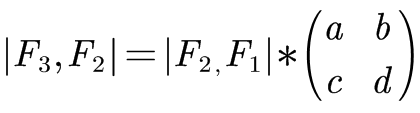

同时，我们也可以得到下面这个矩阵乘法：

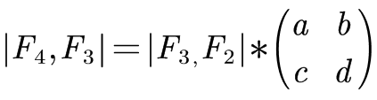

那么，通过这两个矩阵乘法公式，我们可以得到a, b, c, d的值：1、1、1、0。

我们可以验证一下下一个递推式，这样做是成立的。那么我们计算最后一项的时候我们就可以这样去算：

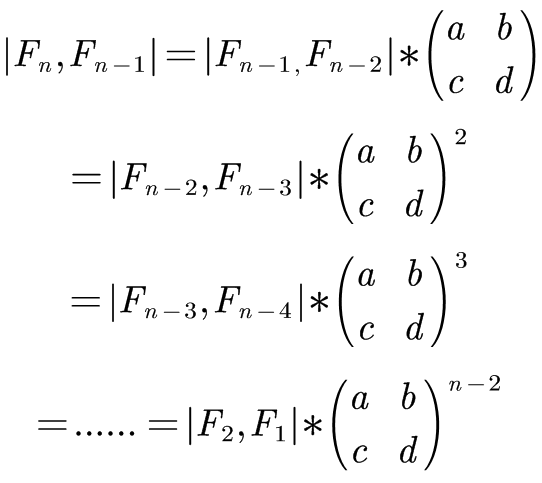

那么，这个问题我们就转化成了如果快速的求矩阵幂运算。快速矩阵幂运算与我们所熟知数的快速幂运算相似，只不过要单独实现一个矩阵乘法的方法。这样，我们就把问题的时间复杂度降到了`O(logn)`。

具体实现代码如下：

```java
//矩阵快速幂的方法实现
public static int f3(int n){
    if (n == 1 || n == 2){
        return 1;
    }
    int[][] base = new int[][]{
        {1,1},
        {1,0}
    };
    int[][] res = matrixPower(base, n - 2);
    return res[0][0] + res[1][0];
}
//矩阵快速幂运算
public static int[][] matrixPower(int[][] m, int k){
    int[][] res = new int[m.length][m[0].length];
    //注意这里，要初始化为单位矩阵，而不是全是1的矩阵
    for (int i = 0; i < res.length; i++) {
        res[i][i] = 1;
    }
    int[][] t = m;
    while (k != 0){
        if ((k & 1) == 1){
            res = product(res, t);
        }
        t = product(t, t);
        k >>= 1;
    }
    return res;
}
//矩阵相乘
public static int[][] product(int[][] m, int[][] n){
    int row = m.length; //所得矩阵的行
    int col = n[0].length;  //所得矩阵的列
    int[][] res = new int[row][col];
    int k = m[0].length;
    for (int i = 0; i < row; i++) {
        for (int j = 0; j < col; j++) {
            for (int c = 0; c < k; c++) {
                res[i][j] += m[i][c] * n[c][j];
            }
        }
    }
    return res;
}
```

在这道题的基础上，我们做一个大推广，即应对以下严格递推问题：

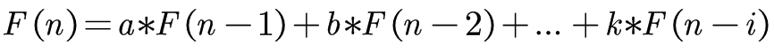

都可以通过矩阵快速幂模型实现`O(logn)`的方法。而我们计算的方式即看每一个元素计算所依赖的长度，我们可以按下面公式来理解：

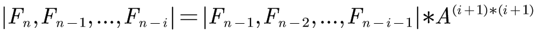

注意，哪怕严格递归式只有两个元素且跨度较大，也要把中间的连续元素包含进去，即下面这个情况：

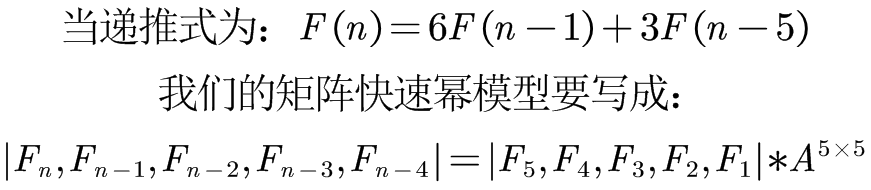

### 2、奶牛生小牛问题

> 第一年农场有1只成熟的母牛A，往后的每年：
> 1）每一只成熟的母牛都会生一只母牛
> 2）每一只新出生的母牛都在出生的第三年成熟
> 3）每一只母牛永远不会死
> 返回N年后牛的数量

 我们可以从一开始的常数项开始考虑。第一年有1头牛，第二年自然有2头牛，第三年和第四年都会依次+1，但是到了第五年，第二年出生的牛就可以开始生小牛了，所以第五年为6，第六年为第五年存在的牛与第三年的牛相加而成，为9。所以我们就可以得到以下递推方程式：

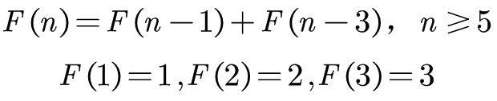

于是我们就可以去求其矩阵：

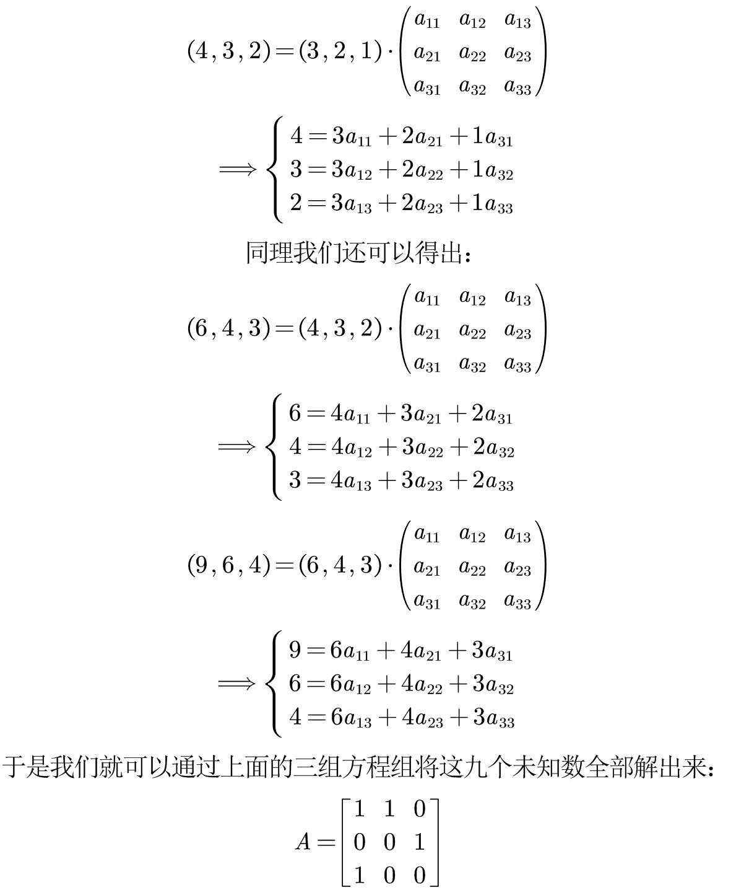

递推结果如下图所示：

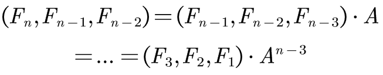

具体实现代码如下：

```java
public static int c3(int n){
    if (n == 1 || n == 2 || n == 3){
        return n;
    }
    int[][] base = new int[][]{
            {1, 1, 0},
            {0, 0, 1},
            {1, 0, 0}
    };
    int[][] res = matrixPower(base, n - 3);
    return 3 * res[0][0] + 2 * res[1][0] + res[2][0];
}
```

### 3、台阶方法数问题

> 一个人可以一次往上迈1个台阶，也可以迈2个台阶，返回迈上N级台阶的方法数

这个问题与斐波那契数列十分的相似，其状态转移方程与斐波那契数列一样，只是在base case上有所区别，即n=2时返回2。

具体实现代码如下：

```java
public static int s3(int n){
    if (n == 1 || n == 2){
        return n;
    }
    int[][] base = new int[][]{
        {1, 1},
        {1, 0}
    };
    int[][] res = matrixPower(base, n - 2);
    return 2 * res[0][0] + res[1][0];
}
```

### 4、达标的字符串数量

> 给定一个数N，想象只由0和1两种字符，组成的所有长度为N的字符串
> 如果某个字符串，任何0字符的左边都有1紧挨着，认为这个字符串达标
> 返回有多少达标的字符串

我们可以通过观察的方法得出这道题的答案。当n=1时，1个达标，当n=2时，2个达标…，如果我们这样推下去，他与台阶方法的状态转移方程是一致的，直接就能得到最终的结果。

具体实现代码如下：

```java
public static int getNum(int n){
    if (n <= 0){
        return 0;
    }
    if (n == 1 || n == 2){
        return n;
    }
    int[][] base = new int[][]{
        {1, 1},
        {1, 0}
    };
    int[][] res = matrixPower(base, n - 2);
    return 2 * res[0][0] + res[1][0];
}
```

当然并不是所有的题目都能通过这样观察的方法得到递推式，所以我们接下来讲面对这个问题的尝试的过程。

我们可以假定一个`f(int i)`的函数，表示后续的`i`个元素有多少种填法。我们从第一个元素开始，第一个元素由于没有前置，所以第一个元素只能填0；而到了第二个元素以及后续的元素当中，就会出现两种情况：

- 当前位置填1，那么后续的填法为`f(i-1)`
- 当前位置填0，那么再下一个位置必须填1，那么后续的填法为`f(i-2)`

所以通过上面的尝试分析，我们可以得出递推方程式，与斐波那契数列相同。

### 5、铺瓷砖问题

> 用1\*2的瓷砖，把N*2的区域填满，返回铺瓷砖的方法数

我们用上一道题的方式来思考这么一个问题。我们铺瓷砖有两种铺法：

- 当前还剩N列没有铺瓷砖，那么如果我们竖着铺一个瓷砖，那么就还剩N-1个瓷砖等着我们铺
- 如果我们横着铺一个瓷砖，那么下方也必须要横着铺一个瓷砖，那么就还剩N-2个瓷砖等着我们铺

所以这还是一个斐波那契数列问题，代码这里就不再展示。

## 十九、KMP算法

KMP算法所要实现的功能：查找目标连续子字符串在在字符串中的位置（如果有多个，就取第一个），返回查找到位置的第一个元素的下标。如果不存在，则返回-1。

### 1、算法实现

我们先考虑用最暴力的方法来实现串的匹配方法。定义两个指针，一个指向主字符串第一个元素，一个指向所要匹配的字符串的第一个元素，然后依次进行比对匹配。如果到最后匹配成功，直接返回；如果匹配失败，则子字符串的指针回溯，主字符串的指针回溯到下一个位置，然后继续匹配，依次往复即可。

这样计算的时间复杂度为O(m*n)，其复杂度较高的根本原因在于指针需要不停的回溯，这样很浪费时间。

我们现在定义一个数组next，这个数组next中每一个元素的信息是这样定义的：对于匹配字符串中的每一个元素，其当前位置的前面所有的前缀串和后缀串最长的相等长度且长度小于前缀串和后缀串的长度。这样说有些抽象，我们举一个例子，假设当前匹配字符串是这样的：

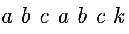

我们观察第7个元素k，我们现在遍历其前缀串和后缀串，从长度为1开始：

- 长度为1时，前缀串为`a`，后缀串为`c`，此时前缀串和后缀串不相等
- 长度为2时，前缀串为`ab`，后缀串为`bc`，此时前缀串和后缀串不相等
- 长度为3时，前缀串为`abc`，后缀串为`abc`，此时前缀串和后缀串相等
- 长度为4时，前缀串为`abca`，后缀串为`cabc`，此时前缀串和后缀串不相等
- 长度为5时，前缀串为`abcab`，后缀串为`bcabc`，此时前缀串和后缀串不相等

再往下，长度到达6，就达到了前缀串和后缀串的长度上限，此时就不能再遍历了。至此，我们得到了元素k在next数组中的值：3。

我们再举一个例子，假设当前匹配字符串是这样的：

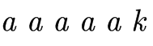

我们观察第6个元素k，我们用与上面相同的方法来进行分析：

- 长度为1时，前缀串为`a`，后缀串为`a`
- 长度为2时，前缀串为`aa`，后缀串为`aa`
- 长度为3时，前缀串为`aaa`， 后缀串为`aaa`
- 长度为4时，前缀串为`aaaa`，后缀串为`aaaa`

至此， 我们得到了元素k在next数组中的值：4。

现在，我们尝试去求一整个next数组，我们看下面这个字符串：

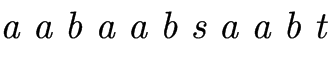

我们一个一个元素来求，暂时不考虑coding问题：

- 第一个位置没有前缀串和后缀串，我们认定第一个串的next数组对应元素值为-1
- 第二个位置由于前缀串和后缀串的长度占了整体（因为前面只有一个元素），所以对应数值为0
- 第三个位置对应的值为1
- 第四个位置对应的值为0
- 第五个位置对应的值为1
- 第六个位置对应的值为2
- 第七个位置对应的值为3
- 第八个位置对应的值为0
- 第九个位置对应的值为1
- 第十个位置对应的值为2
- 第十一个位置对应的值为3

这样，我们就求出来了next数组。当然，这里只讲了next数组中所蕴含的值的定义，并没有说明具体实现的方法（如果按照上面描述的方法来实现coding，面试官会把你赶出去。。。），我们先假定我们拥有了next数组，我们可以利用这个next数组加速整个串模式匹配过程。

开始遍历进行匹配时，我们与暴力匹配算法一样，两个指针都从0开始，依次进行遍历，如果遍历结束发现匹配则直接返回；如果不相等，我们不用让主串的指针进行回退，直接动子串的指针，让他指向其在next对应的值的位置上。我们通过上面求next数组我们可以知道，next数组中存储的是当前元素前面的最长匹配前缀和后缀子串，如果遍历到当前位置发现不匹配的情况下，我们就可以知道在主串当中前面的元素都是相同的，而next数组中存储着最长的前缀串的长度，那么我们就可以将子串“右移”，使其子串的前缀串和主串的“后缀串”对应，这两段是完全相同的，这样主串指针就不会回退。

具体实现代码如下：

```java
public static int getIndexOf(String s1, String s2){
    if (s1 == null || s2 == null || s2.isEmpty() || s1.length() < s2.length()) {
        return -1;
    }
    char[] str1 = s1.toCharArray();
    char[] str2 = s2.toCharArray();
    int x = 0;
    int y = 0;
    //获取next数组
    int[] next = getNextArray(str2);
    //开始遍历，如果跳出循环则说明匹配结束
    while (x < str1.length && y < str2.length){
        //当两个元素相等，两个指针往前推
        if (str1[x] == str2[y]){
            x++;
            y++;
        }else if (next[y] == -1){	//如果不相等且第一个元素就不匹配，x直接前推
            x++;
        }else {	//一般情况下的不匹配
            y = next[y]; 
        }
    }
    return y == str2.length ? x - y : -1;
}
```

下面我们开始实现next数组的计算。

首先我们要明确，next数组的0号位一定为-1，1号位一定为0。上面对next数组的描述中，我们可以知道，对于next数组当中的每一个元素的值，都与自己对应的字符是无关的，与自己前面的字符串有关，所以我们只需要将目光盯向前面的字符串即可。过程是这样的：我们首先看前一个字符的next值，看他的next的值指向的是谁，如果这个next值指向的字符与这个字符相等，那么当前字符的next值直接等于上一个next值+1；如果不相等，我们就看指向的这个字符的next值所指向的字符，如果还不相等，就继续上面的操作，直到一个相等了，那么当前字符的next值就是最后所指向的字符的next值+1，如果最后都没有相等的，直接等于0。

具体实现代码如下：

```java
private static int[] getNextArray(char[] str2) {
    if (str2.length == 1){
        return new int[]{-1};
    }
    int[] next = new int[str2.length];
    next[0] = -1;
    next[1] = 0;
    int i = 2;
    int cn = 0; //与遍历到的目标字符前一个位置的字符比的位置
    while (i < next.length){
        if (str2[i - 1] == str2[cn]){
            next[i++] = ++cn;
        } else if (cn > 0){
            cn = next[cn];
        } else {
            next[i++] = 0;
        }
    }
    return next;
}
```

### 2、旋转字符串

> 判断str1和str2是否互为旋转字符串

暴力方法就是设定每一组元素去转，转完直接比对字符串即可。虽然在Java中有equals方法，但是其时间复杂度为O(n)，所以如果你用这个方法去解决，虽然coding行数很少，但是时间复杂度为O(n^2^)。

我们可以将str1和str1进行一次拼接，然后通过KMP算法计算str2是否为两个字符串拼接过后的子串即可。

具体实现代码如下：

```java
public static boolean isRotation(String s1, String s2){
    if (s1 == null || s2 == null || s1.isEmpty() || s2.isEmpty()){
        return false;
    }
    String s = s1 + s1;
    int ans = getIndexOf(s, s2);
    return ans != -1;
}
```

### 3、子树中是否含有目标二叉树

> 给定两棵二叉树的头节点head1和head2，返回head1中是否有某个子树的结构和head2完全一样

这道题的解决方案就是：将两棵二叉树序列化成字符串，然后比对字符串看head2序列化后的字符串是否为head1序列化后的字符串的子串。

序列化使用中序遍历即可。

具体实现代码如下：

