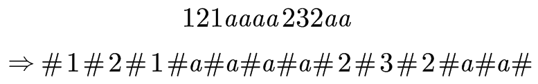
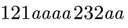
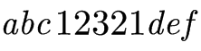
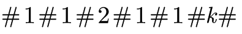
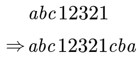
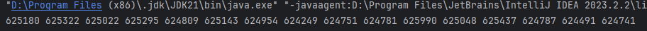
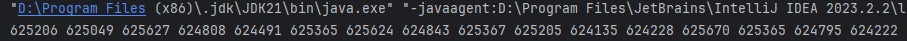

# 数据结构与算法

## 二十、Manacher算法

### 1、最长回文子串

在前面的动态规划课程中，我们用动态规划实现过最长回文子序列。而这个最长回文子串相比较最长回文子序列，他是连续的。

我们先用比较暴力的方法来解决这个问题。

我们先考虑这样一种方式：我们以每一个字符的位置作为中心点，向两边进行遍历比对，如果比对成功，则以当前字符为中心的回文子串的长度+2，然后继续遍历，直到遍历到字符串边界或者比对到某一个位置不相等时，就可以返回。最后计算以每一个字符的位置作为中心点的回文子串最长的那一个就是我们要找的子串。

但是如果仔细思考这种方式，我们发现当面对最长回文子串如果为偶数个个数的情况下是行不通的。

解决偶数个个数的问题，我们可以堆原有的字符串进行改造，向字符串中每一个元素的前后都加入一个特殊字符#，例如下面这种情况：



然后我们用与上面算法相同的方法解决这个问题，当我们得出来最长回文子串长度之后，我们将他除以2即可。

我们还可以思考一个问题：如果我们不使用#来做这些区分，我们用这个字符串当中拥有的元素进行替换，会不会干扰最后的结果？

并不会，因为#和#就是相同的，就算加入了一个与字符串当中元素相同的插入值，遍历到那里他还是相同的，而且永远不会出现插入的字符与原字符串字符及逆行比较的情况。

暴力解法的整体时间复杂度为O(n^2^)。

### 2、算法实现

在算法实现流程讲解之前，我们要先讲述几个概念。

#### ①回文直径&&回文半径

我们可以先看一个例子：



我们很容易能看出来这个字符串的回文串是中间的`“aaaa”`，我们所要定义的回文直径就是这个回文子串的长度：4，回文半径就是以回文的中心到达回文边界的长度：2。当然这个回文半径是偶数长度的回文半径，如果我们给定一个奇数长度回文半径：



这个字符串的回文半径就是3。

当然，如果我们使用处理过后的字符串，例如1中所展示的字符串，字符串处理过后遍历生成的回文直径全部都是奇数，就不存在偶数的情况，所以回文半径就是严格从回文子串中心点出发到边界的长度。

#### ②回文半径数组

回文半径数组中存储的值就是字符串每一个字符的回文半径，就是每一个字符当他作为回文子串的中心时它能向两侧扩张多远。

#### ③最右回文边界

我们不做定义阐述，我们举一个例子来说明这个最有回文边界的含义：



我们定义最右回文边界R=-1，我们从第零个元素向左右扩张：

- 第零个元素进行扩张后回文子串的长度为0，所以我们将R右移到0
- 第一个元素进行扩张后回文子串的长度为3，回文半径长度为2，我们将R右移到这个回文子串的右边界2
- 第二个元素进行扩张后回文半径长度为3，我们将R右移到这个回文子串的右边界4
- ……
- 第五个元素进行扩张后回文半径长度为6，我们将R右移到这个回文子串的右边界10
- ……

省略的部分读者可以自己推敲，这里不做展示，看懂这个例子就知道最右回文边界是什么意思。

这个R是不会回退的，如果R更往右，那么就一直记录最右的位置。

#### ④最右回文边界对应的中心点

当我我们每次移动R的时候，我们一定是根据当前遍历到的元素的回文半径进行变动的，而引起R变动的元素的位置就是最右回文半径对应的中心点。

#### ⑤算法流程

Manacher算法与暴力遍历算法都是在改编过后的字符串上进行的。我们可以根据最右回文边界的位置对当前遍历到的元素进行不同的处理（假设当前遍历到的元素下标为`i`）：

- 当`R<i`时，我们无法对算法进行优化，与暴力遍历比对一样，向左右两边进行比对扩张即可。并且在比对扩张过后，让R指向右边界。
- 当`R≥i`时，我们便有了优化的方案。因为当`R≥i`时，我们一定能够确定R是因为之前的某个元素扩张得到的，那么在R这个范围内，他一定有对称的部分，我们可以找到R对应的中心点，确定当前元素的回文半径长度。这里我们假定R对应的中心点为c，`i`关于这个c的对称点为`i’`，因为`i’`的回文半径我们是计算出来过的，同时我们可以根据对称点c求出c的回文半径，确定其回文子串的左边界L，所以我们可以根据这个回文半径x做出如下判断
  - 当以`i’`为中心点的回文子串的下标范围在L到R之间，那么`i`的回文半径一定会跟`i‘`相同，直接相等取值即可。因为L到R的区域一定是以c为中心点的回文子串，那么以`i`和`i'`为中心的子串的两侧对应的字符一定是对称的，`i`处两侧的值不相等，那么`i'`处的回文子串的两侧值一定不相同，故回文子串长度一定相等。
  - 当以`i’`为中心点的回文子串的下标范围不在L到R之间，那么`i`的回文半径就是其到R的距离，不需要继续向右比对扩张。

当然，R的初始化为-1，`i`就是我们遍历字符串的变量，初始值为0。当我们遍历整个字符串结束的时候，根据找到的最大回文半径就可以计算出最大回文子串的长度。

这就是Manacher算法的全流程。

具体实现代码如下：

```java
public static int manacher(String s) {
    if (s == null || s.isEmpty()){
        return 0;
    }
    char[] str = s.toCharArray();
    //先进行字符串元素填充
    StringBuilder sb = new StringBuilder();
    sb.append('#');
    for (int i = 0; i < str.length; i++) {
        sb.append(str[i]).append('#');
    }
    str = sb.toString().toCharArray();
    int R = -1;     //最右回文边界
    int C = -1;     //最右回文边界对应的中心点
    //定义回文半径
    int[] pArr = new int[str.length];
    int max = Integer.MIN_VALUE;
    for (int i = 0; i < str.length; i++) {
        //现在的R表示的是比对失败的位置，即当前遍历到的元素的最长的回文子串的右侧比对失败的元素位置
        //如果i在R外，那么i当前的回文半径至少为1
        //如果i在R内，那么i当前的回文半径看对称点的值与最右回文边界与其的差值哪个小，小的那一个就是当前节点的回文半径长度
        //这个语句要仔细思考
        pArr[i] = R > i ? Math.min(pArr[2 * C - i], R - i) : 1;
        //如果上面的回文半径是通过i在R内通过的，那么进入这个循环之后第一个if条件判断就会直接跳出
        //如果i在R外，才会进入到这里阔边界的方案
        while (i + pArr[i] < str.length && i - pArr[i] > -1){
            if (str[i + pArr[i]] == str[i - pArr[i]]){
                pArr[i]++;
            } else {
                break;
            }
        }
        //最后更新最右回文边界以及其中心点
        if (i + pArr[i] > R){
            R = i + pArr[i];
            C = i;
        }
        max = Math.max(max, pArr[i]);
    }
    return max - 1;
}
```

我们可以发现，这个问题的时间复杂度可以通过R的动向判断出来。当i在R以内时，我们不需要迭代的比对扩张回文子串，而只有在i在R之外才会扩张R，R从来没有回溯的情况，所以我们可以断定时间复杂度为O(n)。

### 2、添加字符变成回文串

> 给定一个字符串str，只能在str的后面添加字符，想让str整体变成回文串，返回至少要添加几个字符

我们前面通过Manacher算法实现了求一个字符串中的最长回文子串长度的方法，如果我们用在这道题中，我们虽然能求出最长回文子串的长度，但是如何添加我们是解决不了的，就像如下这样：



虽然最长回文子串为12321，但是我们通过观察法我们能一眼看出必须要添加cba。

我们可以多举几个例子就可以发现我们，我们要找到以最后一个元素为结尾的最长回文子串的长度，然后除了这个子串的所有字符就是我们要添加的字符数量，添加的方法与上面的例子相同，逆序直接插入即可。

所以我们要改进我们上面所书写的Manacher算法。我们在做Manacher算法遍历每一个元素的时候，如果我们找到了以某一个元素为中心的最长回文子串将字符串的最后一个元素囊括，那么这个元素就是我们找到的以最后一个元素为结尾的最长回文子串的中心。如果我们要找到添加几个字符，直接通过这个元素的回文半径计算出其回文子串长度，然后用总长度减去它即可；如果我们要返回添加完字符组成的最长回文串，我们就把除了这个回文串的其余所有元素逆序插入这个字符串的末尾即可。

具体实现代码如下：

```java
public static String shortestEnd(String s){
    if (s == null || s.isEmpty()){
        return null;
    }
    char[] str = s.toCharArray();
    StringBuilder sb = new StringBuilder();
    sb.append('#');
    for (int i = 0; i < str.length; i++) {
        sb.append(str[i]).append('#');
    }
    str = sb.toString().toCharArray();
    int R = -1;
    int C = -1;
    int[] pArr = new int[str.length];
    int maxContainsEnd = -1;
    for (int i = 0; i < str.length; i++) {
        pArr[i] = R > i ? Math.min(pArr[2 * C - i], R - i) : 1;
        while (i + pArr[i] < str.length && i - pArr[i] > -1){
            if (str[i + pArr[i]] == str[i - pArr[i]]){
                pArr[i]++;
            } else {
                break;
            }
        }
        if (i + pArr[i] > R){
            R = pArr[i] + i;
            C = i;
        }
        if (R == str.length){
            maxContainsEnd = pArr[i];
            break;
        }
    }
    //这里只返回了添加的内容
    char[] res = new char[s.length() - maxContainsEnd + 1];
    for (int i = 0; i < res.length; i++) {
        res[res.length - 1 - i] = str[i * 2 + 1];
    }
    return String.valueOf(res);
}
```

## 二十一、在无序数组中求第K小的数

### 1、改写快排算法

快速排序的算法在第六章节，每一趟快速排序都会做一次荷兰国旗划分问题。当我们进行一次快排之后，我们能够知道等于目标值的元素在哪个范围，所以其个数我们也能知道，其大于它的个数和小于它的个数我们都能知道。因为我们要求第K小的数，所以在每一次荷兰国旗划分问题过后，我们可以通过这些元素的个数来判断哪一侧的递归不用去做了。

具体实现代码如下：

```java
//改写快排，时间复杂度O(n)
public static int minKth2(int[] array, int k){
    int[] arr = copyArray(array);
    return process2(arr, 0, arr.length - 1, k - 1);
}
//复制数组
public static int[] copyArray(int[] arr) {
    int[] ans = new int[arr.length];
    for (int i = 0; i != ans.length; i++) {
        ans[i] = arr[i];
    }
    return ans;
}
//arr 第k小的数
//process2
//arr[L...R]    范围上，如果排序的话，找位于index的数
//index[L...R]
public static int process2(int[] arr, int L, int R, int index){
    if (L == R){
        return arr[L];
    }
    //随机选出来一个数做划分值
    int pivot = arr[L + (int) (Math.random() * (R - L + 1))];
    int[] range = partition(arr, L, R, pivot);
    //如果在范围中，直接返回
    if (index >= range[0] && index <= range[1]) {
        return arr[index];
    } else if (index < range[0]){
        //在范围左侧，递推调用左侧
        return process2(arr, L, range[0] - 1, index);
    } else {
        //在范围右侧，递归调用右侧
        return process2(arr, range[1] + 1, R, index);
    }
}
//荷兰国旗划分问题
public static int[] partition(int[] arr, int L, int R, int pivot){
    int less = L - 1;
    int more = R + 1;
    int cur = L;
    while (cur < more){
        if (arr[cur] < pivot){
            swap(arr, ++less, cur++);
        } else if (arr[cur] > pivot){
            swap(arr, cur, --more);
        } else {
            cur++;
        }
    }
    return new int[]{less + 1, more - 1};
}
//数组元素交换
public static void swap(int[] arr, int a, int b){
    if (a != b){
        arr[a] = arr[a] ^ arr[b];
        arr[b] = arr[a] ^ arr[b];
        arr[a] = arr[a] ^ arr[b];
    }
}
```

### 2、bfprt算法

对于快排的改进算法，时间复杂度为O(n)，在这道题的所有求解方法当中已经是最优的一类解法了。下面这个算法不需要通过概率就能解释其时间复杂度为O(n)，并且作为一个新鲜的算法能在面试官面前装个B（HHH）。

我们书写快排算法的第一步在于选择一个划分的目标值，为了使算法能够在概率统计计算层面上满足较低复杂度情况，我们这个划分的目标值需要随机选择，使得最复杂的划分情况与其他情况等概率出现。而对于`bfprt`算法，我们聚焦于选择这个划分值，使得这个划分值的划分让这个算法在判断时间复杂度的情况下不需要进行概率计算就能判定时间复杂度。也就是说，该算法就是将快排的第一步随机选择划分值改变成“讲究”地选择划分值。

流程如下：

- 我们从逻辑概念上将数组5个一组进行划分，如果最后一组不满5个，那就剩余的组成一组
- 我们将每一个小组进行排序，因为是小组内部5个元素排序，所以针对一个组的排序，时间复杂度为O(1)，而总共有大约N/5个组，所以总体的时间复杂度为O(n)。这里要理解时间复杂度，小组排序元素个数有限，所以排序时间复杂度为常数级别。
- 把每个小组的中位数拿出来，就是这个小组的第三个数，然后组成一个新的数组。如果是最后一个组剩余的数为偶数，取上中位数。
- 我们把上一步组成的中位数数组命名为m，我们求m的中位数。我们知道这个数组的元素个数为N/5，其中位数就是第N/10小的数。这一步通过递归的方法进行实现。

我们通过画图来演示这个流程：


当我们通过bfprt得到了划分值之后，其他流程与快排相同。

我们在进行荷兰国旗划分过程中，如果我们的划分值选择不到位，那么划分过后的左侧和右侧的区域数字数量会失衡，这样会使得当前的计算复杂度很高。如果我们使用bfprt算法，我们选出来的值能过够使得划分过后的左侧和右侧的区域的数字数量平衡。

这个算法的时间复杂度无法用Master公式进行求解，但是我们能通过一层一层的推导得出其问题计算规模T(n)=T(7n/10)+T(n/2)+O(n)，其时间复杂度为O(n)。

具体实现代码如下：

```java
public static int minKth3(int[] array, int index){
    int[] arr = copyArray(array);
    return bfprt(arr, 0, arr.length - 1, index - 1);
}
//这个方法求的就是第index小的数
public static int bfprt(int[] arr, int L, int R, int index){
    if (L == R) {
        return arr[L];
    }
    //找到划分值
    int pivot = medianOfMedians(arr, L, R);
    int[] range = partition(arr, L, R, pivot);
    if (index >= range[0] && index <= range[1]){
        return pivot;
    } else if (index < range[0]){
        return bfprt(arr, L, range[0] - 1, index);
    } else {
        return bfprt(arr, range[1] + 1, R, index);
    }
}
public static int medianOfMedians(int[] arr, int L, int R){
    int size = R - L + 1;
    int offset = size % 5 == 0 ? 0 : 1;
    int[] mArr = new int[size / 5 + offset];
    for (int team = 0; team < mArr.length; team++) {
        int teamFirst = L + team * 5;
        mArr[team] = getMedian(arr, teamFirst, Math.min(R, teamFirst + 4));
    }
    //这个就是在求这个中位数组的中位数，调用大方法，要仔细理解
    return bfprt(mArr, 0, mArr.length - 1, mArr.length / 2);
}
//得到每个小组的中位数
public static int getMedian(int[] arr, int L, int R){
    //插入排序
    insertionSort(arr, L, R);
    return arr[(L + R) / 2];
}
//因为最多只有五个数，所以用何种方法都一样，都属于常数级别的时间复杂度
public static void insertionSort(int[] arr, int L, int R){
    for (int i = L + 1; i <= R; i++){
        for (int j = i - 1; j >= L && arr[j] > arr[j + 1]; j--){
            swap(arr, j, j + 1);
        }
    }
}
```

上述算法中对于swap交换算法和partition划分算法并未描述，但是最上方的通过快排改进的算法已经给出，如有需要自己去看。

### 3、收集最大的前K个数字

> 设计在无序数组中收集最大的前K个数字的算法（根据不同的三个时间复杂度，设计三个算法）
> 给定一个无序数组`arr`中，长度为N，给定一个正数k，返回top k个最大的数
> 不同时间复杂度三个方法：
>
> 1. `O(N*logn)`
> 2. `O(N+K*logN)`
> 3. `O(N+k*logk)`

这个问题有一个潜台词：k一定小于N。

第一个时间复杂度的方法一定是通过排序取出前k个数，至于哪一种排序，从时间复杂度为`O(N*logn)`中的找。

第二个时间复杂度的方法是通过堆的方法实现的。把一个数组调成大根堆的过程，时间复杂度为O(N)，然后将前k个数依次弹出，每次弹出调整大根堆的时间复杂度为`O(logn)`，故时间复杂度为`O(N+k*logn)`。不过这个方法要专门写加强堆。

第三个时间复杂度的方法就可以通过我们改写快排的方式实现。假设我们现在有10000个数，我们求前100个数，我们只要找到第100大的数即可，然后准备一个k大小的数组，遍历数组将小于目标值的数保存起来，如果最后没有存满，那么剩余的数就全是与目标值相同的数。最后再把这k大小的数组从大到小排个序即可。

（具体代码自己写，上面都描述这么清楚了，写不出来以后别学了。。。）

## 二十二、蓄水池算法

> 解决的问题：
>
> 假设有一个源源吐出不同球的机器，
> 只有装下10个球的袋子，每一个吐出的球，要么放入袋子，要么永远扔掉
> 如何做到机器吐出每一个球之后，所有吐出的球都等概率被放进袋子里

我们可以这样实现这个算法：我们先让前10号球全部进袋子，如果当前吐出的球数量小于等于10，那么这些球进袋子的概率全部为100%；当10个球过后的第`i`个球吐出来的时候，我们有`10/i`的概率让其进袋子，剩下的概率让其抛掉，当它概率选择进入袋子的时候，剩下在袋子里面的球等概率扔掉。

下面我们来进行推到来验证这个方法的可行性：


当然，我们可以通过代码来做一个实验：

具体代码如下：

```java
//请等概率返回i~i中的一个数字
public static int random(int i){
    return (int)(Math.random() * i) + 1;
}

public static void main(String[] args) {
    int test = 1000000;
    int[] count = new int[17];
    for (int i = 0; i < test; i++){
        int[] bag = new int[10];
        int bagi = 0;
        for (int num = 1; num <= 16; num++){
            if (num <= 10){
                bag[bagi++] = num;
            } else {    //num > 10;
                if (random(num) <= 10){ //一定要把num球入袋子
                    bagi = (int)(Math.random() * 10);
                    bag[bagi] = num;
                }
            }
        }
        for (int num : bag){
            count[num]++;
        }
    }
    for (int i = 1; i <= 16; i++){
        System.out.print(count[i] + " ");
    }
    System.out.println();
}
```

然后我们来看几个返回结果：





我们可以看到，数量互相差不了多少，概率就是相等的。

接下来我们看一个应用：

假如你现在开发了一个大型的网络游戏，这个游戏在全球各地推广，并且在全球各个地区都设有服务器。现在你准备做一个抽奖的活动，在当日24小时以内登录游戏的玩家均可参与抽奖，为了使所有的玩家等概率中奖，你需要用到蓄水池算法来实现；如果你不使用蓄水池算法来实现，那么你就得需要将当日所有的登录玩家进行统计，这时候就需要调用全球各地的服务器，这样就有可能出现下面的问题：1、人数统计有可能出现问题，因为有活动，所以当日登陆的玩家数量一定会很庞大。2、无法在时间结束之后立马结算出抽奖结果，需要在活动结束后进行统一结算（当然，这个蓄水池算法推进过程中不能被玩家查看，否则玩家会知道自己在当下是否中奖，这会引起玩家不满）。

