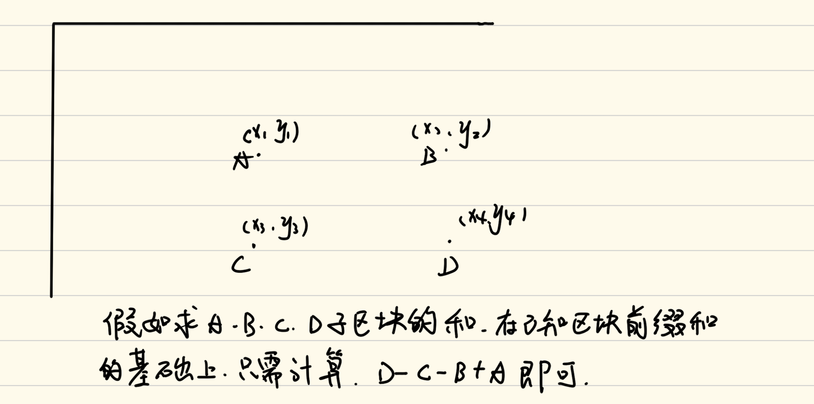
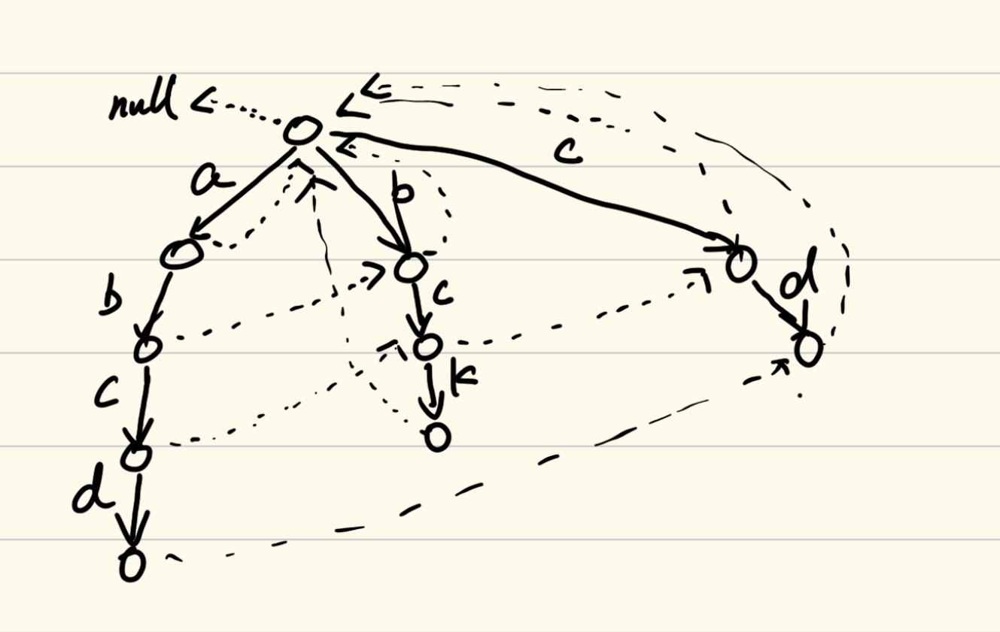
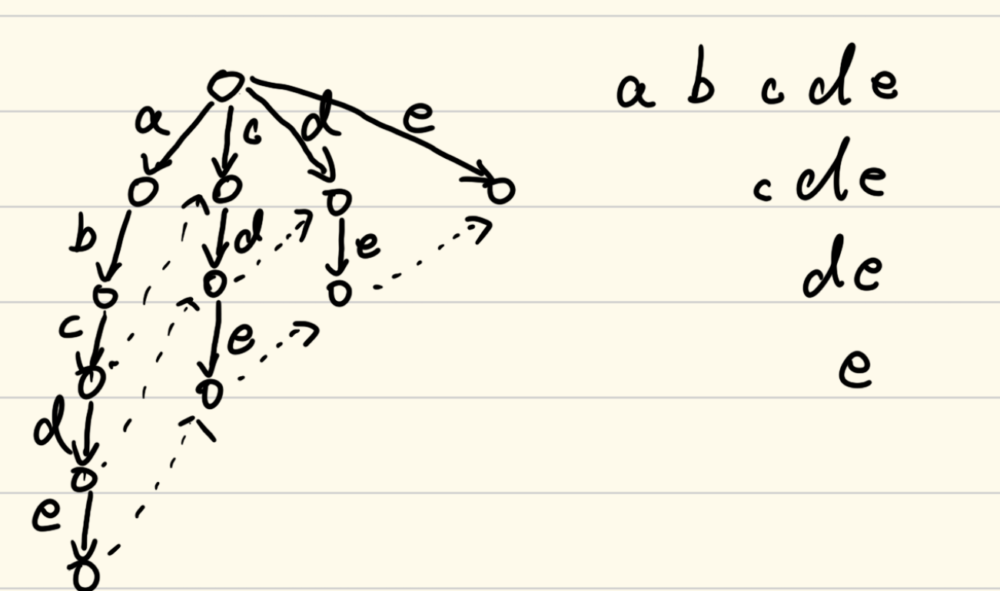
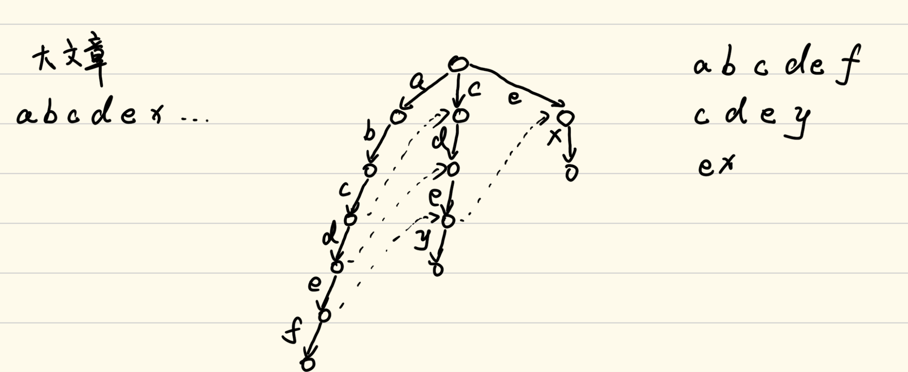

# 数据结构与算法

## 二十五、IndexTree

我们之前学过一个求区间和数组的一种方法：前缀和数组。前缀和数组中的每一位`i`都表示`0`到`i`的所有元素的总和，当我们要求某一个区间的总和，比如`x`到`y`区间的总和，我们只需要用前缀和数组中`y`减去`x-1`的值即可求出`x`到`y`的总和。但是这样我们只能实现求固定的某一个数组的区间和，如果这个数组的某一个值进行了修改，那么修改值的位置及其后面位置的前缀和数组的值就全部得发生改变，所以前缀和数组在数组频繁更新的情况下是不太实用的。为此，我们需要在前缀和的基础上，设计一个新的数据结构来满足求频繁更新数组的区间和的需求。

当然，上一张我们实现了线段树，线段树对于频繁进行某一个区间数值更新有很高的效率，但是如果我们只针对于某一个特定下标的更新，这样的结构就有些臃肿了。

### 1、结构实现

在IndexTree当中，我们的help数组是这样实现的：每一个元素找前面的元素，看看前面的元素能够与当前自己拥有的元素个数相同，如果相同就组成一组，如果不相同就停止寻找。

这句话说的很抽象，很不好理解，我们通过画图来实例化这个方法：

比如当前的数组总共有12个元素（我们先不管数组中什么元素），我们将视角放在第一个元素上，第一个元素由于前面没有元素，所以在help数组当中它就是1的总和：

.png)

然后我们再看第二个元素，第二个元素前面的元素1号元素的个数为1（1号元素只表示自己），而2号元素此时也只表示自己，所以在help数组当中2位置表示1号元素和2号元素的和：

.png)

然后我们再看3号元素，3号元素前面的1号和2号元素为一组，为2个元素，而3号元素此时与自己一组，为1个元素，所以不能合并，help数组3号位置填3自己：


然后我们再看4号元素，4号元素的前面3号元素自己一组，为1个元素，4号元素此时也是自己一组，为1个元素，合并成一组，为2个元素，并且前面1、2号元素此时为一组，有2个元素，此时3、4号元素也为一组，有2个元素，合并为一组变成4个元素，所以help数组当中4号元素为前面1、2、3、4元素和：


然后依次类推，我们得到help数组的表示形式：


我们实现了这个help数组之后，我们需要通过代码层面知道每一个help数组中的元素到底表示谁到谁之间的总和。我们可以使用二进制的方式来解决这个问题。假如现在我们所指向help的下标index为一组二进制数，那么它所代表的总和是其最后一位1所在的位置到二进制最右端的之间的所有的数。这样说很抽象，我们举个例子，例如现在index为101101000，那么它所代表的就是101100001到101101000之间的数的总和；再比如，现在index为101101001，那么它就代表它自己这个位置的总和。

这样一个help数组形成之后，我们可以利用每一个index的二级制位中1的位置来求当前位置的前缀和，例如现在index的值为100001，那么它的前缀和就是第33位和第32位的总和，再比如10110101，它的前缀和就是181、180、176、160、128位的总和。上述规律就是从当前的index的二进制开始，每次将最右侧的1变成0，然后对应的位置进行累加，直到所有的位置全部变为0为止。

那么我们思考一个问题，如果当前有一个位置的值变了，那么有哪些元素是受牵连而改变的。同样是根据当前index的二进制来得到。根据前面所描述的help数组的组成，我们可以猜想，假如当前3号元素位置改变了，那么必然会引起4号元素位置，8号元素位置，16号元素位置…受到牵连，这些位置都得因为这个值的改变而改变，具体到代码层面，我们需要不断地获得index二进制右侧的1所代表的值，然后不断与当前的index相加，直到越界为止。

这样我们就可以实现IndexTree的结构，具体实现代码如下：

```java
//下标从1开始
public static class IndexTree {
    private int[] tree;
    private int N;
    //初始化
    //0位置弃而不用
    public IndexTree(int N){
        this.N = N;
        tree = new int[this.N + 1];
    }
    //求区间和
    public int sum(int index){
        int ret = 0;
        while (index > 0){
            ret += tree[index];
            index -= index & -index;
        }
        return ret;
    }
    //在指定index的数上加上d值
    public void add(int index, int d){
        while (index <= N) {
            tree[index] += d;
            index += index & -index;
        }
    }
}
```

代码很短，但是要好好理解上面的代码。

### 2、二维IndexTree

二维IndexTree解决的是区块前缀和问题。在二维数组M*N中，其中二维数组`(i,j)`上的值表示从`(1,1)`到`(i,j)`整个矩阵的所有元素的总和，那么如果我们要获得某一个小区块的总和，那么我们就要给出这个这个区块的四个端点，然后根据端点的区块前缀和，我们就能求出这个子区块的总和，就如下图所示：



我们在一维IndexTree上我们实现了相应的help数组，那么在二维中的help数组就是一维help数组的推广。对于一维的help数组，我们对于每一个元素所代表的部分元素的和，在二维中进行拓维即可。比如说，当前的某一个位置的index为(0110100, 0111000)，对于行来说，它代表了0110001到0110100这些元素，对于列来说，它代表了0110001到0111000这些元素，在二维中，index这个位置的值代表了这些元素的所有组合。至于更高维度，同理。

具体实现代码如下：

```java
public class Code02_IndexTree2D {
    private int[][] tree;
    private int[][] nums;
    private int N;
    private int M;
    public Code02_IndexTree2D(int[][] matrix) {
        if (matrix.length == 0 || matrix[0].length == 0){
            return;
        }
        N = matrix.length;
        M = matrix[0].length;
        tree = new int[N + 1][M + 1];
        nums = new int[N][M];
        for (int i = 0; i < N; i++) {
            for (int j = 0; j < M; j++) {
                update(i, j, matrix[i][j]);
            }
        }
    }
    private int sum(int row, int col){
        int sum = 0;
        for (int i = row + 1; i > 0; i -= i & (-i)) {
            for (int j = col + 1; j > 0; j -= j & (-j)) {
                sum += tree[i][j];
            }
        }
        return sum;
    }
    public void update(int row, int col, int val){
        if (N == 0 || M == 0) {
            return;
        }
        int add = val - nums[row][col];
        for (int i = row + 1; i <= N; i += i & (-i)) {
            for (int j = col + 1; j <= M; j += j & (-j)) {
                tree[i][j] += add;
            }
        }
    }
    public int sumRegion(int row1, int col1, int row2, int col2) {
        if (N == 0 || M == 0) {
            return 0;
        }
        return sum(row2, col2) + sum(row1 - 1, col1 - 1) - sum(row1 - 1, col2) - sum(row2, col1 - 1);
    }
}
```

## 二十六、AC自动机

AC自动机解决的问题是：解决在一个大字符串中，找到多个候选字符串的问题。

### 1、结构实现

我们先不去看大字符串，我们先看字符串数组。

我们之前在第八章接触了前缀树，解决的就是一组字符串的表示的问题，我们可以将这个字符串数组转变成前缀树。当然，具体如何构建前缀树，可以看第八章的代码。

AC自动机则是在前缀树的基础上实现的。

我们在前缀树的基础上改造这个前缀树。具体改造的流程如下：

> 每一个前缀树的节点都附加一个指针fail，fail指针在建完前缀树之后进行广度优先遍历进行设置。指向规则如下：
>
> - 头节点的fail默认指向null
> - 头节点的所有子节点的fail全部指向fail
> - 接下来每个节点的fail指针设置全部去找自己的父节点的fail。
>   - 如果当前fail指针指向null，则将当前节点的fail指针指向头节点
>   - 如果当前fail指针指向的节点有相应的到达自己的路径，则该节点的fail指针指向当前遍历到的节点顺着该路径的下一个节点
>   - 如果当前fail指针指向的节点没有相应的到达自己的路径，则继续顺着fail指针向下找

我们看一下图示：



首先头节点head的fail指向null，其下面的子节点的fail都指向头节点。

1. 首先来到左分支b下面的节点，其父节点指向的节点为头节点，头节点下有路径b，所以fail指向头节点b路径下的节点。
2. 然后是中间分支c下面的节点，其父节点指向的节点为头节点，头节点下有路径c，所以fail指向头节点c路径下的节点。
3. 来到右分支d下面的节点，其父节点指向的节点下没有路径d，所以fail顺着向上找，指向null，所以其fail指向头节点
4. 来到左分支c下面的节点，其父节点指向的节点下有c路径，所以指向顺着c路径下的节点
5. 来到中间分支k下面的节点，其父节点指向的节点下没有k路径，所以fail顺着向上找，还是没有k路径，接着向上找，指向了null，所以其fail指向头节点
6. 来考左分支d下面的节点，其父节点指向的节点下没有k路径，所以fail顺着向上找，找到了d路径，所以指向这个d路径下面的节点

由此我们改进了前缀树。

构造了前缀树，我们需要思考一个问题：这个改进的前缀树具体有什么含义？

我们给一个图示：



这是要给构造好的前缀树，除了fail指针指向头节点的没有标出来以外，其余的节点的fail指针全部标了出来，右侧则是构造这棵前缀树的所有字符串。

如果我们现在从文章中某一个a开始，找这个字符串数组中的字符串是否出现在文章当中，假如我们匹配到c匹配不下去了，我们可以顺着c下面的子指针寻找到我接下来应该到哪个分支去进行遍历。比如在这个例子当中，我们从a开始遍历，我们遍历到d发现不匹配，那么前面a，b，c都是已经确定匹配的了，我们可以顺着d的父节点的fail去寻找，我们就可以知道之后的节点应该从哪里开始遍历，在这个图里，我们顺着d的父节点的fail，找到了第二个分支的c开始了遍历。这个思路比较像KMP，即通过前缀树的改造使得前缀树本身就拥有了KMP的next数组的性质。

我们接下来看这个构造好的前缀树在AC自动机下的应用。

看下面的图示：



我们现在来看大文章，我们的大文章从a开始，所以我们从a开始遍历这个改造好的前缀树，并且一个字符一个字符地比对。我们发现，当比对到x的时候，就比对不下去了，所以我们从比对不下去的节点出发（左分支f下面的节点）开始，通过fail指针找到了中间分支节点e下面的节点，当我们进行到这一步的时候，这说明前缀为a，b的字符串因此被淘汰，但是前缀为c，d，e的字符串因此保留；然后我们进行进一步的比对，发现比对依旧失败，我们继续通过父节点的fail节点找到了右分支的e下面的节点，通过这一步，我们将前缀为c，d的字符串淘汰，而e作为前缀的字符串保留了下来；然后我们进行进一步的比对，我们发现比对成功。

至于最后的统计工作怎么做，我们这里先看一下代码：

```java
//前缀树的节点
public static class Node {
    // 如果一个node，end为空，不是结尾
    // 如果end不为空，表示这个点是某个字符串的结尾，end的值就是这个字符串
    public String end;
    //只有在上面的end变量不为空的时候，endUse才有意义
    // 表示，这个字符串之前有没有加入过答案
    public boolean endUse;
    public Node fail;
    public Node[] nexts;
    public Node() {
        endUse = false;
        end = null;
        fail = null;
        nexts = new Node[26];
    }
}
public static class ACAutomation {
    private Node root;
    public ACAutomation() {
        root = new Node();
    }
    //前缀树的构建，有路就复用，没有路就新建
    public void insert(String s) {
        char[] str = s.toCharArray();
        Node cur = root;
        int index = 0;
        for (int i = 0; i < str.length; i++) {
            index = str[i] - 'a';
            if (cur.nexts[index] == null) {
                cur.nexts[index] = new Node();
            }
            cur = cur.nexts[index];
        }
        cur.end = s;
    }
    public void build(){
        Queue<Node> queue = new LinkedList<>();
        queue.add(root);
        Node cur = null;
        Node cfail = null;
        while (!queue.isEmpty()){
            //当前节点弹出
            //当前节点的所有后代加入到队列里去
            //当前节点给它的子去设置fail指针
            //cur -> 父亲
            cur = queue.poll();
            for (int i = 0; i < 26; i++) {  //所有的路
                //i号儿子，必须把i号儿子的fail指针设置好！
                if (cur.nexts[i] != null) { //如果真的有i号儿子
                    cur.nexts[i].fail = root;
                    cfail = cur.fail;
                    while (cfail != null) {
                        //注意next[i]表示的就是对应的路径，如果路径存在，则fail指向这个next[i]
                        if (cfail.nexts[i] != null) {
                            cur.nexts[i].fail = cfail.nexts[i];
                            break;
                        }
                        //如果路径不存在，即next[i] == null,则继续找
                        cfail = cfail.fail;
                    }
                    //如果当前的儿子设置好了，就把他加入到队列中去
                    queue.add(cur.nexts[i]);
                }
            }
        }
    }
    //大文章遍历
    public List<String> containWords(String content){
        char[] str = content.toCharArray();
        Node cur = root;
        Node follow = null;
        int index = 0;
        List<String> ans = new ArrayList<>();
        for (int i = 0; i < str.length; i++) {
            //当前来到的“路”
            index = str[i] - 'a';
            //如果当前字符串在这条路上没配出来，就随着fail方向走向下条路径
            while (cur.nexts[index] == null && cur != root){
                cur = cur.fail;
            }
            //1.现在来到的路径，是可以继续匹配的
            //2.现在来到的节点，就是前缀树的根节点
            cur = cur.nexts[index] != null ? cur.nexts[index] : root;
            follow = cur;
            while (follow != root) {
                //如果之前收集过这个字符串了，那就不用管了
                if (follow.endUse) {
                    break;
                }
                //不同的需求，在这一段之间修改
                //这里代表找到了一个可以收集的字符串
                if (follow.end != null) {
                    ans.add(follow.end);
                    follow.endUse = true;
                }
                //不同的需求，在这一段之间修改
                //把所有的fail全部跑一遍
                follow = follow.fail;
            }
        }
        return ans;
    }
}
```

在这个AC自动机当中，我们进行统计工作通过的是每一个节点记录的`end`以及`endUse`两个变量，当`end`不为`null`的时候，`endUse`才会变得有价值。我们可以看`containWords()`这个方法，这个方法对出现的字符串进行了统计，并且利用List进行保存。如果我们当前的节点的下一条“路”没有，那么我们会通过fail指针进行找，找到有下一条路的情况，如果找到的当前节点为`root`，就说明从根节点开始就没有路了，就说明这个字符串数组当中就没有从当前字符开始的字符串，这个时候跳过即可；但如果不为`root`，那就说明是可以继续匹配的，那么我们就继续往下匹配。当我们从第一个`while`跳出来的时候，这个时候就有两种情况：当前能找到继续向下走的“路”和当前到达了根节点。如果当前到达了下面可以走的路，那么就继续往下走；如果当前到达了根节点，说明当前的字符与前缀树的根节点的下一条“路”都不匹配，这个时候就可以跳过。来到一个能有往下的路的时候，我们都会通过`fail`“过一圈”，即通过fail遍历将以这个字符作为后缀的所有子串全部添加到List当中，这个“过一圈”通过`follow`指针去看，直到遍历到`root`之后，或者当遍历到其中的一个`endUse`为`true`时，遍历结束（当遍历到`endUse`时，如果其为`true`，那么就说明这一“圈”都遍历过了，能添加的都添加了，就没必要再看一圈了）。遍历的过程中，如果当前节点的`end`不为空，那么将其添加到List当中，将`endUse`改为`true`即可。

