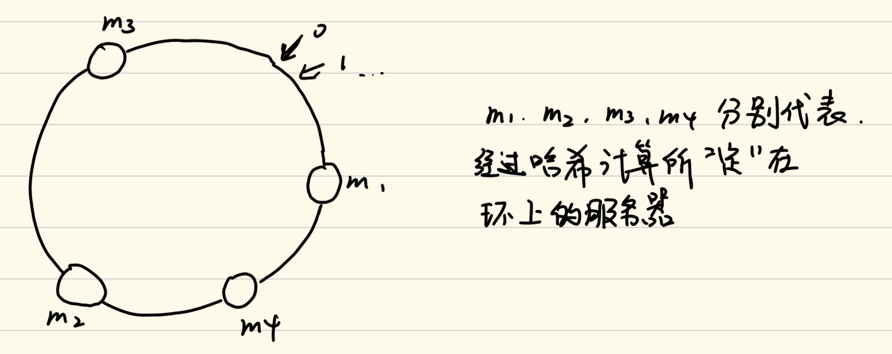

# 数据结构与算法

## 二十七、与哈希函数有关的结构

对于哈希函数的基本原理，这里不做描述。

基于哈希函数的基本原理，我们可以了解一下哈希表的实现。哈希表可以根据传入的数据进行哈希计算得到存入的下标，当不同元素得到的哈希值相同的时候，可以用拉链法将元素进行存储。当我们进行增删改查的时候，我们都可以计算元素的哈希值，然后再在哈希表中进行查找。这些内容属于散列表的内容，如果忘记了散列表的内容建议重新学大学的数据结构基础课程。

当然，一个散列表的大小如果是固定大小的情况下，一旦存入的数据过多，就会导致拉链的长度过长，这个时候进行增删改查的操作就会变慢，所以我们要在拉链长度到达一定长度的时候对哈希表进行扩容。具体操作就是，当其中一条拉链到达临界值的时候，我们便进行扩容操作（因为哈希计算的分布是均匀随机的，所以当一个拉链到达临界的时候，一般其他的拉链都基本上快到临界了），将哈希表的长度增加一倍，并且将其中所有的内容重新进行哈希计算，然后再存入到哈希表中。

这样的操作是有代价的，但是就算是计算上这个代价，我们对于单次的增删改查操作的时间复杂度依然为`O(1)`，原因如下：假如我们现在让哈希表的长度变为1，拉链长度限制为2，那么当我们添加两个元素之后再次添加就会导致哈希表扩容，这个时候哈希表的最大存储元素就会变为4，然后再次进行增加操作，直到增加到4个之后，再次扩容，这样每次我们调整元素的个数呈指数次增长，即2，4，8， 16，…，N。所以我们看出来这是一个等比数列，总操作次数的数量级为`O(N)`，但是我们执行到N的时候执行的次数为N，我们将这个操作与调整的次数进行均摊一下，这个时候得出来的结果就是常数级别的`O(1)`。

下面的代码可以读一下，了解一下Java当中与hash有关的代码：

```java
public class Hash {

    private MessageDigest hash;

    public Hash(String algorithm) {
        try {
            hash = MessageDigest.getInstance(algorithm);
        } catch (NoSuchAlgorithmException e) {
            e.printStackTrace();;
        }
    }
    public String hashCode(String input) {
        return DatatypeConverter.printHexBinary(hash.digest(input.getBytes())).toUpperCase();
    }
    public static void main(String[] args) {
        System.out.println("支持的算法 : ");
        for (String str : Security.getAlgorithms("MessageDigest")) {
            System.out.println(str);
        }
        System.out.println("=======");
        String algorithm = "MD5";
        Hash hash = new Hash(algorithm);
        String input1 = "zuochengyunzuochengyun1";
        String input2 = "zuochengyunzuochengyun2";
        String input3 = "zuochengyunzuochengyun3";
        String input4 = "zuochengyunzuochengyun4";
        String input5 = "zuochengyunzuochengyun5";
        System.out.println(hash.hashCode(input1));
        System.out.println(hash.hashCode(input2));
        System.out.println(hash.hashCode(input3));
        System.out.println(hash.hashCode(input4));
        System.out.println(hash.hashCode(input5));
    }
}
```

### 1、布隆过滤器

我们现在来说一个实用场景：假设现在我们要实现一个黑名单的功能，这个黑名单的存储用`set`来存储，存储的黑名单的数量为100亿，每一个保存的`url`为64字节，现在我们来实现这个黑名单拦截的功能。

如果我们用通常的hash方法来实现，我们需要将这100亿个`url`全部都存储在`set`当中，那么就需要6400亿个字节，那么总存储量大小就会达到640G，这是一个相当大的存储量，就算存储下来，也没有如此大的内存进行存储，还需要使用请求调页的方法进行查找实现。

我们接下来通过这个例子来讲解布隆过滤器的实现。

布隆过滤器可以压缩存储的空间，但是这个压缩方法会造成一定的失误率，这个失误率指的是当访问的`url`是黑名单的一份子的时候，那么他一定被拦截，但是如果访问的`url`不是黑名单的一份子的时候，他会有万分之一的概率被拦截，即坏人一定被拦截，但是有较低概率拦截好人。

布隆过滤器的实现是通过一个叫位图的东西进行实现。我们先介绍位图。

假设我们现在有一个int类型的数组，大小为10，我们知道一个int类型的大小为4B，如果数组大小为10，那么其占有的空间为40B，换算成比特大小就变为了320bit。根据这个计算转换，我们可以知道，如果当前一个比特数组的大小为m，那么这个比特数组的大小转化为字节大小就是m/8。这个比特数组就是一个位图。

通过位图，我们可以进行布隆过滤器的实现。假设现在我们有一个长度为m的比特数组，其转换为字节就是m/8。现在我们获得一个string类型的`url`，我们用多个独立的哈希函数对这个string类型的数据进行计算，得到的哈希值对m取模，就可以对应到比特数组的相应位置，然后把比特数组的对应位置“描黑”（可以将其置为1），当然这多个独立的哈希函数是有可能在对m取模之后出现值相同的情况，“描黑”即可，不予理会。对于所有的`url`，我们都采用这种方式进行存储。

存储过后，我们进行查询也可以通过相同的方式。使用多个独立的哈希函数对查询的`url`进行计算，计算过后的结果对m取模，然后到比特数组当中找到对应的比特项，如果多个比特项有一个没有被“描黑”，则说明这个`url`不在黑名单里，反之，如果多个比特项全部被“描黑”，则说明这个`url`在黑名单里。

上面就是布隆过滤器的整体运行流程。但是这里有一个问题，就是这个比特数组的大小如何确定，如果m过于小，那么失误率就会太大，但是m如果过于大，又会存在浪费空间的问题。这个m的确定取决于三个要素：样本量、失误率和单样本大小。在我们这个黑名单使用场景中，样本量为100亿，失误率为0.01%，单样本大小为64字节。在这个问题当中，我们使用了哈希函数来将样本存储，只要哈希函数能够对样本进行计算，单样本大小并不会对m的大小产生影响。失误率与m呈反比关系，当m为1的时候，其失误率为100%，但是随着m的逐渐增大，其失误率会逐渐减小，当m趋近于无穷大的时候，其概率会趋近于0，但是永远不会等于0，所以只要我们找到反比的具体关系，然后让其失误率达到我们的工程要求，就能决定m的大小。

这里我们将布隆过滤器的三个公式：

> 1. 假设数据量为n，预期的失误率为p（布隆过滤器大小和每个样本的大小无关）
> 2. 根据n和p，计算Bloom Filter一共需要多少个bit位，向上取整，记为m
> 3. 根据m和n，算出Bloom Filter需要多少个哈希函数，向上取整，记为k
> 4. 根据修正公式，算出真实的失误率p_true


上述公式同时给出了需要多少个哈希函数的公式。如果我们的哈希函数数量过多，那么会造成比特数组“描黑”的速度过快而造成失误率升高；但如果我们的哈希函数数量过少，就会因为哈希碰撞而造成失误率升高。所以我们的k要取一个中间值，即曲线的最低点。

上述公式同时也给出了真实失误率的公式。我们在计算出m和k之后，可以通过这个公式计算失误率，如果失误率最后没能控制在预期范围内，那么我们就需要增加一定的空间来达到预期的失误率。当然，k是不能调整的，算出来就是最佳状态。

不过我们现在又有一个问题，如果我们算出来的k比较大，那么我们哪来的那么多哈希函数供我们选择？我们可以这样：我们选择两个哈希函数f1和f2，然后我们取的哈希函数如同下面这样：

1. 1*f1+f2
2. 2*f1+f2
3. 3*f1+f2

​	……

这些哈希函数几乎是相对独立的。

### 2、一致性哈希

在现实开发中，我们的服务器存储数据是这样的：对于每一个键值对<key, value>，我们都会取key进行哈希计算，最后对服务器数量m取模，然后决定将最终的值存储在哪一台服务器当中，这样当我们查找这个value的时候，我们通过key的哈希值就可以找到这个值在哪个服务器存储，并且哈希计算的均匀特性，所有的键值对会均匀地存放在所有的服务器中。我们一般把这个key叫做`hashkey`。

`hashkey`的选择是有一定的策略的。试想一下，如果当前我们存入数据的key是国家的名字，那么来自中国和美国两个国家的访问频率是很高的，这个时候以中国和美国为key的数据存储在其中的两个服务器上，那么这两个服务器的访问频率就会比其他的服务器大很多，这样不同的服务器负载就会不均衡。所以我们再选择`hashkey`的时候，我们需要看选择的`hashkey`不会“挑”服务器，即将所有的`key`根据频率分层次，每一个层次频率都会在所有的服务器上进行均分即可解决这个问题。而这个解决方案需要根据你的具体的业务逻辑以及你的业务经验进行判断。

这里有一个问题，如果这个时候我们增加一台服务器，那么新加入的服务器如何帮助其他服务器分摊负载，让所有的服务器重新负载均衡？

我们现在摒弃之前进行取模计算的方式，将哈希值的取值范围视为一个环来解决这个问题。

我们将取值范围视为一个环，然后对服务器的`ip`地址进行哈希计算，最后决定这台服务器定位在环的某个位置上。就像下面这样：


当然，通过这样的方式，打在这上面的服务器是有概率处在相同位置的（概率很低很低），如果是那样的话，可以给服务器换一个`ip`地址，或者就自认倒霉，两个服务器一起存一个数据吧。。。

然后，我们根据保存的数据的哈希值，同样在这个环上，然后顺时针找到第一台距离自己最近的服务器，然后存储就可以了。

如果我们在这个基础上再加一个服务器，就像这样：



我们可以将m2中哈希值为m1到m4的这一部分转移到m4当中，这样就实现了数据迁移的过程。

当然，当我们把m4从这个环当中移除之后，可以从m4这个位置顺时针找到m2，然后把自己的数据传给m2即可。

不过这样的存储方式有一些问题：

1. 当前分配的服务器会导致负载不均。
2. 如果我们一开始为了负载均衡，我们让初始的机器均分这个环，但是这个时候我们如果想添加一台新机器，无论如何都不会使得当前的所有机器负载均衡。

这两个问题我们用一个技术就可以解决：虚拟节点技术

因为服务器数量太少了，所以打在环上的服务器会导致分配不均匀的问题，那么我们就用一种虚拟节点的技术，让服务器多一点。

我们这样操作：现在假设我们有三台服务器m1，m2，m3，每一个服务器都有着1000个字符串，这1000个字符串对于m1，m2，m3都可查，每一个字符串我们都视为一个虚拟节点。然后我们做一件事，让每台服务器的每一个虚拟节点把自己当成一个服务器去打在这个环上，这样这个环就会被均匀地分为许多小段，虽然杂乱无章，但是由于字符串可查，字符串通过哈希计算可以找到在环上的位置，所有的虚拟节点都有着对应的索引。这样我们就实现了负载均衡的问题。假如说现在来了一个新的服务器，他同样有着1000个字符串，然后也随机地打在环上，打在环上的位置会把之前的每一个区间段打散，然后按照之前的方法进行数据迁移即可。这样就相当于前三台服务器每一台服务器都拿出在全部环上的1/12的内容匀到了第四台服务器上。

在虚拟节点中，我们可以根据服务器本身的硬件配置来决定每一个服务器分配的虚拟节点，比如m1，m2，m3，m4这四台服务器，假如现在m1的硬件配置非常的好，我就可以分配2000个节点，而m2，m3有点捞，我就可以只分配1000个节点，而m4十分的捞，我就可以只分配500个节点，这样我们不仅实现了负载均衡，也能实现负载管理。

## 二十八、资源限制类题目的解题套路

### 1、资源限制技巧汇总

> 1. 布隆过滤器用于集合的建立与查询，并可以节省大量空间
> 2. 一致性哈希解决数据服务器的负载管理问题
> 3. 利用并查集结构做岛问题的并行计算
> 4. 哈希函数可以把数据按照种类均匀分流
> 5. 位图解决某一范围上数字的出现情况，并可以节省大量空间
> 6. 利用分段统计思想、并进一步节省大量空间
> 7. 利用堆、外排序来做多个处理单元的结果合并

### 2、题目一

> 32位无符号整数的范围是0~4,294,967,295，
> 现在有一个正好包含40亿个无符号整数的文件，
> 可以使用最多1GB的内存，怎么找到出现次数最多的数？

这道题是一个明显的资源限制类题目。40亿个无符号整数，一个无符号整数4字节，那么总共就是160亿个字节，大小为16G，但是现在只给了1G的内存大小，所以我们无法通过哈希表的方式实现这个问题，因为如果所有的无符号整数都各不相同，那么内存根本存不下如此大的哈希表。

我们可以计算一下，1GB的内存可以保存多少条哈希表项目（每一个哈希表项目分为key和value，都为无符号int类型，都占4B，所以一个表项占8B），大约为125000000条记录（1亿2500万），当然我们估计的再保守一点，1GB的内存只能装下1千万条记录。我们用40亿除以1千万，得到400，我们就让每一个数通过哈希计算得到的数对400取模，然后将其放到对应下标的文件中去，在文件中对这些数据进行保存。根据哈希函数的性质，每一个数的哈希值只能是一个，所以每一个数字只会存在一个文件中，不会在其他文件中存储，并且哈希函数计算映射的分布均匀，每一个文件记录的数字种数大致相同。

经过上面的步骤，我们就得到了0-399号文件，每一个文件当中都是一个哈希表。我们分别对这些文件进行处理，对每个文件的哈希表进行计算求最大值，计算一个保留一个最大值，然后将文件释放掉，最后得到的最大值对应的数字就是我们要找的答案。

使用文件其实就是使用了硬盘来记录每一个数。

### 3、题目二

> 32位无符号整数的范围是0~4,294,967,295，
> 现在有一个正好包含40亿个无符号整数的文件，
> 所以在真个范围中必然存在没出现过的数。
> 可以使用最多1GB的内存，怎么找到所有未出现过的数？
> 【进阶】
> 内存限制为10MB，但是只用找到一个没出现过的数即可。

这道题我们可以用位图来做。因为无符号整数的大小为4B，所以这40亿个无符号整数的大小在0~2^32^-1这个范围上，所以我们就定义2^32^大小的比特数组，所占用的空间为2^29^B，即不到1个G的大小就能实现。然后我们根据数字的大小来决定哪一位“描黑”即可，最后二进制位上不为1的位的下标就是没有出现过的数。

 我们现在来思考进阶问题。

我们可以把条件再限制的苛刻一点，内存限制为3KB。如果现在我们将所有的内存存储量全部定义为int类型的数据，那么总共可以定义750个int类型的数据。我们现在找一个比750小且是2^n^的数，即512，作为我们选定的int类型的个数，这样3KB是够用的。无符号int类型的数的种类为2^32^个，我们可以将其均分成512份，每一份有2^23^个数，然后这512份数组的每一份都分别用一个无符号int类型的数据来管理，来统计每一份当中出现了多少个数，即每一个无符号int类型统计在自己被分配的这一份内总共出现了多少个数。因为2^32^是大于43亿的，而我们统计的整数的个数为40亿，所以总归有无符号int类型的数据的词频统计是不够2^32^的，所以我们就可以再这个词频统计不够2^32^的无符号int类型上所代表的小范围找就可以了。在这个小范围上，我们依旧可以将其分为512份，然后重复这样的操作，最后就能找到没出现过的数。

我们也可以通过几个有限的变量来完成这个问题。对于所有的无符号整数，我们定义一个左指针，定义一个右指针，定义一个指向中间的指针，然后对左指针到中间指针之间进行词频统计，中间指针到右指针进行词频统计，进行词频统计后总归有不满足2^31^的词频统计数，然后对于不满足2^31^的词频统计数的区域进一步进行二分计算，最后总能找到一个没出现过的数。

### 4、题目三

> 有一个包含100亿个URL的大文件，假设每个URL占用64B，
> 请找出其中所有重复的URL
> 【补充】
> 某搜索公司一天的用户搜索词汇是海量的（百亿数据量），
> 请设计一种求出每天热门Top100词汇的可行办法。

对于找到重复的URL问题，我们可以使用布隆过滤器的办法。如果我们遍历检索到的URL进行哈希计算得到的在位图上的位置并没有全部“描黑”，那么就说明这个URL第一次检索到，那么就把位图相应的位置“描黑”；如果检索到的URL及逆行哈希计算得到的在位图上的位置全部被“描黑”了，那么就说明重复过，就把这个URL记录即可。但是使用布隆过滤器是有失误率的。

如果我们要零失误率，那么我们就用哈希分文件的方式进行实现。每次检索到一个URL就进行哈希计算，然后将其存放到相应的文件当中，检查每一个文件当中是否有重复的URL，记录即可。

### 5、题目四

> 32位无符号整数的范围是0~4,294,967,295，
> 现在有40亿个无符号整数，
> 可以使用最多1GB的内存，
> 找出所有出现了两次的数。

我们可以在位图中用两位来表示一个数字出现的次数，即便是这样，我们使用的内存容量也只是刚好1GB。如果遍历到的URL出现了一次，就把这两位置为01，如果出现了两次，置为10，出现了三次即以上，就置为11。最后遍历寻找为10的即可。

当然，如果我们统计所有出现了三次的次数的数，我们就需要用到3位来表示一个数字，不过这个时候1GB的内存就不够用了，我们可以对其进行分段处理。

### 6、题目五

> 32位无符号整数的范围是0~4294967295，
> 现在有40亿个无符号整数，
> 可以使用最多3K的内存，
> 怎么找到这40亿个整数的中位数？

我们可以通过分段统计的思想解决这道题。3KB的内存，我们定义一个512大小的int类型的数组，把这40亿的无符号整数分成512份，每份进行词频统计，然后根据词频统计的结果计算出中位数的所在的区间，然后对这个区间进一步进行分段统计即可。不过进行下一步的分段统计的时候，要计算出前面的词频统计的总和，这样来决定分段统计要找哪一个区间的数字。

### 7、题目六

> 32位无符号整数的范围是0~4294967295，
> 有一个10G大小的文件，每一行都装着这种类型的数字，
> 整个文件是无序的，给你5G的内存空间，
> 请你输出一个10G大小的文件，就是原文件所有数字排序的结果

我们这里利用堆对文件进行外部排序。

我们可以定义一个大根堆，然后定义一个变量T记录当前大根堆的最大值，这个堆不仅记录存入的值，而且同样记录存入的值的个数（注意这个堆是一个加强堆）。然后我们对文件的数据进行遍历，将元素向堆中插入。如果堆中有当前检索的元素，我们直接将他的个数+1；如果堆中没有当前的元素，我们便用这个数与堆顶元素进行比较，如果比堆顶元素大，则直接淘汰掉，如果比堆顶元素小，那么将堆顶元素弹出，让其插入。这样我们遍历一遍文件之后得到的堆就是这个文件里前n个最小的元素，然后记录其最大值，将堆中的元素按顺序写入文件，进行下一次遍历。在下一次遍历的时候，我们要注意小于变量T的值直接就可以不用考虑，然后依次遍历进堆即可，直到所有的元素全部小于变量T，便排序完毕。

