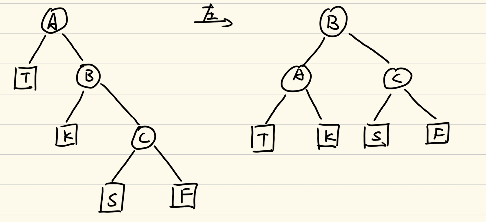

# 数据结构与算法

## 二十九、有序表

关于搜索二叉树，即二叉排序树，这里不做过多的描述（考研学过，不会重新学去）。

我们知道，一棵树进行遍历的时间复杂度取决于树高，如果我们建立搜索二叉树的时候导致了树高过高，那么在查找的时候的时间复杂度就会过高。因此，我们需要将搜索二叉树的树高“压”下来，来减少搜索二叉树在查找时的时间复杂度。

下面介绍两个平衡搜索二叉树的两个操作：左旋和右旋

左旋：

我们先看一个左旋的示例图：



这张图是以A节点为旋转点向左旋转，向左旋转后，B节点充当A节点的位置，B的左孩子全部给A做右孩子，A做B的左孩子，就像图右侧一样。这样，整体的树高因此减少1。

我们如果以搜索二叉树的角度去看着一次旋转，我们会发现，其旋转后并不影响搜索的结果。

右旋：

我们先来看一个示例图


这张图是以A为旋转点向右旋转，向右旋转后，B节点充当A节点的位置，B的右孩子全部给A做左孩子，A做B的右孩子，就像图右侧一样。这样，整体的树高因此减少1。

同样的，这样旋转并不影响搜索二叉树的结果。

我们在此基础上，讲解几种把二叉树树高“压下来”的树。

### 1、平衡搜索二叉树（AVL树）

AVL树的任何一个节点的左树的高度与右树的高度差不会超过1。

AVL树在加入节点的方式上与搜索二叉树没有任何区别。但是在删除节点的时候会有下面几种情况：

1. 删除的节点既没有左节点又没有右节点，那么直接删除即可，对树高没有任何影响。
2. 删除的节点有左节点但是没有右节点，那么让这个节点的左孩子完全替代这个节点的环境即可。
3. 删除的节点有右节点但是没有左节点，那么让这个节点的右孩子完全替代这个节点的环境即可。
4. 删除的节点既有左节点又有右节点，那么我们找这个节点右树上最左节点节点（也可以是左树上的最右节点）代替这个节点的环境即可。

每一个替代过去的节点都相当于把自己原来的节点删除了，让后续的节点向前代替即可。

AVL树的平衡性是在每次进行添加和删除节点之后进行平衡性调整。

AVL树的平衡性会因为添加和删除节点之后被破坏，破坏的类型主要有四种类型（LL，LR，RR，RL），下面给出这四种情况的图示：


我们对这几种类型的处理如下：

1. LL型，我们只需要对该节点进行一次右旋即可。
2. LR型，我们需要对该节点的左孩子进行一次左旋，然后再对该节点进行一次右旋，即让自己左孩子的右孩子调整到自己的位置。
3. RR型，我们只需要对该节点进行一次左旋即可。
4. RL型，我们需要对该节点的右孩子进行一次右旋，然后再对该节点进行一次左旋，即让自己右孩子的左孩子调整到自己的位置。

以上的步骤不明白建议去画图尝试一下。

当然，上面的几种类型有可能会同时出现。试想一下，如果一棵树的根节点的左子树高度为7，右子树高度为6，右子树删去一个结点之后，左子树高度为7，右子树高度变为5，我们可以确定一定是L型其中的一种情况；但是我们去看左子树的左孩子，两个高度有可能会同时为6，这种就属于LL型和LR型。这种情况，我们直接视为LL型进行调整。

而当我们插入一个值进行调整的时候，我们就顺着这个节点网上找自己的父节点，看自己的父节点是否满足这四种情况，如果满足这四种情况，就进行调整；直到遍历到头节点检查完为止。这样，每次进行调整所遍历的节点数量为`logN`，而每次进行旋转调整的时间复杂度为`O(1)`，所以每次调整的时间复杂度为`O(logN)`，

而对于删除一个节点进行调整的时候，我们需要对下面四种情况分别进行分析：

1. 如果删除的节点既没有左孩子，也没有右孩子，那么就从这个节点开始向上每一个父节点进行检查。
2. 如果删除的节点没有左孩子但是有右孩子，那么右孩子将这个节点替换完之后，从这个节点开始向上检查即可。
3. 如果删除的节点有左孩子但是没有右孩子，那么左孩子将这个节点替换完之后，从这个节点开始向上检查即可。
4. 如果删除的节点既有左孩子又有右孩子，那么就从这个删除节点被自己的右孩子的最左节点（或者左孩子的最右节点）替换之后，从这个节点开始向上检查即可。

我们接下来看一下代码：

```java
public static class AVLNode<K extends Comparable<K>, V> {
    public K k;
    public V v;
    public AVLNode<K, V> l;
    public AVLNode<K, V> r;
    public int h;

    public AVLNode(K key, V value) {
        k = key;
        v = value;
        h = 1;
    }
}
public static class AVLTreeMap<K extends Comparable<K>, V> {
    //整个树的根节点
    private AVLNode<K, V> root;
    //一共加入了几个节点
    private int size;
    public AVLTreeMap() {
        root = null;
        size = 0;
    }
    //右旋操作（重点）
    private AVLNode<K, V> rightRotate(AVLNode<K, V> cur) {
        //记一下它的左孩子
        AVLNode<K, V> left = cur.l;
        //让左孩子的右树挂在当前节点的左边
        cur.l = left.r;
        //当前节点挂在左孩子的右边
        left.r = cur;
        //当前节点的高度取自己左右两棵树的高度的最大值+1
        cur.h = Math.max((cur.l != null ? cur.l.h : 0), (cur.r != null ? cur.r.h : 0)) + 1;
        //同时left也要更新
        left.h = Math.max((left.l != null ? left.l.h : 0), (left.r != null ? left.r.h : 0)) + 1;
        //将left返回，left将当前节点代替了
        return left;
    }
    //左旋操作（重点）
    private AVLNode<K,V> leftRotate(AVLNode<K, V> cur) {
        //记一下它的右孩子
        AVLNode<K, V> right = cur.r;
        //让右孩子的左树挂在当前节点的右边
        cur.r = right.l;
        //当前节点挂在右孩子的左边
        right.l = cur;
        //当前节点的高度取自己左右两棵树的高度的最大值+1
        cur.h = Math.max((cur.l != null ? cur.l.h : 0), (cur.r != null ? cur.r.h : 0)) + 1;
        //同时right也要更新，注意顺序，一定要先更新cur的
        right.h = Math.max((right.l != null ? right.l.h : 0), (right.r != null ? right.r.h : 0)) + 1;
        //将right返回，right将当前节点代替了
        return right;
    }
    //（重点）调整方法
    private AVLNode<K, V> maintain(AVLNode<K, V> cur) {
        if (cur == null) {
            return null;
        }
        //获得两个子树的高度
        int leftHeight = cur.l != null ? cur.l.h : 0;
        int rightHeight = cur.r != null ? cur.r.h : 0;
        //如果不平衡就直接进入判断
        if (Math.abs(leftHeight - rightHeight) > 1) {
            //左树高度大于右树高度，必定为L型
            if (leftHeight > rightHeight) {
                //找左树的左子树高度和右子树高度
                int leftLeftHeight = cur.l != null && cur.l.l != null ? cur.l.l.h : 0;
                int leftRightHeight = cur.l != null && cur.l.r != null ? cur.l.r.h : 0;
                if (leftLeftHeight >= leftRightHeight) {
                    //LL型处理
                    cur = rightRotate(cur);
                } else {
                    //LR型处理
                    cur.l = leftRotate(cur.l);
                    cur = rightRotate(cur);
                }
            } else {
                //右树高度大于左树高度，必定为R型
                int rightLeftHeight = cur.r != null && cur.r.l != null ? cur.r.l.h : 0;
                int rightRightHeight = cur.r != null && cur.r.r != null ? cur.r.r.h : 0;
                if (rightRightHeight >= rightLeftHeight) {
                    //RR型处理
                    cur = leftRotate(cur);
                } else {
                    //RL型处理
                    cur.r = rightRotate(cur.r);
                    cur = leftRotate(cur);
                }
            }
        }
        return cur;
    }
    //添加元素
    //上游检查不会有相同的key
    private AVLNode<K, V> add(AVLNode<K, V> cur, K key, V value) {
        //如果当前节点是头节点为空，那么直接new一个
        //如果当前节点是遍历到的为空，即遍历到了叶子节点，那么也直接new一个向上返回
        if (cur == null) {
            return new AVLNode<K, V>(key, value);
        } else {
            if (key.compareTo(cur.k) < 0) {
                //传入的值比当前节点值小，那么直接插在左树
                //至于插在哪里，继续向下调用
                cur.l = add(cur.l, key, value);
            } else {
                cur.r = add(cur.r, key, value);
            }
            //因为当前节点加入节点了，所以要调整高度
            cur.h = Math.max((cur.l != null ? cur.l.h : 0), (cur.r != null ? cur.r.h : 0)) + 1;
            //调整当前节点
            //因为可能会换头节点，所以一定要带返回值
            return maintain(cur);
        }
    }
    //删除元素
    //上游判断节点是否存在
    private AVLNode<K, V> delete(AVLNode<K, V> cur, K key) {
        if (key.compareTo(cur.k) > 0) {
            cur.r = delete(cur.r, key);
        } else if (key.compareTo(cur.k) < 0) {
            cur.l = delete(cur.l, key);
        } else {
            //下面是四种情况的处理
            if (cur.l == null && cur.r == null) {
                cur = null;
            } else if (cur.l == null && cur.r != null) {
                cur = cur.r;
            } else if (cur.l != null && cur.r == null) {
                cur = cur.l;
            } else {
                //既有左孩子又有右孩子的情况
                AVLNode<K, V> des = cur.r;
                //找到右树上的最左节点
                while (des.l != null) {
                    des = des.l;
                }
                //将右树上的最左节点删除
                cur.r = delete(cur.r, des.k);
                //让这个最左节点把当前节点代替
                des.l = cur.l;
                des.r = cur.r;
                cur = des;
            }
        }
        if (cur != null) {
            cur.h = Math.max(cur.l != null ? cur.l.h : 0, cur.r != null ? cur.r.h : 0) + 1;
        }
        return maintain(cur);
    }
    public int size() {
        return size;
    }
    public boolean containsKey(K key) {
        if (key == null) {
            return false;
        }
        AVLNode<K, V> lastNode = findLastIndex(key);
        return lastNode != null && key.compareTo(lastNode.k) == 0 ? true : false;
    }
    //找到小于等于key最右的数
    private AVLNode<K,V> findLastIndex(K key) {
        AVLNode<K, V> pre = root;
        AVLNode<K, V> cur = root;
        while (cur != null) {
            pre = cur;
            if (key.compareTo(cur.k) == 0) {
                break;
            } else if (key.compareTo(cur.k) < 0) {
                cur = cur.l;
            } else {
                cur = cur.r;
            }
        }
        return pre;
    }
    //找到大于等于key最左的数
    private AVLNode<K, V> findLastNoSmallIndex(K key) {
        AVLNode<K, V> ans = null;
        AVLNode<K, V> cur = root;
        while (cur != null) {
            if (key.compareTo(cur.k) == 0) {
                ans = cur;
                break;
            } else if (key.compareTo(cur.k) < 0) {
                ans = cur;
                cur = cur.l;
            } else {
                cur = cur.r;
            }
        }
        return ans;
    }
    private AVLNode<K, V> findLastNoBigIndex(K key) {
        AVLNode<K, V> ans = null;
        AVLNode<K, V> cur = root;
        while (cur != null) {
            if (key.compareTo(cur.k) == 0) {
                ans = cur;
                break;
            } else if (key.compareTo(cur.k) < 0) {
                cur = cur.l;
            } else {
                ans = cur;
                cur = cur.r;
            }
        }
        return ans;
    }
    //添加元素
    public void put(K key, V value) {
        if (key == null) {
            return;
        }
        AVLNode<K, V> lastNode = findLastIndex(key);
        if (lastNode != null && key.compareTo(lastNode.k) == 0) {
            lastNode.v = value;
        } else {
            size++;
            root = add(root, key, value);
        }
    }
    //删除元素
    public void remove(K key) {
        if (key == null) {
            return;
        }
        if (containsKey(key)) {
            size--;
            root = delete(root, key);
        }
    }
    //得到某一个key的value
    public V get(K key) {
        if (key == null) {
            return null;
        }
        AVLNode<K, V> lastNode = findLastIndex(key);
        if (lastNode != null && key.compareTo(lastNode.k) == 0) {
            return lastNode.v;
        }
        return null;
    }
    //找到头Key
    public K firstKey() {
        if (root == null) {
            return null;
        }
        AVLNode<K, V> cur = root;
        while (cur.l != null) {
            cur = cur.l;
        }
        return cur.k;
    }
    //找到尾key
    public K lastKey() {
        if (root == null) {
            return null;
        }
        AVLNode<K, V> cur = root;
        while (cur.r != null) {
            cur = cur.r;
        }
        return cur.k;
    }
    //
    public K floorKey(K key) {
        if (key == null) {
            return null;
        }
        AVLNode<K, V> lastNoBigNode = findLastNoBigIndex(key);
        return lastNoBigNode == null ? null : lastNoBigNode.k;
    }
    //
    public K ceilingKey(K key) {
        if (key == null) {
            return null;
        }
        AVLNode<K, V> lastNoSmallNode = findLastNoSmallIndex(key);
        return lastNoSmallNode == null ? null : lastNoSmallNode.k;
    }
}
```

这里定义的变量都使用的泛型定义变量，来保证使用的广泛性。

这个代码很长，但是我们主要关注左旋、右旋、调整平衡以及添加和删除节点这几个操作。

因为每一次添加、删除、调整、左旋、右旋操作都会改变当前的头节点，所以每一个头节点一定要做返回处理，来保存当前调整完的树的头节点，方便在上游进行拼接操作。

### 2、SB树（Size-Balance-Tree）

SB树的平衡策略是：每个节点的孩子个数必须比自己叔叔节点的孩子的个数少，我们画图来举一个例子：


我们看上图，可以看出F、G的叔叔节点为B，那么B的子树的个数一定大于F的子树的个数和G的子树的个数，同时C的子树的个数一定大于D的子树的个数和E的子树的个数。这就是SB树的策略。

我们可以看出，SB树的平衡性并没有AVL树的平衡性那么严苛，但是其平衡性也非常的好。我们可以思考一下，上图B和C是兄弟节点，加入C节点的孩子的个数比B节点的孩子的个数多，但是B的孩子的个数一定比F和G要多，所以C有再多的节点，他也不过就是B的节点的不到两倍。所以树的高度也是`logN`大小。

同样，SB树也有四种违规类型：

1. LL型，即一个节点的左孩子的左孩子的孩子个数大于自己的右孩子的孩子个数。
2. LR型，即一个节点的左孩子的右孩子的孩子个数大于自己的右孩子的孩子个数。
3. RL型，即一个节点的右孩子的左孩子的孩子个数大于自己的左孩子的孩子个数。
4. RR型，即一个节点的右孩子的右孩子的孩子个数大于自己的左孩子的孩子个数。

我们先详细讲述LL型违规和LR型违规，对于RL型违规和RR型违规的操作是同理的。

我们先看下面的LL型违规操作的示例图：


这是LL型调整的过程，其实与AVL树一样，将父节点进行右旋即可，只不过进行这一步之后，A节点和原先的父节点的孩子发生了改变，所以我们需要递归调用调整方法，对父节点以及A节点再进行一次违规检查调整操作（注意顺序）。

同理，RR型调整的过程与LL型调整一样，将父节点进行左旋即可，同样要对父节点以及提上来的节点进行一次违规检查调整操作（注意顺序）。

我们再来看一下LR型违规操作的示例图：


这是LR调整的方法，其本质与AVL树一样，都是先左旋在右旋。在这个过程中，A节点、B节点以及D节点的孩子都发生了变化，所以A、B、D要分别进行一次违规检查调整操作（注意顺序）。

同理，RL型调整就是先将自己的后孩子右旋，再将自己进行左旋。然后对原先的父节点，父节点的右孩子以及父节点右孩子的左孩子分别及逆行一次违规检查调整操作（注意顺序）。

对于这个调整函数，SB树做如下使用方法：

1. 添加元素的时候，所有沿途所受影响的所有节点全部进行一遍调整。
2. 删除元素的时候，按照AVL树的删除规律进行即可。不过要注意，在SB树中，我们删除完元素后不必要进行调整，这是SB树的优势。

我们看具体的代码实现：

```java
public static class SBTNode<K extends Comparable<K>, V> {
    public K key;
    public V value;
    public SBTNode<K, V> l;
    public SBTNode<K, V> r;
    public int size; // 不同的key的数量

    public SBTNode(K key, V value) {
        this.key = key;
        this.value = value;
        size = 1;
    }
}

public static class SizeBalancedTreeMap<K extends Comparable<K>, V> {
    private SBTNode<K, V> root;
    //右旋和左旋的调整注意关于size的调整
    //与AVL不同，AVL互换高度，但是这里要互换size
    //右旋操作
    private SBTNode<K, V> rightRotate(SBTNode<K, V> cur) {
        SBTNode<K, V> leftNode = cur.l;
        cur.l = leftNode.r;
        leftNode.r = cur;
        leftNode.size = cur.size;
        cur.size = (cur.l != null ? cur.l.size : 0) + (cur.r != null ? cur.r.size : 0) + 1;
        return leftNode;
    }
    //左旋操作
    private SBTNode<K, V> leftRotate(SBTNode<K, V> cur) {
        SBTNode<K, V> rightNode = cur.r;
        cur.r = rightNode.l;
        rightNode.l = cur;
        rightNode.size = cur.size;
        cur.size = (cur.l != null ? cur.l.size : 0) + (cur.r != null ? cur.r.size : 0) + 1;
        return rightNode;
    }
    //调整操作
    private SBTNode<K, V> maintain(SBTNode<K, V> cur) {
        if (cur == null) {
            return null;
        }
        //获取当前节点的所有有关信息：左孩子个数、右孩子个数、左孩子左孩子个数、左孩子有孩子个数、右孩子左孩子个数、右孩子右孩子个数
        int leftSize = cur.l != null ? cur.l.size : 0;
        int leftLeftSize = cur.l != null && cur.l.l != null ? cur.l.l.size : 0;
        int leftRightSize = cur.l != null && cur.l.r != null ? cur.l.r.size : 0;
        int rightSize = cur.r != null ? cur.r.size : 0;
        int rightLeftSize = cur.r != null && cur.r.l != null ? cur.r.l.size : 0;
        int rightRightSize = cur.r != null && cur.r.r != null ? cur.r.r.size : 0;
        //是存在所有情况都不满足的请况，所以每次都要else if
        if (leftLeftSize > rightSize) {
            //LL型情况
            cur = rightRotate(cur);
            cur.r = maintain(cur.r);
            cur = maintain(cur);
        } else if (leftRightSize > rightSize) {
            //LR型情况
            cur.l = leftRotate(cur.l);
            cur = rightRotate(cur);
            cur.l = maintain(cur.l);
            cur.r = maintain(cur.r);
            cur = maintain(cur);
        } else if (rightLeftSize > leftSize) {
            //RL型情况
            cur.r = rightRotate(cur.r);
            cur = leftRotate(cur);
            cur.l = maintain(cur.l);
            cur.r = maintain(cur.r);
            cur = maintain(cur);
        } else if (rightRightSize > leftSize) {
            //RR型情况
            cur = leftRotate(cur);
            cur.l = maintain(cur.l);
            cur = maintain(cur);
        }
        return cur;
    }
    //现在，以cur为头的树上，新增，加(key,value)这样的记录
    //加完之后，会对cur做检查，该调整调整
    //返回，调整完之后，整棵树的新头部
    private SBTNode<K, V> add(SBTNode<K, V> cur, K key, V value) {
        if (cur == null) {
            return new SBTNode<K, V>(key, value);
        } else {
            cur.size++;
            if (key.compareTo(cur.key) < 0) {
                cur.l = add(cur.l, key, value);
            } else {
                cur.r = add(cur.r, key, value);
            }
            return maintain(cur);
        }
    }
    //在cur这棵树上，删掉key所代表的节点
    //返回cur这棵树的新头部
    //注意这个方法要在上游判断节点是否存在，这里默认存在
    private SBTNode<K, V> delete(SBTNode<K, V> cur, K key) {
        cur.size--;
        if (key.compareTo(cur.key) > 0) {
            cur.r = delete(cur.r, key);
        } else if (key.compareTo(cur.key) < 0) {
            cur.l = delete(cur.l, key);
        } else {
            if (cur.l == null && cur.r == null) {
                //c++中要将当先的节点free掉
                cur = null;
            } else if (cur.l == null && cur.r != null) {
                cur = cur.r;
            } else if (cur.l != null && cur.r == null) {
                cur = cur.l;
            } else {
                SBTNode<K, V> pre = null;
                SBTNode<K, V> des = cur.r;
                des.size--;
                while (des.l != null) {
                    pre = des;
                    des = des.l;
                    des.size--;
                }
                if (pre != null) {
                    pre.l = des.r;
                    des.r = cur.r;
                }
                des.l = cur.l;
                des.size = des.l.size + (des.r == null ? 0 : des.r.size) + 1;
                cur = des;
            }
        }
        //这里可以不用进行调整
        return cur;
    }
    private SBTNode<K, V> findLastIndex(K key) {
        SBTNode<K, V> pre = root;
        SBTNode<K, V> cur = root;
        while (cur != null) {
            pre = cur;
            if (key.compareTo(cur.key) == 0) {
                break;
            } else if (key.compareTo(cur.key) < 0) {
                cur = cur.l;
            } else {
                cur = cur.r;
            }
        }
        return pre;
    }
    //
    private SBTNode<K, V> findLastNoSmallIndex(K key) {
        SBTNode<K, V> ans = null;
        SBTNode<K, V> cur = root;
        while (cur != null) {
            if (key.compareTo(cur.key) == 0) {
                ans = cur;
                break;
            } else if (key.compareTo(cur.key) < 0) {
                ans = cur;
                cur = cur.l;
            } else {
                cur = cur.r;
            }
        }
        return ans;
    }
    //
    private SBTNode<K, V> findLastNoBigIndex(K key) {
        SBTNode<K, V> ans = null;
        SBTNode<K, V> cur = root;
        while (cur != null) {
            if (key.compareTo(cur.key) == 0) {
                ans = cur;
                break;
            } else if (key.compareTo(cur.key) < 0) {
                cur = cur.l;
            } else {
                ans = cur;
                cur = cur.r;
            }
        }
        return ans;
    }
    private SBTNode<K, V> getIndex(SBTNode<K, V> cur, int kth) {
        if (kth == (cur.l != null ? cur.l.size : 0) + 1) {
            return cur;
        } else if (kth <= (cur.l != null ? cur.l.size : 0)) {
            return getIndex(cur.l, kth);
        } else {
            return getIndex(cur.r, kth - (cur.l != null ? cur.l.size : 0) - 1);
        }
    }

    public int size() {
        return root == null ? 0 : root.size;
    }

    public boolean containsKey(K key) {
        if (key == null) {
            throw new RuntimeException("invalid parameter.");
        }
        SBTNode<K, V> lastNode = findLastIndex(key);
        return lastNode != null && key.compareTo(lastNode.key) == 0 ? true : false;
    }

    // （key，value） put -> 有序表 新增、改value
    public void put(K key, V value) {
        if (key == null) {
            throw new RuntimeException("invalid parameter.");
        }
        SBTNode<K, V> lastNode = findLastIndex(key);
        if (lastNode != null && key.compareTo(lastNode.key) == 0) {
            lastNode.value = value;
        } else {
            root = add(root, key, value);
        }
    }

    public void remove(K key) {
        if (key == null) {
            throw new RuntimeException("invalid parameter.");
        }
        if (containsKey(key)) {
            root = delete(root, key);
        }
    }

    public K getIndexKey(int index) {
        if (index < 0 || index >= this.size()) {
            throw new RuntimeException("invalid parameter.");
        }
        return getIndex(root, index + 1).key;
    }

    public V getIndexValue(int index) {
        if (index < 0 || index >= this.size()) {
            throw new RuntimeException("invalid parameter.");
        }
        return getIndex(root, index + 1).value;
    }

    public V get(K key) {
        if (key == null) {
            throw new RuntimeException("invalid parameter.");
        }
        SBTNode<K, V> lastNode = findLastIndex(key);
        if (lastNode != null && key.compareTo(lastNode.key) == 0) {
            return lastNode.value;
        } else {
            return null;
        }
    }

    public K firstKey() {
        if (root == null) {
            return null;
        }
        SBTNode<K, V> cur = root;
        while (cur.l != null) {
            cur = cur.l;
        }
        return cur.key;
    }

    public K lastKey() {
        if (root == null) {
            return null;
        }
        SBTNode<K, V> cur = root;
        while (cur.r != null) {
            cur = cur.r;
        }
        return cur.key;
    }

    public K floorKey(K key) {
        if (key == null) {
            throw new RuntimeException("invalid parameter.");
        }
        SBTNode<K, V> lastNoBigNode = findLastNoBigIndex(key);
        return lastNoBigNode == null ? null : lastNoBigNode.key;
    }

    public K ceilingKey(K key) {
        if (key == null) {
            throw new RuntimeException("invalid parameter.");
        }
        SBTNode<K, V> lastNoSmallNode = findLastNoSmallIndex(key);
        return lastNoSmallNode == null ? null : lastNoSmallNode.key;
    }
}
```

这个代码很长，但是我们只需要关注调整、增加以及删除函数，左旋和右旋函数与AVL相同。删除的时候不需要进行调整操作，每次进行添加元素的时候，SB树会直接将树调整平衡。

