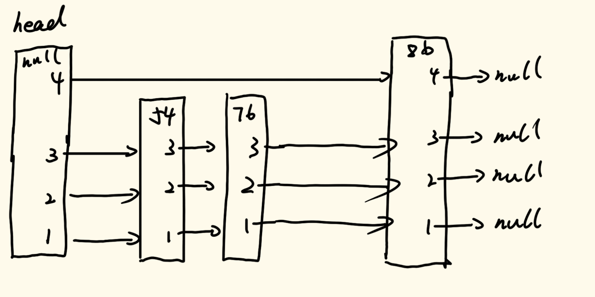

# 数据结构与算法

## 二十九、有序表

### 3、跳表（SkipList）

前面两个有序表结构都使用的二叉树结构，而这节讲的跳表与二叉树无关。

我们先用语言说明跳表的结构是怎样的：

- 跳表初始化：初始化第一个节点，其节点大小为系统的最小值，为null。
- 节点内容：自己存储的值以及序列指针，每一个初始化的序列指针全部指向null。并且根据现有的与自己节点随机到的序列值的最大值设置自己的最大序列值。
- 插入值创建流程：首先通过随机值确定当前插入值的序列值，初始序列值为1，如果随机值大于0.5，那么序列值+1；如果随机值小于0.5，就此停止，确定序列值。然后定义指针cur，从头节点开始，看是否包含这个序列值，如果不包含序列值，那么就将自己的序列值范围上限扩大到该序列值。顺着这个随机到的序列值开始检索，如果序列值指针指向的节点为null，那么就让其指向这个新创立的节点；如果序列值指向的节点的值比目标值小，那么cur指向这个序列值指针指向的这个节点；如果序列值指向的节点的值比目标值大，那么就让创立的节点的该序列值指向cur在该序列值下指向的节点，然后自己的该序列值指针指向这个新创立的节点。当有关于当前序列值操作完成之后，就转入到下一个序列值进行操作，直到所有的序列值全部操作完毕。

我们现在看一个图例，通过图例来理解这一过程：

我们现在已经完成了初始化，然后插入第一个值54，随机到的序列值为3，创建结果如下：


过程是：随机到的序列值为3，而初始化的head的最大序列值为0，所以直接将自己的最大序列值扩充到3，并且值54的节点也是如此。然后定义cur指向自己，从最大序列值开始进行操作。因为初始化的序列值3的指针指向的为null，所以其直接指向插入值54，然后我们看序列值2，2也是null，所以2指向54，序列值1同理。

然后我们再插入一个值76，随机到的序列值同样为3，head最大序列值为3，所以不用进行扩充序列值，并且初始化76节点。然后定义cur指向自己，从最大序列值开始操作。因为序列值3指向的节点值为54，而54小于76，所以cur指向54节点。然后我们再看54节点的序列值3指向的节点，为null，所以直接指向76节点；转到序列值2，同样为null，所以直接指向76节点，1序列值也同理，如下图所示：


然后我们再插入一个值86，随机到的序列值为4，head最大序列值为3，所以扩充到4，并且初始化86节点。然后定义cur指向自己，从最大序列值开始操作。因为序列值指向的为null，所以直接指向86节点，看序列值3；序列值3指向为54小于86，所以cur指向54；再次看cur的序列值3的节点，指向为76小于86，所以cur指向76；cur序列值3指向为null，所以直接指向86节点，然后序列值2和1同理，结果如下图所示：



然后我们再插入一个值39，随机到的序列值为4，head最大序列值为4，所以不用扩充，并且初始化39节点。然后定义cur指向头节点，从最大序列值开始操作。因为序列值4指向的节点为86大于39，所以39节点的序列值4指向的节点改为86，cur序列值4指向的节点为39，然后看下一个序列值；cur序列值3指向的节点为54，所以与之前相同的操作，序列值2和1也相同，这里不做过多描述，结果如下图所示：


接下来插入值为100，随机到的序列值为5，head最大序列值为4，所以要扩充到5，并且初始化100节点。然后定义cur指向头节点，从最大序列值开始操作。因为序列值5指向null，所以直接指向100节点，看下一个序列值；序列值4指向39小于100，cur指向39，然后再看cur序列值4，指向86小于100，所以cur指向86，然后继续看cur序列值4，指向null，这里直接指向100节点，后续的序列值3、2、1同理，结果如下图所示：


接下来插入值为77，随机到的序列值为5，head最大序列值为5，所以不用扩充，并且初始化77节点。然后定义cur指向头节点，从最大序列值开始操作。因为序列值5指向节点100大于77，所以77的序列值5指向100，cur序列值5指向77，然后看下一个序列值；序列值4指向39小于77，所以cur指向39，然后看cur序列值4指向86大于77，所以77的序列值4指向86，cur的序列值4指向77，看下一个序列值；cur序列值3指向54小于77，所以cur指向54，然后再看序列值3，指向76，小于77，所以cur指向76，然后再看序列值3，指向86大于77，所以77的序列值3指向86，cur序列值3指向77，然后序列值2和1同理，结果如下图所示：


我们图例就展示到这里，如果文字看不明白，那么就看图例即可。

当然，我们上述的图例固定了我们的随机值，在实际操作的过程中，如果数据量比较大，那么拥有序列值1的节点的个数为N，拥有序列值2的节点的个数为2/N，拥有序列值3的节点的个数为4/N…。最终跳表的样子与我们输入的数据的顺序无关。如果我们在这个表中检索数据，我们从头节点的最高序列值开始向下遍历，如果指向的值满足某个条件后向下一个节点跨越，那么由于随机值分布的特性，这一个节点跨越会跨越下层很多个节点，通过计算我们就能得出每一个元素进行检索到的时间复杂度为`O(logn)`。

（至于检索的过程，自己用脑子想）

具体实现代码如下：

```java
//跳表的节点定义
public static class SkipListNode<K extends Comparable<K>, V> {
    public K key;
    public V val;
    public ArrayList<SkipListNode<K, V>> nextNodes;
    public SkipListNode(K key, V val) {
        this.key = key;
        this.val = val;
        nextNodes = new ArrayList<>();
    }
    //遍历的时候，如果是从右往左遍历到的null(next == null)，遍历结束
    //头(null)，头结点的null，认为最小
    //node里面的key是否比otherKey小，true，不是false
    public boolean isKeyLess(K otherKey) {
        return otherKey != null && (key == null || key.compareTo(otherKey) < 0);
    }
    public boolean isKeyEqual(K otherKey) {
        return (key == null && otherKey == null) || (key != null && otherKey != null && key.compareTo(otherKey) == 0);
    }
}
public static class SkipListMap<K extends Comparable<K>, V> {
    private static final double PROBABILITY = 0.5;
    //头节点
    private SkipListNode<K, V> head;
    //跳表大小
    private int size;
    //当前跳表的最大序列值
    private int maxLevel;
    public SkipListMap() {
        head = new SkipListNode<>(null, null);
        head.nextNodes.add(null);
        size = 0;
        maxLevel = 0;
    }
    //从最高层开始，一路找下去
    //最终，找到第0层的key的最右的节点
    private SkipListNode<K, V> mostRightLessNodeInTree(K key) {
        if (key == null) {
            return null;
        }
        //从最高层开始找
        int level = maxLevel;
        //从头开始找
        SkipListNode<K, V> cur = head;
        while (level >= 0) {
            //在这一层里小于key的最右节点在哪里
            cur = mostRightLessNodeInLevel(key, cur, level--);
        }
        //这里跳出来以后，一定在最后一层
        return cur;
    }
    private SkipListNode<K,V> mostRightLessNodeInLevel(K key, SkipListNode<K,V> cur, int level) {
        SkipListNode<K, V> next = cur.nextNodes.get(level);
        while (next != null && next.isKeyLess(key)) {
            cur = next;
            next = cur.nextNodes.get(level);
        }
        //从这里跳出来一定是这一层的比目标节点小的最右节点了
        return cur;
    }
    //是否包含key
    public boolean containsKey(K key){
        if (key == null) {
            return false;
        }
        SkipListNode<K, V> less = mostRightLessNodeInTree(key);
        SkipListNode<K, V> next = less.nextNodes.get(0);
        return next != null && next.isKeyEqual(key);
    }
    //新增、改value
    public void put(K key, V value) {
        if (key == null) {
            return;
        }
        //要先找这个表有没有这个节点
        //先找到小于这个值的最右节点
        SkipListNode<K, V> less = mostRightLessNodeInTree(key);
        //然后找上面找到节点的下一个节点
        SkipListNode<K, V> find = less.nextNodes.get(0);
        //如果这个节点存在并且这个节点的key与目标的key相同，那么这个操作就只是更新value的行为
        if (find != null && find.isKeyEqual(key)) {
            find.val = value;
        } else {
            //进入到这个判断，就说明所要操作的元素是新增记录
            size++;
            int newNodeLevel = 0;
            while (Math.random() < PROBABILITY) {
                newNodeLevel++;
            }
            //从这里跳出来序列值就已经确定
            //如果确定的序列值大于目前的序列值，那么就进行扩充
            while (newNodeLevel > maxLevel) {
                head.nextNodes.add(null);
                maxLevel++;
            }
            //初始化节点
            SkipListNode<K, V> newNode = new SkipListNode<>(key, value);
            for (int i = 0; i <= newNodeLevel; i++) {
                newNode.nextNodes.add(null);
            }
            //从最大序列值开始操作
            int level = maxLevel;
            SkipListNode<K, V> pre = head;
            while (level >= 0) {
                //level层中，找到最右的小于key的节点
                pre = mostRightLessNodeInLevel(key, pre, level);
                //当前操作序列值层数小于等于新随机到的序列值的情况下才开始操作
                if (level <= newNodeLevel) {
                    //上面找到最右节点之后，新节点在该序列值指向的节点为pre的下一个
                    newNode.nextNodes.set(level, pre.nextNodes.get(level));
                    //然后重新设置pre在该序列值的指向，指向新节点
                    pre.nextNodes.set(level, newNode);
                }
                level--;
            }
        }
    }
    //得到key的value
    public V get(K key) {
        if (key == null) {
            return null;
        }
        SkipListNode<K, V> less = mostRightLessNodeInTree(key);
        SkipListNode<K, V> next = less.nextNodes.get(0);
        return next != null && next.isKeyEqual(key) ? next.val : null;
    }
    //删除操作
    public void remove(K key) {
        //判断是否有这个元素
        if (containsKey(key)) {
            size--;
            //从最高层出发开始操作
            int level = maxLevel;
            //从头节点出发
            SkipListNode<K, V> pre = head;
            while (level >= 0) {
                //在该序列值下找到比删除目标值小的最右节点
                pre = mostRightLessNodeInLevel(key, pre, level);
                SkipListNode<K, V> next = pre.nextNodes.get(level);
                //1.在这一层中，pre下一个就是key   执行删除操作
                //2.在这一层中，pre的下一个key是大于要删除的key  不执行操作
                //将pre在该序列下的指针指向next在该序列值下指向的节点
                if (next != null && next.isKeyEqual(key)) {
                    pre.nextNodes.set(level, next.nextNodes.get(level));
                }
                //在level层只有一个节点了，就是默认节点head
                //这个时候要减少最大序列值
                if (level != 0 && pre == head && pre.nextNodes.get(level) == null) {
                    head.nextNodes.remove(level);
                    maxLevel--;
                }
                level--;
            }
        }
    }
    public K firstKey() {
        //第0层的第一个
        return head.nextNodes.get(0) != null ? head.nextNodes.get(0).key : null;
    }
    //找最后一个节点，那就直接跳到最后一个节点
    public K lastKey() {
        int level = maxLevel;
        SkipListNode<K, V> cur = head;
        while (level >= 0) {
            SkipListNode<K, V> next = cur.nextNodes.get(level);
            while (next != null) {
                cur = next;
                next = cur.nextNodes.get(level);
            }
            level--;
        }
        return cur.key;
    }
    public K ceilingKey(K key) {
        if (key == null) {
            return null;
        }
        SkipListNode<K, V> less = mostRightLessNodeInTree(key);
        SkipListNode<K, V> next = less.nextNodes.get(0);
        return next != null ? next.key : null;
    }
    public K floorKey(K key) {
        if (key == null) {
            return null;
        }
        SkipListNode<K, V> less = mostRightLessNodeInTree(key);
        SkipListNode<K, V> next = less.nextNodes.get(0);
        return next != null && next.isKeyEqual(key) ? next.key : less.key;
    }
    public int size() {
        return size;
    }
}
```

这些代码里我们需要注意remove函数，实现方式就是通过跳表的特性找到小于目标值的最右节点，然后明确这个最右节点的右节点是否为目标节点，如果是就删掉，如果不是就跳过即可。但是要注意，如果删除这个元素之后，如果删除的元素为上层，并且该层只有目标节点一个节点，那么删除之后这一层就没有元素了，那么我们需要将这一层删去。

### 4、区间和的个数

早在我们学习归并排序的时候，我们就用归并排序实现了这个题的解题方法，这里我们用有序表的方式来解决（有序表来解决会更好）。

（这道题的原题回到归并排序去查看，并且对于归并排序的解法要了解）

我们在使用归并排序解决这个问题的时候，我们将问题转化到了以`i`位置为结尾的子数组有多少个满足条件，当我们在考虑以`i`位置为结尾的子数组有多少个满足条件的时候，我们将问题又转化为`0~j（0≤j≤i）`范围上以0开头j结尾的数组有多少个满足`s-lower, s-upper`这个条件的。第一步问题转化一般是考虑所有子数组问题的思维定式（一般情况下都这么想，但不要盲目这样想）。

在归并排序中，我们利用每次归并的前后两个部分的下标关系（即右侧归并序列无论怎么排序，下标一定大于左侧归并序列），我们实现了这样一个算法。如果我们使用有序表来实现这个算法，我们会发现，我们完全不用进行排序，我们直接顺着数组进行遍历即可，每遍历到一个前缀和数组中的一个元素，我们就可以确定在从开头到该位置这个范围上有多少满足`s-lower, s-upper`条件的前缀数组，而这个功能对于有序表来讲是基本操作。

具体算法流程这样描述：

- 首先计算数组的前缀和数组。
- 定义有序表结构，通过SB树进行改写，实现方法：求在一个区间内满足大小在某一个区间内的数有几个。
- 遍历前缀和数组，每遍历到一个前缀和数据就将其添加到有序表结构当中。
- 每一个元素加入到有序表当中之后，通过有序表定义的方法找到从0开始以当前节点为结尾的区间有几个满足条件的前缀和数组。
- 定义一个变量统计上面返回的结果即可。

上面在有序表中要实现的方法我们可以通过小于指定的key的方法来进行实现。比如说，我们现在要找满足[5,10]范围上的数量，我们可以找满足小于5的数量，并且找到满足小于11的数量，然后做差即可。

我们需要考虑一个问题，这个前缀数组是有可能出现重复数字的，但是我们的有序表是不能存储重复数字的。这种情况我们只需要将多个数字压在一起就可以了。

我们举一个例子：

假如我们现在遍历的数组元素为5、3、3、3、6、6、5，我们这样设计这个有序表。

- 接收到了5，建立节点，key=5，value=1
- 接收到了3，建立节点，key=3，value=1，key=5节点value+1=2
- 接收到了3，key=3节点value+1=2，key=5节点value+1=3
- 接收到了3，key=3节点value+1=3，key=5节点value+1=4
- 接收到了6，建立节点，key=6，value=1，key=5节点value+1=5
- 接收到了6，key=6节点value+1=2，key=5节点value+1=6
- 接收到了5，key=5节点value+1=7

创建的SB树如下图所示：


我们可以看到规律，如果添加节点经过了树的某一个节点，那么这个节点的value+1即可。如果我们想知道某一个节点进来了几个这个值，我们只需要看自己的左右节点，用自己的value减去左右两个孩子节点的value即可得到。

我们要实现的功能为＜key的值有多少个，下面给出一个图例：


在这个图例上，如果我们要找＜16的值的个数，我们首先从头节点出发，因为10<16，所以向右递归遍历寻找，此时遍历到20之后其value为12，所以我们就可以得出，有20-12=8个值小于16；然后20>16，我们往左滑，不累加任何东西；然后15<16，我们向右寻找，发现为null，我们又找到6个值小于16。所以总共8+6=14个值小于16。

所以我们就得到了流程：如果进行搜索向右遍历的情况下，我们进行累加，如果向左进行搜索，我们不累加任何东西。累加的值则是前值减去搜索到的值即可。

具体实现代码如下：

```java
//有序表解法
public static class SBTNode {
    public long key;
    public SBTNode l;
    public SBTNode r;
    //不同key的size    平衡因子
    public long size;
    //总的size    附加的数据项
    public long all;
    public SBTNode(long key) {
        this.key = key;
        size = 1;
        all = 1;
    }
}
public static class SizeBalancedTreeSet {
    //头节点
    private SBTNode root;
    //
    private HashSet<Long> set = new HashSet<>();
    //右旋操作
    private SBTNode rightRotate(SBTNode cur) {
        //计算出该节点key的个数
        long same = cur.all - (cur.l != null ? cur.l.all : 0) - (cur.r != null ? cur.r.all : 0);
        //进行右旋指针调整
        SBTNode leftNode = cur.l;
        cur.l = leftNode.r;
        leftNode.r = cur;
        //size的调整
        leftNode.size = cur.size;
        cur.size = (cur.l != null ? cur.l.size : 0) + (cur.r != null ? cur.r.all : 0) + 1;
        //all的调整
        leftNode.all = cur.all;
        cur.all = (cur.l != null ? cur.l.all : 0) + (cur.r != null ? cur.r.all : 0) + same;
        return leftNode;
    }
    //左旋操作
    private SBTNode leftRotate(SBTNode cur) {
        //计算出该节点key的个数
        long same = cur.all - (cur.l != null ? cur.l.all : 0) - (cur.r != null ? cur.r.all : 0);
        //进行左旋指针调整
        SBTNode rightNode = cur.r;
        cur.r = rightNode.l;
        rightNode.r = cur;
        //size的调整
        rightNode.size = cur.size;
        cur.size = (cur.l != null ? cur.l.size : 0) + (cur.r != null ? cur.r.all : 0) + 1;
        //all的调整
        rightNode.all = cur.all;
        cur.all = (cur.l != null ? cur.l.all : 0) + (cur.r != null ? cur.r.all : 0) + same;
        return rightNode;
    }
    //调整函数
    private SBTNode maintain(SBTNode cur) {
        if (cur == null) {
            return null;
        }
        long leftSize = cur.l != null ? cur.l.size : 0;
        long leftLeftSize = cur.l != null && cur.l.l != null ? cur.l.l.size : 0;
        long leftRightSize = cur.l != null && cur.l.r != null ? cur.l.r.size : 0;
        long rightSize = cur.r != null ? cur.r.size : 0;
        long rightLeftSize = cur.r != null && cur.r.l != null ? cur.r.l.size : 0;
        long rightRightSize = cur.r != null && cur.r.r != null ? cur.r.r.size : 0;
        if (leftLeftSize > rightSize) {
            cur = rightRotate(cur);
            cur.r = maintain(cur.r);
            cur = maintain(cur);
        } else if (leftRightSize > rightSize) {
            cur.l = leftRotate(cur.l);
            cur = rightRotate(cur);
            cur.l = maintain(cur.l);
            cur.r = maintain(cur.r);
            cur = maintain(cur);
        } else if (rightLeftSize > leftSize) {
            cur.r = rightRotate(cur.r);
            cur = leftRotate(cur);
            cur.l = maintain(cur.l);
            cur.r = maintain(cur.r);
            cur = maintain(cur);
        } else if (rightRightSize > leftSize) {
            cur = rightRotate(cur);
            cur.l = maintain(cur.l);
            cur = maintain(cur);
        }
        return cur;
    }
    //添加操作
    private SBTNode add(SBTNode cur, long key, boolean contains) {
        if (cur == null) {
            return new SBTNode(key);
        } else {
            //接收了一个新的key，所以all++
            cur.all++;
            if (key == cur.key) {
                return cur;
            } else {
                //如果没有这个节点，size++
                if (!contains) {
                    cur.size++;
                }
                if (key < cur.key) {
                    cur.l = add(cur.l, key, contains);
                } else {
                    cur.r = add(cur.r, key, contains);
                }
                return maintain(cur);
            }
        }
    }
    public void add(long sum) {
        boolean contains = set.contains(sum);
        root = add(root, sum, contains);
        set.add(sum);
    }
    //比key小的值有几个
    public long lessKeySize(long key) {
        SBTNode cur = root;
        long ans = 0;
        while (cur != null) {
            if (key == cur.key) {
                //如果目标key与当前检索到的key相同，那么就不用继续检索了，看其左孩子上的all，直接加上即可
                return ans + (cur.l != null ? cur.l.all : 0);
            } else if (key < cur.key) {
                //向左滑，不用操作
                cur = cur.l;
            } else {
                //向右滑
                ans += cur.all - (cur.r != null ? cur.r.all : 0);
                cur = cur.r;
            }
        }
        return ans;
    }
    public long moreKeySize(long key) {
        return root != null ? (root.all - lessKeySize(key + 1)) : 0;
    }
}
public static int countRangeSum2(int[] nums, int lower, int upper) {
    //黑盒，加入数字（前缀和），不去重，可以接收重复数字
    //<num，有几个数
    SizeBalancedTreeSet treeSet = new SizeBalancedTreeSet();
    long sum = 0;
    int ans = 0;
    treeSet.add(0);//一个数都没有的时候，就已经有一个前缀和累加和为0
    for (int i = 0; i < nums.length; i++) {
        sum += nums[i];
        long a = treeSet.lessKeySize(sum - lower + 1);
        long b = treeSet.lessKeySize(sum - upper);
        ans += a - b;
        treeSet.add(sum);
    }
    return ans;
}
```

