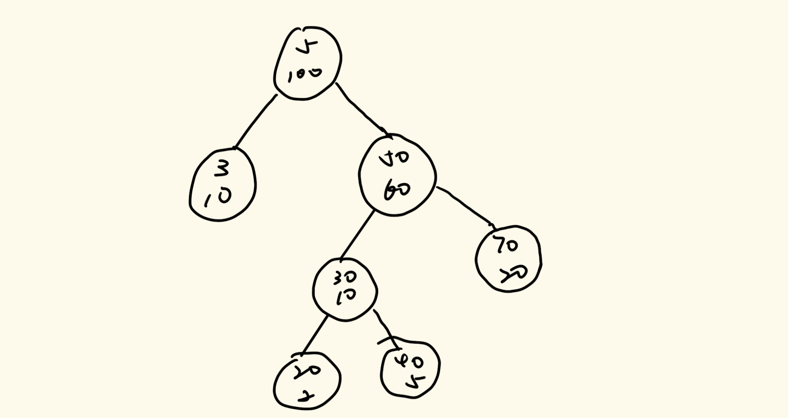
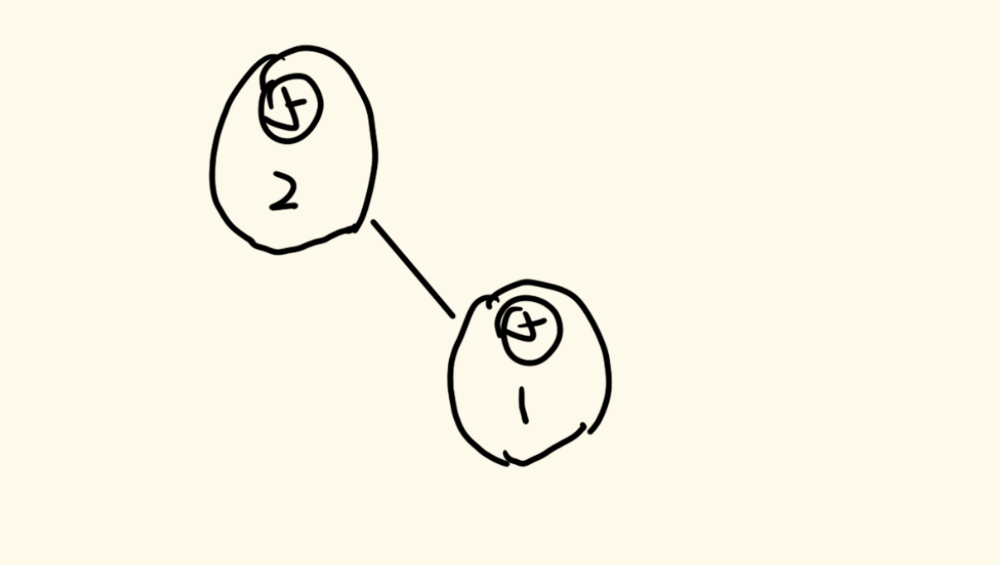
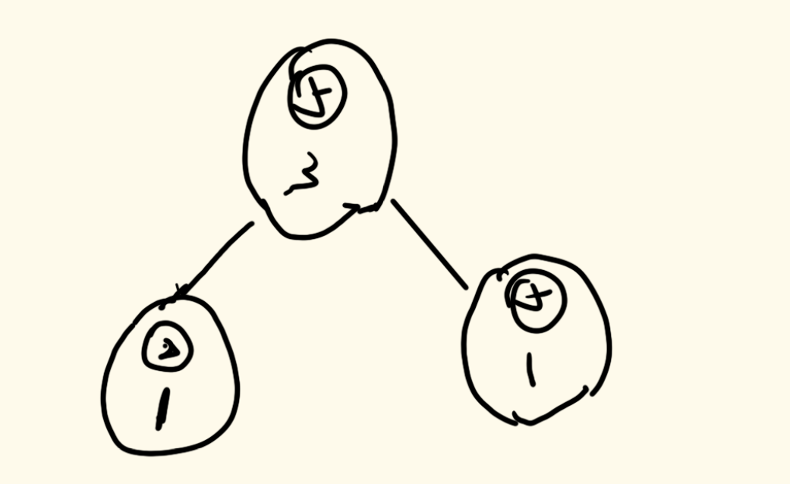
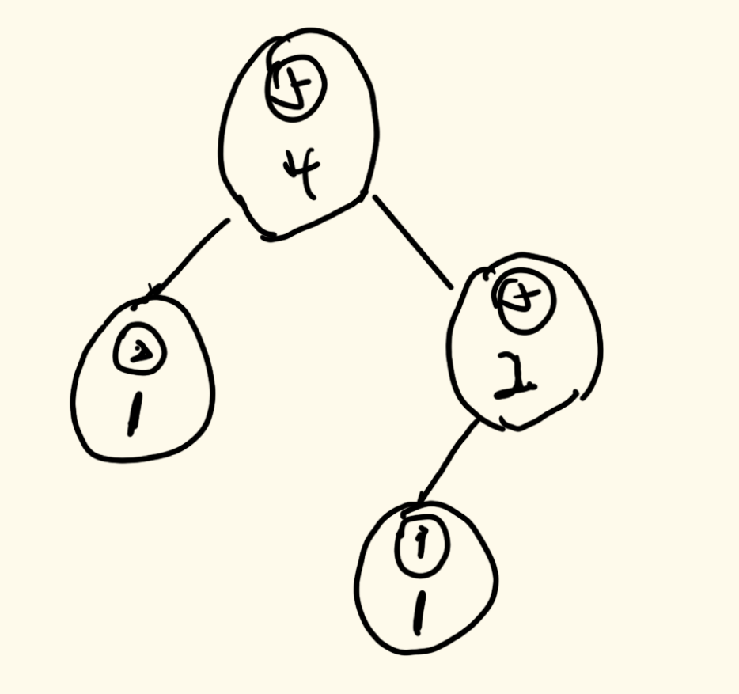
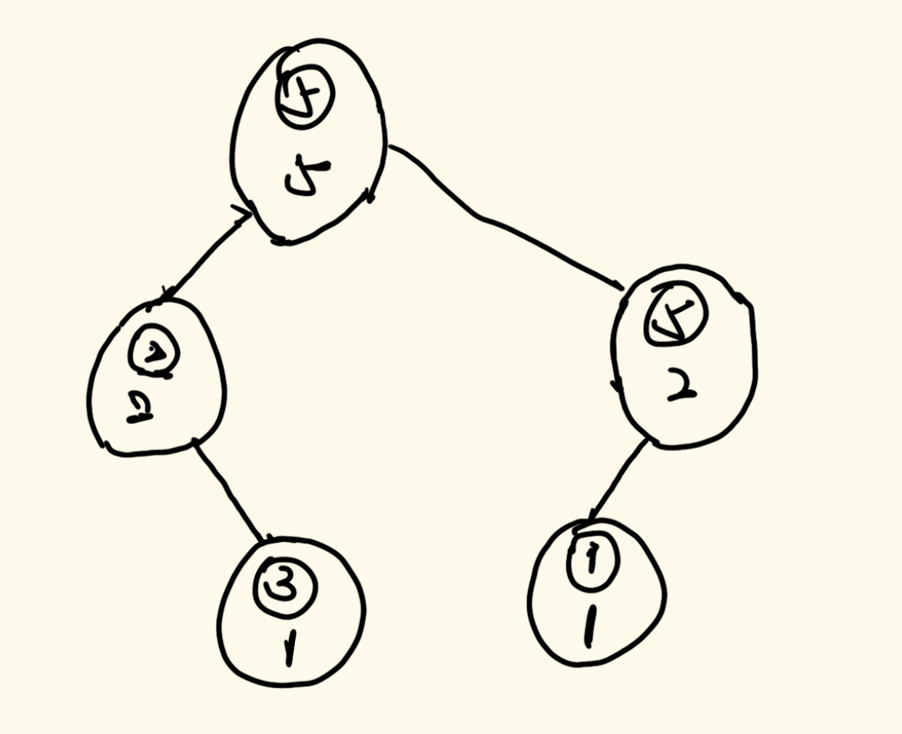
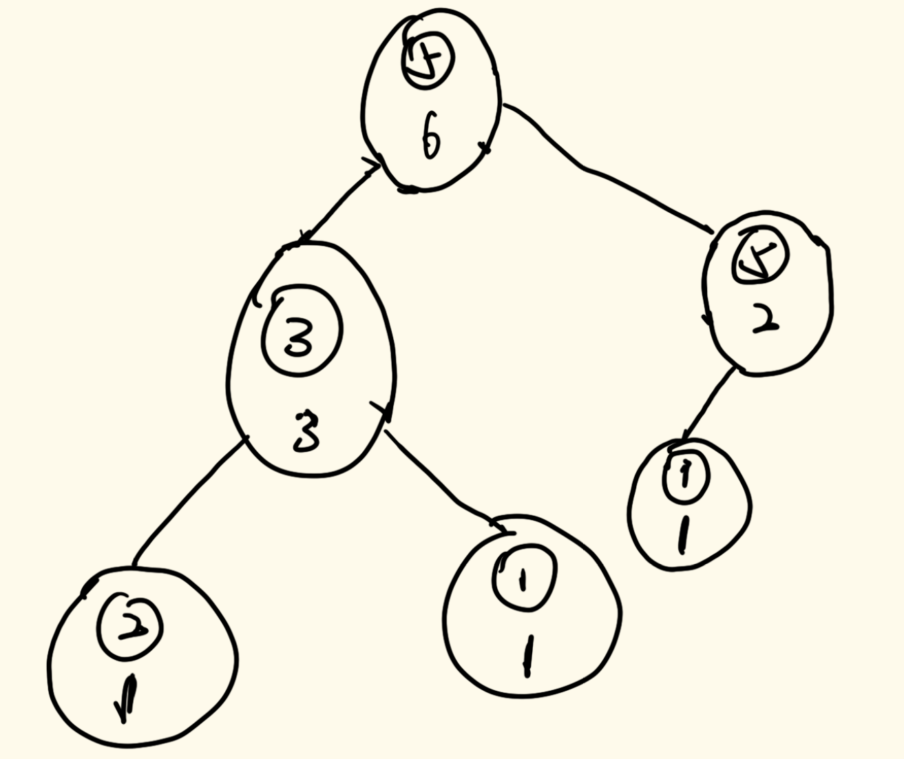

# 数据结构与算法

## 二十九、有序表

### 5、滑动窗口中位数

> 有一个滑动窗口：
>
> 1. L是滑动窗口的最左位置、R是滑动窗口的最有位置，一开始LR都在数组左侧
> 2. 任何一步都可能R往右动，表示某个数进了窗口
> 3. 任何一步都可能L往右动，表示某个数出了窗口
>
> 想知道每一个窗口状态的中位数

我们依旧可以用上一道题的有序表结构，只不过这次我们需要实现删除操作，并且实现的功能需要进行修改，即我们需要找到在index位置上的数。

删除操作可以按照SB树进行处理，我们删除元素时不需要对树进行maintain，只需要按照节点进行处理即可。因为每一个节点上都附带了一个all，只有all为0时，这个节点才能被删除。

而对于找中位数，我们用图示来说明：



如上图（树并不平衡，将就看，道理一样）。

我们现在寻找的index为27，我们从头节点出发，头节点的左树有10个数，右树有60个数，所以自己就有30个，即有30个5，index划分区间为`0~9`、`10~39`、`40~99`。而27落在了`10~39`这个区间，所以index为27的节点值为5。

我们在寻找一个index为77，我们发现他落在了`40~99`这个区间，所以向右递归，递归传过去的index为37，我们在头节点的右树上找Index为37的值，再次进行划分区间，为`0~9`、`10~39`、`40~59`，37落在了中间区间，所以index为77的节点的值为50。

所以我们就明确了找到对应Index的方法：每次搜索到一个节点，我们就根据这个节点的all以及左右孩子的all划分区间，如果在左区间，向左递归，index不用变；如果在中间区域，直接返回节点key即可；如果在右区间，那么就需要向右递归，index需要减去该节点与右子树的all的差值。

具体实现代码如下：

```java
public static class SBTNode<K extends Comparable<K>> {
    public K key;
    public SBTNode<K> l;
    public SBTNode<K> r;
    //平衡因子
    public int size;
    public SBTNode(K key) {
        this.key = key;
        size = 1;
    }
}
public static class SizeBalancedTreeMap<K extends Comparable<K>> {
    private SBTNode<K> root;
    private SBTNode<K> rightRotate(SBTNode<K> cur) {
        SBTNode<K> leftNode = cur.l;
        cur.l = leftNode.r;
        leftNode.r = cur;
        leftNode.size = cur.size;
        cur.size = (cur.l != null ? cur.l.size : 0) + (cur.r != null ? cur.r.size : 0) + 1;
        return leftNode;
    }
    private SBTNode<K> leftRotate(SBTNode<K> cur) {
        SBTNode<K> rightNode = cur.r;
        cur.r = rightNode.l;
        rightNode.l = cur;
        rightNode.size = cur.size;
        cur.size = (cur.l != null ? cur.l.size : 0) + (cur.r != null ? cur.r.size : 0) + 1;
        return rightNode;
    }
    private SBTNode<K> maintain(SBTNode<K> cur) {
        if (cur == null) {
            return null;
        }
        long leftSize = cur.l != null ? cur.l.size : 0;
        long leftLeftSize = cur.l != null && cur.l.l != null ? cur.l.l.size : 0;
        long leftRightSize = cur.l != null && cur.l.r != null ? cur.l.r.size : 0;
        long rightSize = cur.r != null ? cur.r.size : 0;
        long rightLeftSize = cur.r != null && cur.r.l != null ? cur.r.l.size : 0;
        long rightRightSize = cur.r != null && cur.r.r != null ? cur.r.r.size : 0;
        if (leftLeftSize > rightSize) {
            cur = rightRotate(cur);
            cur.r = maintain(cur.r);
            cur = maintain(cur);
        } else if (leftRightSize > rightSize) {
            cur.l = leftRotate(cur.l);
            cur = rightRotate(cur);
            cur.l = maintain(cur.l);
            cur.r = maintain(cur.r);
            cur = maintain(cur);
        } else if (rightLeftSize > leftSize) {
            cur.r = rightRotate(cur.r);
            cur = leftRotate(cur);
            cur.l = maintain(cur.l);
            cur.r = maintain(cur.r);
            cur = maintain(cur);
        } else if (rightRightSize > leftSize) {
            cur = leftRotate(cur);
            cur.l = maintain(cur.l);
            cur = maintain(cur);
        }
        return cur;
    }
    //找到key的前值
    private SBTNode<K> findLastIndex(K key) {
        SBTNode<K> pre = root;
        SBTNode<K> cur = root;
        while (cur != null) {
            pre = cur;
            if (key.compareTo(cur.key) == 0) {
                break;
            } else if (key.compareTo(cur.key) < 0) {
                cur = cur.l;
            } else {
                cur = cur.r;
            }
        }
        return pre;
    }
    //添加元素
    private SBTNode<K> add(SBTNode<K> cur, K key) {
        if (cur == null) {
            return new SBTNode<K>(key);
        } else {
            cur.size++;
            if (key.compareTo(cur.key) < 0) {
                cur.l = add(cur.l, key);
            } else {
                cur.r = add(cur.r, key);
            }
            return maintain(cur);
        }
    }
    //删除元素（重点）
    private SBTNode<K> delete(SBTNode<K> cur, K key) {
        cur.size--;
        if (key.compareTo(cur.key) > 0) {
            cur.r = delete(cur.r, key);
        } else if (key.compareTo(cur.key) < 0) {
            cur.l = delete(cur.l, key);
        } else {
            if (cur.l == null && cur.r == null) {
                cur = null;
            } else if (cur.l == null && cur.r != null) {
                cur = cur.r;
            } else if (cur.l != null && cur.r == null) {
                cur = cur.l;
            } else {
                SBTNode<K> pre = null;
                SBTNode<K> des = cur.r;
                des.size--;
                while (des.l != null) {
                    pre = des;
                    des = des.l;
                    des.size--;
                }
                if (pre != null) {
                    pre.l = des.r;
                    des.r = cur.r;
                }
                des.l = cur.l;
                des.size = des.l.size + (des.r != null ? des.r.size : 0);
                cur = des;
            }
        }
        return cur;
    }
    private SBTNode<K> getIndex(SBTNode<K> cur, int kth) {
        if (kth == (cur.l != null ? cur.l.size : 0) + 1) {
            return cur;
        } else if (kth <= (cur.l != null ? cur.l.size : 0)) {
            return getIndex(cur.l, kth);
        } else {
            return getIndex(cur.r, kth - (cur.l != null ? cur.l.size : 0) - 1);
        }
    }
    public int size() {
        return root == null ? 0 : root.size;
    }
    public boolean containsKey(K key) {
        if (key == null) {
            throw new RuntimeException("invalid parameter.");
        }
        SBTNode<K> lastNode = findLastIndex(key);
        return lastNode != null && key.compareTo(lastNode.key) == 0;
    }
    public void add(K key) {
        if (key == null) {
            throw new RuntimeException("invalid parameter.");
        }
        SBTNode<K> lastNode = findLastIndex(key);
        if (lastNode == null || key.compareTo(lastNode.key) != 0) {
            root = add(root, key);
        }
    }
    public void remove(K key) {
        if (key == null) {
            throw new RuntimeException("invalid parameter.");
        }
        if (containsKey(key)) {
            root = delete(root, key);
        }
    }
    public K getIndexKey(int index) {
        if (index < 0 || index >= this.size()) {
            throw new RuntimeException("invalid parameter.");
        }
        return getIndex(root, index + 1).key;
    }
}
public static class Node implements Comparable<Node> {
    public int index;
    public int value;
    public Node(int i, int v) {
        index = i;
        value = v;
    }
    @Override
    public int compareTo(Node o) {
        return value != o.value ? Integer.valueOf(value).compareTo(o.value)
            : Integer.valueOf(index).compareTo(o.index);
    }
}
public static double[] medianSlidingWindow(int[] nums, int k) {
    SizeBalancedTreeMap<Node> map = new SizeBalancedTreeMap<>();
    //先把前K个数放进有序表中
    //注意，这里添加的数为k-1个数，所以下面的循环第一步添加之后就变成k个数了
    for (int i = 0; i < k - 1; i++) {
        map.add(new Node(i, nums[i]));
    }
    double[] ans = new double[nums.length - k + 1];
    int index = 0;
    for (int i = k - 1; i < nums.length; i++) {
        map.add(new Node(i, nums[i]));
        if (map.size() % 2 == 0) {
            //如果是偶数次，则调用两次index方法，然后求中位数
            Node upmid = map.getIndexKey(map.size() / 2 - 1);
            Node downmid = map.getIndexKey(map.size() / 2);
            ans[index++] = ((double) upmid.value + (double) downmid.value) / 2;
        } else {
            //如果是奇数次，则调用一次index方法即可
            Node mid = map.getIndexKey(map.size() / 2);
            ans[index++] = (double) mid.value;
        }
        map.remove(new Node(i - k + 1, nums[i - k + 1]));
    }
    return ans;
}
```

上面的算法我们并没有使用上一题的结构（虽然有些相似），我们把相同值的不同位置上的数通过Node类进行了区分。如果不理解的话，我们可以看下一道题。

### 6、原序还原问题

> 设计一个结构包含如下三个方法：
>
> ```java
> void add(int index, int num);//把num加入到index位置
> int get(int index);//取出index的值
> void remove(int index);//把index位置上的值删除
> ```
>
> 要求三个方法时间复杂度`O(logN)`。

这道题要求我们将一个有序表设计成一个类似于数组的形式，当我们取出Index位置上的数的时候，我们可以通过index直接取出，同时添加和删除元素的时候也是通过index来删除的。

所以，在这个有序表中，我们需要能够存储元素值相同的元素（这个躲不了，必须实现），并且其排序方式要通过index来实现，而不是值的大小。

我们看下面的图例来明确这个结构该如何设计：

我们现在设定一套插入顺序，然后这个数组的值依次往里面添加：1：5、2：5、1：2、3：1、2：3、3：1、4：6、2：3。

其有序表数节点结构如下定义方式：

```java
public static class SBTNode<V> {
    public V value;
    public SBTNode<V> l;
    public SBTNode<V> r;
    public int size;

    public SBTNode(V v) {
        value = v;
        size = 1;
    }
}
```

对于泛型V，我们可以利用Integer类型使用，为了就是将元素“包”一层，使得元素值相同的元素不相同。

我们按照顺序来依次插入上面的元素：

首先在1位置上插入5，直接定义就好。

然后在2位置上插入5，我们从根节点出发，这个时候根节点的size为1，左右树都为空，所以向2位置插入直接往右树走即可，并且经过的size全部+1。



然后在1位置插入2，我们从头节点出发，发现头节点的size为2，而左树空，右子树size为1，说明1位置我们是有值的，这个时候我们递归左树，在左树上插上即可。



然后在3位置插入1，我们再次从头节点出发，因为头节点size=3，左树size=1，右树size=1，所以当前节点所在的index为2，向右滑动，并且插入的index改为1（减去该节点与其右树的差值）。递归到了右树节点后，其节点size=1，所以该节点在这个次序上为1，所以向左滑动，为null，在这里插入节点即可。



然后我们在2位置插入3，从头节点出发，此时size=4，左树size=1，右树size=2，所以该节点位置为2，所以向左递归；然后再看当前节点，size=1，左右树都为空，所以该节点位置为1，向右滑动插入其右树即可。



然后在3位置插入1，我们还是从头节点开始，左树size=2，右树size=2，所以当前位置为3，向左递归；当前节点左树为空，右树size=1，所以当前节点的位置为1，向右滑动，插入位置改为2；此时节点左右树皆为空，所以向右滑动，直接插入即可（插入后树变得不再平衡，为RR型，所以需要将树调平衡）



后面的插入我们就不再展示了。

所以总结下来，我们的添加方法如下：

- 定义节点，初始size为1
- 定义cur，初始化为头节点
- 传入要插入的位置index
- 找cur的左节点，通过左节点的size大小判断当前cur节点处在那个位置，设为LAHS。
- 如果LAHS小于index，那么向右递归，传入的index为`index-(size-rightSize)`
- 如果LAHS大于等于index，那么向左递归，index传入值不变。
- 如果递归到了null，那么就把插入的节点返回

由于我们使用的SB树，所以删除节点该怎么删怎么删，我们不需要进行调整。

（至于查找怎么写，用脚想想）

具体实现代码如下：

```java
public static class SBTNode<V> {
    public V value;
    public SBTNode<V> l;
    public SBTNode<V> r;
    public int size;

    public SBTNode(V v) {
        value = v;
        size = 1;
    }
}
public static class SbtList<V> {
    private SBTNode<V> root;
    private SBTNode<V> rightRotate(SBTNode<V> cur) {
        SBTNode<V> leftNode = cur.l;
        cur.l = leftNode.r;
        leftNode.r = cur;
        leftNode.size = cur.size;
        cur.size = (cur.l != null ? cur.l.size : 0) + (cur.r != null ? cur.r.size : 0) + 1;
        return leftNode;
    }

    private SBTNode<V> leftRotate(SBTNode<V> cur) {
        SBTNode<V> rightNode = cur.r;
        cur.r = rightNode.l;
        rightNode.l = cur;
        rightNode.size = cur.size;
        cur.size = (cur.l != null ? cur.l.size : 0) + (cur.r != null ? cur.r.size : 0) + 1;
        return rightNode;
    }

    private SBTNode<V> maintain(SBTNode<V> cur) {
        if (cur == null) {
            return null;
        }
        int leftSize = cur.l != null ? cur.l.size : 0;
        int leftLeftSize = cur.l != null && cur.l.l != null ? cur.l.l.size : 0;
        int leftRightSize = cur.l != null && cur.l.r != null ? cur.l.r.size : 0;
        int rightSize = cur.r != null ? cur.r.size : 0;
        int rightLeftSize = cur.r != null && cur.r.l != null ? cur.r.l.size : 0;
        int rightRightSize = cur.r != null && cur.r.r != null ? cur.r.r.size : 0;
        if (leftLeftSize > rightSize) {
            cur = rightRotate(cur);
            cur.r = maintain(cur.r);
            cur = maintain(cur);
        } else if (leftRightSize > rightSize) {
            cur.l = leftRotate(cur.l);
            cur = rightRotate(cur);
            cur.l = maintain(cur.l);
            cur.r = maintain(cur.r);
            cur = maintain(cur);
        } else if (rightRightSize > leftSize) {
            cur = leftRotate(cur);
            cur.l = maintain(cur.l);
            cur = maintain(cur);
        } else if (rightLeftSize > leftSize) {
            cur.r = rightRotate(cur.r);
            cur = leftRotate(cur);
            cur.l = maintain(cur.l);
            cur.r = maintain(cur.r);
            cur = maintain(cur);
        }
        return cur;
    }
    private SBTNode<V> add(SBTNode<V> root, int index, SBTNode<V> cur) {
        if (root == null) {
            return cur;
        }
        root.size++;
        //获取当前节点位置
        int leftAndHeadSize = (root.l != null ? root.l.size : 0) + 1;
        if (index < leftAndHeadSize) {
            //向左滑动
            root.l = add(root.l, index, cur);
        } else {
            //向右滑动
            root.r = add(root.r, index - leftAndHeadSize, cur);
        }
        root = maintain(root);
        return root;
    }
    private SBTNode<V> remove(SBTNode<V> root, int index) {
        root.size--;
        int rootIndex = root.l != null ? root.l.size : 0;
        if (index != rootIndex) {
            if (index < rootIndex) {
                root.l = remove(root.l, index);
            } else {
                root.r = remove(root.r, index - rootIndex - 1);
            }
            return root;
        }
        if (root.l == null && root.r == null) {
            return null;
        }
        if (root.l == null) {
            return root.r;
        }
        if (root.r == null) {
            return root.l;
        }
        SBTNode<V> pre = null;
        SBTNode<V> suc = root.r;
        suc.size--;
        while (suc.l != null) {
            pre = suc;
            suc = suc.l;
            suc.size--;
        }
        if (pre != null) {
            pre.l = suc.r;
            suc.r = root.r;
        }
        suc.l = root.l;
        suc.size = suc.l.size + (suc.r == null ? 0 : suc.r.size) + 1;
        return suc;
    }
    //得到index位置的元素
    //注意下标问题
    private SBTNode<V> get(SBTNode<V> root, int index) {
        int leftSize = root.l != null ? root.l.size : 0;
        if (index < leftSize) {
            return get(root.l, index);
        } else if (index == leftSize) {
            return root;
        } else {
            return get(root.r, index - leftSize - 1);
        }
    }

    public void add(int index, V num) {
        SBTNode<V> cur = new SBTNode<V>(num);
        if (root == null) {
            root = cur;
        } else {
            if (index <= root.size) {
                root = add(root, index, cur);
            }
        }
    }

    public V get(int index) {
        SBTNode<V> ans = get(root, index);
        return ans.value;
    }

    public void remove(int index) {
        if (index >= 0 && size() > index) {
            root = remove(root, index);
        }
    }

    public int size() {
        return root == null ? 0 : root.size;
    }
}
```

### 7、红黑树

有关于红黑树有比较多的性质，我们这里就先描述四条：

1. 每一个红黑树的节点要么是红色节点，要么是黑色节点
2. 红黑树的头节点一定是黑色节点，同时叶子节点（红黑树有null节点）必须都是黑色节点
3. 红色节点和黑色节点不能相邻，即不能互为父子关系
4. 所有分支的黑色节点数量必须一致

我们由第3、4条性质我们可以得出，对于从头节点出发的每一条红黑树路径，最长的路径一定是黑红相间的类型，而最短的路径一定是全黑类型，此时最长和最短的路径相差不会超过两倍，通过这样的方式来维持整棵树的平衡。

对于红黑树，插入总共有5种情况，而删除总共有8种情况。

