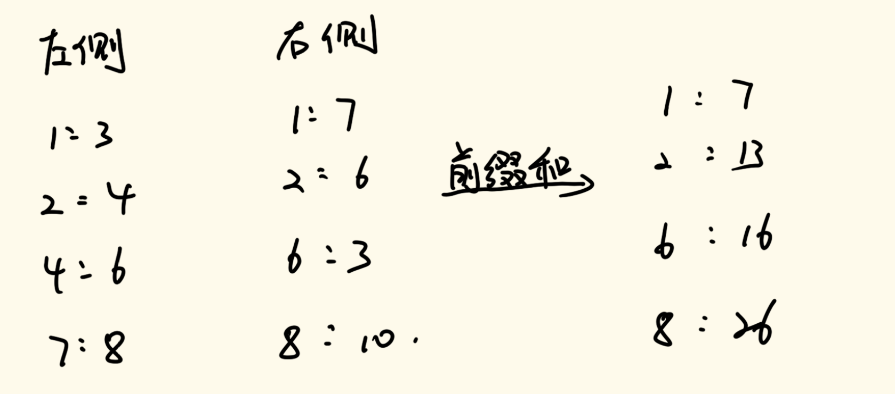

# 数据结构与算法

## 三十、根据对数器找规律、根据数据量猜解法

### 1、题目一

> 小虎去买苹果，商店只提供两种类型的塑料袋，每种类型都有任意数量。
>
> 1. 能装下6个苹果的袋子
> 2. 能装下8个苹果的袋子
>
> 小虎可以自由使用两种袋子来装苹果，但是小虎有强迫症，他要求自己使用的袋子数量必须少，且使用的每个袋子必须装满。
>
> 给定一个正整数N，返回至少使用多少袋子。如果N无法让是员工的每个袋子必须装满，返回-1。

这道题我们先思考一个比较笨的办法。因为我们要用的袋子数量必须少，所以能用装下8个苹果的袋子就一定要用。我们可以假定所有的苹果都用第二个袋子装，然后看余下多少个苹果，如果余下的苹果数量能够用一号袋子装满（即能整除一号袋子），那么我们就找到了一个方案；如果余下的苹果不能够用一号袋子装满，那么就减去一个二号袋子，然后再去尝试即可。

具体实现代码如下：

```java
public static int minBags(int apple) {
    if (apple < 0) {
        return -1;
    }
    int bag8 = apple / 8;
    int rest = apple - 8 * bag8;
    while (bag8 >= 0) {
        //rest个
        if (rest % 6 == 0) {
            return bag8 + (rest / 6);
        } else {
            bag8--;
            rest += 8;
        }
    }
    return -1;
}
```

我们可以写一个对数器，来观察最后返回的结果有什么特征。

我们可以通过输出结果看出来，从apple=18开始，8个一组，每一组中奇数全为-1，偶数全部为结果，从18开始，第0组偶数为3，第一组偶数为4，第二组偶数为5……。 

对于apple<18的区域，我们找不大规律，我们就用一种穷举的方式来获得相应的值即可。

具体实现代码如下：

```java
public static int minBagAwesome(int apple) {
    if ((apple & 1) != 0) {
        return -1;
    }
    if (apple < 18) {
        return apple == 0 ? 0 : (apple == 6 || apple == 8) ? 1 : (apple == 12 || apple == 14 || apple == 16) ? 2 : -1;
    }
    return (apple - 18) / 8 + 3;
}
```

其实这种方法有一种面向结果编程的感觉，只不过我们通过暴力解的方式找到了解的规律，然后按照规律进行编程实现即可。

### 2、题目二

> 给定一个正整数N，表示有N份青草统一堆放在仓库里
>
> 有一只牛和一只羊，牛先吃，羊后吃，它俩轮流吃草
>
> 不管是牛还是羊，每一轮能吃的草量必须是：
>
> 1，4，16，64…（4的某次方）
>
> 谁最先把草吃完，谁获胜
>
> 假设牛和羊都绝顶聪明，都想赢，都会做出理性的决定
>
> 根据唯一的参数N，返回谁会赢

我们先用最暴力的方式来解决这个问题。

我们先进行枚举，从0开始，枚举到4，我们发现当N=0和N=2时后手赢，其余的情况都是先手赢。这样我们就得到了这个递归方法的base case。

然后我们可以通过递归的方式来解决这个问题。如果当前的羊想要吃的草的个数为want，那么如果n-want调用中后手赢了，那么就代表当前的羊作为先手赢了。通过这个思路，我们就能写出暴力递归解决的方法。

具体实现代码如下：

```java
//如果n份草，最终先手赢，返回“先手”
//反之，则返回“后手”
public static String whoWin(int n) {
    if (n < 5) {
        return n == 0 || n == 2 ? "后手" : "先手";
    }
    //进到这个过程里来，当前的先手，先选
    int want = 1;
    while (want <= n) {
        //want  n-want
        //如果后续过程中后手赢了，那么就是当前的羊赢了
        if (whoWin(n - want).equals("后手")) {
            return "先手";
        }
        want *= 4;
    }
    return "后手";
}
```

我们可以通过对数器跑一遍代码，我们可以找到规律：每5个n一组，顺序全部都是：后手、先手、后手、先手、先手。所以这道题的优化代码就得到了。

```java
public static String winner(int n) {
    if (n % 5 == 0 || n % 5 == 2) {
        return "后手";
    } else {
        return "先手";
    }
}
```

不过上面递归版本的代码的want*4的代码可能会造成溢出，所以我们需要对代码进行改进防止溢出（这里就不展示了，做一个if就可以）。

### 3、题目三

> 定义一种数：可以表示成若干（数量>1）连续正数和的数
>
> 比如：
>
> 5 = 2 + 3，5就是这样的数
>
> 12 = 3 + 4 + 5，12就是这样的数
>
> 1不是这样的数，因为要求数量大于1个、连续正数和
>
> 2 = 1 + 1，2也不是，因为等号右边不是连续正数
>
> 给定一个参数N，返回是不是可以表示成若干连续正数和的数

我们还是先通过暴力的方法来实现这个问题。

对于每一个传入的N，我们从1开始尝试，尝试1+2+…，直到加到某一个数与N相等，那么就可以返回true，如果从1开始不行，那就从2开始，直到把所有的数全部尝试一遍即可（这个过程没有剪枝，时间复杂度肯定很高，但是没关系，我们通过有限的数量来找结果规律）。

具体实现代码如下：

```java
public static boolean isMSum1(int num) {
    for (int i = 0; i < num; i++) {
        int sum = i;
        for (int j = i + 1; j <= num; j++) {
            if (sum + j > num) {
                break;
            }
            if (sum + j == num) {
                return true;
            }
            sum += j;
        }
    }
    return false;
}
```

然后我们将数据量设为200，进行测试，发现在2^k^的N都为false，其余都为true。

所以我们的这道题代码就简化成了如下形式：

```java
public static boolean isMSum2(int num) {
    return (num & (num - 1)) != 0;
}
```

### 4、对数器找规律总结

1. 某个面试题，输入参数类型简单，并且只有一个实际参数
2. 要求的返回值类型也简单，并且只有一个
3. 用暴力方法，把输入参数对应的返回值，打印出来看看，进而优化code

### 5、题目四

> int[] d，d[i]：i号怪兽的能力
> int[] p，p[i]：i号怪兽要求的钱
> 开始时你的能力是0，你的目标是从0号怪兽开始，通过所有的怪兽。
> 如果你当前的能力，小于i号怪兽的能力，你必须付出p[i]的钱，贿赂这个怪兽，然后怪兽就会加入你
> 他的能力直接累加到你的能力上；如果你当前的能力，大于等于i号怪兽的能力
> 你可以选择直接通过，你的能力并不会下降，你也可以选择贿赂这个怪兽，然后怪兽就会加入你
> 他的能力直接累加到你的能力上
> 返回通过所有的怪兽，需要花的最小钱数

这道题我们可以使用动态规划的方式来解决。

这是一个经典的从左往右模型问题，每次递归我们只需要考虑两种情况：

1. 如果当前的能力值小于当前怪兽的能力，那么我们只能花钱去买这个怪兽的能力
2. 如果当前的能力值大于等于怪兽的能力，那么我们有两种选择：
   1. 花钱去买这个怪兽的能力
   2. 直接跳过不买

而当我们递归到数组长度的时候，就说明通关了，直接向上返回0即可。

具体实现代码如下：

```java
//d为怪兽的武力
//p为怪兽要求的钱
//先使用暴力解的方式来解决
public static long process(int[] d, int[] p, int ability, int index) {
    //如果来到了最终位置，那么就说明通过了
    if (index == d.length) {
        return 0;
    }
    if (ability < d[index]) {
        //如果当前的能力比当前怪物的武力值小，那么就必须花钱
        return p[index] + process(d, p, ability + d[index], index + 1);
    } else {
        //否则就可以有两种选择，取最小即可
        return Math.min(p[index] + process(d, p, ability + d[index], index + 1), process(d, p, ability, index + 1));
    }
}
public static long func1(int[] d, int[] p) {
    return process(d, p, 0, 0);
}
```

写过LeetCode的应该都知道，如果动态规划算法的题目这样去写，那么大概率是时间超时的，因为在LeetCode上很多动态规划的题目的数组数据量为10^8^以上，那么使用Java的执行时间会远超4s以上，这样会被判定为超时，所以我们肯定不能使用这样的算法来解答题目。

所以我们需要将这样的暴力递归改进成动态规划的形式。

由于递归函数传参为4个变量，但其中会发生变化的变量分别为index和ability，所以我们需要定义一个二维`dp`数组，横坐标为index，纵坐标为ability，其中index的上限我们都是知道的，而ability的上限则是整个能力值数组的所有值之和。

对于其中的元素依赖，我们可以通过上面的递归函数进行判断得出。但是要注意，我们最终需要的是`dp[0][0]`，所以我们要从后往前遍历，但是这个过程会出现ability溢出的现象，这种情况下不需要管这一项即可，因为这一项所代表的状态并不存在。

至于base case，上面的递归代码也给予展示了。

具体实现代码如下：

```java
public static long func2(int[] d, int[] p) {
    int sum = 0;
    for (int num : d) {
        sum += num;
    }
    long[][] dp = new long[d.length + 1][sum + 1];
    for (int index = d.length - 1; index >= 0; index++) {
        for (int ability = 0; ability <= sum; ability++) {
            //如果ability增加的值超过了边界，那么这次计算就不再考虑，让他为0即可
            if (ability + d[index] > sum) {
                continue;
            }
            if (ability < d[index]) {
                dp[index][ability] = p[index] + dp[ability + d[index]][index + 1];
            } else {
                dp[index][ability] = Math.min(p[index] + dp[ability + d[index]][index + 1], dp[ability][index + 1]);
            }
        }
    }
    return dp[0][0];
}
```

但是这里有一个问题，就是最大能力值的大小不受控，有可能会很大，如果最大能力值特别大的情况下，我们定义的数组就会很大，那么在10^8^以内可能就无法执行完毕，所以这个思路即便优化到了动态规划版本，时间复杂度依旧过大，我们需要换一个思路。

我们可以将dp数组进行如下定义：横坐标`index`依旧表示第`i`号怪兽，但是纵坐标我们定义为`money`，表示钱数，`dp[i][j]`表示的意思是当进行到第`i`号怪兽的时候，正正好好花了`j`这么多钱，其能力值达到的最大值是多少；如果无法刚好花那么多钱，则值为-1。这样就不会产生比较大的数组定义，时间复杂度就有了一定的限制。现在如果我们能够将这个数组全部填完，那么最后一行最左侧值不为-1所对应的纵坐标就是我们最后要找的答案。

有关于元素依赖。当我们遍历到`dp[i][j]`时，我们会有两种选择，一种是选择直接跳过这个怪兽，但是这里有前提，就是`dp[i-1][j]`的值既不能等于-1，又必须大于等于当前`i`号怪兽的能力值 ；第二种是选择花钱购买这个怪兽，但是这里也有前提，设当前怪兽的能力值为x，需要y元，我们需要保证`dp[i-1][j-y]`不为-1，这样才能保证这个方案可行。这两种情况我们选最大值。

而对于base case，我们将第`0`行第`p[0]`列的值设置为`d[0]`（用脚想想这样做为什么），其余的所有元素全部初始化为-1，然后从第1行第0列开始遍历计算即可。

具体实现代码如下：

首先是暴力递归的方法实现：

```java
//第二种思路解题
//首先是暴力递归解法
public static long process2(int[] d, int[] p, int index, int money) {
    //base case
    if (index == -1) {  //一个怪兽也没遇到
        //如果当前的money为0，那么这个通关方案成立，否则，这个通关方案不成立，返回-1
        return money == 0 ? 0 : -1;
    }
    //index >= 0
    //1、不购买当前index号怪兽
    long preMaxAbility = process2(d, p, index - 1, money);
    long p1 = -1;
    if (preMaxAbility != -1 && preMaxAbility >= d[index]) {
        p1 = preMaxAbility;
    }
    //2、购买当前index号怪兽
    long preMaxAbility2 = process2(d, p, index - 1, money - p[index]);
    long p2 = -1;
    if (preMaxAbility2 != -1) {
        p2 = d[index] + preMaxAbility2;
    }
    return Math.max(p1, p2);
}

public static long func3(int[] d, int[] p) {
    int allMoney = 0;
    for (int i = 0; i < p.length; i++) {
        allMoney += p[i];
    }
    int N = d.length;
    for (int money = 0; money < allMoney; money++) {
        if (process2(d, p, N - 1, money) != -1) {
            return money;
        }
    }
    return allMoney;
}
```

然后我们改成动态规划方法：

```java
public static long func4(int[] d, int[] p) {
    int sum = 0;
    for (int num : p) {
        sum += num;
    }
    int[][] dp = new int[d.length][sum + 1];
    for (int i = 0; i < dp.length; i++) {
        for (int j = 0; j < dp[i].length; j++) {
            dp[i][j] = -1;
        }
    }
    dp[0][p[0]] = d[0];
    for (int index = 1; index < d.length; index++) {
        for (int money = 0; money <= sum; money++) {
            //注意这里的判断条件，这里是为了防止越界
            if (money >= p[index] && dp[index - 1][money - p[index]] != -1) {
                dp[index][money] = dp[index - 1][money - p[index]] + d[index];
            }
            if (dp[index - 1][money] >= d[index]) {
                dp[index][money] = Math.max(dp[index][money], dp[index - 1][money]);
            }

        }
    }
    int ans = 0;
    for (int i = 0; i <= sum; i++) {
        if (dp[d.length - 1][i] != -1) {
            ans = i;
            break;
        }
    }
    return ans;
}
```

这道题给我们提供了一种动态规划转变思想的方案，而这种方案是由于客观的数据规模的限制而导致的，我们在做题的时候一定要注意数据规模，根据数据规模判断我们的算法规模是否可行。

### 6、题目五

> 给定一个非负数组`arr`，和一个正数`m`
>
> 返回`arr`的所有子序列中累加和%m之后的最大值

我们可以使用动态规划来考虑这个问题。

我们先来看我们最容易想到的动态规划解法。我们设二维数组`dp[i][j]`，横坐标代表遍历进行到了第`i`个数字，纵坐标代表前`i`个数字遍历的子序列的累加和刚好到了`j`的大小，其每一个元素的类型为布尔类型。对于每一个元素，他每遍历到一个值，则需要判断取值为true还是false，这取决于两个元素，第一个是`dp[i-1][j]`，如果他为true，那么就说明当前元素不选就可以做到累加和刚好为`j`；第二个是`dp[i-1][j-arr[i]]`，如果他为true，那么就说明选择当前元素参与累加和可以使得累加和刚好为`j`。那么我们就可以知道上述两个有关于目前位置的依赖只要有一个为true，那么该位置就可以置为true，否则为false。对于base case，我们可以初始化第0行，第0行的元素对应的`arr`中就是第0个元素，其选择他假如累加和和不选择他假如累加和的对应的数组元素置为true，并且第一列所有元素全部为true，其余所有的元素全部初始化为false即可。

具体实现代码如下：

```java
//暴力递归方法
//其实就是得到所有可能出现的总和，将其记录在set当中，然后一个一个拿出来计算取最大即可
public static int max1(int[] arr, int m) {
    HashSet<Integer> set = new HashSet<>();
    process(arr, 0, 0, set);
    int max = 0;
    for (Integer sum : set) {
        max = Math.max(max, sum % m);
    }
    return max;
}

public static void process(int[] arr, int index, int sum, HashSet<Integer> set) {
    if (index == arr.length) {
        set.add(sum);
    } else {
        process(arr, index + 1, sum, set);
        process(arr, index + 1, sum + arr[index], set);
    }
}

public static int max2(int[] arr, int m) {
    int sum = 0;
    for (int num : arr) {
        sum += num;
    }
    int N = arr.length;
    boolean[][] dp = new boolean[N][sum + 1];
    for (int i = 0; i < N; i++) {
        dp[i][0] = true;
    }
    dp[0][arr[0]] = true;
    for (int i = 1; i < N; i++) {
        for (int j = 1; j < sum; j++) {
            dp[i][j] = dp[i - 1][j];
            if (j - arr[i] >= 0) {
                dp[i][j] |= dp[i - 1][j - arr[i]];
            }
        }
    }
    //最后一行进行遍历，值为true的时候，其纵坐标就是能得到的总和，对m取余即可
    int ans = 0;
    for (int i = 0; i <= sum; i++) {
        if (dp[N - 1][i]) {
            ans = Math.max(ans, i % m);
        }
    }
    return ans;
}
```

不过我们按照这样的解题思路来考虑，会有一个问题，如果数组的总和特别大，并且元素也特别多，那么我们定义的二维数组的大小就会特别大，那么执行的时间就会超时，所以我们需要换一个思路来进行优化。

我们定义`dp[i][j]`，`i`依旧表示当前所遍历到的元素，而`j`所代表的则变成了累加和%m之后所得到的值。这样我们就将这个数组进行了一步压缩，使得遍历数据规模被压缩了。

我们的元素依赖与之前的情况基本类似。对于元素`dp[i][j]`，其取值与两个元素有关，一个是`dp[i-1][j]`，如果其为true，那么当前的元素取值可以为true；另一个是`dp[i-1][(j-arr[i]) mod m]`，如果其为true，那么当前元素的取值也可以为true。 这里的难点就在于对于这个模m剩余类加群的计算实现。

具体实现代码如下：

```java
public static int max3(int[] arr, int m) {
    int N = arr.length;
    boolean[][] dp = new boolean[N][m];
    for (int i = 0; i < N; i++) {
        dp[i][0] = true;
    }
    dp[0][arr[0] % m] = true;
    for (int i = 1; i < N; i++) {
        for (int j = 1; j < m; j++) {
            dp[i][j] = dp[i - 1][j];
            //这里注意模m剩余类加群的实现
            int cur = arr[i] % m;
            if (j - cur >= 0) {
                dp[i][j] |= dp[i - 1][j - cur];
            } else {
                dp[i][j] |= dp[i - 1][m + j - cur];
            }
        }
    }
    int ans = 0;
    for (int i = m - 1; i >= 0; i--) {
        if (dp[N - 1][i]) {
            ans = i;
            break;
        }
    }
    return ans;
}
```

我们通过这样的思路解决了数组累加和很大的情况。

我们现在要考虑下一种情况：`arr`中的数非常大，并且`m`非常大，但是`arr`的长度30以内。

我们可以考虑分治的方式进行解决。我们假设现在`arr`数组的长度就是30，我们将这个数组从中间切开分为两半，每一部分都是15个元素。我们求出前半部分的所有子序列，并且再去求右半部分的全部子序列，最后做整合操作即可。而对于整合操作，我们设左侧的任意一个数大小为a, 取模的数为m，我们只需要在右侧去找距离m-a最近的数，然后相加，就能得到一个可能的答案，然后对左侧的每一个数都这么操作即可。找距离m-a最近的数，我们可以通过有序表的方式解决。

具体实现代码如下：

```java
public static int max4(int[] arr, int m) {
    if (arr.length == 1) {
        return arr[0] % m;
    }
    //分治，找中位数
    int mid = (arr.length - 1) / 2;
    //前半个数组处理
    TreeSet<Integer> sortSet1 = new TreeSet<>();
    process4(arr, 0, 0, mid, m, sortSet1);
    //后半个数组处理
    TreeSet<Integer> sortSet2 = new TreeSet<>();
    process4(arr, mid + 1, 0, arr.length - 1, m, sortSet2);
    //遍历寻找答案
    int ans = 0;
    for (Integer leftMod : sortSet1) {
        ans = Math.max(ans, leftMod + sortSet2.floor(m - 1 - leftMod));
    }
    return ans;
}

public static void process4(int[] arr, int index, int sum, int end, int m, TreeSet<Integer> sortSet) {
    if (index == end + 1) {
        sortSet.add(sum % m);
    } else {
        process4(arr, index + 1, sum, end, m, sortSet);
        process4(arr, index + 1, sum + arr[index], end, m, sortSet);
    }
}
```

### 5、题目六

> 牛牛家里一共有`n`袋零食，第`i`袋零食体积为`v[i]`，背包容量为`w`。
>
> 牛牛想知道在总体积不超过背包容量的情况下，一共有多少种零食放法，体积为0也算一种放法。
>
> `1<=n<=30, 1<=w<=2*10^9`
>
> `v[i] (0<=v[i]<=10^9)`

我们先从简单的动态规划去想。我们定义二维数组`dp[i][j]`，其中`i`表示当前遍历到的零食，`j`表示容量体积，数组中的每一个元素表示的是当遍历到`i`号零食的时候，总体积恰好为`j`有多少种方法。所以每一个数组元素`dp[i][j]`依赖两个元素，一种是`dp[i-1][j]`，即不要这袋零食；另一种是`dp[i-1][j-v[i]]`，即要这袋零食。这两种元素依赖要取和。对于base case，`dp[0][v[0]]`为1，`dp[0][i]`为1，其余初始为0。

通过上面两道题，我们可以得知，如果我们用这样的思路去走动态规划，最终时间复杂度一定会超过指定规模（这里我们要注意审题）。包括我们使用最传统的动态规划方法（即数组的纵坐标表示为rest，w的取值范围会将其否定）。根据n的取值范围，我们会很快想到用分治的方式来解决。

我们同样将v数组一分为二，统计左侧的sum的方法数，并且也统计右侧sum的方法数，然后做整合。

整合需要考虑三种情况：一是要考虑所有零食全部来自于左侧，二是要考虑所有零食全部来自于右侧，三是要考虑零食既来自于左侧，又来自于右侧。前两种情况在分治策略下是直接有结果的，主要是在于第三种情况。

我们可以通过这样的策略来整合第三种情况。我们将右侧的统计的sum的方法数进行一次前缀和求和，然后与左侧的表统计，通过相乘的方式就能得到第三种情况的结果。我们通过图例的方式来展示一下（bag为8）：



我们将右侧的键值对求前缀和之后，我们遍历左侧的键值对，key=1时value=3，所以我们要在右侧找≤7的最大key的前缀和，为key=6，其value=16，所以我们就获得了一个方法数：3\*16=48；以此类推，我们遍历到key=2，其value=4，右侧找≤6的最大key的前缀和，为key=6，其value为16，所以我们得到了一个方法数：4\*16=64，然后依次遍历下去即可。

具体实现代码如下：

```java
public static long ways(int[] arr, int bag) {
    if (arr == null || arr.length == 0) {
        return 0;
    }
    if (arr.length == 1) {
        return arr[0] <= bag ? 2 : 1;
    }
    //找中间值
    int mid = (arr.length - 1) >> 1;
    //找左侧的所有sum
    TreeMap<Long, Long> lmap = new TreeMap<>();
    long ways = func(arr, 0, 0, mid, bag, lmap);
    //找右侧的所有sum，并且累加
    TreeMap<Long, Long> rmap = new TreeMap<>();
    ways += func(arr, mid + 1, 0, arr.length - 1, bag, rmap);
    //定义前缀和map，并计算
    TreeMap<Long, Long> rpre = new TreeMap<>();
    long pre = 0;
    for (Map.Entry<Long, Long> entry : rmap.entrySet()) {
        pre += entry.getValue();
        rpre.put(entry.getValue(), pre);
    }
    //遍历左map，通过有序表的功能找到小于等于bag-lweight的最大值key，然后进行ways计算
    for (Map.Entry<Long, Long> entry : lmap.entrySet()) {
        long lweight = entry.getKey();
        long lways = entry.getValue();
        Long floor = rpre.floorKey(bag - lweight);
        if (floor != null) {
            long rways = rpre.get(floor);
            ways += lways;
        }
    }
    //我们定义的func是不包含一个也不拿的情况的，所以最后要算上这种情况
    return ways + 1;
}

//从index出发，到end结束
//零食自由选择，出来的所有累加和，不能超过bag，每一种累加和对应的方法数，填在map里。
//最后不能什么货都没选
public static long func(int[] arr, int index, long sum, int end, int bag, TreeMap<Long, Long> map) {
    if (sum > bag) {
        return 0;
    }
    if (index > end) {
        //sum
        if (sum != 0) {
            if (!map.containsKey(sum)) {
                map.put(sum, 1L);   //这个1L代表的是Long类型的1
            } else {
                map.put(sum, map.get(sum) + 1);
            }
            return 1;
        } else {
            return 0;
        }
    }
    //还有货
    //1.不要当前index位置的货
    long ways = func(arr, index + 1, sum, end, bag, map);
    //2.要当前index位置的货
    ways += func(arr, index + 1, sum + arr[index], end, bag, map);
    return ways;
}
```
