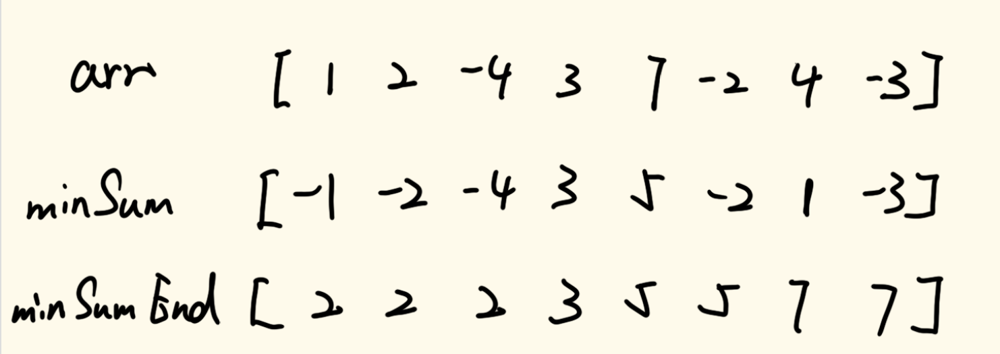
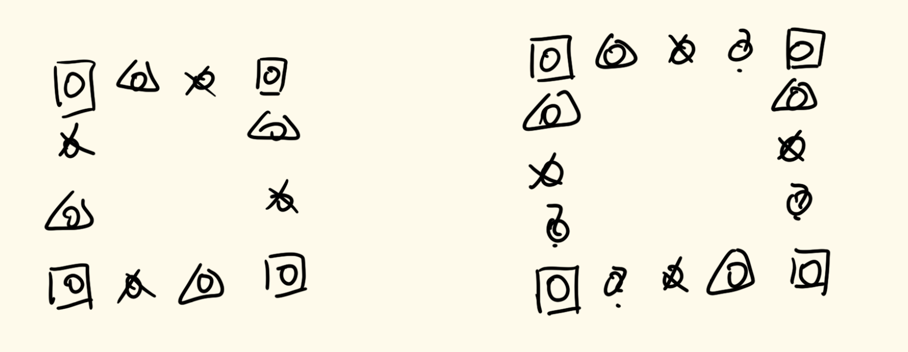
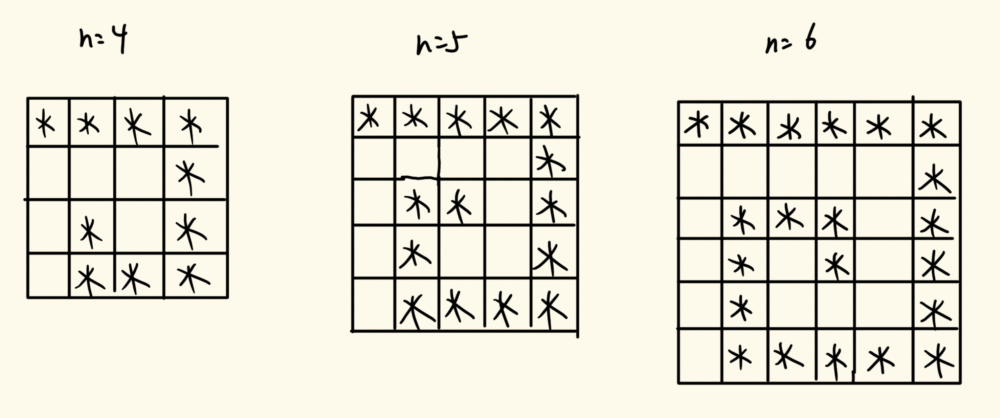

# 数据结构与算法

## 三十一、卡特兰数

> 卡特兰数又称卡塔兰数，英文名Catalan number，是组合数学中一个常出现在各种计数问题种出现的数列。其前几项为：
>
> 1，1，2，5，14，42，132，429，1430，4862，16796，58786，208012，742900，2674440，9694845，35357670，129644790，477638700，1767263190，6564120420，24466267020，91482563640，343059613650，1289904147324，4861946401452，…

卡特兰数公式


上面图片中的C是组合数。

我们下面讲一个有关于卡特兰数的应用：有关于括号匹配的有效次序。

我们先来将有关于两个集合相等的定义，我们对于两个集合A与B，如果A与B之间存在两个映射，一个映射为A到B的一一映射，另一个与前一个映射独立的映射为B到A的一一映射，那么我们说这A和B两个集合是完全相等的。这个定义不理解建议去学一下离散数学，当然近世代数当中也有相应的描述。

对于一个括号次序是否合法，我们可以根据这个括号字符串的所有前缀来判断，如果所有的前缀都能保证左括号数量大于等于右括号的数量，并且整个字符串的左括号和右括号数量完全相等，那么我们就可以说整个括号字符串是完全相等的。

我们现在来看，对于n个左括号和n个右括号的一个字符串，我们总共有C(2n,n)种排序方法，这其中有合法的排序次序，同时也有不合法的排序次序，我们需要将不合法的排序次序计算出来。由上面的描述可知，如果每一个前缀和的左括号数量大于等于右括号数量，那么这个字符串就是合法的，那么反之，我们就可以知道如果我们找到一个前缀和的右括号数量大于左括号数量，那么这个括号字符串数组就是不合法的，如果我们对这个字符串从头开始一一遍历查看，那么我们一定能找到一个最短前缀，其右括号数量比左括号数量大1，这个时候我们看剩余的后缀数组，我们将其左右的括号反转（即左括号变为右括号，右括号变为左括号），这样我们整个括号字符串的左括号就要比左括号大2，右括号的数量为n+1个，左括号的数量为n-1个。

现在，我们定义A集合为不合法的所有字符串的数量，B集合为右括号数量为n+1个，左括号数量为n-1个的所有组成括号字符串。所以通过上面的变换（可以视为一种映射），我们可以将所有的A集合在B集合当中找到唯一一个元素对应；同理，我们也可以以相同的方法，定义一个映射：对于B任意的一个括号字符串（因为左右括号数量不一样，所以一定都是不合法的），其最短的不合法前缀的对应的后缀括号全部取反，一定能在A集合当中找到唯一一个元素对应。所以这样我们就可以得到A集合与B集合完全相等。而B集合的元素个数为C(2n,n+1)=C(2n,n-1)，所以n个左括号和n个右括号的合法括号字符串的数量为C(2n,n)-C(2n,n-1)。这刚好是卡特兰数的公式。

我们根据上面讲的括号匹配问题，我们还可以扩展到进出栈方式上。对于n个进栈操作和n个出栈操作，我们有C(2n,n)种排序方式，而有效的进出栈次序就是卡特兰数（可以将入栈想成左括号，出栈想成右括号，与上面的问题是一样的）。

我们现在想一个难一点的问题。

现在有n个二叉树的节点，我们要求有多少种组成二叉树的方式。

结论就是卡特兰数，我们在这里做一个分析来帮助理解。

我们可以自己在纸上进行一下枚举。如果n=1，那么就只有一个节点，这种情况下。就只有一种情况

如果n=2，那么我们可以一个节点做头节点，另一个节点既可以做左孩子，也可以做右孩子，所以在这种情况下，有两种情况。

我们现在来假设有n个节点，这种情况下，必定有一个节点是头节点，那么剩下的n-1个节点就需要向下扩展。

我么现在来这样想：假如现在头节点的左子树有0个节点，右子树有n-1个节点，那么这种情况下的组成不同形状的二叉树个数就是k(0)*k(n-1)，其中k(n)表示的就是n个节点组成的不同二叉树个数，k(0)=1。那么我们接着考虑，如果头节点左子树有1个节点，右子树有n-2个节点，那么得到的二叉树个数就是k(1)\*k(n-2)…，那么我们将这些个数做总和，他就是卡特兰数的公式。

 ## 三十二、子数组达到规定累加和的最大长度系列问题

### 1、题目一

> 给定一个正整数的无序数组`arr`，给定一个正整数值`K`
>
> 找到`arr`的所有子数组里，那个子数组的累加和等于K，并且是长度最大的，返回其长度

这道题我们可以通过不定长滑动窗口的方法来解决这个问题。

我们定义窗口指针`left`和`right`，`left`为0，`right`为0，并且用一个`sum`变量记录窗口内的累加和大小，一个`ans`变量记录我们找的最大长度。初始化阶段，先把`right`指向的值加到`sum`之中，然后对`sum`进行判断。如果`sum`小于K，那么`right`指针右移，并且将新指向的值添加到`sum`中；如果`sum`等于`K`，那么将当前的窗口长度做记录，更新`ans`，然后right指针右移，更新`sum`；如果`sum`大于`K`，那么`left`指针右移，并且更新`sum`值。

具体实现代码如下：

```java
public static int getMaxLength(int[] arr, int K) {
    if (arr == null || arr.length == 0 || K <= 0) {
        return 0;
    }
    int left = 0;
    int right = 0;
    int sum = arr[0];
    int len = 0;
    while (right < arr.length) {
        if (sum == K) {
            len = Math.max(len, right - left + 1);
            //在这里用right++和left++都可以
            sum -= arr[left++];
        } else if (sum < K) {
            right++;
            if (right == arr.length) {
                break;
            }
            sum += arr[right];
        } else {
            sum -= arr[left++];
        }
    }
    return len;
}
```

### 2、题目二

> 给定一个正数组成的无序数组`arr`，值可能正、可能负、可能0
>
> 给定一个整数值K，找到`arr`的所有子数组里，哪个子数组的累加和等于`K`，并且是长度最大的，返回其长度。

上面一道题由于没有负数参与，所以我们可以通过不定长的滑动窗口来解决，因为`right`往后移动，值总是在增加的，`left`往后移动，值总是在减少的，但是有负数参与的情况，这就说不好了。

我们之前在解决区间和数组问题的时候，我们就确定了一个思维定式，即我们找每一个以当前位置为结尾的所有符合标准的子数组。我们用与之前相同的方法，计算前缀和数组，我们找的累加和为`K`，所以对于每一个以`i`为结尾并且累加和等于`K`的数组，我们只需要找相应的前缀和等于`presum[i]-K`的即可，这个功能我们可以通过哈希表来实现。

不过我们可以一边遍历一遍求前缀和一遍加入到有序表当中，不需要单独进行一次遍历，而且对于哈希表而言，如果我们遇到了两个相同的前缀和，我们需要记录最早出现的位置。并且对于我们定义的哈希表，我们需要添加一个key=0，value=-1的一项，即如果我们遍历到的前缀和刚好为K，那么我们在map中所要找的就是key=0的value，而这一项是无法通过遍历得出来的，即便是得出来的，其位置也一定不是-1。

具体实现代码如下：

```java
public static int maxLength(int[] arr, int k) {
    if (arr == null || arr.length == 0) {
        return 0;
    }
    HashMap<Integer, Integer> map = new HashMap<>();
    //这条记录一定要加
    map.put(0, -1);
    int len = 0;
    int sum = 0;
    for (int i = 0; i < arr.length; i++) {
        sum += arr[i];
        if (map.containsKey(sum - k)) {
            len = Math.max(len, i - map.get(sum - k));
        }
        if (!map.containsKey(sum)) {
            map.put(sum, i);
        }
    }
    return len;
}
```

### 3、题目三

> 给定一个整数组成的无序数组`arr`，值可能正、可能负、可能0
>
> 给定一个整数值K，找到`arr`的所有子数组里，哪个子数组的累加和`<=K`，并且是长度最大的，返回其长度

如果我们按照之前的思维定式，我们会想到用前缀和加有序表的方式来解决。如果是这种解决思路，那么时间复杂度为`O(nlogn)`。不过这道题的最优解时间复杂度为`O(n)`，我们直接讲最优解。

我们定义两个数组`minSum`以及`minSumEnd`，其中`minSum`数组中的每一个元素表示以当前位置为开头的子数组最小累加和的大小，而`minSumEnd`数组中则存储`minSum`中的对应累加和的结尾下标。然后我们从后往前遍历，得到这两个数组的值。

我们这里举一个例子：



这是生成后的数组，我们从右往左依次进行处理。

- index=7时值为-3，这是数组中的最后一个元素，所以最小累加和数组值为-3，右边界坐标为7
- index=6时值为4，看`minSum`中下一个元素，由于与其加和会使得当前的值减小，所以`minSum[6]`=4-3=1，`minSumEnd[6]`=7
- index=5时值为-2，看`minSum`中下一个元素，由于与其加和会使得当前的值增加，所以`minSum[5]`=-2，`minSumEnd[5]`=5
- index=4时值为7，看`minSum`中下一个元素，可以得到`minSum[4]`=7-2=5，`minSumEnd[4]`=5
- index=3时值为3，看`minSum`中下一个元素，可以得到`minSum[3]`=3，`minSumEnd[3]`=3
- index=2时值为-4，看`minSum`中下一个元素，可以得到`minSum[2]`=-4，`minSumEnd[2]`=2
- index=1时值为2，看`minSum`中下一个元素，可以得到`minSum[1]`=2-4=-2，`minSumEnd[1]`=2
- index=0时值为1，看`minSum`中下一个元素，可以得到`minSum[0]`=1-2=-1，`minSumEnd[0]`=2

这样我们就生成了`minSum`和`minSumEnd`这两个数组。

根据题意，我们要找的是≤K的最长子数组，我们可以遍历`minSum`数组，遍历分如下情况：

- 如果当前的值＞K，那么就说明以当前位置开头的子数组的最小累加和＞K，那么就说明以当前作为开头的子数组无法找到答案，跳过即可。
- 如果当前的值≤K，那么我们就看`minSumEnd`值，找`minSumEnd`值所指向的`minSum`数组中的下一个，让找到的下一个值与当前的值做累加和，如果依旧≤K，那么就继续寻找下去，直到遍历到末端位置或者累加和＞K，停止，看遍历到的最右端位置，就能确定一个最长子输出的长度。
- 然后我们根据这个范围，从左侧开始遍历，看其能否将右端的右侧元素纳入进来保证其总累加和能否满足条件，如果不能满足条件，左侧接着开始遍历，直到左侧遍历到一个元素能够将右端的元素纳入进来或者左端遍历到了右端，这两种情况都可以让右端的元素进行向右扩张（与上一个过程一样）

我们按照上面的图进行一次模拟，假如K=4

- index=0时value=-1≤4，所以我们根据索引找到index=3，此时value=3，3-1=2≤4，接着根据索引找到index=4，此时value=5，2+5=7＞4，遍历停止，所以我们找到了一个长度3-0+1=4
- 然后我们看index=1时，这个时候我们统计的sum=2，减去index=0时的数组值，sum=2-1=1，然后将index=4纳入进来，发现1+7=8>4，所以不可行
- 然后我们看index=2时，这个时候我们统计的sum=1，减去index=1时的数组值，sum=1-2=-1，然后将index=4纳入进来，发现-1+7=6>4，所以不可行
- 然后我们看index=3时，这个时候我们统计的sum=-1，减去index=2时的数组值，sum=-1+4=3，然后将index=4纳入进来，发现3+7=10>4，所以不可行
- 然后我们看index=4时，这个时候我们遍历到了当前的右边界，所以直接向右扩，由于index=4时value=5，5大于4，所以从index=4开始的数组都不能满足要求，跳过
- 然后我们看index=5时value=-2≤4，所以我们根据索引找到index=6，此时value=1，-2+1=-1≤4，接着根据索引找到index=8，越界了，所以我们找到了一个长度7-5+1=3，未能更新最大长度。

这样我们就找到了最大长度。

具体实现代码如下：

```java
public static int maxLengthAwesome(int[] arr, int k) {
    if (arr == null || arr.length == 0) {
        return 0;
    }
    //先将minSum与minSumEnd求出来
    int[] minSum = new int[arr.length];
    int[] minSumEnds = new int[arr.length];
    minSum[arr.length - 1] = arr[arr.length - 1];
    minSumEnds[arr.length - 1] = arr.length - 1;
    for (int i = arr.length - 2; i >= 0; i--) {
        if (minSum[i + 1] < 0) {
            minSum[i] = arr[i] + minSum[i + 1];
            minSumEnds[i] = minSumEnds[i + 1];
        } else {
            minSum[i] = arr[i];
            minSumEnds[i] = i;
        }
    }
    //结尾指针
    int end = 0;
    //记录当前总和
    int sum = 0;
    //记录当前最长长度
    int ans = 0;
    for (int i = 0; i < arr.length; i++) {
        //先进行end指针扩充
        while (end < arr.length && sum + minSum[end] <= k) {
            sum += minSum[end];
            end = minSumEnds[end] + 1;
        }
        //记录当前扩充的长度
        ans = Math.max(ans, end - i);
        //如果end指针大于当前的下标的时候，将当前的arr值从sum中减去
        if (end > i) {
            sum -= arr[i];
        } else {
            //如果到了这一步，那么就说明当前的下标与当前标记的结尾相同，这个时候结尾向上+1
            //同时，如果到了这一步，sum一定变为0了
            end = i + 1;
        }
    }
    return ans;
}
```

这是一道相当有难度的题，要好好理解一下。不过如果想不到这样解，直接用前缀和+有序表解决也是可以的。

### 4、题目四

> 给定一个数组`arr`，给定一个值v
>
> 求子数组平均值小于等于v的最长子数组长度

我们让数组中所有的值全部减去v，然后九江问题转化为了上面的问题，只不过我们要找的是累加和小于等于0的最长子数组的长度。

### 5、总结

题目一主要技巧：利用单调性优化

题目二主要技巧：利用预处理结构优化

题目三主要技巧：假设答案法+淘汰可能性（很难，以后还会见到）

### 6、题目五

> 给定一个正方形矩阵matrix，原地调整成瞬时间90度转动的样子
>
> `a b c`	`g d a`
> `d e f`	`h e b`
> `g h i`	`i f c`

注意这道题的审题，因为我们要将数组进行原地调整，所以这个矩阵一定是正方形矩阵，不可能是长方形矩阵，如果是长方形矩阵，那么存储结构一定会发生变换。

我们对于任意的正方形矩阵matrix，我们总能找到其左上角坐标和右下角坐标，我们可以将这一对坐标视为正方形矩阵的“一圈”，然后对这一圈进行调整，之后将左上角坐标向右下移动，右下角坐标向左上移动，将新构成的左上坐标和右下坐标视为一圈，然后再次对这一圈进行调整，直到最后两个坐标越界为止。那么接下来的问题就在于我们如何对“一圈”做调整。

我们首先对一圈中的元素进行分组，我们看示例图：



图片左侧是4*4的圈，我们根据图中的不同标志来进行分组，在进行旋转的时候，只需要对同组的元素顺时针交换即可，右侧的5\*5矩阵可以作为参考来进行理解。

不过我们应对的是n*n的方阵，所以我们需要进行抽象化：对于圈调整的方法f，其导入了a, b, c, d四个变量，a, b代表左上坐标点，c, d嗲表右下坐标点。我们进行分组则是根据每个圈上面一行的位置坐标进行分组，分组总共分成d-b组。每一组的第一个元素一定在第a行第b+i列，第二个元素在第a+i行第d列，第三个元素在第c行第d-i列，第四个元素在第c-i行第b列，然后让其进行旋转互相交换即可。

具体实现代码如下：

```java
public static void rotate(int[][] matrix) {
    int a = 0;
    int b = 0;
    int c = matrix.length - 1;
    int d = matrix[0].length - 1;
    while (a < c) {
        rotateEdge(matrix, a++, b++, c--, d--);
    }
}
public static void rotateEdge(int[][] matrix, int a, int b, int c, int d) {
    int tmp = 0;
    for (int i = 0; i < d - b; i++) {
        tmp = matrix[a][b + i];
        matrix[a][b + i] = matrix[c - i][b];
        matrix[c - i][b] = matrix[c][d - i];
        matrix[c][d - i] = matrix[a + i][d];
        matrix[a + i][d] = tmp;
    }
}
```

### 7、题目六

> 给定一个正方形或者长方形矩阵matrix，实现转圈打印
>
> 例如下面的矩阵matrix：
>
> `a b c`
> `d e f`
> `g h i`
> `j k l`
>
> 其打印的结果是：`a b c f i l k j g d e h`

我们可以依照上一道题的解决方案来解决这一道题。我们依旧将这个矩阵分成若干个“圈”，然后完成一圈的顺时针打印，然后我们会发现，顺时针打印完，我们导入下一个圈，下一个圈的打印起始节点刚好与上一个圈的末尾节点接上，所以我们现在只需要处理每一圈的顺时针打印即可。

我们直接看代码来理解：

```java
public static void spiralOrderPrint(int[][] matrix) {
    int tR = 0;
    int tC = 0;
    int dR = matrix.length - 1;
    int dC = matrix[0].length - 1;
    while (tR <= dR && tC <= dC) {
        printEdge(matrix, tR++, tC++, dR--, dC--);
    }
}

public static void printEdge(int[][] m, int tR, int tC, int dR, int dC) {
    //如果遍历圈到最后两个点的横坐标相等，那就直接将其从左往右打印即可
    if (tR == dR) {
        for (int i = tC; i <= dC; i++) {
            System.out.print(m[tR][i] + " ");
        }
    } else if (tC == dC) {  //这里与上面同理
        for (int i = tR; i <= dR; i++) {
            System.out.print(m[i][tC] + " ");
        }
    } else {
        int curC = tC;
        int curR = tR;
        //先打印上边界
        while (curC != dC) {
            System.out.print(m[tR][curC] + " ");
            curC++;
        }
        //打印右边界
        while (curR != dR) {
            System.out.print(m[curR][dC] + " ");
            curR++;
        }
        //打印下边界
        while (curC != tC) {
            System.out.print(m[dR][curC] + " ");
            curC--;
        }
        //打印左边界
        while (curR != tR) {
            System.out.print(m[curR][tC] + " ");
            curR--;
        }
    }
}
```

上述代码很好的描述了每一圈的边界如何打印。

### 8、转圈打印星号问题

我们用一个图例来解释这道题我们要实现的内容：



我们同样将这个问题进行分圈处理，只不过相比较之前的两道题进行一圈一圈划分，在这个问题上我们采取两圈两圈划分的方式。如果不理解的话，可以尝试把n=7往后的一些样例画出来进行分析。

具体代码可以自己尝试写一写，可能会比较难（恶心🤢）。
