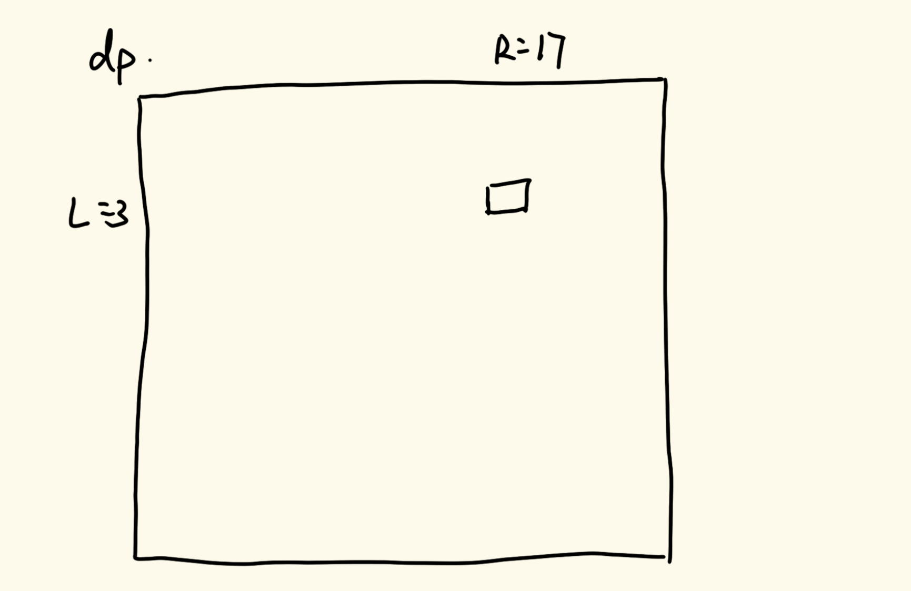

# 数据结构与算法

## 三十三、四边形不等式技巧

### 1、题目一

> 给定一个非负数组`arr`，长度为N
>
> 那么有N-1中方案可以把`arr`切成左右两部分
>
> 每一种方案都有，min{左部分累加和，右部分累加和}
>
> 求这么多方案中，min{左部分累加和，右部分累加和}的最大值是多少？要求整个过程时间复杂度O(N)

这道题是这个部分的引例。

求法非常简单，先求出整个数组的累加和，然后从第一个元素开始依次遍历，遍历一个左部分累加和加上一个，左部分累加和减去一个，然后求左右部分累加和最小值，然后再遍历下一个元素即可。

具体实现代码如下：

```java
public static int bestSplit2(int[] arr) {
    if (arr == null || arr.length < 2) {
        return 0;
    }
    int N = arr.length;
    int sumAll = 0;
    for (int num : arr) {
        sumAll += num;
    }
    int ans = 0;
    int sumL = 0;
    for (int i = 0; i < N - 1; i++) {
        sumL += arr[i];
        int sumR = sumAll - sumL;
        ans = Math.max(ans, Math.min(sumL, sumR));
    }
    return ans;
}
```

我们在这道题的基础上做一个扩展。如果我们现在要一个答案数组，每一个答案数组记录着每一个前缀的上述结果，即对于一个`ans[]`数组，其第0号位置记录着前缀0\~0的min{左部分累加和，右部分累加和}，第1号位置记录着前缀0\~1的min{左部分累加和，右部分累加和}…，我们在上一道题中求得的为这个数组第n-1号元素的值。

如果我们用最暴力的想法去想，我们就把每一个前缀数组视为一个数组，然后用上面的方法全部尝试一边，这样的时间复杂度为O(n^2^)。

但其实，我们可以让这个划分的指针不回退。比如，我们现在求得了0~i位置上的划分，此时划分的指针指向了j（0≤j<i），然后我们要求第i+1的划分的结果，由于数组是非负的，所以加上i+1这个位置的元素，前缀总和一定不会减少，所以我们不需要让j指针回退，只需要从原地开始进行判断遍历即可。对于我们之前一问的方法，我们是将一个数组全部遍历了一遍，但其实当我们通过遍历发现`ans`会变小的时候，其实就可以停止遍历了。

具体实现代码如下：

```java
public static int[] bestSplit3(int[] arr) {
    if (arr == null || arr.length == 0) {
        return new int[0];
    }
    int N = arr.length;
    int[] ans = new int[N];
    ans[0] = 0;
    //求前缀和数组
    int[] sum = new int[N + 1];
    for (int i = 0; i < N; i++) {
        sum[i + 1] = sum[i] + arr[i];
    }
    //记录最优划分
    int best = 0;
    for (int range = 0; range < N; range++) {
        while (best + 1 < range) {
            //向右移动前找最小值
            int before = Math.min(sum(sum, 0, best), sum(sum, best + 1, range));
            //向右移动后找最小值
            int after = Math.min(sum(sum, 0, best + 1), sum(sum, best + 2, range));
            if (after >= before) {
                //如果向右移动后比向右移动前要大，则划分右移
                best++;
            } else {
                //划分不需要改变
                break;
            }
        }
        ans[range] = Math.min(sum(sum, 0, best), sum(sum, best + 1, range));
    }
    return ans;
}
```

我们在这一个问题中，每一个子问题的答案都是`ans=max{min{left,right}}`，我们可以将其广义化，如果我们遇到的问题的子问题结果为`ans=最优{最差{左, 右}}`，我们都可以用指针不回退的方式来解决这一类问题（最优和最差互换位置，也成立），但是注意，我们的左部分指标和右部分指标必须跟左部分区间和右部分区间具有单调关系，即左部分区间增加，指标跟着单调增加或者减少（右区间同理）。

### 2、题目二

> 摆放着n堆石子。现要将石子有次序地合并成一堆
>
> 规定每次只能选相邻的2堆石子合并成新的一堆，并将新的一堆石子数记为该次合并的得分
>
> 求出将n堆石子合并成一堆的最小得分（或最大得分）合并方案

这道题我们先从动态规划的角度来考虑。

如果从动态规划的角度去考虑，这是一道比较经典的范围尝试模型。我们从暴力递归入手，对于一个范围L到R上，我们进行合并有两种方式：一种是L先不参与合并，让L+1到R合并，然后再让L与L+1到R合并的结果合并；另一种是让L与L+1合并，然后让L+2到R去合并，最后让这两部分合并。对于base case，如果L==R，那么就说明此时遍历到的是自己与自己合并，所以合并后的得分为0，直接返回0即可；如果L+1\==R，那么此时只有两个元素参与合并，那么直接返回两者的合并之后的得分即可。

我们可以根据这个递归方式实现动态规划的方法。

具体实现代码如下：

```java
//求前缀和（前面留一位0）
public static int[] sum(int[] arr) {
    int N = arr.length;
    int[] s = new int[N + 1];
    s[0] = 0;
    for (int i = 0; i < N; i++) {
        s[i + 1] = s[i] + arr[i];
    }
    return s;
}
//求L到R区间和
public static int w(int[] s, int L, int R) {
    return s[R + 1] - s[L];
}
//暴力递归方法
public static int min1(int[] arr) {
    if (arr == null || arr.length < 2) {
        return 0;
    }
    int N = arr.length;
    int[] s = sum(arr);
    return process1(0, N - 1, s);
}
public static int process1(int L, int R, int[] s) {
    if (L == R) {
        return 0;
    }
    int next = Integer.MAX_VALUE;
    //这里使用了暴力枚举的方式来解决
    for (int leftEnd = L; leftEnd < R; leftEnd++) {
        next = Math.min(next, process1(L, leftEnd, s) + process1(leftEnd + 1, R, s));
    }
    return next + w(s, L, R);
}
//改写动态规划方法
public static int min2(int[] arr) {
    if (arr == null || arr.length < 2) {
        return 0;
    }
    int N = arr.length;
    int[] s = sum(arr);
    int[][] dp = new int[N][N];
    //这里做初始化，每一个dp[i][i]都为0，所以可以什么也不用做
    for (int L = N - 2; L >= 0; L--) {
        for (int R = L + 1; R < N; R++) {
            int next = Integer.MAX_VALUE;
            for (int leftEnd = L; leftEnd < R; leftEnd++) {
                next = Math.min(next, dp[L][leftEnd] + dp[leftEnd + 1][R]);
            }
            dp[L][R] = next + w(s, L, R);
        }
    }
    return dp[0][N - 1];
}
```

上面的递归代码我们用的不是上面所描述的思路，我们采用的是一种比较暴力的思路，即对于每一个递归的L到R，我们遍历其所有的合并操作，然后在所有的合并操作中取最小值。这样写的代码转变成动态规划之后时间复杂度为O(n^3^)。

如果我们按照之前动态规划的斜率优化的方式来思考，我们发现中间的遍历是求最小值，是没有办法进行优化的（如果是累加是可以优化的）。如果我们想要优化，我们需要结合四边形不等式来进行优化。

我们先画一个图例来解释一下：



我们看上面的图，现在假设我们要求这个数组中的(3,17)这个元素的值，我们遍历求解的过程是从下往上，从左往右的顺序来遍历的，所以当我们遍历到这个位置的时候，(3,16)(4,17)的两个元素已经是求出来的了。我们思考，对于(3,16)，其表示的是3到16这个区间的最佳合并方式所得到的最小得分，那么它一定有最后一次合并是基于某一个位置的划分的，我们假设这个划分的位置为a；同样，对于(4,17)，其划分一定存在一个位置b。这样，我们可以通过四边形不等式思考，如果我们知道a和b的值，那么我们就只需要遍历a和b之间的划分情况来拿到这一位置的值，这样就大大缩减了计算的时间复杂度。

所以我们可以定义一个best数组，来记录每一个合并的最佳划分点，其所有的(i,i+1)位置全部设置为i，并且对于dp数组的对应位置设置为两个元素的和。对于每一次进行值计算，我们遍历的范围从原来的L到R变成`best[L][R-1]`到`best[L+1][R]`，并且我们在进行划分计算判断的时候，需要看当前划分的值是否小于之前划分的值，如果小于，则需要记录划分点，这样当遍历到大于的时候，我们的划分点就记录到best数组当中了。

具体实现代码如下：

```java
public static int min3(int[] arr) {
    if (arr == null || arr.length < 2) {
        return 0;
    }
    int N = arr.length;
    int[] s = sum(arr);
    int[][] dp = new int[N][N];
    int[][] best = new int[N][N];
    //初始化数组，需要注意best数组的初始化
    for (int i = 0; i < N - 1; i++) {
        best[i][i + 1] = i;
        dp[i][i + 1] = w(s, i, i + 1);
    }
    for (int L = N - 3; L >= 0; L--) {
        for (int R = L + 2; R < N; R++) {
            int next = Integer.MAX_VALUE;
            //choose记录划分的位置
            int choose = -1;
            for (int leftEnd = best[L][R - 1]; leftEnd <= best[L + 1][R]; leftEnd++) {
                //找到当前划分的最优解
                int cur = dp[L][leftEnd] + dp[leftEnd + 1][R];
                //如果当前的划分比next小，就说明这个划分比之前的划分策略更好，所以记录这个划分
                if (cur <= next) {
                    next = cur;
                    choose = leftEnd;
                }
            }
            //最后将划分点记录到best数组当中
            best[L][R] = choose;
            dp[L][R] = next + w(s, L, R);
        }
    }
    return dp[0][N - 1];
}
```

### 3、四边形不等式技巧特征

1. 两个可变参数的区间划分问题
2. 每个格子有枚举行为
3. 当两个可变参数固定一个，另一个参数和答案之间存在单调性关系
4. 而且往往是反向单调关系
5. 枚举加速的位置对：上+右，或者，左+下
6. 不要证明！用对数器验证
7. 可以把时间复杂度降低一阶

### 4、题目三

> 给定一个整型数组 `arr`，数组中的每个值都为正数，表示完成一幅画作需要的时间，再给定一个整数`num`，表示画匠的数量，每个画匠只能画连在一起的画作
>
> 所有的画家并行工作，返回完成所有的画作需要的最少时间。
>
> 【举例】
>
> `arr=[3,1,4]`，`num=2`。
>
> 最好的分配方式为第一个画匠画3和1，所需时间为4
>
> 第二个画匠画4，所需时间为4
>
> 所以返回4
>
> `arr=[1,1,1,4,3]`，`num=3`
>
> 最好的分配方式为第一个画匠画前三个1，所需时间为3
>
> 第二个画匠画4，所需时间为4
>
> 第三个画匠画3，所需时间为3
>
> 返回4

此题为LeetCode第410题：https://leetcode.cn/problems/split-array-largest-sum/

这道题的动态规划我们这样考虑：我们令`dp[i][j]`表示完成0\~i所有画作，在有j个画匠的情况下需要的最少时间。对于数组的初始化，如果当前的j≥i，那么就说明画匠的数量大于等于画作的数量，那么它的最优解情况一定是一个画匠负责一张画，此时只需要找到0\~i中的最小值即可（当然这里面有技巧，比如当前我们计算了(1,2)，那么(1,3)的结果一定与(1,2)的结果相同，因为都是一幅画，不管几个画匠，完成时间肯定相同，对于(2,4)和(2,3)也是一样的；还有，对于已知(2,4)计算(3,4)，由于(2,4)计算了0、1、2三个元素的最小值，所以我们只需要拿数组中下标为3的数与(2,4)做max计算即可）；对于j=0这一列，全部为0（因为此时没有画匠，所以一个作品也完不成），对于j=1这一列，因为只有一个人在做，所以其完成所有的画作需要的最少时间就是前缀和，一个一个累加即可。

对于任意一个元素(i,j)，我们通过其含义，我们可以将第j个画匠单独拎出来进行分析：首先我们不让这个画匠作画，只是用j-1个画匠，这是一种情况；然后我们让前j-1个画匠做0\~i-1的画，让j做第i\~i幅画；我们还可以让前j-1个画匠做0\~i-2的画，让j做第i-1\~i的画…，如此枚举，我们取这些情况中的最小，就能得到这个元素的值。

具体实现代码如下：

```java
//我们使用的sum数组的0号位置是空着的，所以这里计算向右移动一个
public static int sum(int[] sum, int L, int R) {
    return sum[R + 1] - sum[L];
}

public int splitArray1(int[] nums, int k) {
    int N = nums.length;
    int[] sum = new int[N + 1];
    for (int i = 0; i < N; i++) {
        sum[i + 1] = sum[i] + nums[i];
    }
    int[][] dp = new int[N][k + 1];
    //初始化
    for (int j = 1; j <= k; j++) {
        dp[0][j] = nums[0];
    }
    for (int i = 1; i < N; i++) {
        dp[i][1] = sum(sum, 0, i);
    }
    //每一行从上往下
    //每一列从左往右
    for (int i = 1; i < N; i++) {
        for (int j = 2; j <= k; j++) {
            //进行遍历找答案
            int ans = Integer.MAX_VALUE;
            for (int leftEnd = 0; leftEnd <= i; leftEnd++) {
                int leftCost = leftEnd == -1 ? 0 : dp[leftEnd][j - 1];
                int rightCost = leftEnd == i ? 0 : sum(sum, leftEnd + 1, i);
                int cur = Math.max(leftCost, rightCost);
                if (cur < ans) {
                    ans = cur;
                }
            }
            dp[i][j] = ans;
        }
    }
    return dp[N - 1][k];
}
```

我们可以参考上面的四边形不等式技巧特征，我们思考这个问题的优化。

对于每一个元素，其将相应的画作使用相应的画匠画完，如果画匠数量相等的情况下，其画作越少，时间越长，呈单调反比关系，所以我们可以通过这样的特征来确定四边形不等式的优化方式。

不过我们上面实现的方式是从上往下，从左往右的方式进行，我们无法通过左+下或者右+上的方式来进行四边形不等式计算，所以我们要改变遍历方式。通过上面得到的单调关系，我们对于j，我们依旧从左往右遍历，但是对于i，我们选择从下往上遍历。对于底部的元素，其所依赖的元素就只有其左边的元素，但是向上遍历，每一个元素就既依赖左边元素，又依赖下边的元素。

根据第二题的实现，我们需要定义一个best数组，来存储每一步的最优划分方式，具体划分操作可以自己去思考（学到这里还不会，建议去看脑科）。重点在于best数组的初始化，对于第1列的元素，由于都只有一个画家在作画，我们定义其划分区间为-1，对于第0行的元素，我们也定义其划分区间为-1。

具体实现代码如下：

```java
public int splitArray(int[] nums, int k) {
    int N = nums.length;
    int[] sum = new int[N + 1];
    for (int i = 0; i < N; i++) {
        sum[i + 1] = sum[i] + nums[i];
    }
    int[][] dp = new int[N][k + 1];
    int[][] best = new int[N][k + 1];
    for (int j = 1; j <= k; j++) {
        dp[0][j] = nums[0];
        best[0][j] = -1;
    }
    for (int i = 1; i < N; i++) {
        dp[i][1] = sum(sum, 0, i);
        best[i][1] = -1;
    }
    //从第二列开始，从左往右
    //从最后一行开始，从下往上
    for (int j = 2; j <= k; j++) {
        for (int i = N - 1; i >= 1; i--) {
            //记录遍历下端，这里不需要额外判断，这个元素一定存在
            int down = best[i][j - 1];
            //如果最后一行，是没有下方的元素的，这个时候遍历上限就是N - 1
            int up = i == N - 1 ? N - 1 : best[i + 1][j];
            int ans = Integer.MAX_VALUE;
            int bestChoose = -1;
            for (int leftEnd = down; leftEnd <= up; leftEnd++) {
                int leftCost = leftEnd == -1 ? 0 : dp[leftEnd][j - 1];
                int rightCost = leftEnd == i ? 0 : sum(sum, leftEnd + 1, i);
                int cur = Math.max(leftCost, rightCost);
                if (cur < ans) {
                    ans = cur;
                    bestChoose = leftEnd;
                }
            }
            dp[i][j] = ans;
            best[i][j] = bestChoose;
        }
    }
    return dp[N - 1][k];
}
```

我们通过动态规划，并且使用四边形不等式的方式来解决这道题，并不是这道题的最优解（所以在LeetCode上我们的成绩惨不忍睹）。下面我们来讲这道题的最优解。

我们先将这个问题进行转化。这个问题问我们在有给定的画匠的情况下最快的时间，我们可以将问题先转化成给定一个标准时间，我们最少可以用多少个画家来解决。如果这样转化问题，我们可以用一次遍历就可以解决：我们从头开始记录当前遍历到的元素的累加和，如果当前的累加和超过了我们给定的标准时间，那么我们所划定的这一片区域就由一个画家来搞定，将累加和清零，从下一个位置开始继续计算累加和，这样我们就能得到我们使用的最少的画家数量（如果我们进行一步累加和就超过了标准时间，那么就说明这个数组的作画给定的标准时间一定不可能完成，可以直接返回最大value）。

那么现在，我们可以先计算整个数组的累加和sum，然后从0~sum开始进行二分，每一次二分找到的值我们设定为一个标准时间，然后判断我们能够使用的最少画家的数量，如果比我们规定的画家数量少（这里包括等于），说明这个标准定的有点“低”，我们需要向左进行二分计算；如果需要的最少画家数量比规定的画家数量多，那么就说明这个标准有点“高”，我们需要向右进行二分计算（这个把在这个情况下不可能完成也考虑了进去）。我们一直递归到死，最后指向的值就是我们要找的最短时间。

具体实现代码如下：

```java
//本题的最优解
public int splitArray(int[] nums, int k) {
    //先算累加和
    long sum = 0;
    for (int i = 0; i < nums.length; i++) {
        sum += nums[i];
    }
    //二分左指针
    long l = 0;
    //二分右指针
    long r = sum;
    //保存答案
    long ans = 0;
    while (l <= r) {
        long mid = (l + r) / 2;
        //得到在当前指标下使用的最少的画匠
        long cur = getNeedParts(nums, mid);
        if (cur <= k) {
            //如果比目标的人少，说明有的优化，向左划分
            ans = mid;
            r = mid - 1;
        } else {
            //如果比目标的人多，说明要求过高，向右划分
            l = mid + 1;
        }
    }
    return (int)ans;
}
public static int getNeedParts(int[] nums, long aim) {
    for (int i = 0; i < nums.length; i++) {
        //遍历数组，如果又发现大于aim的，那么直接返回系统最大值
        if (nums[i] > aim) {
            return Integer.MAX_VALUE;
        }
    }
    //至少有一个人
    int parts = 1;
    //记录当前的总和
    int all = nums[0];
    for (int i = 1; i < nums.length; i++) {
        if (all + nums[i] > aim) {
            //如果当前的总和加上下一个元素超了，那么就需要再多一个人，并且总和刷新
            parts++;
            all = nums[i];
        } else {
            //如果没有，那么就继续累加
            all += nums[i];
        }
    }
    return parts;
}
```
