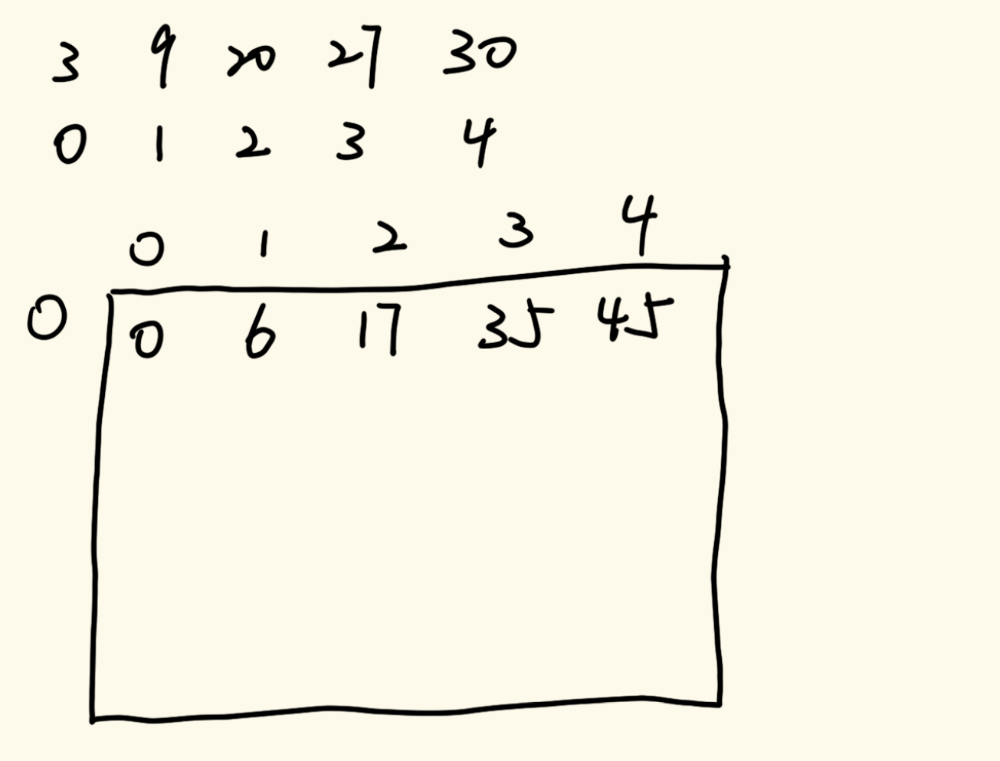

# 数据结构与算法

## 三十三、四边形不等式技巧

### 5、题目四

> 一条直线上有居民点，邮局只能建在居民点上
> 给定一个有序正数数组`arr`，每个值表示 居民点的一维坐标，再给定一个正数 `num`，表示邮局数量
> 选择`num`个居民点建立`num`个邮局，使所有的居民点到最近邮局的总距离最短，返回最短的总距离
> `arr=[1,2,3,4,5,1000]`，`num=2`
> 第一个邮局建立在3位置，第二个邮局建立在1000位置
> 那么1位置到邮局的距离为2，2位置到邮局距离为1，3位置到邮局的距离为0，4位置到邮局的距离为1，5位置到邮局的距离为2
> 1000位置到邮局的距离为0
> 这种方案下的总距离为6，其他任何方案的总距离都不会比该方案的总距离更短，所以返回6

我们现在来考虑一个问题，如果当前我们在L到R范围上建立1个邮局，这个邮局建立的位置一定是这一批数当中中间的位置（如果是奇数个，那么就取中间值，如果有偶数个，哪个都行），但是如果现在要求这个最优位置的总距离是什么，即我们如果进行动态规划依靠元素依赖填数组的时候，我们向其中填入的一定是最小总代价，如果当前我们只考虑填1个邮局的情况下，这个元素到底该怎么填。如果按照常规的方式来求，那我们就需要让L到R范围上的所有居民点全部计算其到中间居民点位置的距离，这样的时间复杂度就会比较高，我们需要想一个办法对其进行优化。

我们现在定义一个表，横坐标表示L，即我们进行计算的子问题的起始下标（在`arr`上），纵坐标表示R，即我们进行计算的子问题的结束下标（在`arr`上）。我们知道我们取奇数个位置的元素的时候，中间值一定是最中间唯一确定的值，如果是偶数个位置的元素的时候，中间值是最中间的两个值，即如果个数为奇数个的话，那个最优解的中间位置是唯一确定的，而如果个数为偶数个的话，最优解有两个，并不唯一确定，所以我们可以利用这个性质让“邮局搬家”。

我们下面用图示来说明这个问题：



上述图示展示了当我们邮局的数量取1的时候计算的结果，我们计算的过程是这样的：

- 当R=0时，这个时候邮局只需要建立在坐标轴为3（index=0）的位置即可，其最小代价就是0
- 当R=1时，此时我们纳入考虑的有两个居民点，一个位置在3上，一个位置在9上，在这两个位置建立邮局，代价是一样的，都为9-3=6。因为此时纳入考虑的邮局有偶数个，所以我们让邮局“搬家”，搬到index=1的位置上
- 当R=2时，此时纳入考虑的有3个邮局，并且现在的中心点为index=1的位置上，所以我们直接计算2到1的距离20-9=11，与前一个值相加就能得到最终的结果17
- 当R=3时，此时纳入考虑的有4个邮局，并且现在的中心点为index=1的位置上，所以我们直接计算3到1的距离27-9=18，与前一个值相加就能得到最终的结果35。因为此时纳入考虑的邮局有偶数个，所以我们让邮局“搬家”，搬到index=2的位置上
- 当R=4时，此时纳入考虑的有5个邮局，并且现在的中心点为index=2的位置上，所以我们直接计算4到2的距离30-20=10，与前一个值相加就能得到最终的结果45。

所以我们就知道了当邮局为1的时候的最小代价如何去计算，即初始邮局建立在index=L上，如果添加元素之后元素个数变为偶数的时候，让邮局向右移动一个位置，如果添加元素之后元素个数变为奇数，那么就不需要“搬家”；每个值的计算基于自己左侧的值进行计算，在左侧的值添加自己位置与邮局位置的差即可。

这样一张表做出来之后，我们就可以像上一道画匠问题一样来解决这个问题。我们定义`dp[i][j]`，i代表0\~i号所有居民，j代表邮局，其表示的含义为0\~i号居民在有j个邮局情况下的最小代价是多少。至于元素依赖以及运算的过程，几乎与上一个画匠问题一模一样，只不过上个问题对于右端1个分配元素的计算之前用前缀和数组，这个从我们上面计算的二维数组拿值即可。

具体实现代码如下：

```java
public static int min1(int[] arr, int num) {
    //考虑现实情况，如果我们的居民点数量比邮局小，那么每个居民点都装一个邮局，代价一定为0
    if (arr == null || arr.length < num || num < 1) {
        return 0;
    }
    int N = arr.length;
    int[][] w = new int[N + 1][N + 1];
    //计算一个邮局的情况下的所有范围的最小代价，没计算到的代价都为0
    //因为L一定小于等于R，但是当L==R的时候，代价一定为0，所以不用计算
    for (int L = 0; L < N; L++) {
        for (int R = L + 1; R < N; R++) {
            //除2之后得到的值就是邮局的位置，而且不需要额外的变量来记录邮局位置
            w[L][R] = w[L][R - 1] + arr[R] - arr[(L + R) >> 1];
        }
    }
    int[][] dp = new int[N][num + 1];
    //初始化
    //对于i=0这一行，除了j=0不用考虑以外，其他所有情况代价都为0
    //对于j=0，这一列不用考虑
    //对于j=1，我们需要将其值用上面的w数组进行赋值
    for (int i = 0; i < N; i++) {
        dp[i][1] = w[0][i];
    }
    //进行元素依赖计算
    for (int i = 1; i < N; i++) {
        //如果j超过了i，那么就会无意义，如果j的最大值一定是num
        for (int j = 2; j <= Math.min(i, num); j++) {
            int ans = Integer.MAX_VALUE;
            //L<R为无效范围，但是在w当中的值全部为0，所以我们这里就用不着边界判断了
            for (int leftEnd = 0; leftEnd <= i; leftEnd++) {
                ans = Math.min(ans, dp[leftEnd][j - 1] + w[leftEnd + 1][i]);
            }
            dp[i][j] = ans;
        }
    }
    return dp[N - 1][num];
}
```

上面的方法我们并没有进行优化，我们接下来用四边形不等式来进行优化（至于为什么可以通过四边形不等式来进行优化……）。

与之前的画匠问题一样，直接重新写代码即可。

具体实现代码如下：

```java
//利用四边形不等式优化
public static int min2(int[] arr, int num) {
    if (arr == null || num < 1 || arr.length < num) {
        return 0;
    }
    int N = arr.length;
    int[][] w = new int[N + 1][N + 1];
    for (int L = 0; L < N; L++) {
        for (int R = L + 1; R < N; R++) {
            w[L][R] = w[L][R - 1] + arr[R] - arr[(L + R) >> 1];
        }
    }
    int[][] dp = new int[N][num + 1];
    int[][] best = new int[N][num + 1];
    for (int i = 0; i < N; i++) {
        dp[i][1] = w[0][i];
        best[i][1] = -1;
    }
    for (int j = 2; j <= num; j++) {
        for (int i = N - 1; i >= j; i--) {
            int down = best[i][j - 1];
            int up = i == N - 1 ? N - 1 : best[i + 1][j];
            int ans= Integer.MAX_VALUE;
            int bestChoose = -1;
            for (int leftEnd = down; leftEnd <= up; leftEnd++) {
                int leftCost = leftEnd == -1 ? 0 : dp[leftEnd][j - 1];
                int rightCost = leftEnd == i ? 0 : w[leftEnd + 1][i];
                int cur = leftCost + rightCost;
                if (cur <= ans) {
                    ans = cur;
                    bestChoose = leftEnd;
                }
            }
            dp[i][j] = ans;
            best[i][j] = bestChoose;
        }
    }
    return dp[N - 1][num];
}
```

### 6、题目五

> 一座大楼有0~N层，地面算作第0层，最高的一层为第N层
> 已知棋子从第0层掉落肯定不会摔碎，从第i层掉落可能会摔碎，也可能不会摔碎(1≤i≤N)
> 给定整数N作为楼层数，再给定整数K作为棋子数
> 返回如果想找到棋子不会摔碎的最高层数，即使在最差的情况下扔的最少次数
> 一次只能扔一个棋子
> N=10，K=1
> 返回10
> 因为只有1棵棋子，所以不得不从第1层开始一直试到第10层
> 在最差的情况下，即第10层是不会摔坏的最高层，最少也要扔10次
> N=3，K=2
> 返回2
> 先在2层扔1棵棋子，如果碎了试第1层，如果没碎试第3层
> N=105，K=2
> 返回14
> 第一个棋子先在14层扔，碎了则用仅存的一个棋子试1~13
> 若没碎，第一个棋子继续在27层扔，碎了则用仅存的一个棋子试15~26
> 若没碎，第一个棋子继续在39层扔，碎了则用仅存的一个棋子试28~38
> 若没碎，第一个棋子继续在50层扔，碎了则用仅存的一个棋子试40~49
> 若没碎，第一个棋子继续在60层扔，碎了则用仅存的一个棋子试51~59
> 若没碎，第一个棋子继续在69层扔，碎了则用仅存的一个棋子试61~68
> 若没碎，第一个棋子继续在77层扔，碎了则用仅存的一个棋子试70~76
> 若没碎，第一个棋子继续在84层扔，碎了则用仅存的一个棋子试78~83
> 若没碎，第一个棋子继续在90层扔，碎了则用仅存的一个棋子试85~89
> 若没碎，第一个棋子继续在95层扔，碎了则用仅存的一个棋子试91~94
> 若没碎，第一个棋子继续在99层扔，碎了则用仅存的一个棋子试96~98
> 若没碎，第一个棋子继续在102层扔，碎了则用仅存的一个棋子试100、101
> 若没碎，第一个棋子继续在104层扔，碎了则用仅存的一个棋子试103
> 若没碎，第一个棋子继续在105层扔，若到这一步还没碎，那么105便是结果

此题为LeetCode上第887题：https://leetcode.cn/problems/super-egg-drop

这是一道非常经典的K蛋问题。

我们先从暴力递归的角度开始分析。

我们定义递归函数f(n, k)，n表示还有多少层楼需要去尝试，k表示手上还有多少棋子。对于调用的每一个f(n, k)，我们假定现在从第一层去尝试，那么他有两种情况：一种是当前的棋子碎了，所以我们可以确定目标楼层为0层，直接返回0即可；一种是没有碎，那么我们就需要调用f(n-1, k)，得到在剩余99层楼且棋子为3的情况下的尝试次数。最后这两种情况去最大值后+1。然后我们也可以从第二层尝试，这样它的值依靠两个递归函数：f(1, k-1)和f(98, k)，两种情况依旧取最大值然后+1。于是以此类推，我们暴力的把每种情况都试一次，最终得到的结果就是最差情况下的次数。

所以这个问题是一个二维动态规划问题。根据上面的方法我们就可以实现还未被优化的动态规划方法。至于初始化问题，读者可以自己思考一下。

具体实现代码如下：

```java
//这个算法未优化，超时
public int superEggDrop2(int k, int n) {
    if (n < 1 || k < 1) {
        return 0;
    }
    if (k == 1) {
        return n;
    }
    int[][] dp = new int[n + 1][k + 1];
    //初始化
    for (int i = 1; i != dp.length; i++) {
        dp[i][1] = i;
    }
    for (int i = 1; i != dp.length; i++) {
        for (int j = 2; j != dp[0].length; j++) {
            int min = Integer.MAX_VALUE;
            //依次尝试得到结果
            for (int rightEnd = 1; rightEnd != i + 1; rightEnd++) {
                min = Math.min(min, Math.max(dp[rightEnd - 1][j - 1], dp[i - rightEnd][j]));
            }
            //最后的结果一定要+1
            dp[i][j] = min + 1;
        }
    }
    return dp[n][k];
}
```

不过这个算法在LeetCode中是超时的，因为还没有优化（当然，通过四边形不等式优化过后的解法也不是最优解）。

我们依照这道题的元素依赖计算关系与四边形不等式的特征进行对比，发现是可以通过四边形不等式进行优化的。不过相比较之前的范围对应模型，这道题是样本对应模型，我们进行优化的时候不再依靠左下两个元素，而是右上两个元素，这一点我们可以通过画图来进行证明（读者可以自己去画图尝试，主要在于每一个元素依赖都依靠自己的左上部分的元素进行计算）。所以我们通过四边形不等式进行优化的时候，需要调整好遍历方法，外层遍历为行遍历，内层遍历为列遍历（以往的范围对应模型是反过来的）。

具体实现代码如下：

```java
public int superEggDrop(int k, int n) {
    if (n < 1 || k < 1) {
        return 0;
    }
    if (k == 1) {
        return n;
    }
    int[][] dp = new int[n + 1][k + 1];
    int[][] best = new int[n + 1][k + 1];
    //初始化
    for (int i = 1; i != dp.length; i++) {
        dp[i][1] = i;
    }
    for (int i = 1; i != dp[0].length; i++) {
        dp[1][i] = 1;
        best[1][i] = 1;
    }
    for (int i = 2; i <= n; i++) {
        for (int j = k; j > 1; j--) {
            int ans = Integer.MAX_VALUE;
            int bestChoose = 1;
            //对于down和up，这里要好好分析
            int down = best[i - 1][j];
            //如果当前所在的位置是数组的右边界，那么这个元素是没有右边的依赖的
            //这个时候定义遍历上限就要把down到i都要遍历一遍
            int up = j == k ? i : best[i][j + 1];
            for (int rightEnd = down; rightEnd <= up; rightEnd++) {
                int cur = Math.max(dp[rightEnd - 1][j - 1], dp[i - rightEnd][j]);
                if (cur <= ans) {
                    ans = cur;
                    bestChoose = rightEnd;
                }
            }
            dp[i][j] = ans + 1;
            best[i][j] = bestChoose;
        }
    }
    return dp[n][k];
}
```

不过上面的代码在LeetCode上跑，可以通过排名发现时间复杂度还是很高。下面我们来讲这道题的最优解。

这道题的最优解我们还是使用动态规划，只不过这一次的动态规划我们的策略变了。

我们设二维数组`dp[i][j]`，其中i表示棋子数，j表示我们进行扔棋子的次数，每一个元素所表达的含义是当我们拥有i颗棋子扔j次所能搞定的最大的楼层是多少。

在这种定义下，我们进行初始化，对于i=0的情况下是没有意义的，因为没有棋子是一定找不到楼层的；对于j=0时，也是没有意义的；对于j=1，因为只有一层楼，所以不管有多少个棋子，因为只能扔一次，所以只能搞定1层楼高的情况；对于i=1，因为只有一颗棋子，所以扔的次数有多高，我们就能解决多高楼的问题。

对于这个问题的元素依赖，我们是这样思考的：假如我们要求的元素为`dp[i][j]`，我们现在已知`dp[i][j-1]`和`dp[i-1][j-1]`，那么我们思考，如果当前我们在任意一层楼高x处扔下一个棋子，他会有两种情况：一种是碎了，如果当前x小于等于`dp[i-1][j-1]`，那么剩下的j-1次扔法一定能解决这个问题，所以如果碎了，这个事情可以交给(i-1,j-1)来解决；一种是没碎，所以我们需要往上方找，如果当前上方的楼层小于等于`dp[i][j-1]`，那么交给(i,j-1)一定能解决这个问题。所以综上分析，我们可以知道`dp[i][j]=dp[i-1][j-1]+dp[i][j-1]`。这样我们就找到了元素依赖。

不过我们需要思考一个问题，我们要准备多少列来解决这个问题？其实这个不用思考，因为我们计算完两列去考虑第三列的时候，第一列就不用再去考虑了，直接使用空间压缩的办法，让空间复杂度直接降到O(N)即可。

具体实现代码如下：

```java
//最优解
//这一段代码要仔细思考
public int superEggDrop(int k, int n) {
    if (n < 1 || k < 1) {
        return 0;
    }
    int[] dp = new int[k];
    int res = 0;
    while (true) {
        res++;
        //通过这样的方式，顺便把初始化都解决了
        //previous记录的是dp[i-1][j-1]的值
        int previous = 0;
        for (int i = 0; i < dp.length; i++) {
            int tmp = dp[i];//这里的tmp记录的是dp[i][j-1]的值
            dp[i] = dp[i] + previous + 1;
            previous = tmp;
            if (dp[i] >= n) {
                return res;
            }
        }
    }
}
```

通过这道题，我们能深刻体会到对于动态规划问题，试法很关键，或许你可以用一个不是太好的尝试方法，通过四边形不等式来进行优化，但是最终时间复杂度一定无法与一个比较好的试法最终实现的结果进行比较。

