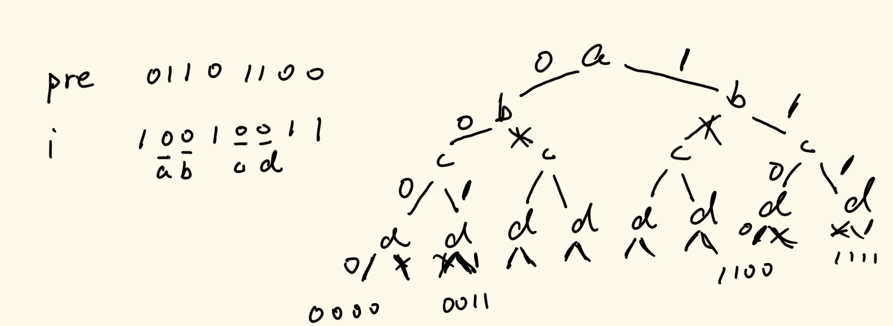

# 数据结构与算法

## 三十四、状态压缩的动态规划

### 1、题目1

> 在"100 game"这个游戏中，两名玩家轮流选择从1到10的任意整数，累计整数和
> 先使得累计整数和达到或超过100的玩家，即为胜者，如果我们将游戏规则改为 “玩家不能重复使用整数” 呢？
> 例如，两个玩家可以轮流从公共整数池中抽取从1到15的整数（不放回），直到累计整数和 >= 100
> 给定一个整数 `maxChoosableInteger` （整数池中可选择的最大数）和另一个整数 `desiredTotal`（累计和）
> 判断先出手的玩家是否能稳赢（假设两位玩家游戏时都表现最佳）
> 你可以假设 `maxChoosableInteger` 不会大于 20， `desiredTotal` 不会大于 300。

此题为LeetCode上第464题：https://leetcode.cn/problems/can-i-win

我们先用暴力递归的方式来实现这个问题。

因为我们每次轮流使用的数组不相同，所以我们需要将所有可能选到的值保存在一个数组当中，然后遍历的时候让其修改为-1，表示其已经被使用过了，不过在递归中我们在一个分支计算完之后要恢复现场。

对于每一次递归，我们都将所有可能的取值全部递归尝试一遍，如果我们递归到的下一个子问题返回的false，那么我们这一个子问题就可以直接返回true，否则就得需要返回false。

具体实现代码如下：

```java
//暴力递归解法
public boolean canIWin1(int maxChoosableInteger, int desiredTotal) {
    //LeetCode抽风，所以这里要加上一个过滤条件
    if (desiredTotal == 0) {
        return true;
    }
    //由于不能选择重复数字，所以必须要将所有的情况记录在表中
    int[] arr = new int[maxChoosableInteger];
    for (int i = 0; i < maxChoosableInteger; i++) {
        arr[i] = i + 1;
    }
    return process(arr, desiredTotal);
}
public static boolean process(int[] arr, int rest) {
    if (rest <= 0) {
        return false;
    }
    //先手尝试所有的情况
    for (int i = 0; i < arr.length; i++) {
        if (arr[i] != -1) {
            //先手的决定
            int cur = arr[i];
            arr[i] = -1;
            boolean next = process(arr, rest - cur);
            //注意这里要恢复现场
            arr[i] = cur;
            //下面这句的含义是，如果子过程的先手赢不了的话，那么当前赢
            if (!next) {
                return true;
            }
        }
    }
    return false;
}
```

在这个基础上我们实现动态规划的话，我们就发现了一个问题，每一个`process`中的`arr`是不同的，而这个数组变量的变化导致了我们通过之前的转为动态规划的方法不再有效。

我们现在从这个暴力递归版本进行第一步分析，即我们分析其递归树，看看其是否有重复调用的过程。虽然我们使用了一个可变的数组变量，但是这个可变的数组变量的每一个元素要么是其本身的值，要么其值为-1表示该值无效，所以通过递归树分析很容易发现会有重复调用的问题。如果我们仔细观察这道在LeetCode上面的原题，我们会发现它给出了对于两个传入参数的大小范围，choose的范围在1\~20，total的范围在0\~300。所以我们就很容易联想到使用位信息来表示当前的数组状态，即每一位表示对应的数组信息是否有效。这样，我们就可以将我们之前定义的`arr`省去，在递归传入参数的时候就将我们要使用的位进行修改即可，就不用进行恢复现场的操作了。

具体实现代码如下：

```java
public boolean canIWin(int maxChoosableInteger, int desiredTotal) {
    if (desiredTotal == 0) {
        return true;
    }
    if ((maxChoosableInteger * (maxChoosableInteger + 1) >> 1) < desiredTotal) {
        return false;
    }
    return process1(maxChoosableInteger, 0, desiredTotal);
}
//status表示状态
public static boolean process1(int choose, int status ,int rest) {
    if (rest <= 0) {
        return false;
    }
    for (int i = 1; i <= choose; i++) {
        //如果当前位的状态为0，那么就代表这一位没有使用过
        if (((1 << i) & status) == 0) {
            //传入的时候将当前位变为1
            if (!process1(choose, status | (1 << i), rest - i)) {
                return true;
            }
        }
    }
    return false;
}
```

虽然这种方法最终还是会超时，但是它给了我们接下来优化的方案。

我们将其转变为动态规划算法，我们如果按照常规的动态规划思路，我们会因为有两个变量去定义一个二维数组，但是我们这里思考一个问题，无论我们通过何种途径，最后遍历到了某一个status状态下，那么它对应的rest一定是相同的，就比如说我们先手选择4后手选择6，和先手选择6后手选择4，最终递归到的rest都是一个，所以我们不需要定义一个二维动态规划数组，我们只需要定义一个一维动态规划数组，来计算每一个status即可。

我们这里为了代码实现起来方便，我们就写到了记忆化搜索这个环节（即做了一次缓存）。

具体实现代码如下：

```java
//转变为动态规划算法
public boolean canIWin(int maxChoosableInteger, int desiredTotal) {
    if (desiredTotal == 0) {
        return true;
    }
    if ((maxChoosableInteger * (maxChoosableInteger + 1) >> 1) < desiredTotal) {
        return false;
    }
    int[] dp = new int[1 << (maxChoosableInteger + 1)];
    return process2(maxChoosableInteger, 0, desiredTotal, dp);
}

//重点理解这一段代码
//因为无论status通过什么顺序得到的当前的状态，其最终对应的rest一定是一样的，所以rest不需要进行缓存
//换句话来讲，status的一个状态一定对应着一个固定的rest，所以rest不需要去管
public static boolean process2(int choose, int status, int rest, int[] dp) {
    if (dp[status] != 0) {
        return dp[status] == 1 ? true : false;
    }
    boolean ans = false;
    if (rest > 0) {
        for (int i = 1; i <= choose; i++) {
            if (((1 << i) & status) == 0) {
                if (!process2(choose, (status | (1 << i)), rest - i, dp)) {
                    ans = true;
                    break;
                }
            }
        }
    }
    dp[status] = ans ? 1 : -1;
    return ans;
}
```

这道题是状态压缩动态规划类型题目中最简单的一道题。这道题说明，如果我们在进行动态规划实现的时候遇到了变量是可变的线性结构的时候，而这个线性结构中的每一个元素都有有效和无效两种情况的时候，我们可以通过一个位图来表示其每一个元素的状态，但其本质上还是一个线性结构，但是我们可以对其进行处理了。

### 2、题目二

> TSP问题
>
> 有N个城市，任何两个城市之间都有距离，任何一座城市到自己的距离都为0。所有点到点的距离都存在一个N*N的二维数组matrix里，也就是整张图由邻接矩阵表示。现要求一旅行商从k城市出发必须经过每一个城市且只在一个城市逗留一次，最后回到出发的k城，返回总距离最短的路的距离。
>
> 参数给定一个matrix，给定k。

我们先从暴力递归的方式解决这个问题。

因为每一个城市只能遍历一次，所以我们需要用一个数组来记录每一个城市是否被遍历过了。所以我们先定义一个状态数组，然后定义递归函数，其参数为这个图的邻接矩阵，状态数组以及当前遍历的节点。

对于这个递归函数f(m, set, start)，其返回值为int。其中start必定在set中存在，初始的start是最终的归宿点。当我们进行递归调用的时候，我们需要先判断现在set中还有几个值是有效的，如果只有一个值有效，那么这个值一定是当前遍历的点，这个时候直接返回该点到最终归宿点的距离即可；如果set中不止该点是有效点，那么我们先把当前的点置为无效，然后遍历剩下有效的点，遍历到一个点就计算自己当前的点到下一个点的距离加上下一个点的到归宿点的距离，最后取最短即可。最终要注意恢复现场，避免遍历过程中使得数组值发生变化而导致遍历报错。

具体实现代码如下：

```java
public static int t1(int[][] matrix) {
    int N = matrix.length; // 0...N-1
    // set
    // set.get(i) != null i这座城市在集合里
    // set.get(i) == null i这座城市不在集合里
    List<Integer> set = new ArrayList<>();
    for (int i = 0; i < N; i++) {
        set.add(1);
    }
    return func1(matrix, set, 0);
}
// 任何两座城市之间的距离，可以在matrix里面拿到
// set中表示着哪些城市的集合，
// start这座城一定在set里，
// 从start出发，要把set中所有的城市过一遍，最终回到0这座城市，最小距离是多少
public static int func1(int[][] matrix, List<Integer> set, int start) {
    //先计算还有几个有效城市
    int cityNum = 0;
    for (int i = 0; i < set.size(); i++) {
        if (set.get(i) != null) {
            cityNum++;
        }
    }
    //如果只剩一个城市，必定是它自己
    if (cityNum == 1) {
        return matrix[start][0];
    }
    // cityNum > 1  不只start这一座城
    set.set(start, null);
    int min = Integer.MAX_VALUE;
    //遍历整个数组
    for (int i = 0; i < set.size(); i++) {
        if (set.get(i) != null) {
            // start -> i i... -> 0
            int cur = matrix[start][i] + func1(matrix, set, i);
            min = Math.min(min, cur);
        }
    }
    set.set(start, 1);
    return min;
}
```

我们可以通过递归树的方式来寻找是否有相同参数重复传入计算的过程，发现是有的，而且与上一道题很类似。所以我们可以通过上一道题的方式来对这道题通过状态压缩实现缓存解决问题。

对于上面的set，其每个值有两种状态，一个是1，一个是null，所以我们可以通过位图来表示每一个点的状态，并且我们不再需要定义一个set来存储当前未被遍历的节点。

具体实现代码如下：

```java
//进行缓存处理
public static int t3(int[][] matrix) {
    int N = matrix.length;
    int allCity = (1 << N) - 1;
    int[][] dp = new int[allCity + 1][N];
    for (int i = 0; i < allCity + 1; i++) {
        for (int j = 0; j < N; j++) {
            dp[i][j] = -1;
        }
    }
    return func3(matrix, allCity, 0, dp);
}

public static int func3(int[][] matrix, int cityStatus, int start, int[][] dp) {
    if (dp[cityStatus][start] != -1) {
        return dp[cityStatus][start];
    }
    //如果当前只剩下一个有效元素了，那么直接返回当前start到0的距离
    if (cityStatus == (cityStatus & (~cityStatus + 1))) {
        return matrix[start][0];
    }
    //把start位的1去掉
    cityStatus &= (~(1 << start));
    int min = Integer.MAX_VALUE;
    for (int move = 0; move < matrix.length; move++) {
        if (move != start && (cityStatus & (1 << move)) != 0) {
            int cur = matrix[start][move] + func3(matrix, cityStatus, move, dp);
            min = Math.min(min, cur);
        }
    }
    cityStatus |= (1 << start);
    dp[cityStatus][start] = min;
    return min;
}
```

如果在笔试或者面试场上，一般写道这一步就可以停下来了，下面改成元素依赖的动态规划难度很高，而且时间复杂度并没有本质上的优化。

这里只给出转变成动态规划的代码，我们不做描述。

```java
public static int t4(int[][] matrix) {
    int N = matrix.length; // 0...N-1
    int statusNums = 1 << N;
    int[][] dp = new int[statusNums][N];
    for (int status = 0; status < statusNums; status++) {
        for (int start = 0; start < N; start++) {
            if ((status & (1 << start)) != 0) {
                if (status == (status & (~status + 1))) {
                    dp[status][start] = matrix[start][0];
                } else {
                    int min = Integer.MAX_VALUE;
                    // start 城市在status里去掉之后，的状态
                    int preStatus = status & (~(1 << start));
                    // start -> i
                    for (int i = 0; i < N; i++) {
                        if ((preStatus & (1 << i)) != 0) {
                            int cur = matrix[start][i] + dp[preStatus][i];
                            min = Math.min(min, cur);
                        }
                    }
                    dp[status][start] = min;
                }
            }
        }
    }
    return dp[statusNums - 1][0];
}
```

#### 3、题目三

> 你有无限的1*2的砖块，要铺满M\*N的区域，
>
> 不同的铺法有多少种？

我们先从暴力递归的方法入手找到解决方案。

对于任意一个砖块，我们有四种放置方法：向上，向左，向下和向右摆放瓷砖。不过我们可以对摆放砖块的方法加以限制，即我们可以限制摆放瓷砖的方法为向上和向右摆放瓷砖，因为对于一个位置我们向上摆放瓷砖，也可以视为这个位置上方的位置向下摆放瓷砖，这是一样的；对于向右摆放瓷砖，这也是同一个道理。

我们这样定义递归函数f(int i, int pre，int N)：i表示当前遍历到了第几行；pre表示第i-1行的状态，这个通过位信息来表示第i-1行哪里有空格以及哪里是满的；N表示一共有多少行，这个值是固定的；返回值i到N行全部摆满摆放了多少个瓷砖，并且这个函数有一个“潜台词”，即前i-2行的所有格子全部铺满。对于这个方法的base case，我们这样设定：当i==N时，这个时候已经越界且不能做任何操作了，这个时候如果pre的二进制位全部为1，这个时候f函数可以返回铺好的个数；如果不全为1，则遍历到这里的摆放方法是无效的，返回-1。

那么现在的问题就在于这个递归函数f如何实现。我们现在传入了pre以及i，我们需要根据pre的内容进行“填格子”，如果pre对应的位为0，则为了在进行下一行遍历的时候保证下一行的上两行之前全部填满，在这行对应的位置只能向上摆放；如果pre对应的位为1，那么这个位置就是可以自由发挥的位置，因为我们对瓷砖的摆放方式做了限制，要么向上放，要么向右放，但是pre在这个位置为1，所以不能向上放，所以就有两种情况，要么不放，要么向右摆放，但是向右摆放的前提是右侧的pre必须也为1，如果为0就不能向右侧摆放。所以对于一行剩余自由发挥的位置的值的确定，我们需要使用深度优先遍历，具体深度优先遍历的过程我们通过下面的图示来解释：



图中左侧是pre以及由pre取反所计算出的i这一行的pre，即进入下一次调用的pre，我们将这个pre所有的0位置进行深度优先遍历来确定最终的取值，最终的取值如图右侧展示的这样。

具体实现代码如下（这里直接给出记忆化搜索的解）：

```java
public static int ways3(int N, int M) {
    if (N < 1 || M < 1 || ((N * M) & 1) != 0) {
        return 0;
    }
    if (N == 1 || M == 1) {
        return 1;
    }
    //找N和M的最大最小，我们将长的视为列，短的视为行
    int max = Math.max(N, M);
    int min = Math.min(N, M);
    int pre = (1 << min) - 1;
    int[][] dp = new int[pre + 1][max + 1];
    //初始化
    for (int i = 0; i < dp.length; i++) {
        for (int j = 0; j < dp[0].length; j++) {
            dp[i][j] = -1;
        }
    }
    return process3(pre, 0, max, max, dp);
}
public static int process3(int pre, int i, int N, int M, int[][] dp) {
    //如果有缓存就直接存起来
    if (dp[pre][i] != -1) {
        return dp[pre][i];
    }
    int ans = 0;
    if (i == N) {
        ans = pre == ((1 << M) - 1) ? -1 : 0;
    } else {
        //相关位要按位取反，切记不能全部取反
        int op = ((~pre) & ((1 << M) - 1));
        ans = dfs3(op, M - 1, i, N, M, dp);
    }
    dp[pre][i] = ans;
    return ans;
}

public static int dfs3(int op, int col, int level, int N, int M, int[][] dp) {
    if (col == -1) {
        return process3(op, level + 1, N, M, dp);
    }
    int ans = 0;
    ans += dfs3(op, col - 1, level, N, M, dp);
    if (col > 0 && (op & (3 << (col - 1))) == 0) {
        ans += dfs3((op | (3 << (col - 1))), col - 2, level, N, M, dp);
    }
    return ans;
}
```

