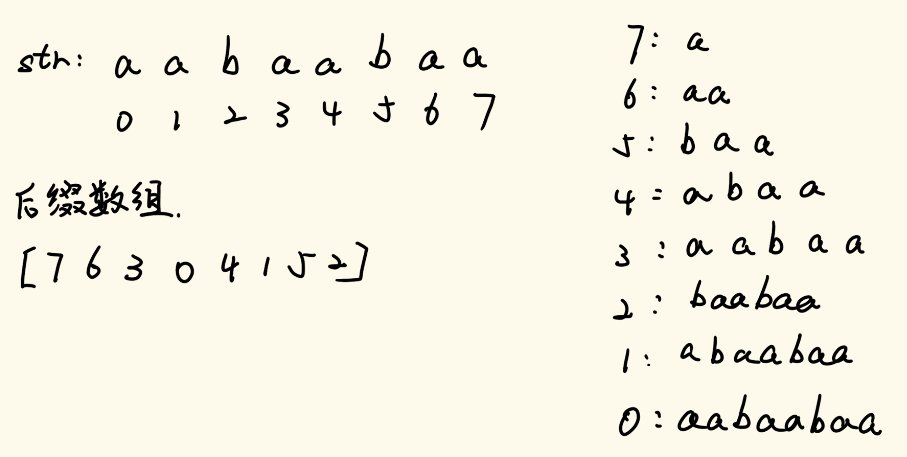
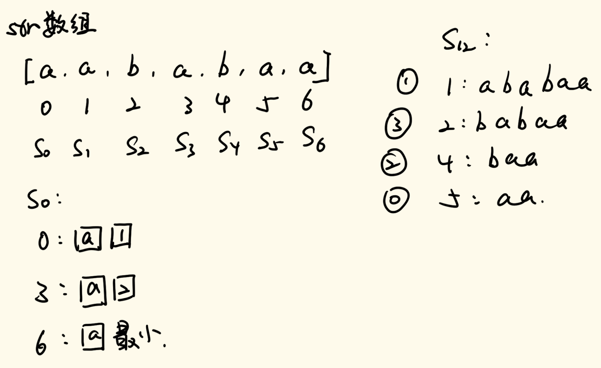
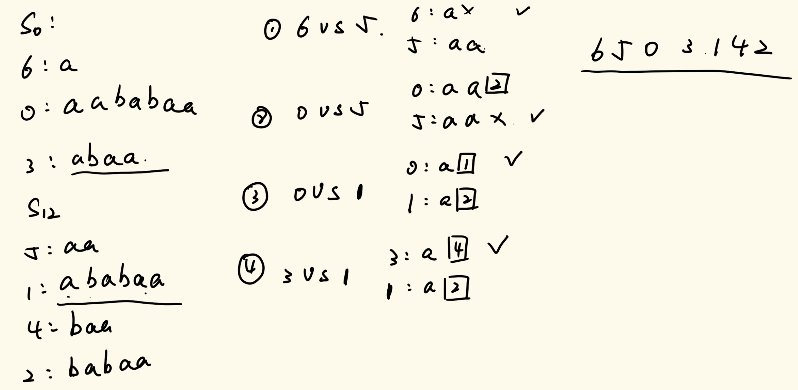
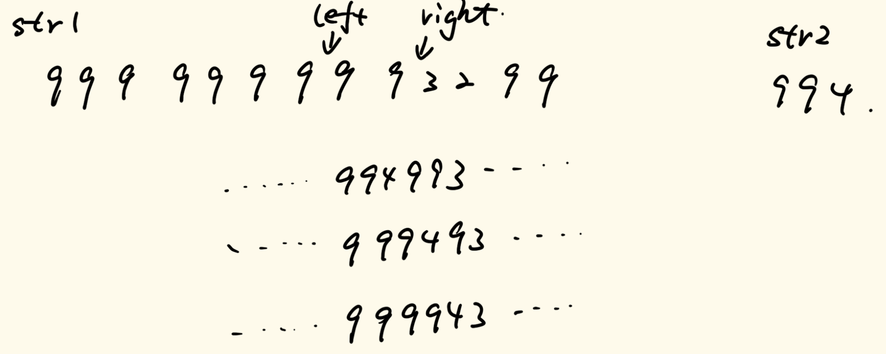
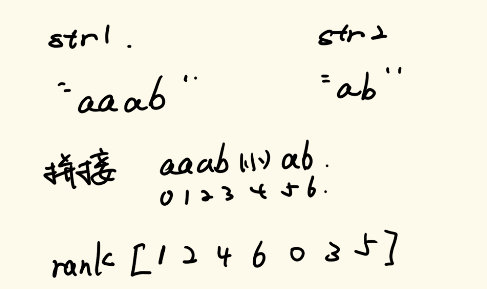
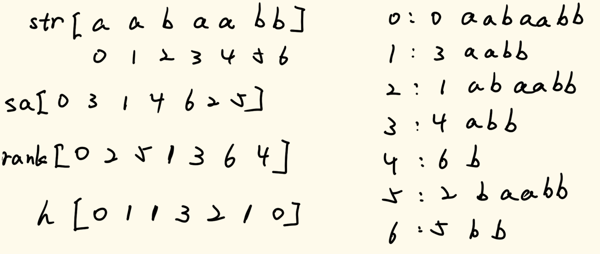
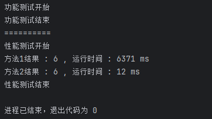

# 数据结构与算法

## 三十五、DC3生成后缀数组

DC3算法不需要去掌握其代码如何去写，主要是以理解为主。

### 1、后缀数组

对后缀字符串，这个很好理解，对于每一个下标位，包括其本身的往后的所有元素组成的字符串，就是后缀字符串。

我们在后缀字符串的前提下定义后缀数组。后缀数组就是所有的后缀字符串按字典序进行排序，排序后的下标所组成的数组就是后缀数组。

我们看下面的图例：



图片右侧就是str的所有后缀字符串，根据字符串的特征我们能很容易判断出其字典序是什么，根据字典序所形成的顺序就是一个后缀数组。

由于每一个后缀字符串的长度都是不相同的，所以不可能存在字典序一样的情况，这些生成的后缀数组顺序一定是有差异的。

如果我们求这个后缀数组，用最暴力的解法，即首先先求出所有的后缀数组，这一步的时间复杂度为`O(N^2)`，然后在根据我们求出的字符串进行排序，排序的时间复杂度为`O(N*logN)`，但是排序的比较策略为`O(N)`，所以时间复杂度为`O(N^2*logN)`，总时间复杂度为`O(N^2*logN)`。这个时间复杂度是我们没办法容忍的。

而DC3算法就是求这样的一个后缀数组，能够将时间复杂度优化成O(N)。

这里我们要强调一下，这个算法不止针对于字符串，我们可以将字符串拆分成一个一个元素放到数组当中，并且每一个元素是以ASCII码的形式存在，我们依旧可以去求这个数组的后缀数组。

### 2、算法实现

DC3算法全称：Difference Cover mod 3

我们先明确一个问题：假设现在有N个样本，每个样本有一个三维数据，我们对这N个样本进行排序，比较方式是先比较一维数据，如果一维数据相同就比较二维数据，如果还相同就在比较三维数据。现在假设这三个数据的大小都不是特别大，请问怎样排序是最快的。对于这个问题，我们可以采用基数排序的方式进行，具体排序方式是这样的：我们现在假设所有的数据都不大于m，定义一个个数为m的“桶”（每一个桶可以视为一个队列），然后我们根据第三维数字的大小，将其放入到相应的桶当中，如果我们要实现的是从小到大排序，我们则需要从第0号桶开始将所有元素“倒”出来，然后根据“倒”出来的顺序依照蒂尔维数字的大小依次将所有的元素放入“桶”中，然后再次从0号桶开始将所有元素“倒”出来，然后以同样的方式依照第一维的数据进行同样的操作，这样我们就把这N个样本的顺序排好了（如果我们要从大到小进行排序，只需要从第m-1号桶依次倒出即可）。

明确了上面的问题，我们正式来将DC3算法。

我们先将一个数组的所有下标根据模3剩余类进行分组，即0号下标属于s0，1号下标属于s1，二号下标属于s2，3号下标属于s0，4号下标属于s1，5号下标属于s2……，即所有下标在模3计算后结果相等的属于一类。

我们用图示来说明下一步：



这张图是这样的：假设现在我们求得了s12这两个分组中所有后缀字符串的排序，然后我们现在求s0中的所有元素的后缀字符串的排序，我们是这样处理的：0号位置的后缀字符串可以表示为自己当前元素和s12中顺序排1的后缀字符串的拼接，可以将这两个元素视为一个二维数据，对于3号位置的后缀字符串也是这样的，而6号位置的后续就没有元素了，所以我们可以用一个最小ASCII码来作为这个二维数据的第二个数。这样，我们就可以通过基数排序来确定s0中的所有后缀数组的排序。如果我们想要总排名，那么我们就需要将s0与s12进行合并，如果我们存在一个merge（合并）的方法，将这两个集合中的元素通过归并的方式进行组合，这样我们的总排序就出来了。 

而对于merge的比较策略，我们用图示的方法来说明：



我们对比的原则是，看对比的数之间在剩余类中他们相差多少，相差的大小决定了前面有几个元素单独去比较，后面的元素直接到s12中去找。

我们看流程，首先比较的是下标为6和5两个后缀的比较，因为在剩余类中他们相差2，所以我们先比较单独比较前面两个元素，所以第一个元素相同的情况下，6没有第二个元素，而5有第二个元素，所以6先进入排好序的数组；然后是0和5比较，因为在剩余类中他们相差2，所以我们单独比较两个元素，发现都相同，然后5后面没有元素了，而0后面在s12中对应下标为2的后缀，所以5进入排好序的数组；然后比较0和1，他们在剩余类中相差1，所以只比较1个元素，第一个元素相同，而0号位后面的元素是1的后缀，1号位后面的元素是2的后缀，1比2排在前面，所以0号元素进入排序数组；然后是3和1比较，他们在剩余类中相差1，所以只单独比较1个元素，发现相同，3号位后面是4的后缀，1号位后面是2的后缀，4后缀在2前，所以3号元素进入排好序的数组，剩下的s12中还剩下1、4、2号位的后缀，依次加入到排好序的数组当中，最终归并的结果如右上角所示。

所以现在的问题就在于s12这个排好序的集合我们如何得到。

我们这里引用论文中的例子来进行说明：


我们看上面论文中所引用的例子，现在来说明一下。

对于上面的例子，我们只看所有属于s1和s2的元素，s0的元素我们不看。我们找到所有s1元素和s2元素的后缀字符串的前三位，如果没有三位，我们在此全部补上0，视为ASCII最小。然后将所有s1的后缀字符串的前三位通过基数排序方式进行从大到小排序，并且依照排好序的相对顺序将s1和s2的分开，就像图中第二行一样（图中第二行每三个字符为一组的下方表示的为这三个元素在基数排序后的相对次序），这样我们就得到了第三行的数组，这一行的数组存储的全部都是三个元素的后缀字符串在基数排序下的相对次序。我们在第三行的数组上进行一次递归调用，调用的就是求后缀数组的方法，求出第三行数组的后缀数组，这样就得到了第四行的数据。到这一步，我们就将这个s1和s2的数据拍好了序，第四行的数据我们是这样解读的：第四行0号元素为3，代表在第三行元素中的第三号元素1为s12中第0号元素；四行1号元素为2，代表在第三行元素中的第二号元素2为s12中第1号元素，说明原数组中下标为2的后缀字符串在s12中为第1号元素，以此类推。

至于为什么这样算能够算出s12集合的排序，这里不做具体描述，只需要掌握计算过程即可。

具体代码就不在这里展示了，代码比较长，并且不太好理解，以后我们只需要将DC3算法视为一个黑盒，然后用这样一个黑盒去求解相关问题即可。

我们这里只给出接口以及我们可以调用的成员变量。

```java
public int[] sa;    //从左往右依次递增的字典序

public int[] rank;  //每一个元素表示在原数组该下标下排第几个

public int[] height;

// 构造方法的约定:
// 数组叫nums，如果你是字符串，请转成整型数组nums
// 数组中，最小值>=1
// 如果不满足，处理成满足的，也不会影响使用
// max, nums里面最大值是多少
public DC3(int[] nums, int max) {
    sa = sa(nums, max);
    rank = rank();
    height = height(nums);
}
```

### 3、按字典序排在最后的字符串

> 给你一个字符串 `s` ，找出它的所有子串并按字典序排列，返回排在最后的那个子串。

此题为LeetCode上第1163题：https://leetcode.cn/problems/last-substring-in-lexicographical-order

这道题我们直接使用DC3算法，将字符串转成字符数组即可。

具体实现代码如下：

```java
public String lastSubstring(String s) {
    if (s == null || s.length() == 0) {
        return s;
    }
    int N = s.length();
    char[] str = s.toCharArray();
    //统计最大值和最小值
    int min = Integer.MAX_VALUE;
    int max = Integer.MIN_VALUE;
    for (char cha : str) {
        min = Math.min(cha, min);
        max = Math.max(cha, max);
    }
    int[] arr = new int[N];
    //缩小每个数的大小，方便计算
    for (int i = 0; i < N; i++) {
        arr[i] = str[i] - min + 1;
    }
    DC3 dc3 = new DC3(arr, max - min + 1);
    return s.substring(dc3.sa[N - 1]);
}
```

### 4、题目一

> 给定两个字符串str1和str2，想把str2整体插入到str1中的某个位置
>
> 形成最大的字典序
>
> 返回字典序最大的的结果

这道题我们建立在插入的字符串str2的长度比str1的长度小的多的前提下进行求解。

我们先想明白一个问题，如果对于str1，如果其最开头的元素的后缀字符串的字典序如果大于等于str2，那么str2就没有插入str1第一个之前的必要。

如果我们对于上面的断言进行推广，则是这样的：对于str1的任意一个元素，以其开头的后缀字符串的字典序如果大于等于str2，那么str2就没有插入到该元素前面的必要，这个遍历过程我们可以直接将他跳过。不过对于小于str2的后缀字符串，我们是必须要考虑的。

如果我们遍历这个数组生成的后缀数组（这里我们遍历rank数组），如果当前的字典序大于等于str2，那么我们直接跳过；如果当前的字典序小于str2，那么我们在此做一个标记，因为接下来遍历如果没有到达终点的情况下一定有一个字典序大于等于str2，把大于等于str2的位置的下标记住，那么在这个区间内的所有元素就是我们要的下标，我们比较这个区间的插入这个str2的情况下的字典序大小即可。

当然，对比的时候我们只需要关心局部串即可，即两个下标区间的数进行插入比价即可。

就如下面图所示：



就比如这个图中，我们找到了左右两个下标，我们只需要比较993这一个区间上插入的结果即可。

解题的流程如下：

1. 通过DC3算法，建立str1从i位置出发以及str2从0位置出发的字典序比较机制
2. 然后遍历str1数组，一个一个试，定位出left在哪里
3. 找到left可能性后，我们需要找到right在哪里
4. 截取left和right，然后找到最大的字典序

所以我们的所有问题就聚焦在了第一步怎么实现。 这也是DC3算法的常见用法。

我们通过一个最小ASCII码将str1和str2拼接在一起，然后对整个拼接好的字符串进行一次DC3算法，这样我们就得到了所有i位置与str2字典序的比较结果。

就例如下面图示：



我们将str1与str2中间通过最小ASCII码来拼接，然后进行DC3算法，这样我们得出来的rank数组能够很好的展现str2与str1的字典序排序。

具体实现代码如下：

```java
//正式方法
public static String maxCombine(String s1, String s2) {
    if (s1 == null || s1.length() == 0) {
        return s2;
    }
    if (s2 == null || s2.length() == 0) {
        return s1;
    }
    //先转成数组
    char[] str1 = s1.toCharArray();
    char[] str2 = s2.toCharArray();
    int N = str1.length;
    int M = str2.length;
    //获取str1和str2数组最大值
    int min = str1[0];
    int max = str1[0];
    for (int i = 1; i < N; i++) {
        min = Math.min(min, str1[i]);
        max = Math.max(max, str1[i]);
    }
    for (int i = 0; i < M; i++) {
        min = Math.min(min, str2[i]);
        max = Math.max(max, str2[i]);
    }
    //进行数组拼接
    int[] all = new int[N + M + 1];
    int index = 0;
    for (int i = 0; i < N; i++) {
        all[index++] = str1[i] - min + 2;
    }
    all[index++] = 1;        //最小ASCII码
    for (int i = 0; i < M; i++) {
        all[index++] = str2[i] - min + 2;
    }
    //进行DC3算法，找到后缀数组
    DC3 dc3 = new DC3(all, max - min + 2);
    int[] rank = dc3.rank;
    //标记str2字符串的位置
    int comp = N + 1;
    for (int i = 0; i < N; i++) {
        //让每一个后缀字符串的字典序与str2字典序进行比较
        if (rank[i] < rank[comp]) {
            //得到最好的拼接结果的分裂下标
            int best = bestSplit(s1, s2, i);
            return s1.substring(0, best) + s2 + s1.substring(best);
        }
    }
    return s1 + s2;
}
//找到最好的划分点
//传入的first是找到的小于str2的下标位置
public static int bestSplit(String s1, String s2, int first) {
    int N = s1.length();
    int M = s2.length();
    int end = N;
    //先找到最右符合标准的位置
    for (int i = first, j = 0; i < N && j < M; i++, j++) {
        if (s1.charAt(i) < s2.charAt(j)) {
            end = i;
            break;
        }
    }
    String bestPrefix = s2;
    //我们初始化的最好划分点是first，如果后面无法改动，就返回他了
    int bestSplit = first;
    for (int i = first + 1, j = M - 1; i <= end; i++, j--) {
        String curPrefix = s1.substring(first, i) + s2.substring(0, j);
        if (curPrefix.compareTo(bestPrefix) >= 0) {
            bestPrefix = curPrefix;
            bestSplit = i;
        }
    }
    return bestSplit;
}
```

### 5、题目二

> 给两个长度分别为M和N的整数数组nums1和nums2，其中每个值都不大于9，再给一个正数K。
>
> 你可以在nums1和nums2中挑选数字，要求一共挑选K个，并且要从左到右挑。
>
> 返回所有可能的结果中，代表最大数字的结果。

此题为LeetCode上第321题：https://leetcode.cn/problems/create-maximum-number

解题的大致流程是这样的：

- 先决定在nums1和nums2中选择K个数，可以在nums1中选择k个数，nums2中选择0个数；也可以在nums1中选择k-1个数，nums2中选择1个数……
- 然后将选择的数进行merge
- merge后与之前的数比较来判断哪个最大
- 最后将最大的留下即可

我们现在来解决一个问题：对于一个数组当中，我们选择M个数，怎么挑选可以让这个数尽量大一些。不过这个问题我们需 要解决批量处理的问题，即我们开始遍历的时候第一次选择k个数，而第二次选择k-1个数…，所以我们需要一个结构，来实现这样一个批处理问题。我们定义一个二维数组， 其横坐标代表这个数组的下标，列数对应个数，所以纵坐标的个数比横坐标个数要多一个，其中元素的含义是从i位置挑选数字，挑选j个，其最大位置的结果开始位置在哪。对于这张表，j=0时是没有意义的，对于j=1，我们从下往上填，最后一行的位置填数组最后一个数的下标，后面的元素则与上一个元素比大小，如果比他大，就填自己的下标，如果比他小，则填上一个元素所指向的数组元素下标。根据这个数组的含义，我们可以得知i + j ≤ k，所以对于i + j > k的区域我们都不用管。对角线上的位置全部填自己的下标即可。对于每一个元素(i, j)，其依赖元素为(i+1,  j)，如果当前的元素的i所指向的数组中的元素大于等于依赖元素所指向的数组中的元素，那么就填自己，否则就填依赖元素即可（想一想为什么）。这样我们就解决了这个问题。

我们通过建立的这张表，我们能够迅速的找到我们想要找到的数字。当我们需要找m个数字的时候，我们只需要找(0, m)，根据其元素的值选择数字x，并且跳到(x+1，m-1)，找下一个元素，依次往后找，直到纵坐标变为0即可。

到了下一步，我们需要进行遍历，将所有可能的选择进行组合求解。不过这个时候我们需要明确遍历区间，如果这两个数组当中的一个数组大小比k还要小，那么就说明这个数组无法取出k个值，所以我们要明确遍历区间，防止出现取不出那么多值的情况。之后看代码我们可以了解这个区间是怎么确定的。

在遍历中，我们根据第一个问题的解决结果求两个数组在某一个取值个数的情况下的最优取值策略，然后我们需要解决这两个数组的合并操作，并且与之前求解得到的数组进行比较得出结果。

首先我们来解决最优合并的问题。

我们先通过比较传统的暴力解方式来解决，这也是LeetCode上提供的最优解。

我们定义两个指针，分别指向这两个合并数组的第0号元素，然后比对这两个元素的后缀，谁的后缀字典序排在后面，谁先进入merge数组当中作为答案返回。而进行后缀字典序的比较，则是在定义一个指针，接着依次往下比，直到比较到某一个数组的值不再相同时，谁大谁的字典序排在后面。如果一样大，要哪个都可以。

具体的操作代码是这样的：

```java
public static int[] merge(int[] nums1, int[] nums2) {
    int k = nums1.length + nums2.length;
    int[] ans = new int[k];
    for (int i = 0, j = 0, r = 0; r < k; ++r) {
        //谁的字典序大谁放入ans数组
        ans[r] = preMoreThanLast(nums1, i, nums2, j) ? nums1[i++] : nums2[j++];
    }
    return ans;
}
//进行后缀比较
public static boolean preMoreThanLast(int[] nums1, int i, int[] nums2, int j) {
    //如果相等，则将指针向后移动
    while (i < nums1.length && j < nums2.length && nums1[i] == nums2[j]) {
        i++;
        j++;
    }
    //直到指针指向了最后
    return j == nums2.length || (i < nums1.length && nums1[i] > nums2[j]);
}
```

之所以我们要比较后缀，是因为我们需要知道每一个数的“潜力”，这样才能选出最优的数。

到这里，我们可以根据上一道题对于DC3算法的应用，来解决这个子问题。我们只需要将求解最佳合并的两个数组中间插入一个最小ASCII码，这样我们就可以判断这两个数组的所有后缀的次序，这样我们遍历一遍数组就可以了。

具体实现代码如下：

```java
//使用DC3算法进行求解
public int[] maxNumber(int[] nums1, int[] nums2, int k) {
    int len1 = nums1.length;
    int len2 = nums2.length;
    if (k < 0 || k > len1 + len2) {
        return null;
    }
    int[] res = new int[k];
    //获取两个nums数组的dp数组
    int[][] dp1 = getdp(nums1);
    int[][] dp2 = getdp(nums2);
    //要根据两个数组以及k的大小决定一开始挑几个数
    for (int get1 = Math.max(0, k - len2); get1 <= Math.min(k, len1); get1++) {
        //arr1挑get1个，怎么得到一个最优结果
        int[] pick1 = maxPick(nums1, dp1, get1);
        int[] pick2 = maxPick(nums2, dp2, k - get1);
        //合并操作
        int[] merge = mergeBySuffixArray(pick1, pick2);
        //最后判断
        res = MoreThan(res, merge) ? res : merge;
    }
    return res;
}
public static int[] mergeBySuffixArray(int[] nums1, int[] nums2) {
    int size1 = nums1.length;
    int size2 = nums2.length;
    int[] nums = new int[size2 + size1 + 1];
    //这里所有数都+2，这样即便是最小值0都会比1小
    for (int i = 0; i < size1; i++) {
        nums[i] = nums1[i] + 2;
    }
    nums[size1] = 1;
    for (int i = 0; i < size2; i++) {
        nums[i + size1 + 1] = nums2[i] + 2;
    }
    //这里的max为9+2=11
    DC3 dc3 = new DC3(nums, 11);
    int[] rank = dc3.rank;
    int[] ans = new int[size1 + size2];
    //i，j分别指向nums1和nums2
    //r为ans数组指针
    int i = 0;
    int j = 0;
    int r = 0;
    //i,j两个指针谁指向的后缀值更大，谁加入到ans当中
    while (i < size1 && j < size2) {
        ans[r++] = rank[i] > rank[j + size1 + 1] ? nums1[i++] : nums2[j++];
    }
    while (i < size1) {
        ans[r++] = nums1[i++];
    }
    while (j < size2) {
        ans[r++] = nums2[j++];
    }
    return ans;
}
public static boolean MoreThan(int[] nums1, int[] nums2) {
    int i = 0;
    int j = 0;
    while (i < nums1.length && j < nums2.length && nums1[i] == nums2[j]) {
        i++;
        j++;
    }
    return j == nums2.length || (i < nums1.length && nums1[i] > nums2[j]);
}
public static int[][] getdp(int[] arr) {
    int size = arr.length;
    int pick = arr.length + 1;
    int[][] dp = new int[size][pick];
    //这个遍历过程其实就包含了初始化
    for (int get = 1; get < pick; get++) {
        //获取当前列的最大遍历区间
        //这个变量同时也是对角线元素的初始值
        int maxIndex = size - get;
        for (int i = size - get; i >=0; i--) {
            if (arr[i] >= arr[maxIndex]) {
                maxIndex = i;
            }
            dp[i][get] = maxIndex;
        }
    }
    return dp;
}
```

### 6、题目三

> 最长公共子串问题时面试常见题目之一，假设str1长度N，str2长度M
>
> 一般在面试场上回答出O(N*M)的解法已经是比较优秀了
>
> 因为得到O(N*M)的解法，就已经需要用到动态规划了
>
> 但其实这个问题的最优解是O(N+M)，需要用到后缀数组+height数组

我们先通过动态规划的方法解决这个问题。

我们定义`dp[i][j]`，其中横坐标为str1的下标，纵坐标为str2的下标，其元素值表示str1以i位置为结尾，str2以j位置为结尾，最长公共子串的长度是多少。

我们先来看base case，对于j=0这一列，如果对应的str2元素与str1中的下标为0的元素相同，则填1，否则填0；同理，对于i=0这一行，如果对应的str1元素与str2中下标为0的元素相同，则填1，否则填0。

接下来我们看元素依赖关系。对于一个元素`dp[i][j]`，如果其在str1和str2中对应的元素相同，那么找(i-1,j-1)，加1即可；如果不相等，直接填0。

最终的答案就是整张表中最大的那个值。

因为我们只需要了解自己的左上元素的值是多少，所以我们可以进行空间压缩。

具体实现代码如下（这个代码的空间压缩已经压缩到了极致，可能看不懂，但是要尽量看懂）：

```java
//动态规划解法
//(吐槽一下：这代码写成这B样谁看得懂啊？？？？？？你大爷的空间压缩压缩成一个变量是吧？？？？)
public static int lcs1(String s1, String s2) {
    if (s1 == null || s2 == null || s1.length() == 0 || s2.length() == 0) {
        return 0;
    }
    char[] str1 = s1.toCharArray();
    char[] str2 = s2.toCharArray();
    int row = 0;
    int col = str2.length - 1;
    int max = 0;
    while (row < str1.length) {
        int i = row;
        int j = col;
        int len = 0;
        while (i < str1.length && j < str2.length) {
            if (str1[i] != str2[j]) {
                len = 0;
            } else {
                len++;
            }
            if (len > max) {
                max = len;
            }
            i++;
            j++;
        }
        if (col > 0) {
            col--;
        } else {
            row++;
        }
    }
    return max;
}
```

这样的方法的时间复杂度为O(M*N)。

我们接下来将通过DC3方法解决这个问题，将时间复杂度优化到O(M+N)。

我们先讲解DC3中高度数组的概念。

我们这里先引入一个h数组的概念

h数组是指对于当前下标位置上的后缀字符串与在排名中自己前一名的后缀字符串的最长前缀长度是多长。

我们用图例来说明这一件事：



上述图片给出了DC3三个数组的生成结果，对于sa数组和rank数组我们并不陌生，这里我们只讲rank数组的生成。

- 对于第0号元素，其排名在rank中可以得知，为第0名，所以没有上一名，就没有公共前缀，所以值为0
- 对于第1号元素，其排名为2，上一名第1名所在位置为3，最长公共前缀就只有到a，所以值为1
- 对于第2号元素，其排名为5，上一名第4名所在位置为6，最长公共前缀只有b，所以值为1
- 对于第3号元素，其排名为1，上一名第0名所在位置为0，最长公共前缀有aab，所以值为3
- 对于第4号元素，其排名为3，上一名第2名所在位置为1，最长公共前缀有ab，所以值为2
- 对于第5号元素，其排名为6，上一名第5名所在位置为2，最长公共前缀有b，所以值为1
- 对于第6号元素，其排名为4，上一名第3名所在位置为4，没有最长公共前缀，所以值为0

这就是h数组的概念。

下面我们来说明h数组的求解方法。

我们先说一个结论，对于任意的h[i]，其值一定大于等于h[i-1]-1。

我们根据这个结论，我们在进行前缀比对的时候，可以跳过一些数，直接往下开始比对即可。就比如上述例子，我们在得知了第3号元素的值的时候，我们计算第4号元素的值，其排名为3，上一名第2名所在位置为1，我们在比对这两个字符串的时候直接从第2号元素开始比对即可，而这一比对就直接判断出最长前缀为2了。

通过这样的方式，我们发现我们的比对指针是基本不回退的，时间复杂度就为O(N)。

然后我们来讲一下height数组的概念。

height数组中的元素height[i]表示对于排名第i个的后缀字符串，其与i-1名后缀字符串的最长前缀是多长。

我们能很容易的根据h数组来求解height数组。

我们就拿上面的图例来说明其height数组是如何计算的。

- 后缀字符串排第0名的为第0号元素，其h数组值为0，所以height[0]=0
- 后缀字符串排第1名的为第3号元素，其h数组值为3，所以height[1]=3
- 后缀字符串排第2名的为第1号元素，其h数组值为1，所以height[1]=1
- 后缀字符串排第3名的为第4号元素，其h数组值为2，所以height[1]=2
- 后缀字符串排第4名的为第6号元素，其h数组值为0，所以height[1]=0
- 后缀字符串排第5名的为第2号元素，其h数组值为1，所以height[1]=1
- 后缀字符串排第6名的为第5号元素，其h数组值为3，所以height[1]=1

通过这样的方法，我们得到了其height数组中的所有元素值。

上面所计算的过程忽略了h数组和height数组与sa数组和rank数组之间的关联，读者可以通过代码来了解关联什么。

height数组的具体实现代码如下：

```java
//这里我们求出h数组之后直接用rank数组填写好height数组
//上面讲h数组只是为了方便理解，实际操作的过程中我们可以跳过求h数组的阶段直接填height数组的值
private int[] height(int[] s) {
    int n = s.length;
    int[] ans = new int[n];
    // 依次求h[i] , k = 0
    for (int i = 0, k = 0; i < n; ++i) {
        //如果当前rank的值为0，那么当前元素在height的值一定也为0
        if (rank[i] != 0) {
            //k为当前的指针
            if (k > 0) {
                --k;
            }
            //找到当前元素所在排名的前一名的下标
            int j = sa[rank[i] - 1];
            //如果元素相同，就向后移动比对
            while (i + k < n && j + k < n && s[i + k] == s[j + k]) {
                ++k;
            }
            // h[i] = k
            ans[rank[i]] = k;
        }
    }
    return ans;
}
```

讲完了height数组，我们现在来讲利用这个height数组来求解最长公共子串问题。

如果我们把两个求解的字符串利用最小ASCII码拼接在一起，然后进行DC3算法的计算得到所有后缀字符串的排名，两个最长公共子串开头元素的排名一定是紧挨着的（因为公共子串最长），所以我们可以利用这个特性来解决这个问题。我们计算出height数组之后，我们遍历height数组，如果发现其指向的sa数组的前后两个元素分别在拼接的字符串的左右两边，我们就记录下这个此时height数组的值，所有记录的值取最大即可。

具体实现代码如下：

```java
public static int lcs2(String s1, String s2) {
    if (s1 == null || s2 == null || s1.length() == 0 || s2.length() == 0) {
        return 0;
    }
    //惯例，DC3前戏
    char[] str1 = s1.toCharArray();
    char[] str2 = s2.toCharArray();
    int N = str1.length;
    int M = str2.length;
    int min = str1[0];
    int max = str1[0];
    for (int i = 1; i < N; i++) {
        min = Math.min(min, str1[i]);
        max = Math.max(max, str1[i]);
    }
    for (int i = 0; i < M; i++) {
        min = Math.min(min, str2[i]);
        max = Math.max(max, str2[i]);
    }
    int[] all = new int[N + M + 1];
    int index = 0;
    for (int i = 0; i < N; i++) {
        all[index++] = str1[i] - min + 2;
    }
    all[index++] = 1;
    for (int i = 0; i < M; i++) {
        all[index++] = str2[i] - min + 2;
    }
    DC3 dc3 = new DC3(all, max - min + 2);
    int n = all.length;
    int[] sa = dc3.sa;
    int[] height = dc3.height;;
    int ans = 0;
    //第一个元素为插入的最小ASCII码，是不需要考虑的
    for (int i = 1; i < n; i++) {
        int Y = sa[i - 1];
        int X = sa[i];
        //如果两个数的下标分别在N的两侧，就说明这两个后缀字符串在两个字符串上
        if (Math.min(X, Y) < N && Math.max(X, Y) > N) {
            //此时记录下最长公共前缀即可
            ans = Math.max(ans, height[i]);
        }
    }
    return ans;
}
```

这个算法的运行效率是很高的，我们可以看这两个方法在对数器下的运行效率：


