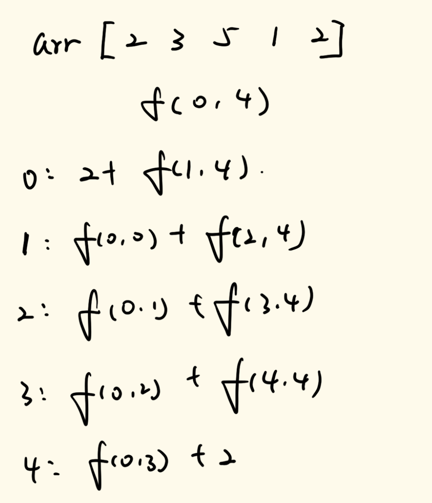
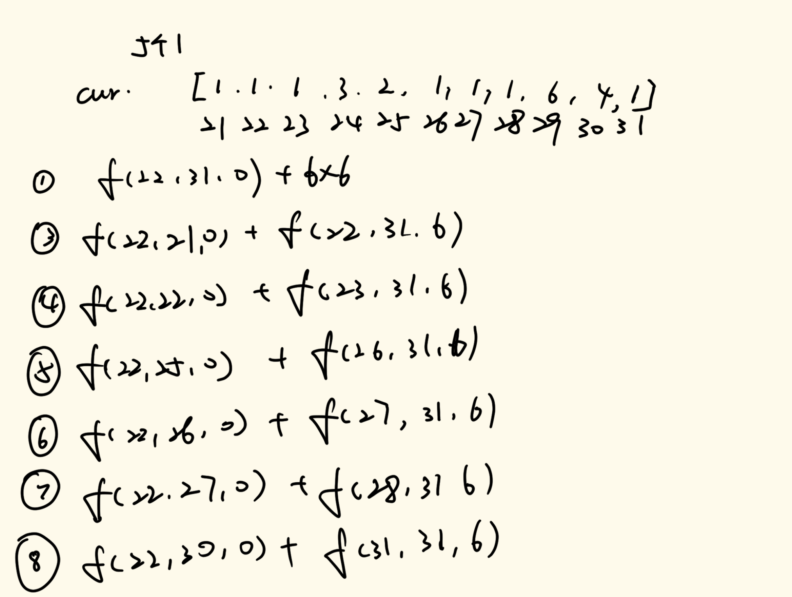
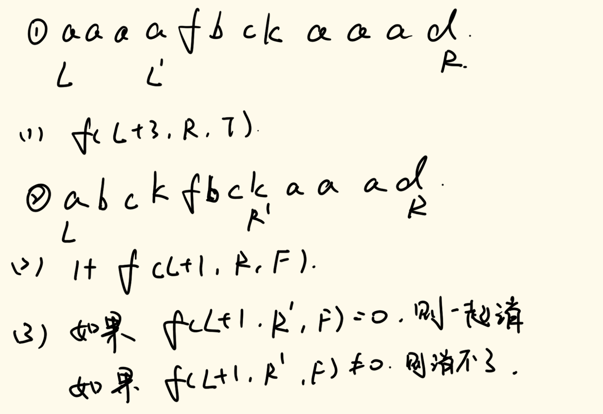
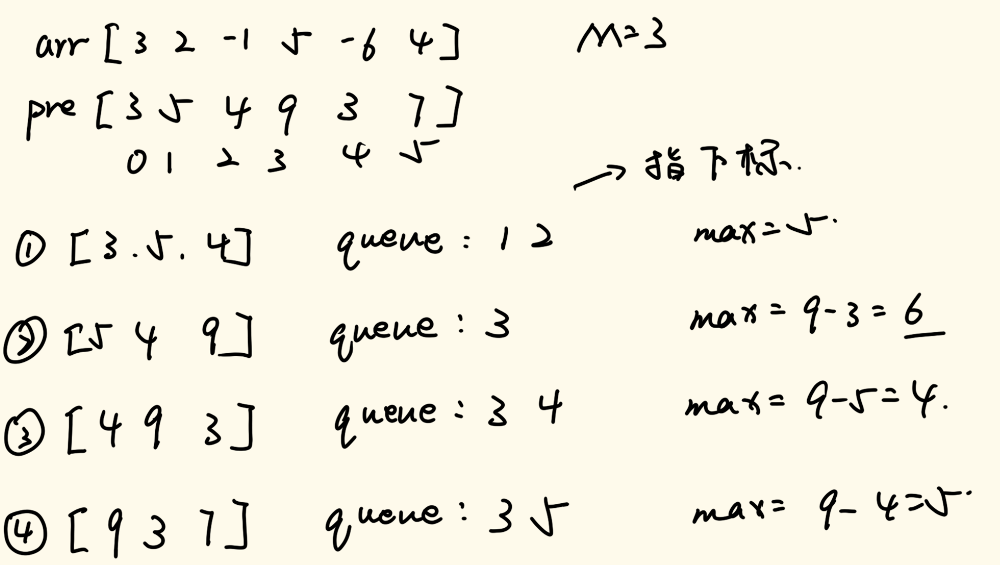

# 数据结构与算法

## 三十六、动态规划中和外部信息简化的相关

### 1、题目一

> 给定一个数组arr，代表一排有分数的气球。每打爆一个气球都能获得分数，假设打包气球的分数为X，获得分数的规则如下：
>
> 1. 如果被打爆气球的左边有没被打爆的气球，找到离被打爆气球最近的气球，假设分数为L；如果被打爆气球的右边有没被打爆的气球，找到离被打包气球最近的气球，假设分数为R。获得分数为L\*X\*R
> 2. 如果被打爆气球的左边有没被打爆的气球，找到离被打爆气球最近的气球，假设分数为L；如果被打爆气球的右边所有气球都已经被打爆。获得分数为L*X
> 3. 如果被打爆气球的左边所有的气球都已经被打爆；如果被打爆的气球右边有没被打爆的气球，找到离被打爆气球最近的气球，假设分数为R。获得分数X*R
> 4. 如果被打爆气球的左边和右边所有的气球都已经被打爆，获得分数X。
>
> 目标是打包所有气球，获得每次打爆的分数。通过选择打爆气球的顺序，可以得到不同的总分，请返回能获得的最大分数。

此题为LeetCode第312题：https://leetcode.cn/problems/burst-balloons

如果我们从之前课程中学到的动态规划方法来思考这个问题，我们能很容易的想到定义一个f(L,R)函数，其表示的意思是在L到R范围上获得的分数的最大是多少。但是这里就有一个问题，对于L到R上的最优得分是会受到L到R以外的元素影响的，如果我们把这个影响的因素添加到变量里面去，这个左边和右边的情况有些太多了，这样做不太合适（因为数组的长度最大为300，所以我们无法使用状态压缩来表示在这个范围上的状态）。

我们先来讲这道题的解法，之后我们在对这道题总结。

我们再次定义f(L,R)函数，它依旧表示L到R范围上获得的分数最大是多少，只不过这次我们有一个潜台词，即L-1和R+1位置上的气球没有被打爆。我们在进行递归调用的时候，每一种可能性以最后被打爆的气球进行调用。我们这里举一个例子：



我们看上面的例子，如果我们要求得最后的答案，我们需要调用f(0,4)函数，所以我们有以下几种可能性：

- 0位置为最后打爆的气球，那么其向下调用为2+f(1,4)
- 1位置为最后打爆的气球，那么其向下调用为f(0,0)+f(2,4)
- 2位置为最后打爆的气球，那么其向下调用为f(0,1)+f(3,4)
- 3位置为最后打爆的气球，那么其向下调用为f(0,2)+f(4,4)
- 4位置为最后打爆的气球，那么其向下调用为f(0,3)+2

这样我们就考虑到了所有的情况。

不过针对于代码的实现层面，我们需要处理边界问题，我们可以在数组的开头和结尾分别加个1，并且默认这两个位置的气球永远不被打爆，这样我们能省去很多边界判定问题。

具体实现代码如下：

```java
//暴力递归方式实现
public int maxCoins(int[] nums) {
    if (nums == null || nums.length == 0) {
        return 0;
    }
    if (nums.length == 1) {
        return nums[0];
    }
    int N = nums.length;
    int[] help = new int[N + 2];
    help[0] = 1;
    for (int i = 0; i < N; i++) {
        help[i + 1] = nums[i];
    }
    help[N + 1] = 1;
    return process(help, 1, N);
}
//L-1位置和R+1位置永远不越界，而且这两个位置的气球一定没有爆
//返回区间最大得分
public static int process(int[] arr, int L, int R) {
    if (L == R) {
        return arr[L - 1] * arr[L] * arr[R + 1];
    }
    //尝试每一种情况，最后打爆的气球是什么位置
    //第一种可能性
    int p1 = process(arr, L + 1, R) + arr[L - 1] * arr[L] * arr[R + 1];
    //第二种可能性
    int p2 = process(arr, L, R - 1) + arr[L - 1] * arr[R] * arr[R + 1];
    //取最大值
    int ans = Math.max(p1, p2);
    //其余的可能性
    for (int i = L + 1; i <= R - 1; i++) {
        int left = process(arr, L, i - 1);
        int right = process(arr, i + 1, R);
        int last = arr[L - 1] * arr[i] * arr[R + 1];
        int cur = last + left + right;
        ans = Math.max(ans, cur);
    }
    return ans;
}
```

当然，这个算法在LeetCode上肯定通过不了，所以我们下面按照惯例进行严格动态规划实现。

具体实现代码如下：

```java
//直接实现严格元素依赖的动态规划版本
public int maxCoins(int[] nums) {
    if (nums == null || nums.length == 0) {
        return 0;
    }
    if (nums.length == 1) {
        return nums[0];
    }
    int N = nums.length;
    int[] arr = new int[N + 2];
    arr[0] = 1;
    for (int i = 0; i < N; i++) {
        arr[i + 1] = nums[i];
    }
    arr[N + 1] = 1;
    int[][] dp = new int[N + 2][N + 2];
    //base case
    for (int i = 1; i <= N; i++) {
        dp[i][i] = arr[i - 1] * arr[i] * arr[i + 1];
    }
    //进行动态规划计算
    //这里我们要注意，L一定小于等于R，所以这个数组的下三角部分的值是无效的
    for (int L = N; L >= 1; L--) {
        for (int R = L + 1; R <= N; R++) {
            int p1 = dp[L + 1][R] + arr[L - 1] * arr[L] * arr[R + 1];
            //第二种可能性
            int p2 = dp[L][R - 1] + arr[L - 1] * arr[R] * arr[R + 1];
            //取最大值
            int ans = Math.max(p1, p2);
            //其余的可能性
            for (int i = L + 1; i <= R - 1; i++) {
                int left = dp[L][i - 1];
                int right = dp[i + 1][R];
                int last = arr[L - 1] * arr[i] * arr[R + 1];
                int cur = last + left + right;
                ans = Math.max(ans, cur);
            }
            dp[L][R] = ans;
        }
    }
    return dp[1][N];
}
```

所以我们在进行动态规划问题分析的时候，还是要注意尽可能地降低变量的定义复杂程度，如果无法降低复杂程度，我们就需要从每一次递归的外部入手，通过外部潜台词来解决变量复杂的问题。

这类问题只能多练习多想，最后的实现步骤是比较简单的，主要在于第一步的尝试方法上。

### 2、题目二

> 给出一些不同颜色的盒子 `boxes` ，盒子的颜色由不同的正数表示。
>
> 你将经过若干轮操作去去掉盒子，直到所有的盒子都去掉为止。每一轮你可以移除具有相同颜色的连续 `k` 个盒子（`k >= 1`），这样一轮之后你将得到 `k * k` 个积分。
>
> 返回你能获得的最大积分和 。

此题为LeetCode第546题：https://leetcode.cn/problems/remove-boxes

我们直接给出这道题的尝试方法。我们定义f(L, R, k)，L和R表示一个区间，k表示在L前面有k个数的值与L相同，函数表示消除掉在L到R区间以及前面k个数的最大的积分和是多少。

我们接下来分析所有的递归可能性，我们看下面的图例：

 

这个图例针对于上面的一个子数组进行了分析。

这个可能性分析的整体思路是：①为只选择21号元素进行组合去掉，其余的可能性都是选择数组当中的一个与1相等的数进行合并去掉计算。

通过这种可能性分析方法，我们就能得到暴力递归的解法。

具体实现代码如下：

```java
//第一个版本，暴力递归方法
//这个显然超时
public int removeBoxes(int[] boxes) {
    if (boxes == null || boxes.length == 0) {
        return 0;
    }
    return process1(boxes, 0, boxes.length - 1, 0);
}
public static int process1(int[] arr, int L, int R, int K) {
    if (L > R) {
        return 0;
    }
    int ans = process1(arr, L + 1, R, 0) + (K + 1) * (K + 1);
    for (int i = L + 1; i <= R; i++) {
        if (arr[i] == arr[L]) {
            ans = Math.max(ans, process1(arr, L + 1, i - 1, 0) + process1(arr, i, R, K + 1));
        }
    }
    return ans;
}
```

至于记忆化搜索版本，这里就不展示了，定义一个`dp[N][N][N]`进行存储重复调用的方法即可。

我们再次思考一下，对于我们上面举得例子里面，前面的1其实可以直接合并计算去除即可，没必要一个一个加进去试。在这基础上，对于我们选择这个数组中间的1，我们只需要选择连续部分的第一个1即可，也没比要都尝试一遍。

这样我们就讲这个算法优化到了最优的方案。

具体实现代码如下：

```java
//优化后的记忆化搜索版本
public int removeBoxes(int[] boxes) {
    if (boxes == null || boxes.length == 0) {
        return 0;
    }
    int N = boxes.length;
    int[][][] dp = new int[N][N][N];
    return process2(boxes, 0, N - 1, 0, dp);
}
public static int process2(int[] arr, int L, int R, int K, int[][][] dp) {
    if (L > R) {
        return 0;
    }
    if (dp[L][R][K] > 0) {
        return dp[L][R][K];
    }
    //找到最后一个与arr[L]相同的元素
    int last = L;
    while (last + 1 <= R && arr[last + 1] == arr[L]) {
        last++;
    }
    //pre为现在找到的与arr[L]值相同的个数
    int pre = K + last - L;
    //第一种可能性
    int ans = (pre + 1) * (pre + 1) + process2(arr, last + 1, R, 0, dp);
    for (int i = last + 2; i <= R; i++) { 
        //必须保证自己前一个元素的值不与arr[L]相同，这样能避免无意义的调用
        if (arr[i] == arr[L] && arr[i - 1] != arr[L]) {
            ans = Math.max(ans, process2(arr, last + 1, i - 1, 0, dp) + process2(arr, i, R, pre + 1, dp));
        }
    }
    dp[L][R][K] = ans;
    return ans;
}
```

### 3、题目三

> 如果一个字符相邻的位置没有相同字符，那么这个位置的字符出现不能被消掉
> 比如:"ab"，其中a和b都不能被消掉
> 如果一个字符相邻的位置有相同字符，就可以一起消掉
> 比如:"abbbc"，中间一串的b是可以被消掉的，消除之后剩下"ac"
> 某些字符如果消掉了，剩下的字符认为重新靠在一起
> 给定一个字符串，你可以决定每一步消除的顺序，目标是请尽可能多的消掉字符，返回最少的剩余字符数量
> 比如："aacca", 如果先消掉最左侧的"aa"，那么将剩下"cca"，然后把"cc"消掉，剩下的"a"将无法再消除，返回1
> 但是如果先消掉中间的"cc"，那么将剩下"aaa"，最后都消掉就一个字符也不剩了，返回0，这才是最优解。
> 再比如："baaccabb"，
> 如果先消除最左侧的两个a，剩下"bccabb"，如果再消除最左侧的两个c，剩下"babb"，最后消除最右侧的两个b，剩下"ba"无法再消除，返回2
> 而最优策略是：
> 如果先消除中间的两个c，剩下"baaabb"，如果再消除中间的三个a，剩下"bbb"，最后消除三个b，不留下任何字符，返回0，这才是最优解

我们使用上一题的对于dp数组的定义来解决这道题。

定义f(L, R, k)，其中k表示在L前是否有与L指向的值相等，为布尔类型，表示的含义为L到R之间通过消除最少还剩多少个字符。

我们同样通过图例来说明所有的递归可能性。 



上面的图例举了两个例子，在①中，如果L后面有连续的与自己相同的数，则遍历到右边，调用(1)即可

在②中，如果后面没有连续的与自己相同的数，我们可以直接调用(2)，表示这个元素我们不消去了，直接返回1让后面自己去消除

当然，如果数组当中后面有与自己相同的数，则调用(3)，看中间的部分能不能完全消去，如果不能完全消去，则当前自己这个方法返回1+这中间的部分剩余的字符出，如果可以消去，那么自己与后面的相同的元素就可以消去。

具体实现代码如下：

```java
//暴力递归解法
public static int restMin2(String s) {
    if (s == null) {
        return 0;
    }
    if (s.length() < 2) {
        return s.length();
    }
    char[] str = s.toCharArray();
    return process(str, 0, str.length - 1, false);
}
public static int process(char[] str, int L, int R, boolean has) {
    if (L > R) {
        return 0;
    }
    if (L == R) {
        return has ? 0 : 1;
    }
    int index = L;
    int K = has ? 1 : 0;
    while (index <= R && str[index] == str[L]) {
        K++;
        index++;
    }
    //注意这里的K的取值，如果K>1，则前面的值可以全部消除掉，如果不大于1，则没法消除，选哟
    int way1 = (K > 1 ? 0 : 1) + process(str, index, R, false);
    int way2 = Integer.MAX_VALUE;
    for (int split = index; split <= R; split++)  {
        //遍历后面的找到与str[L]的相同值的下标，如果是连续的取第一个，避免无意义的调用
        if (str[split] == str[L] && str[split] != str[split - 1]) {
            //看中间能不能完全消去，如果能完全消去，则可以进行合并消去
            if (process(str, index, split - 1, false) == 0) {
                way2 = Math.min(way2, process(str, split, R, K != 0));
            }
        }
    }
    return Math.min(way1, way2);
}
```

然后是记忆化搜索版本（动态规划版本不写了，写到这里可以了）：

```java
//优良的动态规划版本
public static int restMin3(String s) {
    if (s == null) {
        return 0;
    }
    if (s.length() < 2) {
        return s.length();
    }
    char[] str = s.toCharArray();
    int N = str.length;
    int[][][] dp = new int[N][N][2];
    //动态规划数组初始化
    for (int i = 0; i < N; i++) {
        for (int j = 0; j < N; j++) {
            for (int k = 0; k < 2; k++) {
                dp[i][j][k] = -1;
            }
        }
    }
    return dpProcess(str, 0, N - 1, false, dp);
}
public static int dpProcess(char[] str, int L, int R, boolean has, int[][][] dp) {
    if (L > R) {
        return 0;
    }
    int K = has ? 1 : 0;
    if (dp[L][R][K] != -1) {
        return dp[L][R][K];
    }
    int ans = 0;
    //如果现在只剩下一个元素，那么就看其前面是否有与其相同的元素
    //如果没有相同的元素，那么自己这个元素就单独在这里了
    //如果有相同的元素，则自己可以与前面的合并，就可以返回0
    if (L == R) {
        ans = (K == 0 ? 1 : 0);
    } else {
        int index = L;
        int all = K;
        //让index指向第一个与L上的元素不相同的位置
        while (index <= R && str[index] == str[L]) {
            all++;
            index++;
        }
        int way1 = (all > 1 ? 0 : 1) + dpProcess(str, index, R, false, dp);
        int way2 = Integer.MAX_VALUE;
        for (int split = index; split <= R; split++) {
            if (str[split] == str[L] && str[split] != str[split - 1]) {
                if (dpProcess(str, index, split - 1, false, dp) == 0) {
                    way2 = Math.min(way2, dpProcess(str, split, R, all > 0, dp));
                }
            }
        }
        ans = Math.min(way1, way2);
    }
    dp[L][R][K] = ans;
    return ans;
}
```

### 4、题目四

> 给定一个数组arr，和一个正数M
>
> 返回在arr的子数组在长度不超过M的情况下，最大的累加和

虽然在动态规划这里讲这道题，但是这道题最容易想到的方法是滑动窗口，如果忘记滑动窗口的话可以回去看滑动窗口的最大值或最小值更新结构那一节。

我们先计算这个数组的前缀和数组，然后进行滑动窗口的操作。   

我们通过图示举一个例子：



我们来一步一步解释这些步骤的含义：

1. 窗口首先包含前三个元素，这个时候根据窗口内最大值更新队列，队列会剩下1，2号元素，这个时候我们考虑的是以0为开头的数组的最长M长度的最大累加和，记录当前的结果为5
2. 窗口向右移动，这个时候窗口内最大值更新队列更新，队列会剩下3号元素，这个时候我们考虑的是以1为开头的数组的最长M长度的最大累加和，需要取出来的最大值减去窗口左端的值，记录当前的结果为9-3=6
3. 窗口向右移动，这个时候窗口内最大值更新队列更新，队列会剩下3，4号元素，这个时候我们考虑的是以2为开头的数组的最长M长度的最大累加和，需要取出来最大值减去窗口左端的值，记录当前的结果为9-5=4
4. ……

我们根据上面的过程，就可以写出解决这个问题的答案。

具体实现代码如下：

```java
//使用滑动窗口最大值更新结果来解决这个问题
public static int maxSum(int[] arr, int M) {
    if (arr == null || arr.length == 0 || M < 1) {
        return 0;
    }
    int N = arr.length;
    int[] sum = new int[N];
    sum[0] = arr[0];
    for (int i = 1; i < N; i++) {
        sum[i] = sum[i - 1] + arr[i];
    }
    LinkedList<Integer> qmax = new LinkedList<>();
    int i = 0;
    int end = Math.min(N, M);
    //先把前end个数放进队列当中
    for (; i < end; i++) {
        while (!qmax.isEmpty() && sum[qmax.peekLast()] <= sum[i]) {
            qmax.pollLast();
        }
        qmax.add(i);
    }
    int max = sum[qmax.peekFirst()];
    int L = 0;
    //这个时候i就为窗口最右端了
    for (; i < N; L++, i++) {
        if (qmax.peekFirst() == L) {
            qmax.pollFirst();
        }
        while (!qmax.isEmpty() && sum[qmax.peekLast()] <= sum[i]) {
            qmax.pollLast();
        }
        qmax.add(i);
        max = Math.max(max, sum[qmax.peekFirst()] - sum[L]);
    }
    //然后动L指针，减小最大长度，将最后几个元素进行计算
    for (; L < N - 1; L++) {
        //每挪动一个元素，都要看当前的元素是否还在队列当中
        if (qmax.peekFirst() == L) {
            qmax.pollFirst();
        }
        max = Math.max(max, sum[qmax.peekFirst()] - sum[L]);
    }
    return max;
}
```

### 5、哈夫曼树

哈夫曼树我们在贪心章节遇到过（就是那个分金条问题，如果忘记了就去看）。我们最终的分金条的最小代价就是通过哈夫曼树进行实现的。

不过我们这次要通过哈夫曼树实现哈夫曼编码，即根据每一个字符的出现频率来进行合适的编码，使得出现比较高频的数字编码长度较少。通过这样的方式，让每个字符通过编码来书写，这样的文章出现的0和1总量是最少的。

至于合并的过程，如果忘记了建议重新学习本科数据结构与算法内容，这里就不做描述了。我们重点关注代码如何书写。

具体实现代码如下：

```java
//根据文章str，生成词频统计表
public static HashMap<Character, Integer> countMap(String str) {
    HashMap<Character, Integer> ans = new HashMap<>();
    char[] s = str.toCharArray();
    for (char cha : s) {
        if (!ans.containsKey(cha)) {
            ans.put(cha, 1);
        } else {
            ans.put(cha, ans.get(cha) + 1);
        }
    }
    return ans;
}
//哈夫曼树节点
public static class Node {
    public int count;
    public Node left;
    public Node right;

    public Node(int count) {
        this.count = count;
    }
}
//写一个Node的比较器
public static class NodeComp implements Comparator<Node> {
    @Override
    public int compare(Node o1, Node o2) {
        return o1.count - o2.count;
    }
}
//生成哈夫曼编码表
public static HashMap<Character, String> huffmanForm(HashMap<Character, Integer> countMap) {
    HashMap<Character, String> ans = new HashMap<>();
    if (countMap.size() == 1) {
        for (char key : countMap.keySet()) {
            ans.put(key, "0");
        }
        return ans;
    }
    HashMap<Node, Character> nodes = new HashMap<>();
    PriorityQueue<Node> heap = new PriorityQueue<>(new NodeComp());
    //将所有的词频建立成节点和字符的对应关系，然后存放到nodes和小根堆当中
    for (Map.Entry<Character, Integer> entry : countMap.entrySet()) {
        Node cur = new Node(entry.getValue());
        char cha = entry.getKey();
        nodes.put(cur, cha);
        heap.add(cur);
    }
    //进行建堆操作
    while (heap.size() != 1) {
        Node a = heap.poll();
        Node b = heap.poll();
        Node h = new Node(a.count + b.count);
        h.left = a;
        h.right = b;
        heap.add(h);
    }
    //最后剩下的元素一定为最终的头节点
    Node head = heap.poll();
    //进行编码操作
    fillForm(head, "", nodes, ans);
    return ans;
}
//编码操作，这里用递归实现
public static void fillForm(Node head, String pre, HashMap<Node, Character> nodes, HashMap<Character, String> ans) {
    //如果当前遍历到的节点在nodes当中存在，那么就说明遍历到头了，这个时候将pre放进ans数组当中即可
    if (nodes.containsKey(head)) {
        ans.put(nodes.get(head), pre);
    } else {
        //注意，哈夫曼树除了叶子节点以外，所有节点都是有左右两个孩子的，如果上面的if没有拦住，这里的节点一定不是叶子节点，一定有左右两个孩子，不要担心指针指向空
        //如果向左跑，那么就加“0”
        fillForm(head.left, pre + "0", nodes, ans);
        //如果向右跑，那么就加"1"
        fillForm(head.right, pre + "1", nodes, ans);
    }
}
//编码操作
public static String huffmanEncode(String str, HashMap<Character, String> huffmanForm) {
    char[] s = str.toCharArray();
    StringBuilder builder = new StringBuilder();
    for (char cha : s) {
        builder.append(huffmanForm.get(cha));
    }
    return builder.toString();
}
//利用前缀树来实现哈夫曼编码的解码操作
//前缀树结构
public static class TireNode {
    public char value;
    public TireNode[] nexts;
    public TireNode() {
        value = 0;
        //因为每个节点向下只有0和1两种分支，所以这个定义两个单元即可
        nexts = new TireNode[2];
    }
}
//创建前缀树
public static TireNode creatTire(HashMap<Character, String> huffmanForm) {
    TireNode root = new TireNode();
    for (char key : huffmanForm.keySet()) {
        //获取每个字符串编码
        char[] path = huffmanForm.get(key).toCharArray();
        //开始进行对当前字符串建树
        TireNode cur = root;
        for (int i = 0; i < path.length; i++) {
            int index = path[i] == '0' ? 0 : 1;
            //如果接下来的元素没建立，那就建立一个
            if (cur.nexts[index] == null) {
                cur.nexts[index] = new TireNode();
            }
            //指向下一个节点
            cur = cur.nexts[index];
        }
        //到这里一定是一个触底节点了，给其附上value值
        cur.value = key;
    }
    return root;
}
//哈夫曼解码操作
public static String huffmanDecode(String huffmanEncode, HashMap<Character, String> huffmanForm) {
    //先创建前缀树
    TireNode root = creatTire(huffmanForm);
    TireNode cur = root;
    char[] encode = huffmanEncode.toCharArray();
    StringBuilder builder = new StringBuilder();
    //开始遍历整个编码字符串
    for (int i = 0; i < encode.length; i++) {
        //看当前的编码是什么
        int index = encode[i] == '0' ? 0 : 1;
        //根据编码走下一个位置
        cur = cur.nexts[index];
        //如果触底了，那么这个节点的value就是解码得到的字符
        if (cur.nexts[0] == null && cur.nexts[1] == null) {
            builder.append(cur.value);
            //编码找到一个之后直接返回头节点
            cur = root;
        }
    }
    return builder.toString();
}
```

