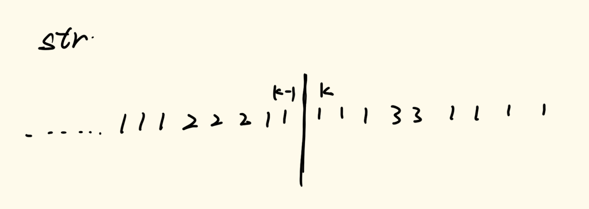
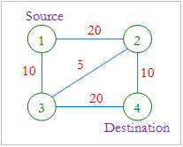
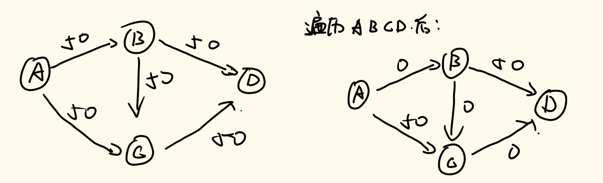
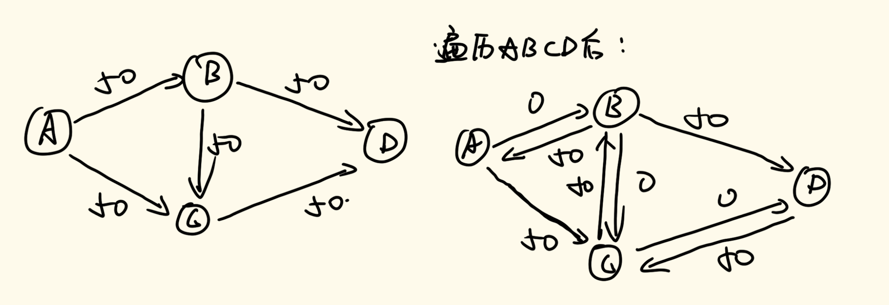
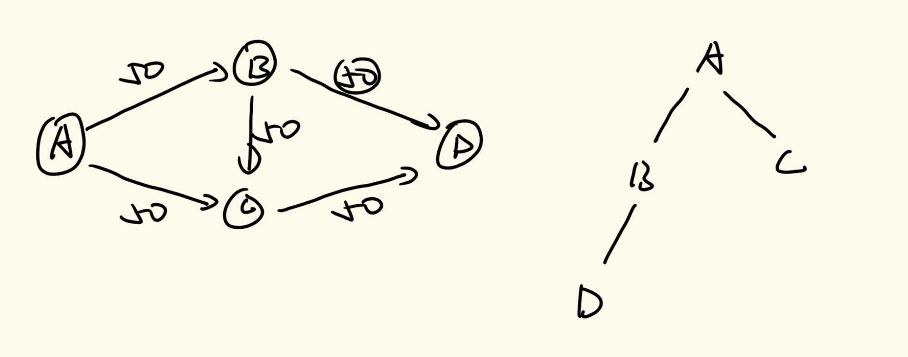
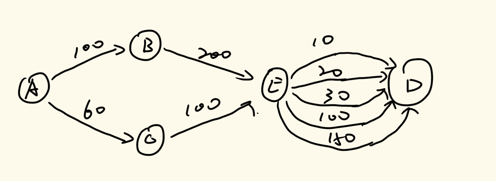

# 数据结构与算法

## 三十六、动态规划中和外部信息简化的相关

### 6、奇怪的打印机

> 有台奇怪的打印机有以下两个特殊要求：
>
> - 打印机每次只能打印由同一个字符组成的序列。
> - 每次可以在从起始到结束的任意位置打印新字符，并且会覆盖掉原来已有的字符。
>
> 给你一个字符串 `s` ，你的任务是计算这个打印机打印它需要的最少打印次数。

此题为LeetCode第664题：https://leetcode.cn/problems/strange-printer

我们定义f(L, R)，其表示为从L到R范围所有内从进行打印需要的最少打印次数是多少。 

我们这样来讨论所有的可能性：对于一个f(L, R)，我们一定是会粉刷L指向的元素的，我们在这个基础上，每一个位置我们都做分界线，表示我们将开头这个元素一直粉刷到这个分界线前，我们分别去调用f(L,K-1)和f(K, R)两种方法，这两种方法的总和就是当前方法的打印次数，遍历取最小即可。

具体实现代码如下：

```java
//暴力递归方法
//毫无意外的超时
public int strangePrinter(String s) {
    if (s == null || s.length() == 0) {
        return 0;
    }
    char[] str = s.toCharArray();
    return process1(str, 0, str.length - 1);
}

public static int process1(char[] str, int L, int R) {
    if (L == R) {
        return 1;
    }
    //假设每一个字符都是单独一次打印出来的
    int ans = R - L + 1;
    //分情况讨论
    for (int k = L + 1; k <= R; k++) {
        //注意最后减去的部分
        ans = Math.min(ans, process1(str, L, k - 1) + process1(str, k, R) - (str[L] == str[k] ? 1 : 0));
    }
    return ans;
}
```

对于上面在process部分的遍历分情况讨论中，每一次进行得到两个递归结果之后我们都需要减去后面这个可能存在的1。

我们通过图示来理解这个问题：



我们在进行讨论的前提是对于一个f(L, R)，它一定会将第一个字符进行粉刷，但是如果第一个字符与第k个字符是相同的，那么这个粉刷是可以合并在一起操作的，没必要分开进行操作，所以在相同的时候一定要减去这个1。

动态规划版本如下：

```java
public int strangePrinter(String s) {
    if (s == null || s.length() == 0) {
        return 0;
    }
    char[] str = s.toCharArray();
    int N = str.length;
    int[][] dp = new int[N][N];
    //初始化
    dp[N - 1][N - 1] = 1;
    for (int i = 0; i < N - 1; i++) {
        dp[i][i] = 1;
        //如果两个元素不相同，则必须打印两次
        dp[i][i + 1] = str[i] == str[i + 1] ? 1 : 2;
    }
    for (int L = N - 3; L >= 0; L--) {
        for (int R = L + 2; R < N; R++) {
            dp[L][R] = R - L + 1;
            for (int k = L + 1; k <= R; k++) {
                dp[L][R] = Math.min(dp[L][R], dp[L][k - 1] + dp[k][R] - (str[L] == str[k] ? 1 : 0));
            }
        }
    }
    return dp[0][N - 1];
}
```

### 7、还原数组的可能性

> 整型数组arr长度为n(3 <= n <= 10^4)，最初每个数字是<=200的正数且满足如下条件：
> 1. 0位置的要求：arr[0]<=arr[1] 
> 2. n-1位置的要求：arr[n-1]<=arr[n-2]
> 3. 中间i位置的要求：arr[i]<=max(arr[i-1],arr[i+1]) 
>
> 但是在arr有些数字丢失了，比如k位置的数字之前是正数，丢失之后k位置的数字为0
> 请你根据上述条件，计算可能有多少种不同的arr可以满足以上条件
> 比如 [6,0,9] 只有还原成 [6,9,9]满足全部三个条件，所以返回1，即[6,9,9]达标

这道题我们这样定义递归函数f(i, V, S)，其中i表示0\~i范围，V表示想把i位置的值变为V，S总共有三种值：0、1、2，分别代表之前在i+1上做的决定是大于、等于、小于V。这个函数所代表的含义就是当前在0\~i范围上进行变化，并且i位置想变成V，且i+1位置的值与i位置想变成的值V为S状态时的变法有多少种。

对于主函数，我们的调用为f(arr.length-1, arr[arr.length-1], 2)，因为我们必须保证题目中的第二条性质，所以必须默认最后一个元素的值是小于自己右边的值的。

我们下面看代码来理解所有的可能性递归方式以及base case。

具体实现代码如下：

```java
//初版暴力递归解法
public static int ways1(int[] arr) {
    if (arr == null || arr.length == 0) {
        return 0;
    }
    int N = arr.length;
    //如果不为0，那么就说明这个数是确定的，直接调用即可
    if (arr[N - 1] != 0) {
        return process1(arr, N - 1, arr[N - 1], 2);
    } else {
        //如果为0，那么这个数就是我们要遍历寻找的，所以定义一个变量来记录我们可以取到的值
        int ways = 0;
        for (int v = 1; v < 201; v++) {
            ways += process1(arr, N - 1, v, 2);
        }
        return ways;
    }
}

//整体上是一个深度优先搜索方法
public static int process1(int[] arr, int i, int v, int s) {
    if (i == 0) {
        //此时就剩最后一个位置了，对于0位置的数，左边的数是默认比他小的，右边的数必须大于等于它才行
        //如果说当前的数为0或者当前的数是没丢的，则可以直接返回1
        //否则返回0，说明这次深度搜索是不成立的
        return ((s == 0 || s == 1) && (arr[i] == 0 || v == arr[i])) ? 1 : 0;
    }
    if (arr[i] != 0 && v != arr[i]) {
        //如果当前的值没丢但是其值并不为当前i位置上的值
        //这说明这个调用是不成立的，返回0即可
        return 0;
    }
    //遍历到了下面，说明i位置的数是可以变成v的，接下来根据v和s来确定我们调用的下一个v是什么
    //先定义一个变量来记录答案
    int ways = 0;
    //右边的数大于等于v的情况
    //这个时候下一个数可以随意取，但是要注意与v之间的关系
    if (s == 0 || s == 1) {
        for (int pre = 1; pre < 201; pre++) {
            ways += process1(arr, i - 1, pre, pre < v ? 0 : (pre == v ? 1 : 2));
        }
    } else {
        //右边的数小于v的情况
        //这个时候进行下一步递归的时候，值必须大于等于v，否则当前是没法取v的
        for (int pre = v; pre < 201; pre++) {
            ways += process1(arr, i - 1, pre, pre == v ? 1 : 2);
        }
    }
    return ways;
}
```

我们进行可能性分析是这样设计的：因为我们不知道每一个位置他是否丢失，所以我们只能把所有的值遍历一遍，如果到了当前的位置，当前的位置的值为没丢失的话，那么递归上一步调用的值V与当前值相同的情况下，我们才能进行下一步调用，如果为丢失的话，当前位置则是可以取V的；当我们确定了这个位置可以填写v的时候（填写v有两种情况，一种是这个位置为丢失值的位置，可以填写v，一种是这个位置本身就是值v），我们需要根据s的值来判断我们如果填写下一个递归调用的v的值，下一步调用的v的值即取决于s，又取决于v；如果当前s为0或1的话，那么说明上一步的值是比当前填写的v的值要大（或者相等）的，所以下一个位置的值我们可以随便填写，但是要注意下一步的s，如果比v小，则填0，如果与v相等，填1，否则填2；如果当前s为2的话，那么说明上一步的值比当前填写的v的值要小，所以下一步的位置我们填写的值必须大于等于v，所以从v开始进行遍历填写即可。

对于base case，上面代码已经有所展示。如果当前遍历到的0位置，首先判断s，根据题意，0位置值的前面的值一定默认比自己小的，所以调用到0的时候s必须是0或1，表示上一个位置的值比0位置大（或者相等）；然后判断v，在0位置有两种情况，一种是0位置的值没有丢，一种是0位置的值丢了，所以我们需要进行判断。并且对于我们遍历过程中的任意一个元素，我们需要看当前位置丢没丢，如果丢了v的填写就可行，如果没丢，则需要看v是否与自己位置上的值相等，如果相等才可以继续下一步计算。

我们先在这个基础上改动态规划：

```java
public static int ways2(int[] arr) {
    if (arr == null || arr.length == 0) {
        return 0;
    }
    int N = arr.length;
    int[][][] dp = new int[N][201][3];
    //base case
    if (arr[0] != 0) {
        dp[0][arr[0]][0] = 1;
        dp[0][arr[0]][1] = 1;
    } else {
        for (int v = 1; v < 201; v++) {
            dp[0][v][0] = 1;
            dp[0][v][1] = 1;
        }
    }
    for (int i = 1; i < N; i++) {
        for (int v = 1; v < 201; v++) {
            for (int s = 0; s < 3; s++) {
                //只有值可以修改或者当前v与原数组值相等的时候，才可以进行操作
                if (arr[i] == 0 || v == arr[i]) {
                    //注意中间这一步的改进，非常关键
                    if (s == 0 || s == 1) {
                        for (int pre = 1; pre < v; pre++) {
                            dp[i][v][s] += dp[i - 1][pre][0];
                        }
                    }
                    dp[i][v][s] += dp[i - 1][v][1];
                    for (int pre = v + 1; pre < 201; pre++) {
                        dp[i][v][s] += dp[i - 1][pre][2];
                    }
                }
            }
        }
    }
    if (arr[N - 1] != 0) {
        return dp[N - 1][arr[N - 1]][2];
    } else {
        int ways = 0;
        for (int v = 1; v < 201; v++) {
            ways += dp[N - 1][v][2];
        }
        return ways;
    }
}
```

上面的动态规划就给出了这个算法的一个优化策略，对于任意一个f(i,v,s)，我们所需要依赖的值为f(i-1,v1,0)+f(i-1,v,1)+f(i-1,v2,2)，其中v1为所有比v小的值，v2为所有比v大的值。

不过这个优化的方法只是在代码层面上写简洁了，实际并没有将时间复杂度进行优化。但是这样为我们接下来进行优化打好了基础。

我们可以定义三个sum数组，分别为sum0，sum1，sum2，其分别代表在同一个i下，s=0、1、2的情况下，当前1\~v值的累加和是多少。我们举个简单的例子说明一下，现在我们计算f(7,90,0)的值，根据上面的优化我们可以将这个函数计算拆分成三个部分：f(6,v1,0)+f(6,90,1)+f(6,v2,2)，而sum0[v]就代表在0\~6这个范围上，s=0的情况下，当前1~v值的所有f调用得到的结果的总和，对于sum1和sum2同理。这样，我们就能利用这个前缀和数组来求解我们想要的所有的在当前i位置下的对应的所有v值的情况。

对于上面的三个sum数组，他们是统计的所有i-1位置的情况，然后来计算当前i位置的所有情况，所以我们每次计算下一种情况的时候，我们需要重新计算所有的sum数组。

具体实现代码如下：

```java
//优化过后的动态规划版本
public static int sum(int begin, int end, int relation ,int[][] presum) {
    return presum[end][relation] - presum[begin - 1][relation];
}

public static int ways3(int[] arr) {
    if (arr == null || arr.length == 0) {
        return 0;
    }
    int N = arr.length;
    int[][][] dp = new int[N][201][3];
    //base case
    if (arr[0] != 0) {
        dp[0][arr[0]][0] = 1;
        dp[0][arr[0]][1] = 1;
    } else {
        for (int v = 1; v < 201; v++) {
            dp[0][v][0] = 1;
            dp[0][v][1] = 1;
        }
    }
    //初始化presum数组，上面计算了base case，所以我们用i=0的位置进行初始化
    int[][] presum = new int[201][3];
    for (int v = 1; v < 201; v++) {
        for (int s = 0; s < 3; s++) {
            presum[v][s] = presum[v - 1][s] + dp[0][v][s];
        }
    }
    for (int i = 1; i < N; i++) {
        for (int v = 1; v < 201; v++) {
            for (int s = 0; s < 3; s++) {
                if (arr[i] == 0 || arr[i] == v) {
                    if (s == 0 || s == 1) {
                        dp[i][v][s] += sum(1, v - 1, 0, presum);
                    }
                    dp[i][v][s] += dp[i - 1][v][1];
                    dp[i][v][s] += sum(v + 1, 200, 2, presum);
                }
            }
        }
        //更新presum数组
        for (int v = 1; v < 201; v++) {
            for (int s = 0; s < 3; s++) {
                presum[v][s] = presum[v - 1][s] + dp[i][v][s];
            }
        }
    }
    if (arr[N - 1] != 0) {
        return dp[N - 1][arr[N - 1]][2];
    } else {
        //因为要返回的是一个累加和，且位置为i位置的所有累加和，所以直接用现有的presum来计算即可
        return sum(1, 200, 2, presum);
    }
}
```

### 8、Dinic算法

> 
>
> 在互联网上，机器（节点）是充分互连的，并且给定的一对节点之间可能存在许多路径。两个给定节点之间的总消息承载能力（带宽）是每单位时间可以从一个节点传输到另一个节点的最大数据量。使用一种称为数据包交换的技术；该数据可以同时沿多条路径传输。 例如，图中显示了一个具有四个节点（如圆圈所示）的网络，其中共有五个连接。每个连接都标有带宽，表示其每单位时间的数据承载能力。 在我们的示例中，节点 1 和节点 4 之间的带宽为 25，可以将其视为沿路径 1-2-4 的带宽 10、沿路径 1-3-4 的带宽 10 和沿路径 5 的带宽之和。路径 1-2-3-4。节点 1 和 4 之间的其他路径组合无法提供更大的带宽。 您必须编写一个程序，在给定网络中所有连接的单独带宽的情况下，计算网络中两个给定节点之间的带宽。在此问题中，假设连接的带宽在两个方向上始终相同（这在现实世界中不一定成立）。

这道题我们的第一感官是使用深度优先遍历来求解，当一条深度优先遍历结束后找到了一条最小的路径权值，然后让这条路径上的所有值全部减去这条最小的路径权值，然后在进行下一条路径的深度优先遍历，直到把所有的路径全部找到，然后做累加，最后得到答案。

但这样做会因为我们进行深搜选边的原因导致算法不成立。比如我们下面这个例子：



上面的例子可以很容易的看出传统的深度优先遍历在解决这个问题的弊端，即如果我们深搜的路径为ABCD这个路径，那么将这个路径遍历完成之后权值全部减去50，那么当我们再次从A开始出发遍历的时候，边的权值就不足以我们遍历下去了，这个时候我们得到的最大流结果是50，但其实这个图的结果为100。

我们可以在这个传统的深度优先遍历的基础上进行一个改进，在我们对边权值减少的情况下，我们补一个反向边，这个反向边的权值就是我们减去的权值，看下面这个图：



如果我们按照这种方法，以减去的权值大小补一个反向边，那么我们就能解决这个问题。当我们遍历完ABCD之后，我们再遍历ACBD，我们就能根据补上的权值边来进行计算，得到最终的答案100。

这个方案是Dinic算法中最重要的优化步骤。

Dinic算法还有两个优化。

第一个优化就是建立高度，让我们每一步往下推的高度尽可能地低。方案就是先进行广度优先遍历，建立一个数组，来记录每一个点到A的距离是多少。

我们可以拿上面的图举例，如果我们进行广度优先搜索，我们会建立下面这个遍历图：



于是我们就能通过这个遍历图来确定我们的数组值大小：[0, 1, 1, 2]，这个数组分别表示节点A到A,B,C,D的举例是多少。当我们进行算法遍历的时候，我们只遍历长度增长的节点，如果两个长度相等的节点之间有通路，我们不遍历。

第二个优化是针对于每一个节点的一个数组，记录着这个节点的出路线的所有边的权值被用去多少了。我们下面来举一个例子：



上述的例子展示了一个节点有多条权值边的情况。我们用一个数组cur[10, 20, 30, 100, 150]来记录这几条边的权值情况。现在我们从A开始遍历，A会因为自己的出路径的权值会先发来一个100大小流的任务，然后经过B之后，B的下一条路径为200，所以它可以完成100的任务，接着到E节点，E节点要完成100的任务，用到了10，20，30，和100权值路径的40的大小流的值，完成了从B传来的100任务，然后到达了D，这样就到达了最终的目的节点；而当A节点向C派发了60流大小的任务，这个时候他会像B一样将60大小的任务传给E，E就不必再从10权值的路径往下走了，可以直接从cur数组当中考虑前面减去的值进行考虑即可，在这个问题中，之前完成100路径的时候第四条权值的路径减完40后还剩60，刚好能完成60这个任务，然后回传给A节点。

这些概念比较抽象，但是我们看一看代码就能理解了。

具体实现代码如下：

```java
public static class Edge {
    //从哪个点来
    public int from;
    //到哪个点去
    public int to;
    //这条边还剩余的可用容载量
    public int available;

    public Edge(int from, int to, int available) {
        this.from = from;
        this.to = to;
        this.available = available;
    }
}
public static class Dinic {
    //有多少个点
    private int N;
    //记录每一个节点的出边在edges中的编号
    private ArrayList<ArrayList<Integer>> nexts;
    //所有的边
    //这里的所有的边包括所有的反向边，初始值都为0
    //对于所有边找到其反向边，只需要对边的下标大小异或上1即可。
    private ArrayList<Edge> edges;
    private int[] depth;
    private int[] cur;

    public Dinic(int nums) {
        //假设多一个点来处理
        //因为传入的值可能会比真实的点的个数少一个
        N = nums + 1;
        nexts = new ArrayList<>();
        for (int i = 0; i <= N; i++) {
            nexts.add(new ArrayList<>());
        }
        edges = new ArrayList<>();
        depth = new int[N];
        cur = new int[N];
    }

    //传入的参数：from，to以及权值
    public void addEdge(int u, int v, int r) {
        int m = edges.size();
        //建立正向边
        edges.add(new Edge(u, v, r));
        nexts.get(u).add(m);
        //建立反向边
        edges.add(new Edge(v, u, 0));
        nexts.get(v).add(m + 1);
    }

    //最大流算法
    public int maxFlow(int s, int t) {
        int flow = 0;
        //通过bfs，如果能从s到t，那么就算出一个流量出来
        //如果通过遍历发现到不了了，那么就跳出循环返回即可。
        while (bfs(s, t)) {
            Arrays.fill(cur, 0);
            //在dfs中，是会调整边的权值的，通过边的权值的调整，可能会使得bfs检查发现不可达
            flow += dfs(s, t, Integer.MAX_VALUE);
        }
        return flow;
    }

    private boolean bfs(int s, int t) {
        // depth[s] == 0    所以这里就不写了
        //宽度优先，一定要用队列来实现
        LinkedList<Integer> queue = new LinkedList<>();
        queue.addFirst(s);
        //记录遍历过的节点
        boolean[] visited = new boolean[N];
        visited[s] = true;
        while (!queue.isEmpty()) {
            //u就是当前节点
            int u = queue.pollLast();
            //在它所有的边中一个一个遍历
            for (int i = 0; i < nexts.get(u).size(); i++) {
                //在nexts数组当中获取到边号，再从edges数组当中获取到边
                Edge e = edges.get(nexts.get(u).get(i));
                //找到边的去向
                int v = e.to;
                //如果这条边没被遍历过，并且权值大于0，则说明可以遍历
                if (!visited[v] && e.available  > 0) {
                    //先调整visited数组对应的值
                    visited[v] = true;
                    //在调整depth数组的值，在前一个节点的基础上+1即可
                    depth[v] = depth[u] + 1;
                    queue.addFirst(v);
                }
            }
        }
        return visited[t];
    }

    //当前来到了s点，最终目标是t
    //r，收到的任务
    //返回值：收集到的流，flow <= r
    private int dfs(int s, int t, int r) {
        //当到达t的情况下，收到多少任务那就返回多少任务
        if (s == t || r == 0) {
            return r;
        }
        //记录单次dfs收集到的流
        int f = 0;
        //记录总收集到的流
        int flow = 0;
        //s从哪条边开始尝试
        for (; cur[s] < nexts.get(s).size(); cur[s]++) {
            //获取边和反向边
            int ei = nexts.get(s).get(cur[s]);
            Edge e = edges.get(ei);
            Edge o = edges.get(ei ^ 1);
            //看下一条边是否为bfs遍历的下一层
            //并且下发下去的任务最后是否完成了一定的量
            if (depth[e.to] == depth[s] + 1 && (f = dfs(e.to, t, Math.min(e.available, r))) != 0) {
                //调整节点权值
                e.available -= f;
                o.available += f;
                //调整收集到最大流 
                flow += f;
                r -= f;
                //如果当前任务完成了，直接break，后面的不用再看了
                if (r <= 0) {
                    break;
                }
            }
        }
        return flow;
    }
```


至此，我们的数据结构与算法体系学习班彻底完结！！！！！！
