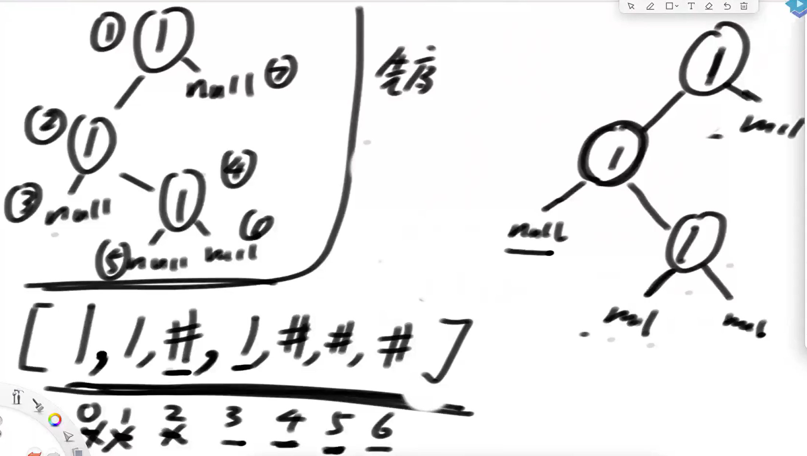

# 数据结构与算法

## 十一、二叉树

### 1、基本定义

结构描述：

```java
Class Node<V>{
    V value;
    Node left;
    Node right;
    public Node(V value){
        this.value = value;
    }
}
```

二叉树的遍历：

> 先序：任何子树的处理顺序都是，先头节点、再左子树、然后右子树
>
> 中序：任何子树的处理顺序都是，先左子树、再头节点、然后右子树
>
> 后序：任何子树的处理顺序都是，先左子树、再右子树、然后头节点

虽然定义了三种遍历顺序，但是我们可以头右左、右头左、右左头遍历，所以我们可以扩展到六种遍历顺序。

具体实现代码如下：

```java
public static class Node {
    public int value;
    public Node left;
    public Node right;
    public Node(int v) {
        value = v;
    }
}
public static void f(Node head) {
    if (head == null) {
        return;
    }
    // 1
    f(head.left);
    // 2
    f(head.right);
    // 3
}
// 先序打印所有节点
public static void pre(Node head) {
    if (head == null) {
        return;
    }
    System.out.println(head.value);
    pre(head.left);
    pre(head.right);
}
//中序遍历
public static void in(Node head) {
    if (head == null) {
        return;
    }
    in(head.left);
    System.out.println(head.value);
    in(head.right);
}
//后序遍历
public static void pos(Node head) {
    if (head == null) {
        return;
    }
    pos(head.left);
    pos(head.right);
    System.out.println(head.value);
}
```

当然这种递归算法有非递归的实现版本：

```java
public static class Node {
    public int value;
    public Node left;
    public Node right;
    public Node(int v) {
        value = v;
    }
}
//先序遍历
public static void pre(Node head) {
    System.out.print("pre-order: ");
    if (head != null) {
        Stack<Node> stack = new Stack<Node>();
        stack.push(head);
        while (!stack.isEmpty()) {
            head = stack.pop();
            System.out.print(head.value + " ");
            if (head.right != null) {
                stack.push(head.right);
            }
            if (head.left != null) {
                stack.push(head.left);
            }
        }
    }
    System.out.println();
}
//中序遍历
public static void in(Node cur) {
    System.out.print("in-order: ");
    if (cur != null) {
        Stack<Node> stack = new Stack<Node>();
        while (!stack.isEmpty() || cur != null) {
            //先是一股脑将所有左边界压入栈中
            if (cur != null) {
                stack.push(cur);
                cur = cur.left;
            } else {
                //从栈中弹出节点打印
                cur = stack.pop();
                System.out.print(cur.value + " ");
                //让节点右孩子成为cur
                cur = cur.right;
            }
        }
    }
    System.out.println();
}
//后序遍历
//通过头 右 左 遍历，利用两个栈来实现后序遍历
public static void pos1(Node head) {
    System.out.print("pos-order: ");
    if (head != null) {
        Stack<Node> s1 = new Stack<Node>();
        Stack<Node> s2 = new Stack<Node>();
        s1.push(head);
        while (!s1.isEmpty()) {
            head = s1.pop(); // 头 右 左
            s2.push(head);
            if (head.left != null) {
                s1.push(head.left);
            }
            if (head.right != null) {
                s1.push(head.right);
            }
        }
        // 左 右 头
        while (!s2.isEmpty()) {
            System.out.print(s2.pop().value + " ");
        }
    }
    System.out.println();
}
//这个算法要好好琢磨琢磨
public static void pos2(Node h) {
    System.out.print("pos-order: ");
    if (h != null) {
        Stack<Node> stack = new Stack<Node>();
        stack.push(h);
        Node c = null;
        while (!stack.isEmpty()) {
            c = stack.peek();
            if (c.left != null && h != c.left && h != c.right) {
                stack.push(c.left);
            } else if (c.right != null && h != c.right) {
                stack.push(c.right);
            } else {
                System.out.print(stack.pop().value + " ");
                h = c;
            }
        }
    }
    System.out.println();
}
```

一道面试题：

对于在一棵树上的某一个节点X，已知这棵树的先序遍历序列以及后序遍历序列，在这两个序列中，先序遍历X节点前的节点和后序遍历X节点后的节点的两个集合进行取交集运算，最后得到的节点一定是X的父节点，问为什么？

我们可以从X的角度出发把二叉树分为这样几个部分：X的所有父节点、X的右兄弟以及X的父节点的右兄弟、X的左兄弟以及X的父节点的左兄弟。根据先序遍历以及后序遍历的特征，我们可以知道先序遍历排在X之前的节点一定包括X的父节点以及X的左兄弟以及X的父节点的左兄弟，而后序遍历排在X之后的节点一定包括X的父节点以及X的有兄弟以及X的父节点的右兄弟，所以两个部分取交集，最后得到的一定是X的父节点。

按层遍历（使用队列实现）：

```java
public static class Node {
    public int value;
    public Node left;
    public Node right;

    public Node(int v) {
        value = v;
    }
}
public static void level(Node head) {
    if (head == null) {
        return;
    }
    Queue<Node> queue = new LinkedList<>();
    queue.add(head);
    while (!queue.isEmpty()) {
        Node cur = queue.poll();
        System.out.println(cur.value);
        if (cur.left != null) {
            queue.add(cur.left);
        }
        if (cur.right != null) {
            queue.add(cur.right);
        }
    }
}
```

### 2、实现二叉树的序列化和反序列化

序列化和反序列化的主要用途就是将一棵二叉树存入文件中。

在进行序列化的时候，我们可以使用先序遍历（或后续遍历、层序遍历）的方式来遍历二叉树，但是要注意，一个节点的左孩子和右孩子为空的时候一定要记录到遍历序列当中，这样我们就能通过遍历好的序列来恢复二叉树。



具体实现代码如下：

```java
public static class Node {
    public int value;
    public Node left;
    public Node right;

    public Node(int data) {
        this.value = data;
    }
}
//先序序列化
public static Queue<String> preSerial(Node head) {
    Queue<String> ans = new LinkedList<>();
    pres(head, ans);
    return ans;
}
public static void pres(Node head, Queue<String> ans) {
    if (head == null) {
        ans.add(null);
    } else {
        ans.add(String.valueOf(head.value));
        pres(head.left, ans);
        pres(head.right, ans);
    }
}
//后序序列化
public static Queue<String> posSerial(Node head) {
    Queue<String> ans = new LinkedList<>();
    poss(head, ans);
    return ans;
}
public static void poss(Node head, Queue<String> ans) {
    if (head == null) {
        ans.add(null);
    } else {
        poss(head.left, ans);
        poss(head.right, ans);
        ans.add(String.valueOf(head.value));
    }
}
//通过先序遍历反序列化
public static Node buildByPreQueue(Queue<String> prelist) {
    if (prelist == null || prelist.size() == 0) {
        return null;
    }
    return preb(prelist);
}
public static Node preb(Queue<String> prelist) {
    String value = prelist.poll();
    if (value == null) {
        return null;
    }
    Node head = new Node(Integer.valueOf(value));
    head.left = preb(prelist);
    head.right = preb(prelist);
    return head;
}
//通过后序遍历反序列化
public static Node buildByPosQueue(Queue<String> poslist) {
    if (poslist == null || poslist.size() == 0) {
        return null;
    }
    // 左右中  ->  stack(中右左)
    Stack<String> stack = new Stack<>();
    while (!poslist.isEmpty()) {
        stack.push(poslist.poll());
    }
    return posb(stack);
}
public static Node posb(Stack<String> posstack) {
    String value = posstack.pop();
    if (value == null) {
        return null;
    }
    Node head = new Node(Integer.valueOf(value));
    head.right = posb(posstack);
    head.left = posb(posstack);
    return head;
}
//层序遍历序列化
public static Queue<String> levelSerial(Node head) {
    Queue<String> ans = new LinkedList<>();
    if (head == null) {
        ans.add(null);
    } else {
        ans.add(String.valueOf(head.value));
        Queue<Node> queue = new LinkedList<Node>();
        queue.add(head);
        while (!queue.isEmpty()) {
            head = queue.poll(); // head 父   子
            if (head.left != null) {
                ans.add(String.valueOf(head.left.value));
                queue.add(head.left);
            } else {
                ans.add(null);
            }
            if (head.right != null) {
                ans.add(String.valueOf(head.right.value));
                queue.add(head.right);
            } else {
                ans.add(null);
            }
        }
    }
    return ans;
}
public static Node buildByLevelQueue(Queue<String> levelList) {
    if (levelList == null || levelList.size() == 0) {
        return null;
    }
    Node head = generateNode(levelList.poll());
    Queue<Node> queue = new LinkedList<Node>();
    if (head != null) {
        queue.add(head);
    }
    Node node = null;
    while (!queue.isEmpty()) {
        node = queue.poll();
        node.left = generateNode(levelList.poll());
        node.right = generateNode(levelList.poll());
        if (node.left != null) {
            queue.add(node.left);
        }
        if (node.right != null) {
            queue.add(node.right);
        }
    }
    return head;
}
public static Node generateNode(String val) {
    if (val == null) {
        return null;
    }
    return new Node(Integer.valueOf(val));
}
```

### 3、将n元树编码为二叉树

此题为`LeetCode`上第431题：https://leetcode.cn/problems/encode-n-ary-tree-to-binary-tree。

这道题其实就是将一颗多叉树转变为二叉树，即左孩子右兄弟的规律，将一棵树的孩子放在自己的左孩子处，将自己的兄弟放在右孩子处。对于根节点，如果不是森林，那么根节点是没有右孩子的。我们采用深度优先遍历的方式，不断地去建立左孩子，让每个节点先找到自己的孩子，自己的孩子建立好之后，在返回建立自己的右孩子，在返回到上层。

反编码过程与编码过程相似，也是做深度优先的遍历，优先找孩子，然后让孩子找完兄弟后再返回到自己，这样就能把自己的孩子都找到。

具体实现代码如下：

```java
// 提交时不要提交这个类
public static class Node {
    public int val;
    public List<Node> children;
    public Node() {
    }
    public Node(int _val) {
        val = _val;
    }
    public Node(int _val, List<Node> _children) {
        val = _val;
        children = _children;
    }
};
// 提交时不要提交这个类
public static class TreeNode {
    int val;
    TreeNode left;
    TreeNode right;

    TreeNode(int x) {
        val = x;
    }
}
// 只提交这个类即可
static class Codec {
    // Encodes an n-ary tree to a binary tree.
    public TreeNode encode(Node root) {
        if (root == null) {
            return null;
        }
        TreeNode head = new TreeNode(root.val);
        head.left = en(root.children);
        return head;
    }
    private TreeNode en(List<Node> children) {
        //head指向的是父节点的第一个孩子，cur则是帮助一个节点建立自己的兄弟
        TreeNode head = null;
        TreeNode cur = null;
        for (Node child : children) {
            TreeNode tNode = new TreeNode(child.val);
            if (head == null) {
                head = tNode;
            } else {
                cur.right = tNode;
            }
            cur = tNode;
            //这是在做深度优先遍历
            cur.left = en(child.children);
        }
        return head;
    }
    // Decodes your binary tree to an n-ary tree.
    public Node decode(TreeNode root) {
        if (root == null) {
            return null;
        }
        //返回根节点，将自己的左树作为参数进行递归
        return new Node(root.val, de(root.left));
    }
    public List<Node> de(TreeNode root) {
        //走右指针时不会弹出循环，但是走做指针时会进入到下一个递归，并且建立一个节点，完成while遍历后就会回到上一个递归
        //每一个递归建立在一个父节点上，循环内都是通过遍历二叉树的右节点找到这个父节点的孩子
        List<Node> children = new ArrayList<>();
        while (root != null) {
            Node cur = new Node(root.val, de(root.left));
            children.add(cur);
            root = root.right;
        }
        return children;
    }
}
```

### 4、打印函数

这个函数是一个福利函数，这里不去说明（反正面试不会去考）。

### 5、求二叉树最宽的层有多少个节点

 这道题通过题目我们就可以明确使用层序遍历的方式实现。不过二叉树每一层他不一定都是满的，所以我们在遍历的过程中引入机制，来记录当前遍历到了哪一层，并且这一层的节点数是多少。

通过每一层的节点，我们可以知道当前这一层的下一层节点的最后一个节点是什么，所以我们可以设置两个变量：`curend`以及`nextend`，并且将`curend`先设为1（第一层有且只能有一个节点），然后遍历每一层的元素，如果该元素有孩子，则将其序号靠后的元素记录在`nextend`上，当遍历的序号等于`curend`时，遍历完该节点之后将`nextend`赋值给`curend`，将`nextend`置为`null`，开启下一层的遍历。在每一层遍历的时候，记录当前层遍历的节点数，然后更新`max`即可。

具体实现代码如下：

```java
public static class Node {
    public int value;
    public Node left;
    public Node right;
    public Node(int data) {
        this.value = data;
    }
}
public static int maxWidthNoMap(Node head) {
    if (head == null) {
        return 0;
    }
    Queue<Node> queue = new LinkedList<>();
    queue.add(head);
    Node curEnd = head; // 当前层，最右节点是谁
    Node nextEnd = null; // 下一层，最右节点是谁
    int max = 0;
    int curLevelNodes = 0; // 当前层的节点数
    while (!queue.isEmpty()) {
        Node cur = queue.poll();
        if (cur.left != null) {
            queue.add(cur.left);
            nextEnd = cur.left;
        }
        if (cur.right != null) {
            queue.add(cur.right);
            nextEnd = cur.right;
        }
        curLevelNodes++;
        if (cur == curEnd) {
            max = Math.max(max, curLevelNodes);
            curLevelNodes = 0;
            curEnd = nextEnd;
        }
    }
    return max;
}
```

### 6、后继节点

> 二叉树结构如下定义：
>
> ```java
> class Node<V>{
>     V value;
>     Node left;
>     Node right;
>     Node parent;	//指向自己的父节点
> }
> ```
>
> 给你二叉树中的某个节点，返回该节点的后继节点。

根据该节点的位置特征，有如下几个情况

- 该节点有右树，那么他的中序遍历的后继节点一定是这棵右树的最左侧节点。
- 该节点无右树，那么他的中序遍历的后继节点就需要向上遍历，直到他的一个父节点为其父节点的左孩子时，这个节点的父节点就是后继节点。
- 在上一个基础上，如果找不到这样一个父节点，则无后继。

具体实现代码如下：

```java
public static class Node {
    public int value;
    public Node left;
    public Node right;
    public Node parent;
    public Node(int data) {
        this.value = data;
    }
}
public static Node getSuccessorNode(Node node) {
    if (node == null) {
        return node;
    }
    if (node.right != null) {
        return getLeftMost(node.right);
    } else { // 无右子树
        Node parent = node.parent;
        while (parent != null && parent.right == node) { // 当前节点是其父亲节点右孩子
            node = parent;
            parent = node.parent;
        }
        //如果没有后继节点，此时的parent一定为空
        //并且当满足第二个条件的时候，循环一定会跳出
        return parent;
    }
}
public static Node getLeftMost(Node node) {
    if (node == null) {
        return node;
    }
    while (node.left != null) {
        node = node.left;
    }
    return node;
}
```

### 7、纸张对折折痕问题

> 请把一张纸条竖着放在桌子上，然后从纸条的下边向上方对折一次，压出折痕后展开。此时折痕是凹下去的，即折痕突起的方向指向纸条的背面。如果从纸条的下边向上连续对折2次，压出折痕后展开，此时有三条折痕，从上到下依次是下折痕、下折痕和上折痕。
>
> 给定一个输入参数N，代表纸条都从下边向上方连续对折N次。请从上到下打印所有折痕的方向。
>
> 例如：`N = 1`时，打印：`down`；`N = 2`时，打印：`down down up`

我们可以通过一张纸条来模拟这样一种情况，前两次对折在题目中有说明，我们可以直接看第三次对折。第三次对折的结果，我们可以看到，在第二次对折的两条折痕的上方和下方分别出现了一个下折痕一个上折痕，所以我们可以推断，当折痕折到N次时，会在N-1次出现的折痕的上方和下方分别出现一个下折痕和上折痕。

由此，我们可以将其构成一棵二叉树，二叉树的每一层都是这一次对折产生的结果，其结果就是上一层的每一个节点的左孩子和右孩子分别是下折痕和上折痕，对其进行中序遍历，就是我们最后想要的结果。

如果去生成这个完全二叉树的话，我们会发现这棵二叉树的规律：

- 头节点是下折痕
- 所有左子树的头都是下折痕
- 所有右子树的头都是上折痕

具体实现代码如下：

```java
public static void printAllFolds(int N) {
    process(1, N, true);
    System.out.println();
}
// 当前你来了一个节点，脑海中想象的！
// 这个节点在第i层，一共有N层，N固定不变的
// 这个节点如果是凹的话，down = T
// 这个节点如果是凸的话，down = F
// 函数的功能：中序打印以你想象的节点为头的整棵树！
public static void process(int i, int N, boolean down) {
    if (i > N) {
        return;
    }
    process(i + 1, N, true);
    System.out.print(down ? "凹 " : "凸 ");
    process(i + 1, N, false);
}
```

### 8、判断二叉树是否是完全二叉树

同样是使用层序遍历的方法，遍历时分为以下几种情况：

- 如果一个节点只有右孩子没有左孩子，则不是完全二叉树
- 遍历过程中当第一次遇到左右孩子不双全的时候，剩下的节点都必须是叶子节点。

具体实现代码如下：

```java
public static class Node {
    public int value;
    public Node left;
    public Node right;
    public Node(int data) {
        this.value = data;
    }
}
public static boolean isCBT1(Node head) {
    if (head == null) {
        return true;
    }
    LinkedList<Node> queue = new LinkedList<>();
    // 是否遇到过左右两个孩子不双全的节点
    boolean leaf = false;
    Node l = null;
    Node r = null;
    queue.add(head);
    while (!queue.isEmpty()) {
        head = queue.poll();
        l = head.left;
        r = head.right;
        if (
            // 如果遇到了不双全的节点之后，又发现当前节点不是叶节点
            (leaf && (l != null || r != null)) 
            || 
            (l == null && r != null)   //有右无左
        ) {
            return false;
        }
        //层序遍历
        if (l != null) {
            queue.add(l);
        }
        if (r != null) {
            queue.add(r);
        }
        if (l == null || r == null) {
            leaf = true;
        }
    }
    return true;
}
```

### 9、二叉树的递归套路

#### ①给定一棵二叉树的头节点head，返回这棵二叉树是不是平衡二叉树

平衡二叉树需要判断每个节点的左树右树高度之差是否大于1，所以我们需要递归的找到每一个节点的左树右树的高度以及自己的左树右树是否平衡。

具体实现代码如下：

```java
public static class Node {
    public int value;
    public Node left;
    public Node right;
    public Node(int data) {
        this.value = data;
    }
}
public static boolean isBalanced2(Node head){
    return process2(head).isBalanced;
}
//用来保存递归信息
public static class Info{
    public boolean isBalanced;
    public int height;

    public Info(boolean isBalanced, int height){
        this.isBalanced = isBalanced;
        this.height = height;
    }
}
//递归操作
public static Info process2(Node x){
    if (x == null){
        return new Info(true, 0);
    }
    //递归找到自己左树右树的信息
    Info leftInfo = process2(x.left);
    Info rightInfo = process2(x.right);

    //这里一定要记住+1
    int height = Math.max(leftInfo.height, rightInfo.height) + 1;
    boolean isBalanced = true;
    if (!leftInfo.isBalanced || !rightInfo.isBalanced){
        isBalanced = false;
    }
    if (Math.abs(leftInfo.height - rightInfo.height) > 1){
        isBalanced = false;
    }
    return new Info(isBalanced, height);
}
```

#### ②判断二叉树是否是搜索二叉树

同样的，我们需要递归找到每个节点的左树右树是否满足搜索二叉树条件。

具体实现代码如下：

```java
public static class Node{
    public int value;
    public Node left;
    public Node right;

    public Node(int value){
        this.value = value;
    }
}
public static class Info{
    public boolean isBST;
    public int max;
    public int min;

    public Info(boolean isBST, int max, int min){
        this.isBST = isBST;
        this.max = max;
        this.min = min;
    }
}
public static boolean isBST2(Node head){
    if (head == null){
        return true;
    }
    return process(head).isBST;
}
public static Info process(Node x){
    if (x == null){
        return null;
    }
    Info leftInfo = process(x.left);
    Info rightInfo = process(x.right);
    int max = x.value;
    int min = x.value;
    if (leftInfo != null){
        max = Math.max(max, leftInfo.max);
        min = Math.min(min, leftInfo.min);
    }
    if (rightInfo != null){
        max = Math.max(max, rightInfo.max);
        min = Math.min(min, rightInfo.min);
    }
    boolean isBST = true;
    if ((leftInfo != null && !leftInfo.isBST) || (rightInfo != null && !rightInfo.isBST)){
        isBST = false;
    }
    if ((leftInfo != null && leftInfo.max >= x.value) || (rightInfo != null && rightInfo.min <= x.value)){
        isBST = false;
    }
    return new Info(isBST,max,min);
}
```

#### ③返回整棵二叉树的最大距离

> 给定一棵二叉树的头节点`head`，任何两个节点之间都存在距离，返回整棵二叉树的最大距离。

这里分为两种情况：

- 当前最大距离与x无关
  - x左树上的最大距离
  - x右树上的最大距离
- 当前最大距离与x有关
  - x左树最大距离
  - x右树最大距离
  - x左树与x最远+x右树与x最远（即左树高度+右树高度）

所以我们需要对`info`提出两个要求：每个子树的最大距离 & 每个子树的高度

具体实现代码如下：

```java
public static class Info{
    public int maxDistance;
    public int height;
    public Info(int maxDistance, int height){
        this.maxDistance = maxDistance;
        this.height = height;
    }
}
public static int maxDistance2(Node head){
    return process(head).maxDistance;
}
public static Info process(Node x){
    if (x == null){
        return new Info(0,0);
    }
    Info leftInfo = process(x.left);
    Info rightInfo = process(x.right);
    int height = Math.max(leftInfo.height, rightInfo.height) + 1;
    int p1 = leftInfo.maxDistance;
    int p2 = rightInfo.maxDistance;
    int p3 = leftInfo.height + rightInfo.height + 1;
    int maxDistance = Math.max(Math.max(p1, p2), p3);
    return new Info(maxDistance, height);
}
```

#### ④判断一棵树是不是满二叉树

满二叉树的节点个数为2^h^-1。

具体实现代码如下：

```java
public static boolean isFull1(Node head) {
    if (head == null) {
        return true;
    }
    Info1 all = process1(head);
    return (1 << all.height) - 1 == all.nodes;
}
public static class Info1 {
    public int height;
    public int nodes;
    public Info1(int h, int n) {
        height = h;
        nodes = n;
    }
}
public static Info1 process1(Node head) {
    if (head == null) {
        return new Info1(0, 0);
    }
    Info1 leftInfo = process1(head.left);
    Info1 rightInfo = process1(head.right);
    int height = Math.max(leftInfo.height, rightInfo.height) + 1;
    int nodes = leftInfo.nodes + rightInfo.nodes + 1;
    return new Info1(height, nodes);
}
```

#### ⑤返回最大的搜索二叉子树

针对遍历的每个节点，有如下两种情况：

- x不做头
  - 左`maxBSTSize`
  - 右`maxBSTSize`
- x做头
  - 左树是否为BST
  - 右树是否为BST
  - 左树max < x
  - 右树min > x
  - 左树大小
  - 右树大小

具体实现代码如下：

```java
public static int maxSubBSTSize2(Node head){
    if (head == null){
        return 0;
    }
    return process(head).maxBSTSubtreeSize;
}

public static class Info{
    public int maxBSTSubtreeSize;
    public int allSize;
    public int max;
    public int min;
    public Info(int maxBSTSubtreeSize, int allSize, int max, int min){
        this.allSize = allSize;
        this.max = max;
        this.min = min;
        this.maxBSTSubtreeSize = maxBSTSubtreeSize;
    }
}

public static Info process(Node x){
    if (x == null){
        return null;
    }
    Info leftInfo = process(x.left);
    Info rightInfo = process(x.right);

    int max = x.value;
    int min = x.value;
    int allSize = 1;
    if (leftInfo != null){
        max = Math.max(leftInfo.max, max);
        min = Math.min(leftInfo.min, min);
        allSize += leftInfo.allSize;
    }
    if (rightInfo != null){
        max = Math.max(leftInfo.max, max);
        min = Math.min(leftInfo.min, min);
        allSize += leftInfo.allSize;
    }
    int p1 = -1;
    int p2 = -1;
    if (leftInfo != null){
        p1 = leftInfo.maxBSTSubtreeSize;
    }
    if (rightInfo != null){
        p2 = rightInfo.maxBSTSubtreeSize;
    }

    int p3 = -1;
    boolean leftBST = leftInfo == null ? true : (leftInfo.maxBSTSubtreeSize == leftInfo.allSize);
    boolean rightBST = rightInfo == null ? true : (rightInfo.maxBSTSubtreeSize == rightInfo.allSize);
    if (leftBST & rightBST){
        boolean leftMaxLessX = leftInfo == null ? true : (leftInfo.max < x.value);
        boolean rightMinMoreX = rightInfo == null ? true : (rightInfo.min  > x.value);
        if (leftMaxLessX & rightBST){
            int leftSize = leftInfo == null ? 0 : leftInfo.allSize;
            int rightSize = rightInfo == null ? 0 : rightInfo.allSize;
            p3 = leftSize + rightSize + 1;
        }
    }

    int maxBSTSubtreeSize = Math.max(Math.max(p1, p2), p3);


    return new Info(maxBSTSubtreeSize, allSize, max, min);

}
```

#### ⑥总结

这种方法，时间复杂度为`O(n)`。

套路总结：

- 假设以X节点为头，假设可以向X左树和X右树要任何信息。
- 在上一步的假设下，讨论以X为头节点的树，得到答案的可能性（最重要）。
- 列出所有可能性后，确定到底需要向左树和右树要什么样的信息。
- 把左树信息和右树信息求全集，就是任何一棵子树都需要返回的信息S。
- 递归函数都返回S，每一棵子树都这么要求。
- 写代码，在代码中考虑如何把左树的信息和右树信息整合出整棵树的信息。

这种方法可以解决面试中绝大多数的二叉树问题尤其是树型`dp`问题。本质是利用递归遍历二叉树的便利性。

#### ⑦判断是否是完全二叉树

之前我们使用了层序遍历的方式实现了判断，这次我们可以尝试通过递归套路来解决。

如果一个节点下面为完全二叉树，那么他会满足以下条件：

- 左树为满二叉树，右树为满二叉树，高度相同
- 左树为完全二叉树，右树为满二叉树，左树高度比右树高度大1
- 左树为满二叉树，右树为满二叉树，左树高度比右树高度大1
- 左树为满二叉树，右树为完全二叉树，高度相同

所以我们确定Info中需要定义的变量为：是否为完全二叉树`isCBT`、是否为满二叉树`isFull`、子树高度`height`。

具体实现代码如下：

```java
public static boolean isCompleteTree2(TreeNode head){
    return process(head).isCBT;
}
public static class Info{
    public boolean isFull;
    public boolean isCBT;
    public int height;
    public Info(boolean isFull, boolean isCBT, int height){
        this.isCBT = isCBT;
        this.isFull = isFull;
        this.height = height;
    }
}
public static Info process(TreeNode x){
    if (x == null){
        return new Info(true, true, 0);
    }
    Info leftInfo = process(x.left);
    Info rightInfo = process(x.right);
    int height = Math.max(leftInfo.height, rightInfo.height) + 1;
    boolean isFull = leftInfo.isFull && rightInfo.isFull && leftInfo.height == rightInfo.height;
    boolean isCBT = false;
    //可能性1
    if (isFull){
        isCBT = true;
    }
    //可能性2
    if (leftInfo.isCBT && rightInfo.isFull && leftInfo.height == rightInfo.height + 1){
        isCBT =true;
    }
    //可能性3
    if (leftInfo.isFull && rightInfo.isFull && leftInfo.height == rightInfo.height + 1){
        isCBT =true;
    }
    //可能性4
    if (leftInfo.isFull && rightInfo.isCBT && leftInfo.height == rightInfo.height){
        isCBT =true;
    }
    return new Info(isFull, isCBT, height);
}
```

#### ⑧最小祖先问题

> 给定一棵二叉树的头节点head，和另外两个节点a和b，返回a和b的最低公共祖先。

我们可以思考，假设当前递归遍历到x节点，我们需要的信息是：

- 是否发现了a
- 是否发现了b
- 是否发现了最低公共祖先

所以我们在遍历到x节点后分为这两种大情况

- 汇聚点与x无关
  - a与b已经在左树汇聚
  - a与b已经在右树汇聚
  - a和b不全
- 汇聚点与x有关
  - 左树发现了a、b中的一个
  - 右树发现了另一个
  - x本身就是a(b)节点，然后在左树或右树发现了b(a)

具体实现代码如下：

```java
public static Node lowestAncestor2(Node head, Node o1, Node o2){
    return process(head, o1, o2).ans;
}
public static class Info{
    public boolean findA;
    public boolean findB;
    public Node ans;
    public Info(boolean findA, boolean findB, Node ans){
        this.findA = findA;
        this.findB = findB;
        this.ans = ans;
    }
}
public static Info process(Node x, Node a, Node b){
    if (x == null){
        return new Info(false, false, null);
    }
    Info leftInfo = process(x.left, a, b);
    Info rightInfo = process(x.right, a, b);
    boolean findA = (x == a) || leftInfo.findA || rightInfo.findA;
    boolean findB = (x == b) || leftInfo.findB || rightInfo.findB;
    Node ans = null;
    if (leftInfo.ans != null){
        ans = leftInfo.ans;
    }else if (rightInfo.ans != null){
        ans = rightInfo.ans;
    }else {
        if (findA && findB){
            ans = x;
        }
    }
    return new Info(findA, findB, ans);
}
```

#### ⑨派对的最大快乐值

> 员工信息的定义如下:
> class Employee {
>     public int happy; // 这名员工可以带来的快乐值
>     List<Employee> subordinates; // 这名员工有哪些直接下级
> }
> 公司的每个员工都符合 Employee 类的描述。整个公司的人员结构可以看作是一棵标准的、 没有环的多叉树
> 树的头节点是公司唯一的老板，除老板之外的每个员工都有唯一的直接上级
> 叶节点是没有任何下属的基层员工(subordinates列表为空)，除基层员工外每个员工都有一个或多个直接下级
> 这个公司现在要办party，你可以决定哪些员工来，哪些员工不来，规则：
> 1.如果某个员工来了，那么这个员工的所有直接下级都不能来
> 2.派对的整体快乐值是所有到场员工快乐值的累加
> 3.你的目标是让派对的整体快乐值尽量大
> 给定一棵多叉树的头节点boss，请返回派对的最大快乐值。

假定递归遍历到x的时候：

- x来
  - `x.happy`+其他节点不来的情况下的`happy`
- x不来
  - max{某个节点来，某个节点不来}所有节点总和

具体实现代码如下：

```java
public static int maxHappy2(Employee head){
    Info ans = process(head);
    return Math.max(ans.yes, ans.no);
}
public static class Info{
    public int no;
    public int yes;

    public Info(int no, int yes){
        this.no = no;
        this.yes = yes;
    }
}
public static Info process(Employee x){
    if (x == null){
        return new Info(0, 0);
    }
    int no = 0;
    int yes = x.happy;
    for (Employee employee : x.subordinates){
        Info nextInfo = process(employee);
        no += Math.max(nextInfo.no, nextInfo.yes);
        yes += nextInfo.no;
    }
    return new Info(no, yes);
}
```

