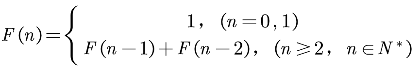

# 数据结构与算法

## 十五、暴力递归与动态规划

### 1、暴力递归

暴力递归就是尝试

1. 把问题转化为规模缩小了的同类问题的子问题
2. 有明确的不需要继续进行递归的条件
3. 有当得到了子问题的结果之后的决策过程
4. 不记录每一个子问题的解

#### ①Hanoi问题

> 相传在古印度圣庙中，有一种被称为汉诺塔(Hanoi)的游戏。该游戏是在一块铜板装置上，有三根杆(编号A、B、C)，在A杆自下而上、由大到小按顺序放置64个金盘(如图1)。游戏的目标：把A杆上的金盘全部移到C杆上，并仍保持原有顺序叠好。操作规则：每次只能移动一个盘子，并且在移动过程中三根杆上都始终保持大盘在下，小盘在上，操作过程中盘子可以置于A、B、C任一杆上。


我们假设现在在A杆上有三个圆盘，三个圆盘从上到下从小变大，现在如果我们将这三个盘子移动到C杆，且不改变相对顺序，我们可以通过以下步骤来进行：

- A杆 -> C杆
- A杆 -> B杆
- C杆 -> B杆
- A杆 -> C杆
- B杆 -> A杆
- B杆 -> C杆
- A杆 -> C杆

通过这样的步骤，就能实现将三个盘子移动到C杆当中。

我们通过上面的步骤，我们可以将这个问题拆分为三个大步骤：

- 将最底部圆盘的上方N-1个圆盘移动到B杆
- 将最底部圆盘移动到C杆
- 再将B杆上N-1个圆盘移动到C杆

当然，第一步将N-1个圆盘移动到B杆又要分三个大步骤：

- 将最底部圆盘的上方N-1个圆盘移动到C杆
- 将最底部圆盘移动到B杆
- 再将C杆上的N-1个圆盘移动到B杆

所以，我们通过进一步分析，我们需要六个递归函数形式：

- 从A到C
- 从A到B
- 从B到A
- 从B到C
- 从C到A
- 从C到B

具体实现代码如下：

```java
public static void hanoi1(int n) {
    leftToRight(n);
}
//从A到C
public static void leftToRight(int n) {
    if (n == 1) { // base case
        System.out.println("Move 1 from left to right");
        return;
    }
    leftToMid(n - 1);
    System.out.println("Move " + n + " from left to right");
    midToRight(n - 1);
}
//从A到B
public static void leftToMid(int n) {
    if (n == 1) {
        System.out.println("Move 1 from left to mid");
        return;
    }
    leftToRight(n - 1);
    System.out.println("Move " + n + " from left to mid");
    rightToMid(n - 1);
}
//从C到B
public static void rightToMid(int n) {
    if (n == 1) {
        System.out.println("Move 1 from right to mid");
        return;
    }
    rightToLeft(n - 1);
    System.out.println("Move " + n + " from right to mid");
    leftToMid(n - 1);
}
//从B到C
public static void midToRight(int n) {
    if (n == 1) {
        System.out.println("Move 1 from mid to right");
        return;
    }
    midToLeft(n - 1);
    System.out.println("Move " + n + " from mid to right");
    leftToRight(n - 1);
}
//从B到A
public static void midToLeft(int n) {
    if (n == 1) {
        System.out.println("Move 1 from mid to left");
        return;
    }
    midToRight(n - 1);
    System.out.println("Move " + n + " from mid to left");
    rightToLeft(n - 1);
}
//从C到B
public static void rightToLeft(int n) {
    if (n == 1) {
        System.out.println("Move 1 from right to left");
        return;
    }
    rightToMid(n - 1);
    System.out.println("Move " + n + " from right to left");
    midToLeft(n - 1);
}
```

这种方法虽然很复杂，但是很具备启发性（。。。。。。）。

我们现在把A杆、B杆、C杆忘掉。因为我们每一步操作都在借用到其他杆，例如从A到B，我们一定是用到C杆的，所以我们可以将这三个杆抽象为：from、to、other。所以每一步我们就可以抽象为下面这个步骤：

- 将from杆上的最底盘上方的N-1个盘移动到other杆上，利用到to杆
- 将from最底盘移动到to杆上
- 将other杆上的N-1个盘移动到to杆上，利用到from杆

我们将这个问题抽象化，就能简化这个问题的代码量。

具体实现代码如下：

```java
public static void hanoi2(int n) {
    if (n > 0) {
        func(n, "left", "right", "mid");
    }
}
public static void func(int N, String from, String to, String other) {
    if (N == 1) { // base
        System.out.println("Move 1 from " + from + " to " + to);
    } else {
        func(N - 1, from, other, to);
        System.out.println("Move " + N + " from " + from + " to " + to);
        func(N - 1, other, to, from);
    }
}
```

虽然这个代码量少，但是在执行时所花费的时间与上面没有差异。

当然这个问题可以用非递归解决，但是在这里我们主要讲述的就是暴力递归。

#### ②打印一个字符串的全部子序列

 注意，这不是连续子序列。

我们可以假定每一个元素要或者不要，来决定组成什么样的子序列

具体实现代码如下：

```java
public static List<String> subs(String s) {
    char[] str = s.toCharArray();
    String path = "";
    List<String> ans = new ArrayList<>();
    process1(str, 0, ans, path);
    return ans;
}
// str 固定参数
// 来到了str[index]字符，index是位置
// str[0..index-1]已经走过了！之前的决定，都在path上
// 之前的决定已经不能改变了，就是path
// str[index....]还能决定，之前已经确定，而后面还能自由选择的话，
// 把所有生成的子序列，放入到ans里去
public static void process1(char[] str, int index, List<String> ans, String path) {
    if (index == str.length) {
        ans.add(path);
        return;
    }
    // 没有要index位置的字符
    process1(str, index + 1, ans, path);
    // 要了index位置的字符
    process1(str, index + 1, ans, path + String.valueOf(str[index]));
}
```

#### ③打印一个字符串的全部子序列，要求不要出现重复字面值的子序列

这个相对于上一步需要加入一个去重操作，使用java中的`HashSet`能完美解决这个问题。

具体实现代码如下：

```java
public static List<String> subsNoRepeat(String s) {
    char[] str = s.toCharArray();
    String path = "";
    //使用HashSet来存储结果
    HashSet<String> set = new HashSet<>();
    process2(str, 0, set, path);
    List<String> ans = new ArrayList<>();
    //最后把结果加到list当中去
    for (String cur : set) {
        ans.add(cur);
    }
    return ans;
}
public static void process2(char[] str, int index, HashSet<String> set, String path) {
    if (index == str.length) {
        set.add(path);
        return;
    }
    String no = path;
    process2(str, index + 1, set, no);
    String yes = path + String.valueOf(str[index]);
    process2(str, index + 1, set, yes);
}
```

#### ④打印一个字符串的全部排列

这个问题我们可以用一种纯暴力的递归方法实现，将字符串转为字符数组之后，每选择一个字符就将其递归到下一个选择，最后组成排列，当递归到字符串上限的时候，将当前字符串结果添加到结果序列当中即可。

具体代码实现如下：

```java
public static List<String> permutation1(String s){
    List<String> ans = new ArrayList<>();
    if (s == null || s.isEmpty()){
        return ans;
    }
    char[] str = s.toCharArray();
    ArrayList<Character> rest = new ArrayList<>();
    for (char cha : str){
        rest.add(cha);
    }
    String path = "";
    f(rest, path, ans);

    return ans;
}
//暴力递归，几乎全部遍历一遍
public static void f(ArrayList<Character> rest, String path, List<String> ans){
    if (rest.isEmpty()){    //base case
        ans.add(path);
    }else {
        int N = rest.size();
        for (int i = 0; i < N; i++) {
            char cur = rest.remove(i);
            f(rest, path + cur, ans);
            rest.add(i, cur);   //恢复现场
        }
    }
}
```

这里介绍一种深度优先遍历的一种算法，通过交换来解决这个问题。（要仔细思考）

我们可以设置一个对每个位置的字符的遍历索引index，我们遍历每个字符串的位置，每个位置都可以遍历的与大于等于自己下标的位置进行交换，每次交换过后，我们递归调用下一个位置，让下一个位置也进行同样的操作，递归调用完成后，将现场恢复即可，当我们深度递归调用到最后一个字符串位置的时候，此时形成的字符数组就是我们要的一个排列。

具体代码实现如下：

```java
public static List<String> permutation2(String s){
    List<String> ans = new ArrayList<>();
    if (s == null || s.isEmpty()){
        return ans;
    }
    char[] str = s.toCharArray();
    g(str, 0, ans);
    return ans;
}
//深度优先遍历，通过交换来得到所有排列
//针对于str字符数组，每一个交换结果都会保留在str本身
public static void g(char[] str, int index, List<String> ans){
    //当没得换的时候，就直接加到答案里面去
    if (index == str.length){
        ans.add(String.valueOf(str));
    }else {
        for (int i = index; i < str.length; i++) {
            swap(str, index, i);
            g(str, index + 1, ans);
            swap(str, index, i);    //恢复现场
        }
    }
}
private static void swap(char[] str, int i, int j) {
    char temp = str[i];
    str[i] = str[j];
    str[j] = temp;
}
```

#### ⑤打印一个字符串的全部排列，要求不要出现重复的排列

因为ASCII码总共有256个，所以我们可以定义一个`boolean`类型的变量数组来监控这256个元素，当深度遍历到某个元素，找后面的元素与其交换的时候，与其交换的元素与他本身相同，则不要去交换。

具体实现代码如下：

```java
public static List<String> permutation3(String s){
    List<String> ans = new ArrayList<>();
    if (s == null || s.isEmpty()){
        return ans;
    }
    char[] str = s.toCharArray();
    g2(str, 0, ans);
    return ans;
} 
//深度优先遍历，通过交换来得到所有排列
//针对于str字符数组，每一个交换结果都会保留在str本身
public static void g2(char[] str, int index, List<String> ans){
    //当没得换的时候，就直接加到答案里面去
    if (index == str.length){
        ans.add(String.valueOf(str));
    }else {
        //ASCII码总共256位，所以定义256大小
        //对每一个字符进行监控，看看之前是否遇到过
        boolean[] visited = new boolean[256];
        for (int i = index; i < str.length; i++) {
            if (!visited[str[i]]){
                //将其置为true之后，如果之后仍然遇到了该元素，则跳过
                visited[str[i]] = true;
                swap(str, index, i);
                g2(str, index + 1, ans);
                swap(str, index, i);    //恢复现场
            }
        }
    }
}
```

#### ⑥使用递归逆序栈

> 给定一个栈，请逆序这个栈，不能申请额外的数据结构，只能使用递归函数。

不多说，直接看代码（这个代码要仔细去读）。

具体代码实现如下：

```java
public static void reverse(Stack<Integer> stack) {
    if (stack.isEmpty()) {
        return;
    }
    //拿到栈底元素
    int i = f(stack);
    //递归去拿
    reverse(stack);
    stack.push(i);
}
// 栈底元素移除掉
// 上面的元素盖下来
// 返回移除掉的栈底元素
public static int f(Stack<Integer> stack) {
    //用result将弹出栈的元素保存
    int result = stack.pop();
    if (stack.isEmpty()) {
        //栈为空则说明result为栈底元素
        return result;
    } else {
        //如果没到栈底元素，就递归找到栈底元素
        int last = f(stack);
        //把当前元素入栈
        stack.push(result);
        //将栈底元素向上返回
        return last;
    }
}
```

### 2、暴力递归到动态规划

#### ①斐波那契数列



如果我们通过暴力递归的方式，代码是这样的：

```java
public static int f(int n){
    if (n == 0 || n == 1){
        return 1;
    }
    return f(n - 1) + f(n - 2);
}

public static int f2(int n){
    int[] dp = new int[n + 1];
    dp[0] = 1;
    dp[1] = 1;
    for (int i = 2; i <= n; i++){
        dp[i] = dp[i - 1] + dp[i - 2];
	}
    return dp[n];
}
```

我们可以去看，如果说n=6，那么他需要递归调用f(5)以及f(4)，调用f(5)一定会去调用f(4)以及f(3)，调用f(4)一定会调用f(3)以及f(2)…。我们会发现一个问题，f(4)、f(3)等会重复调用，重复计算，这是比较浪费时间的。

动态规划虽然有很复杂的一套理论，但是究其根本，就是拿空间换时间，我们将计算过的f(4)、f(3)等通过一个表保存起来，之后调用到的时候就直接从表里拿，而不需要重新进行计算，这样计算效率就会得到提高。

#### ②机器人走路

> 假设有排成一行的N个位置记为1~N，N一定大于或等于2
> 开始时机器人在其中的M位置上(M一定是1~N中的一个)
> 如果机器人来到1位置，那么下一步只能往右来到2位置；
> 如果机器人来到N位置，那么下一步只能往左来到N-1位置；
> 如果机器人来到中间位置，那么下一步可以往左走或者往右走；
> 规定机器人必须走K步，最终能来到P位置(P也是1~N中的一个)的方法有多少种
> 给定四个参数 N、M、K、P，返回方法数

我们先从暴力递归的方法开始。

具体实现代码如下：

```java
public static int way1(int N, int start, int aim, int K){
    return process1(start, K, aim, N);
}
//机器人当前来到的位置是cur
//机器人还有rest步需要去走
//最终的目标是aim
//返回：机器人从cur出发，走过rest步之后，最终停在aim的方法数，是多少？
public static int process1(int cur, int rest, int aim ,int N){
    if (rest == 0){ //base case
        return cur == aim ? 1 : 0;
    }
    //rest > 0，还有步数要走
    if (cur == 1){
        return process1(2, rest - 1, aim, N);
    }
    if (cur == N){
        return process1(N - 1, rest - 1, aim, N);
    }
    return process1(cur + 1, rest - 1, aim, N) + process1(cur - 1, rest - 1, aim, N);
}
```

暴力递归的策略很简单，从最初的位置出发，将下一个位置以及剩余的步数作为传入值，返回值为从当前位置出发，走过剩余步数之后，最终停留在目的地的方法数是多少。当步数走完之后，到达位置即可向上传递1。

我们思考一下，在这个递归函数当中，目标值以及位置数是不变的，唯一变动的就是当前节点值以及剩余的步数。现在我们假设开始位置为7，目标位置为13，步数为10，那么在递归调用的过程中，如果我们递归的时候，必然会调用到(8,9)、(6,9)，(8,9)递归会调用(7,8)、(10,8)，(6,9)递归会调用(7,8)、(5,8)，这时候我们就会发现重复调用的方法了，所以这就是我们动态规划要优化的地方。

所以，我们就可以将递归调用过的函数缓存。

具体实现代码如下：

```java
public static int way2(int N, int start, int aim, int K){
    int[][] dp = new int[N + 1][K + 1];
    for (int i = 0; i <= N; i++) {
        for (int j = 0; j <= K; j++) {
            dp[i][j] = -1;
        }
    }
    //dp就是缓存表
    //process2(cur, rest)之前没算过！dp[cur][rest] == -1
    //dp[cur][rest] != -1，那么说明process2(cur, rest)算过，其值就为该方法调用的返回值
    return process2(start, K, aim, N, dp);
}
public static int process2(int cur, int rest, int aim ,int N, int[][] dp){
    if (dp[cur][rest] != -1){
        return dp[cur][rest];
    }
    int ans = 0;
    if (rest == 0){ //base case
        ans = cur == aim ? 1 : 0;
    }else if (cur == 1){
        ans = process2(2, rest - 1, aim, N, dp);
    }else if (cur == N){
        ans =  process2(N - 1, rest - 1, aim, N, dp);
    }else {
        ans = process2(cur + 1, rest - 1, aim, N, dp) + process2(cur - 1, rest - 1, aim, N, dp);
    }
    dp[cur][rest] = ans;
    return ans;
}
```

这种方法也叫记忆化搜索，也叫从顶向下的动态规划。

我们还可以进行进一步优化。

我们定义了一个`dp`数组，来存储递归调用过后的结果。我们可以把这个数组用图列出来：


我们可以将目光盯到第0列，列标代表的是rest，即剩余步数，第0列就为当剩余步数为0的时候，到达aim的距离，我们假定aim为4，这个时候第0列除了行号为4的位置为1以外，别的位置都是0，此时这个表就会变成这样：


我们看第一次实现的暴力递归的算法，我们会发现，行号为1的每一个位置都会依赖于自己左下角的那个数组元素，行号为N的每一个位置都会依赖于自已左上角的元素，而中间几行的元素会共同依赖于自己左上角和左下角的元素。就像这样：


所以我们就可以从第一列开始将元素填充，就像这样：


而这个表，就代表着以aim为目标点的从所有位置出发到aim的路径的个数。

这个数据就是动态规划数组，动态规划是一个结果而不是原因，这种通过暴力递归写出基本的尝试，然后对这种递归过程做分析，找到可以缓存的元素，分析每一个元素之间的关系（即位置依赖），而这个尝试策略就是我们动态规划中讲到的“状态转移方程”。

所以我们就可以通过这个尝试策略找到状态转移方程，然后就可以得到这道题的最终的优化版本（真正的动态规划）。


具体实现代码如下：

```java
public static int way3(int N, int start, int aim, int K){
    int[][] dp = new int[N + 1][K + 1];
    dp[aim][0] = 1; //java中初始化的数组数值全是0，所以只需要改这一个值就可以了，不过C/C++必须要将这一列进行初始化
    //先遍历列再遍历行
    for (int rest = 1; rest <= K; rest++) {
        dp[1][rest] = dp[2][rest - 1];
        for (int cur = 2; cur <= N - 1; cur++){
            dp[cur][rest] = dp[cur + 1][rest - 1] + dp[cur - 1][rest - 1];
        }
        dp[N][rest] = dp[N - 1][rest - 1];
    }
    return dp[start][K];
}
```

#### ③左右拿牌

> 给定一个整型数组`arr`，代表数值不同的纸牌排成一条线
> 玩家A和玩家B依次拿走每张纸牌
> 规定玩家A先拿，玩家B后拿
> 但是每个玩家每次只能拿走最左或最右的纸牌
> 玩家A和玩家B都绝顶聪明
> 请返回最后获胜者的分数

这道题要注意，虽然A和B只能拿最左或者最右的牌，但是中间的牌他们都是知道的，所以他们不会因为一时的左小右大或者左大右小去贪图短暂的便宜。例如数组[50,100,20,10]，如果A先拿50的话，B就会直接拿100，这样就算A后续拿到了20，最终他也不会获胜，所以A的策略从全局看一定是先拿10，这样B就不可能会获得100，A就会获得最终的胜利，返回值就是110。

我们现在假设一个函数`f(arr,L,R)`，代表先手在L到R上拿牌，获得的最好分数是多少。在这个方法中，当L == R的时候，此时就剩一张牌，你只能拿这一张牌；在其他情况下，我们会有两种选择：拿左边的牌和拿右边的牌，当我们拿了左边的牌或者右边的牌之后，我们还需要直到自己后手会拿的最佳分数是多少，两种情况肯定取最大值。我们假设后手函数为`g(arr,L,R)`，表示以后手的姿态拿牌。在这个方法中，当L==R的时候，你不能拿这张牌；在其他情况下，我们也会有两种情况：对手会拿左侧的牌和右侧的牌，当对手拿完牌之后，我们需要针对对方的两种情况，对剩下的牌执行先手函数，确定自己的最佳分数是多少，不过这总情况下是对手在拿牌，所以我们只能接受这两种情况的最小值。

具体实现代码如下：

```java
public static int win1(int[] arr){
    if (arr == null || arr.length == 0){
        return 0;
    }
    int AScore = f(arr, 0, arr.length - 1);
    int BScore = g(arr, 0, arr.length - 1);
    return Math.max(AScore, BScore);
}
//arr[L...R]，先手获得的最好分数返回
public static int f(int[] arr, int L, int R){
    if (L == R){
        return arr[L];
    }
    int p1 = arr[L] + g(arr, L + 1, R);
    int p2 = arr[R] + g(arr, L, R - 1);
    return Math.max(p1, p2);
}
//arr[L...R]，后手获得的最好分数返回
public static int g(int[] arr, int L, int R){
    if (L == R){
        return 0;
    }
    int p1 = f(arr, L + 1, R);  //对手拿走了L位置的数
    int p2 = f(arr, L, R - 1);  //对手拿走了R位置的数
    return Math.min(p2, p1);
}
```

我们通过这个思路，找到了暴力递归的解决方法。接下来，我们和上一题一样，用具体例子找到对一个方法的重复调用。

我们举一个简单的例子：假设一个数组，范围为0~7，这个时候我们先手函数一定会调用f(0,7)（这里忽略掉`arr`，因为自始至终`arr`不变，不会对递归函数结果产生影响），调用f(0,7)就会调用g(1,7)和g(0,6)，调用这两个函数就会调用f(1,6)和f(2,7)、f(0,5)和f(1,6)，这里发现了重复调用的过程，所以我们就可以通过缓存的方式来优化这个算法。

具体实现代码如下：

```java
public static int win2(int[] arr){
    if (arr == null || arr.length == 0){
        return 0;
    }
    int N = arr.length;
    //使用两张表做缓存，一个是先手表，一个是后手表
    int[][] fmap = new int[N][N];
    int[][] gmap = new int[N][N];
    for (int i = 0; i < N; i++) {
        for (int j = 0; j < N; j++) {
            fmap[i][j] = -1;
            gmap[i][j] = -1;
        }
    }
    int AScore = f2(arr, 0, arr.length - 1, fmap, gmap);
    int BScore = g2(arr, 0, arr.length - 1, fmap, gmap);
    return Math.max(AScore, BScore);
}

public static int f2(int[] arr, int L, int R, int[][] fmap, int[][] gmap){
    if (fmap[L][R] != -1){
        return fmap[L][R];
    }
    int ans = 0;
    if (L == R){
        ans = arr[L];
    }else {
        int p1 = arr[L] + g2(arr, L + 1, R, fmap, gmap);
        int p2 = arr[R] + g2(arr, L, R - 1, fmap, gmap);
        ans = Math.max(p1, p2);
    }
    fmap[L][R] = ans;
    return ans;
}
public static int g2(int[] arr, int L, int R, int[][] fmap, int[][] gmap){
    if (gmap[L][R] != -1){
        return gmap[L][R];
    }
    int ans = 0;
    if (L == R){
        ans = 0;
    }else {
        int p1 = f2(arr, L + 1, R, fmap, gmap);  //对手拿走了L位置的数
        int p2 = f2(arr, L, R - 1, fmap, gmap);  //剁手拿走了R位置的数
        ans = Math.min(p1, p2);
    }
    gmap[L][R] = ans;
    return ans;
}
```

我们接下来看元素之间的关系依赖：

我们可以像刚才一样，画两张表：`fmap`表和`gmap`表。我们由暴力递归的base case可以直到，`fmap`表的对角线上的元素就是数组下标对应的元素；`gmap`表的对角线元素全是0。由于R >= L，所以对角线下方的元素全部都是无效的。我们依旧可以根据暴力递归当中的递归函数求解过程，`fmap`中的元素需要依赖与`gmap`中的元素，`gmap`中的元素需要依赖`fmap`中的元素，我们可以得到下面的状态转移方程：


具体实现代码如下：

```java
public static int win3(int[] arr){
    if (arr == null || arr.length == 0){
        return 0;
    }
    int N = arr.length;
    int[][] fmap = new int[N][N];
    int[][] gmap = new int[N][N];
    for (int i = 0; i < N; i++) {
        fmap[i][i] = arr[i];
    }
    for (int starCol = 1; starCol < N; starCol++){
        int row = 0;
        int col = starCol;
        while (col < N){
            fmap[row][col] = Math.max(arr[row] + gmap[row + 1][col], arr[col] + gmap[row][col - 1]);
            gmap[row][col] = Math.min(fmap[row + 1][col], fmap[row][col - 1]);
            row++;
            col++;
        }
    }
    return Math.max(fmap[0][N-1], gmap[0][N-1]);
}
```

#### ④背包问题

> 给定两个长度都为N的数组`weights`和`values`，`weights[i]`和`values[i]`分别代表 `i`号物品的重量和价值
> 给定一个正数`bag`，表示一个载重`bag`的袋子，装的物品不能超过这个重量
> 返回能装下的最大价值

这道题是一个典型的从左往右模型问题。

如果我们暴力枚举这个数据，即0号货物两种情况，1号货物两种情况，2号货物两种情况……，通过枚举的方式我们肯定能得到最优的答案（就类似于一个二叉树）。

具体实现代码如下：

```java
//所有的货，重量和价值，都在w和v数组里
//为了方便，其中没有负数
//bag背包容量，不能超过这个载重
//返回：不超重的情况下能够得到的最大价值
public static int maxValue(int[] w, int[] v, int bag){
    if (w == null || v == null || w.length != v.length || w.length == 0){
        return 0;
    }
    //尝试函数
    return process(w, v, 0, bag);
}
//当前考虑到了index号货物，index...所有的货物可以自由选择
//做的选择不能超过背包容量
public static int process(int[] w, int[] v, int index, int bag){
    if (bag < 0){
        return -1;
    }
    if (index == w.length){
        return 0;
    }
    //这个货物不选的情况下
    int p1 = process(w, v, index + 1, bag);
    //这个货物选的情况下
    int p2 = 0;
    int next = process(w, v, index + 1, bag - w[index]);
    if (next != -1){
        p2 = v[index] + next;
    }
    return Math.max(p1, p2);
}
```

我们这里直接跳过设立缓存的过程，直接找元素之间的关联。

我们定义`dp`二维数组，横坐标为`index`号货物，纵坐标为背包剩余容量`rest`，每一个数组元素代表着当前从`index`货物考虑到最后货物的最大价值。由于当`index == w.length`时，返回值为0，所以数组的最后一列全部为0，根据暴力递归的选择策略，我们就可以从下往上依次推算出数组中所有的结果，最后返回`dp[0][bag]`。

具体实现代码如下：

```java
public static int dp(int[] w, int[] v, int bag){
    if (w == null || v == null || w.length != v.length || w.length == 0){
        return 0;
    }
    int N = w.length;
	//dp数组
    int[][] dp = new int[N + 1][bag + 1];
    for (int index = N - 1 ;index >= 0; index--){
        for(int rest = 0; rest <= bag; rest++){
            //拿当前货物的情况
            int p1 = dp[index + 1][rest];
            //不拿当前货物的情况
            int p2 = 0;
            int next = rest - w[index] < 0 ? -1 : dp[index + 1][rest - w[index]];
            if (next != -1){
                p2 = v[index] + next;
            }
            dp[index][rest] = Math.max(p1, p2);
        }
    }
    //尝试函数
    return dp[0][bag];
}
```

#### ⑤数字字符串转成英文字符串

> 规定1和A对应、2和B对应、3和C对应...26和Z对应
> 那么一个数字字符串比如"111”就可以转化为:
> "AAA"、"KA"和"AK"
> 给定一个只有数字字符组成的字符串str，返回有多少种转化结果 

这道题属于线性递归的问题。

每次递归遍历到某一个字符的时候，我们分为两种情况：将一个数字字符转化成字母字符、将两个数字字符转化成字母数组。

这里注意base case，当index遍历到最后的时候，返回为1，因为这代表着依次转化的成功。

具体实现代码如下：

```java
public static int number(String str){
    if (str == null || str.length() == 0){
        return 0;
    }
    char[] chars = str.toCharArray();
    return process(chars, 0);
}
public static int process(char[] chars, int index) {
    if (index == chars.length){
        return 1;
    }
    //i没到最后
    if (chars[index] == '0'){   //之前的决定有问题，返回0
        return 0;
    }
    //str[i] ！= '0'
    //可能性1，i单转
    int ways = process(chars, index + 1);
    if (index + 1 < chars.length && (chars[index] - '0') * 10 + chars[index + 1] - '0' < 27){
        ways += process(chars, index + 2);
    }
    return ways;
}
```

下面是动态规划的实现（转变过程自己想）：

```java
public static int dp(String str){
    if (str == null || str.isEmpty()){
        return 0;
    }
    char[] strs = str.toCharArray();
    int N = strs.length;
    int[] dp = new int[N + 1];
    dp[N] = 1;
    for (int index = N - 1; index >= 0; index--) {
        if (strs[index] == '0'){
            continue;
        }
        dp[index] = dp[index + 1];
        if (index + 1 < strs.length && (strs[index] - '0') * 10 + strs[index + 1] - '0' < 27){
            dp[index] += dp[index + 2];
        }
    }
    return dp[0];
}
```