# MySQL

## MySQL数据库基本操作-DDL

### 1、DDL解释

DDL（Data Definition Language），数据定义语言，该语言包括以下内容：

- 对数据库的常用操作
- 对表结构的常用操作
- 修改表结构

###  2、对数据库的常用操作

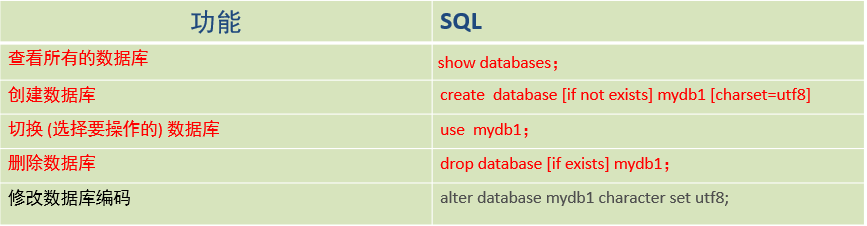

具体代码如下：

```sql
-- 1、DDL操作之数据库操作

-- 查看所有数据库
SHOW DATABASES;
-- 创建数据库
CREATE DATABASE MYDB1;
CREATE DATABASE IF NOT EXISTS MYDB1;
-- 选择使用哪一个数据
USE mydb1;
-- 删除数据库
DROP DATABASE mydb1;
DROP DATABASE  IF EXISTS mydb1;

-- 修改数据库编码
ALTER DATABASE mydb1 CHARACTER SET utf8;
```

###  3、对表结构的常用操作-创建表

- 创建表格式：
  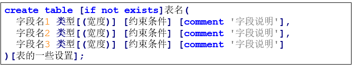创建表是构建一张空表，指定这个表的名字，这个表有几列，每一列叫什么名字，以及每一列存储的数据类型。
  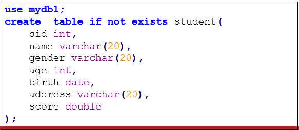

  具体实现代码如下：

  ```sql
  -- 创建表
  
  -- 选择mydb1
  USE mydb1;
  
  CREATE TABLE IF NOT EXISTS student(
  	sid INT,
  	name VARCHAR(20),
  	gender VARCHAR(20),
  	age INT,
  	birth DATE,
  	address VARCHAR(20)
  );
  ```

- 数据类型
  数据类型是指在创建表的时候为表中字段指定数据类型，只有数据符合类型要求才能存储起来，使用数据类型的原则是：够用就行，尽量使用取值范围小的，而不用大的，这样可以更多的节省存储空间。

  - 数值类型
    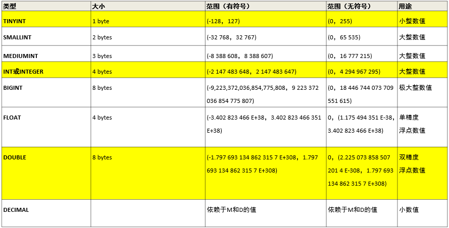
  - 日期和事件类型
    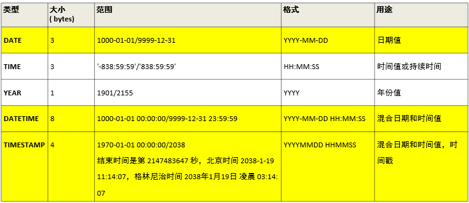
  - 字符串类型
    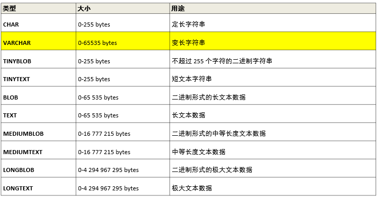
  - 如果我们需要无符号数，只需要在定义的项右侧加上unsigned即可

### 4、对表结构的常用操作—其他操作


具体实现代码如下：

```sql
-- 查看当前数据库所有的表
SHOW TABLES;
-- 查看指定表的创建语句
SHOW CREATE TABLE student;
/*
CREATE TABLE `student` (
  `sid` int DEFAULT NULL,
  `name` varchar(20) DEFAULT NULL,
  `gender` varchar(20) DEFAULT NULL,
  `age` int DEFAULT NULL,
  `birth` date DEFAULT NULL,
  `address` varchar(20) DEFAULT NULL
) ENGINE=InnoDB DEFAULT CHARSET=utf8mb3
*/
-- 查看表结构
DESC student;
-- 删除表
DROP TABLE student;
```

### 5、对表结构的常用操作-修改表结构格式

- 修改表添加列
  语法格式
  例子：

  ```sql
  -- 修改表结构
  -- 添加列
  ALTER TABLE student ADD dept VARCHAR(20);
  ```

- 修改类名和类型
  语法格式
  例子：

  ```sql
  -- 为student表的dept字段更换为department VARCHAR(30)
  ALTER TABLE student CHANGE dept department VARCHAR(30); 
  ```

- 修改表删除列
  语法格式
  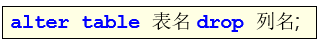例子：

  ```sql
  -- 删除student表中department这列
  ALTER TABLE student DROP department;
  ```

- 修改表名
  语法格式
  例子：

  ```sql
  -- 将student表的名字改为stu
  RENAME TABLE student TO stu;
  ```

## MySQL数据库基本操作-DML

### 1、基本介绍

DML（Data Manipulation Language）是指数据操作语言，用来对数据库中表的数据记录进行更新。

关键字：

- 插入insert
- 删除delete
- 更新update

### 2、数据插入

语法格式：
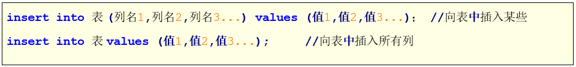

例子：

```sql
-- DML操作
-- 1.数据的插入

-- 格式1：
INSERT INTO student(sid,name,gender,age,birth,address,score)
VALUES(1001,'张三','男',18,'2001-12-23','北京',85.5);

-- 一次插入多个数据
INSERT INTO student(sid,name,gender,age,birth,address,score)
VALUES
(1002,'李四','男',19,'2002-09-13','上海',78.5),
(1003,'王五','女',17,'2003-11-29','深圳',66.5);

-- 只插入部分列的值
INSERT INTO student(sid) VALUES(1004);
INSERT INTO student(sid,name) VALUES(1005,'赵六');

-- 格式2：
INSERT INTO student VALUES(1006,'张华','女',21,'1999-01-21','广州',79);

-- 一次插入多个数据
INSERT INTO student VALUES
(1008,'钱博','男',21,'2005-05-07','北京',98),
(1007,'李方','男',24,'1998-05-04','武汉',89);
```

### 3、数据修改

语法格式：


例子：

```sql
-- 数据修改

-- 将所有学生的地址修改为重庆
UPDATE student SET address='重庆';
-- 将id为1004的学生的地址修改为北京
UPDATE student SET address='北京' WHERE sid=1004;
-- 将id为1005的学生的地址修改为北京，成绩修改为100
UPDATE student SET address='北京',score=100 WHERE sid=1005;
```

### 4、数据删除

语法格式：


例子：

```sql
-- 3.数据删除

-- 删除sid为1004的学生数据
DELETE FROM student WHERE sid=1004;
-- 删除表所有数据
DELETE FROM student;
-- 清空表数据
TRUNCATE TABLE student;
TRUNCATE student;
```

注意：delete和truncate原理不同，delete只删除内容，而truncate类似于drop table，可以理解为是将整个表删除，然后再创建表。

### 5、练习

```sql
-- 1.创建表
/*
创建员工表employee，字段如下：
id(员工编号)，name(员工名字)，gender(员工性别)，salary(员工薪资)
*/

-- USE mydb1;
-- 可以不选择数据库，直接用.的方式在相应的数据库添加表
CREATE TABLE IF NOT EXISTS mydb1.employee(
	id INT,
	name VARCHAR(20),
	gender VARCHAR(10),
	salary DOUBLE
);

-- 2.插入数据
/*
1,'张三','男',2000
2,'李四','男',1000
3,'王五','女',4000
*/

-- 因为要对所有列定义值，所以这里不指定列了
INSERT INTO employee VALUES
(1,'张三','男',2000),
(2,'李四','男',1000),
(3,'王五','女',4000);

-- 3.student
-- 将所有员工薪水修改为5000元
UPDATE employee SET salary=5000;

-- 将姓名为'张三'的员工薪水修改为3000元
UPDATE employee SET salary=3000 WHERE name='张三';

-- 将姓名为'李四'的员工薪水修改为4000元，gender改为女
UPDATE employee SET salary=4000,gender='女' WHERE name='李四';

-- 将'王五'的薪水在原有的基础上增加1000元
UPDATE employee SET salary=salary+1000 WHERE name='王五';
```

## MySQL约束

- 概念
  约束英文：constraint
  约束实际上就是表中数据的限制条件
- 作用
  表在设计的时候加入约束的目的就是为了保证表中的记录完整性和有效性，比如用户表有些列的值（手机号）不能为空，有些列的值（身份证号）不能重复。
- 分类
  - 主键约束(primary key)PK
  - 自增长约束(auto_increment)
  - 非空约束(not null)
  - 唯一性约束(unique)
  - 默认约束(default)
  - 零填充约束(zerofill)
  - 外键约束(foreign key)FK

### 1、主键约束

- 概念

  - MySQL主键约束是一个列或者多个列的组合，其值能唯一地标识表中地每一行，方便在RDBMS中尽快的找到某一行。
  - 主键约束相当于 唯一约束+非空约束 地组合，主键约束列不允许重复，也不允许出现空值。
  - 每个表最多只允许一个主键。
  - 主键约束的关键字是：primary key
  - 当创建主键的约束时，系统默认会在所在的列和列组合上建立对应的唯一索引。

- 操作

  - 添加单列主键
    创建单列主键有两种方式，一种是在定义字段的同时指定主键，一种是定义完字段之后指定主键
    方法1-语法：
    例子：

    ```sql
    -- 方式1
    
    USE mydb1;
    CREATE TABLE emp1(
    	eid INT PRIMARY KEY,
    	name VARCHAR(20),
    	deptID INT,
    	salary DOUBLE
    );
    ```

    方法2-语法：
    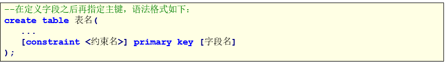

    例子：

    ```sql
    -- 方式2
    
    USE mydb1;
    CREATE TABLE emp2(
    	eid INT,
    	name VARCHAR(20),
    	deptID INT,
    	salary DOUBLE,
    	CONSTRAINT pk1 PRIMARY KEY(eid)
    );
    ```

  - 添加多列联合主键
    所谓的联合主键，就是这个主键是由一张表中多个字段组成的。
    注意：

    1. 当主键是由多个字段组成时，不能直接在字段名后面声明主键约束
    2. 一张表只能由一个主键，联合主键也是一个主键

    语法：
    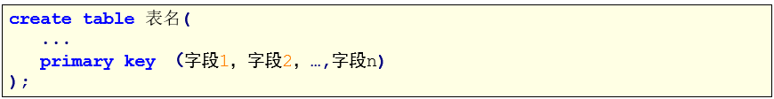例子：

    ```sql
    -- 2.联合主键
    -- 所谓的联合主键，就是这个主键是由一张表中多个字段组成的。
    CREATE TABLE emp3(
    	name VARCHAR(20),
    	deptId INT,
    	salary DOUBLE,
    	CONSTRAINT pk2 PRIMARY KEY(name,deptId)
    );
    
    INSERT INTO emp3 VALUES('张三',10,5000);
    -- 联合主键的两列都是主键，只要这些主键并不是都不相同，就视为不相同，就可以插入数据
    INSERT INTO emp3 VALUES('张三',20,5000);
    INSERT INTO emp3 VALUES('王五',20,5000);
    -- 虽然可以部分主键相同，但是都不能为空
    INSERT INTO emp3 VALUES(NULL,30,5000);
    INSERT INTO emp3 VALUES('赵六',NULL,5000);
    INSERT INTO emp3 VALUES(NULL,NULL,5000);
    ```

  - 通过修改表结构添加主键
    主键约束不仅可以在创建表的同时创建，也可以在修改表时添加。
    语法：
    

    例子：

    ```sql
    -- 3.通过修改表结构添加主键
    
    -- 添加单列主键
    CREATE TABLE emp4(
    	eid INT,
    	name VARCHAR(20),
    	deptId INT,
    	salary DOUBLE
    );
    ALTER TABLE emp4 ADD PRIMARY KEY(eid);
    
    CREATE TABLE emp5(
    	eid INT,
    	name VARCHAR(20),
    	deptId INT,
    	salary DOUBLE
    );
    ALTER TABLE emp5 ADD PRIMARY KEY(name,deptId);
    ```

  - 删除主键
    一个表中不需要主键约束时，就需要从表中将其删除。删除主键约束的方法要比创建主键约束容易的多。
    语法：
    例子：

    ```sql
    -- 4.删除主键
    -- 删除主键是不分单列和多列的，直接全部删除
    
    -- 删除单列主键
    ALTER TABLE emp1 DROP PRIMARY KEY;
    
    -- 删除多列主键
    ALTER TABLE emp5 DROP PRIMARY KEY;
    ```

### 2、自增长约束

- 概念
  在MySQL中，当主键定义为自增长后，这个主键的值就不再需要用户输入数据了，而由数据库系统根据定义自动赋值，每添加一条记录，主键会自动以相同的步长进行增长。
  通过给字段添加auto_increment属性来实现主键自增长

- 语法
  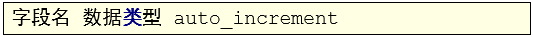

- 操作

  ```sql
  -- 自增正约束
  USE mydb1;
  CREATE TABLE t_user1(
  	id INT PRIMARY KEY auto_increment,
  	name VARCHAR(20)
  );
  
  INSERT INTO t_user1 VALUES(NULL,'张三');
  INSERT INTO t_user1(name) VALUES('李四');
  ```

- 特点

  - 默认情况下，auto_increment的初始值是1，每新增一条记录，字段值自动加1。
  - 一个表中只能有一个字段使用auto_increment约束，且该字段必须有唯一索引，以避免序号重复（即为主键或主键的一部分）。
  - auto_increment约束的字段必须具备NOT NULL属性。
  - auto_increment约束的字段只能是整数类型（TINYINT、SMALLINT、INT、BIGINT等）。
  - auto_increment约束字段的最大值受该字段的数据类型约束，如果达到上限，auto_increment就会失效。

- 指定自增字段初始值
  如果第一条记录设置了该字段的初始值，那么新增加的记录就会从这个初始值开始自增。例如，如果表中插入的第一条记录的id值设置为5，那么再插入记录时，id值就会从5开始往上增加

  ```sql
  -- 指定自增长的初始值
  -- 方式1，创建表时指定
  CREATE TABLE t_user2(
  	id INT PRIMARY KEY auto_increment,
  	name VARCHAR(20)
  )auto_increment=100;
  
  -- id从给定的值开始
  INSERT INTO t_user2 VALUES(NULL,'张三');
  INSERT INTO t_user2(name) VALUES('李四');
  
  -- 方式2，创建表之后指定
  CREATE TABLE t_user3(
  	id INT PRIMARY KEY auto_increment,
  	name VARCHAR(20)
  );
  
  ALTER TABLE t_user3 auto_increment=200;
  
  INSERT INTO t_user3 VALUES(NULL,'张三');
  INSERT INTO t_user3(name) VALUES('李四');
  ```

- delete和truncate在删除后自增列的变化

  - delete数据之后自动增长从断点开始
  - truncate数据之后自动增长从默认起始值开始

  ```sql
  -- DELETE删除数据之后，自增长还是在最后一个值基础上加1
  DELETE FROM t_user1;
  
  -- 前面插了两个值删除后，断点为3，所以从3开始进行标注
  INSERT INTO t_user1 VALUES(NULL,'张三');
  INSERT INTO t_user1(name) VALUES('李四');
  
  -- TRUNCATE删除之后，自增长从1开始
  TRUNCATE t_user1;
  
  INSERT INTO t_user1 VALUES(NULL,'张三');
  INSERT INTO t_user1(name) VALUES('李四');
  
  -- TRUNCATE即使给定初始开始值，删除后依旧从系统自定的1开始
  TRUNCATE t_user2;
  
  INSERT INTO t_user2 VALUES(NULL,'张三');
  INSERT INTO t_user2(name) VALUES('李四');
  ```

### 3、非空约束

- 概念
  MySQL非空约束（not null）指字段的值不能为空。对于使用了非空约束的字段，如果用户在添加数据时没有指定值，数据库系统就会报错。

- 语法
  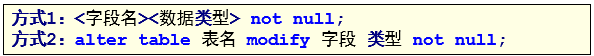

  例子：

  ```sql
  -- 三、非空约束
  
  -- 创建非空约束
  -- 方式1，创建表时指定
  CREATE TABLE t_user6(
  	id INT,
  	name VARCHAR(20) NOT NULL,
  	address VARCHAR(20) NOT NULL
  );
  
  -- 如果定义了 NOT NULL，那么在insert这个数据的时候必须要添加这个值，即使没有做声明
  INSERT INTO t_user6(id) VALUES(1001);
  INSERT INTO t_user6(id) VALUES(1001,NULL,NULL);
  -- 这个NULL表示的是字符串NULL
  INSERT INTO t_user6(id,name,address) VALUES(1001,'NULL','NULL');
  -- 这个代表空串
  INSERT INTO t_user6(id,name,address) VALUES(1001,'','');
  
  -- 方式2，创建表之后指定
  CREATE TABLE t_user7(
  	id INT,
  	name VARCHAR(20),
  	address VARCHAR(20)
  );
  
  ALTER TABLE t_user7 MODIFY name VARCHAR(20) NOT NULL;
  ALTER TABLE t_user7 MODIFY address VARCHAR(20) NOT NULL;
  
  DESC t_user7;
  ```

- 删除非空约束

  ```sql
  -- 删除非空约束
  ALTER TABLE t_user7 MODIFY name VARCHAR(20);
  ALTER TABLE t_user7 MODIFY address VARCHAR(20);
  ```

### 4、唯一约束

- 概念
  唯一约束（Unique Key）是指所有记录中字段的值不能重复出现。例如，为id字段加上唯一性约束后，每条记录的id值都是唯一的，不能出现重复的情况。

- 语法
  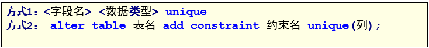例子：

  ```sql
  -- 1.添加唯一约束
  -- 方式1，创建表时指定
  USE mydb1;
  CREATE TABLE t_user8(
  	id INT,
  	name VARCHAR(20),
  	phone_number VARCHAR(20) UNIQUE
  );
  
  INSERT INTO t_user8 VALUES(1001,'张三',138);
  -- 重复会报错
  INSERT INTO t_user8 VALUES(1002,'张三',138);
  INSERT INTO t_user8 VALUES(1002,'张三',139);
  -- NULL可以多次插入执行
  -- 在MySQL中，NULL和任何值都不相同，甚至和自己都不相同
  INSERT INTO t_user8 VALUES(1003,'张三3',NULL);
  INSERT INTO t_user8 VALUES(1004,'张三4',NULL);
  
  -- 方式2，创建表之后指定
  CREATE TABLE t_user9(
  	id INT,
  	name VARCHAR(20),
  	phone_number VARCHAR(20) UNIQUE
  );
  
  ALTER TABLE t_user9 add CONSTRAINT unique_pn UNIQUE(phone_number);
  
  INSERT INTO t_user9 VALUES(1001,'张三',138);
  INSERT INTO t_user9 VALUES(1002,'张三2',138);
  ```
  
- 删除唯一约束

  ```sql
  -- 2.删除唯一约束
  
  -- 如果建立约束的时候没有使用名字，那么这个变量就是我们使用约束的列的名字
  ALTER TABLE t_user9 DROP INDEX unique_pn;
  ```

### 5、默认约束

- 概念
  MySQL默认值约束用来指定某列的默认值。

- 语法
  例子：

  ```sql
  -- 1.创建默认约束
  -- 方式1，创建表时指定
  USE mydb1;
  CREATE TABLE t_user10(
  	id INT,
  	name VARCHAR(20),
  	address VARCHAR(20) DEFAULT '北京'
  );
  
  -- 对某列执行默认约束的时候，如果没有给这一列赋值，那么会对这一列默认赋值
  INSERT INTO t_user10(id,NAME) VALUES(1001,'张三');
  INSERT INTO t_user10(id,NAME,address) VALUES(1002,'张三2','上海');
  INSERT INTO t_user10 VALUES(1003,'李四',NULL);
  
  -- 方式2，创建表之后指定
  CREATE TABLE t_user11(
  	id INT,
  	name VARCHAR(20),
  	address VARCHAR(20)
  );
  
  ALTER TABLE t_user11 MODIFY address VARCHAR(20) DEFAULT '深圳';
  
  INSERT INTO t_user11(id,NAME) VALUES(1001,'张三');
  INSERT INTO t_user11(id,NAME,address) VALUES(1002,'张三2','上海');
  INSERT INTO t_user11 VALUES(1003,'李四',NULL);
  ```

- 删除默认约束

  ```sql
  -- 2.删除默认约束
  
  ALTER TABLE t_user11 MODIFY address VARCHAR(20) DEFAULT NULL;
  ```

### 6、零填充约束

- 概念

  1. 插入数据时，当该字段的值的长度小于定义的长度时，会在该值的前面补上相应的0
  2. zerofill默认为int(10)
  3. 当使用zerofill时，默认会自动加unsigned（无符号）属性，使用unsigned属性后，数值范围是原值的2倍，例如，有符号为-128\~+127，无符号为0\~256

- 操作

  ```sql
  -- 1.添加约束
  CREATE TABLE t_user12(
  	id INT ZEROFILL,
  	name VARCHAR(20)
  );
  
  INSERT INTO t_user12 VALUES(123,'张三');
  INSERT INTO t_user12 VALUES(1,'李四');
  ```

- 删除

  ```sql
  -- 2.删除约束
  
  ALTER TABLE t_user12 MODIFY id INT;
  
  INSERT INTO t_user12 VALUES(123,'张三');
  INSERT INTO t_user12 VALUES(1,'李四');
  ```
