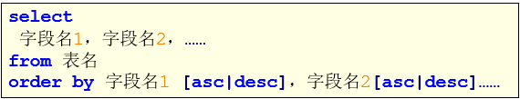
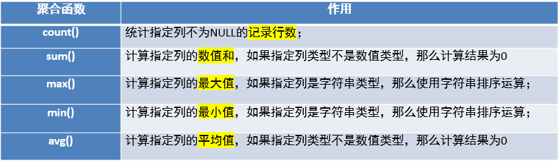
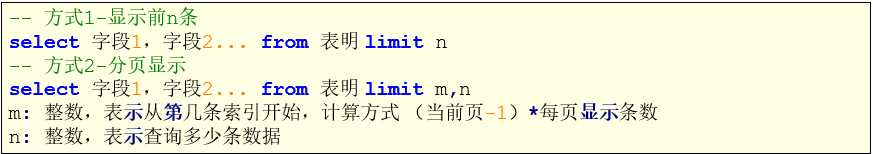
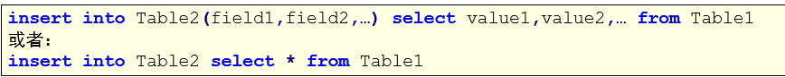
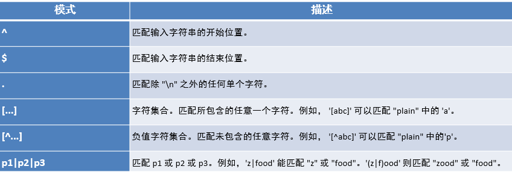
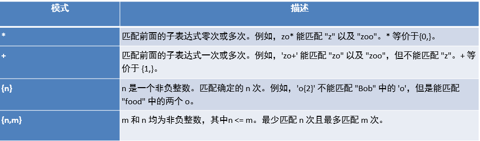

# MySQL

## MySQL数据库基本操作-DQL

### 1、基本介绍

- 概念
  - 数据库管理系统一个重要功能就是数据查询，数据查询不应只是简单返回数据库中存储的数据，还应该根据需要对数据进行筛选以及确定数据以什么样的格式显示。
  - MySQL提供了功能强大、灵活的语句来实现这些操作
  - MySQL数据库使用select语句来查询数据
- 应用
- 语法格式
  
- 简化版语法
  
- 数据准备

### 2、基本查询

- 简单查询

  ```sql
  -- 1.查询所有的商品
  SELECT pid,pname,price,category_id FROM product;
  SELECT * FROM product;
  
  -- 2.查询商品名和商品价格
  SELECT pname,price FROM product;
  
  -- 3.别名查询，使用的关键字是as
  -- 3.1表别名
  SELECT * FROM product as p;
  SELECT * FROM product p;
  -- 3.2列别名
  SELECT pname AS '商品名',price AS '商品价格' FROM product;
  
  -- 4.去掉重复值
  -- 针对某一列去掉重复值
  SELECT DISTINCT price FROM product;
  -- 针对于所有列，只有所有列都相等的时候才会被去重
  SELECT DISTINCT * FROM product;
  
  -- 5.查询结构式表达式（运算查询）
  SELECT pname,price+10 FROM product;
  ```

- 运算符

  - 简介
    数据库中的表结构确立后，表中的数据代表的意义就已经确定。通过MySQL运算符进行运算，就可以获取到表结构以外的另一种数据。
    例如，学生表中存在一个birth字段，这个字段表示学生的出生年份。而运用MySQL的算术运算符用当前的年份减学生出生的年份，那么得到的就是这个学生的实际年龄数据。
    MySQL支持四种运算符

    - 算数运算符
      
    - 比较运算符
      
    - 逻辑运算符
      
    - 位运算符
      位运算是在二进制数上进行计算的运算符。位运算会先将操作数变成二进制数，进行位运算。然后再将计算结果从二进制数变回十进制数。

  - 运算符操作

    - 算术运算符

      ```sql
      -- 1.算数运算符
      SELECT 6 + 2;
      SELECT 6 - 2;
      SELECT 6 * 2;
      SELECT 6 / 2;
      SELECT 6 % 4;
      
      -- 将所有商品的价格加10元
      SELECT pname,price + 10 AS new_price FROM product;
      -- 将所有的商品价格上调10%
      SELECT pname,price * 1.1 AS new_price FROM product;
      ```

    - 条件查询

      ```sql
      -- 2.比较运算符
      -- 3.逻辑运算符
      
      -- 查询商品名称为“海尔洗衣机”的商品所有信息
      SELECT * FROM product WHERE pname='海尔洗衣机';
      -- 查询价格为800的商品
      SELECT pname FROM product WHERE price=800;
      -- 查询价格不是800的所有商品
      SELECT pname FROM product WHERE price!=800;
      SELECT pname FROM product WHERE price<>800;
      SELECT pname FROM product WHERE NOT (price=800);
      -- 查询商品价格大于60元的所有商品信息
      SELECT * FROM product WHERE price>60;
      -- 查询商品价格在200到1000之间所有商品
      SELECT pname FROM product WHERE price>=200 AND price<=800;
      SELECT pname FROM product WHERE price>=200&&price<=800;
      SELECT pname FROM product WHERE price between 200 and 1000;
      -- 查询商品价格是200或800的所有商品
      SELECT pname FROM product WHERE price=200||price=800;
      SELECT pname FROM product WHERE price=200 OR price=800;
      SELECT pname FROM product WHERE price IN(200,800);
      -- 查询含有'裤'字的所有商品
      -- %用来匹配任意字符
      SELECT pname FROM product WHERE pname LIKE '%裤%';
      -- 查询以'海'开头的所有商品
      SELECT pname FROM product WHERE pname LIKE '海%';
      -- 查询第二个字为'蔻'的所有商品
      SELECT pname FROM product WHERE pname LIKE '_蔻%';
      -- 查询category_id为null的商品
      -- 不可以用等于的方式查询值为null的项
      SELECT pname FROM product WHERE category_id IS NULL;
      -- 查询catgegory_id不为null分类的商品
      SELECT pname FROM product WHERE category_id IS NOT NULL;
      -- 使用least求最小值
      SELECT LEAST(10,5,20) AS small_number;
      -- 如果求最小函数的输入有null，那么最后一定返回null
      SELECT LEAST(10,NULL,20);
      -- 使用greatest求最大值
      SELECT GREATEST(10,20,30) AS big_number;
      -- 如果求最大函数的输入有null，那么最后一定返回null
      SELECT GREATEST(10,NULL,30);
      ```

    - 位运算符
    
      ```sql
      -- 4.位运算符（这个不会直接remake吧）
      SELECT 3&5;
      SELECT 3|5;
      SELECT 3^5;
      SELECT 3>>1;
      SELECT 3<<1;
      SELECT ~3;
      ```
  
- 排序查询

  - 介绍
    如果我们需要对读取的数据进行排序，我们就可以使用MySQL的order by子句来设定你想按哪个字段哪种方式来进行排序，再返回搜索结果。
    

  - 特点

    1. asc代表升序，desc代表降序，如果不写默认升序
    2. order by用于子句中可以支持单个字段，多个字段，表达式，函数，别名
    3. order by子句，放在查询语句的最后面。LIMIT子句除外

  - 操作

    ```sql
    -- 三、排序查询
    
    -- 1.使用价格排序（降序）
    SELECT * FROM product ORDER BY price DESC;
    -- 2.在价格排序（降序）的基础上，以分类排序（降序）
    SELECT * FROM product ORDER BY price DESC,category_id DESC;
    -- 3.显示商品的价格（去重复），并排序（降序）
    SELECT DISTINCT price FROM product ORDER BY price DESC;
    ```

- 聚合查询

  - 简介
    之前我们做的查询都是横向查询，它们都是根据条件一行一行的进行判断，而使用聚合函数查询是纵向查询，它是对一列的值进行计算，然后返回一个单一的值；另外聚合函数会忽略空值。
    
    
  - 操作
  
    ```sql
    -- 四、聚合查询
    
    -- 1.查询商品的总条数
    SELECT COUNT(pid) FROM product;
    SELECT COUNT(*) FROM product;
    -- 2.查询价格大于200商品的总条数
    SELECT COUNT(pid) FROM product WHERE price > 200;
    -- 3.查询分类为'c001'的所有商品的价格总和
    SELECT SUM(price) FROM product WHERE category_id = 'c001';
    -- 4.查询商品的最大价格
    SELECT MAX(price) FROM product;
    -- 5.查询商品的最小价格
    SELECT MIN(price) FROM product;
    SELECT MAX(price) max_price,MIN(price) min_price FROM product;
    -- 6.查询分类为'c002'所有商品的平均价格
    SELECT AVG(price) FROM product WHERE category_id = 'c002';
    ```
  
  - NULL值的处理
  
    - 介绍
  
      1. count函数对null值的处理
         如果count函数的参数为星号(*)，则统计所有记录的个数。而如果参数为某字段，不统计含null值的记录个数。
      2. sum和avg函数对null值的处理
         这两个函数忽略null值的存在，，就好像该条记录不存在一样。
      3. max和min函数对null值的处理
         max和min两个函数同样忽略null值的存在。
  
    - 操作
  
      ```sql
      -- NULL值的处理
      -- 创建表
      CREATE TABLE test_null (
      	c1 VARCHAR (20),
      	c2 INT
      );
      
      -- 插入数据
      INSERT INTO test_null VALUES ('aaa',3);
      INSERT INTO test_null VALUES ('bbb',3);
      INSERT INTO test_null VALUES ('ccc',NULL);
      INSERT INTO test_null VALUES ('ddd',6);
      
      -- 测试
      SELECT COUNT(*),COUNT(c1),COUNT(c2) FROM test_null;
      SELECT SUM(c2),MAX(c2),MIN(c2),AVG(c2) FROM test_null;
      ```
  
- 分组查询

  - 简介
    分组查询是指使用group by字句对查询信息进行分组。
    

  - 操作

    ```sql
    -- 五、分组查询
    
    -- 1.统计各个分类商品的个数
    SELECT category_id,COUNT(pid) FROM product GROUP BY category_id;
    -- 如果GROUP BY字段后面跟了很多分类项，那么只有所有分类项都相同时才能分为一类
    -- 注意，分组之后，SELECT的后面只能写分组字段和聚合函数
    ```

    如果要进行分组的话，则SELECT子句之后，只能出现分组的字段和统计函数，其他的字段不能出现。

  - 分组之后的条件筛选-having
    分组之后对统计结果进行筛选的话必须使用having，不能使用where。
    where子句用来筛选from子句中指定的操作所产生的行。
    group by子句用来分组where子句的输出。
    having子句用来从分组的结果中筛选行。

    - 操作

      ```sql
      -- 2.统计各个分类商品的个数，且只显示个数大于4的信息
      -- SQL执行顺序：FROM->GROUP BY->COUNT(pid)->SELECT->HAVING->ORDER BY
      SELECT category_id,COUNT(pid) cnt FROM product GROUP BY category_id HAVING COUNT(pid) > 4 ORDER BY cnt;
      ```

- 分页查询

  - 简介
    分页查询在项目开发中常见，由于数据量很大，显示屏长度有限，因此对数据需要采取分页显示方式。例如数据共有30条，每页显示5条，第一页显示1-5条，第二页显示6-10条。

  - 格式
    

  - 操作

    ```sql
    -- 六、分页查询
    
    -- 1.查询product表的前5条记录
    SELECT * FROM product LIMIT 5;
    -- 2.从第4条开始显示，显示5条
    -- 因为SQL默认是从0开始，所以从第四条开始显示要写3
    SELECT * FROM product LIMIT 3,5;
    ```

- INSERT INTO SELECT语句

  - 简介
    将一张表的数据导入到另一张表中，可以使用INSERT INTO SELECT语句

  - 格式
    要求目标表Table2必须存在

  - 操作

    ```sql
    -- 七、INSERT INTO SELECT
    
    -- INSERT INTO TABLE SELECT ...
    
    CREATE TABLE product2(
    	pname VARCHAR(20),
    	price DOUBLE
    );
    
    INSERT INTO product2(pname,price) SELECT pname,price FROM product;
    SELECT * FROM product2;
    
    CREATE TABLE product3(
    	category_id VARCHAR(20),
    	product_count INT
    );
    
    INSERT INTO product3 SELECT category_id,count(*) FROM product GROUP BY category_id;
    SELECT * FROM product3;
    ```

- 练习

  ```sql
  use mydb2;
  CREATE TABLE student(
  	id INT,
  	name VARCHAR(20),
  	gender VARCHAR(20),
  	chinese INT,
  	english INT,
  	math INT
  );
  
  INSERT INTO student(id,name,gender,chinese,english,math) VALUES(1,'张明','男',89,78,90);
  INSERT INTO student(id,name,gender,chinese,english,math) VALUES(2,'李进','男',67,53,95);
  INSERT INTO student(id,name,gender,chinese,english,math) VALUES(3,'王五','女',87,78,77);
  INSERT INTO student(id,name,gender,chinese,english,math) VALUES(4,'李一','女',88,98,92);
  INSERT INTO student(id,name,gender,chinese,english,math) VALUES(5,'李财','男',82,84,67);
  INSERT INTO student(id,name,gender,chinese,english,math) VALUES(6,'张宝','男',55,85,45);
  INSERT INTO student(id,name,gender,chinese,english,math) VALUES(7,'黄蓉','女',75,65,30);
  INSERT INTO student(id,name,gender,chinese,english,math) VALUES(7,'黄蓉','女',75,65,30);
  
  
  -- 查询表中所有学生的信息
  SELECT * FROM student;
  -- 查询表中所有学生的姓名和对应的英语成绩
  SELECT name, english FROM student;
  -- 过滤表中重复数据
  SELECT DISTINCT * FROM student;
  -- 统计每个学生的总分
  SELECT chinese+english+math FROM student;
  -- 在所有学生总分数上加10分特长分
  SELECT chinese+english+math+10 FROM student;
  -- 使用别名表示学生分数
  SELECT name, chinese '语文成绩', english '英语成绩', math '数学成绩' FROM student;
  -- 查询英语成绩大于90分的同学
  SELECT * FROM student WHERE english > 90;
  -- 查询总分大于200分的所有同学
  SELECT * FROM student WHERE chinese+english+math > 200;
  -- 查询英语分数在80-90之间的同学
  SELECT * FROM student WHERE english >= 80 && english <= 90;
  -- 查询英语分数不在80-90之间的同学
  SELECT * FROM student WHERE english < 80 || english > 90;
  -- 查询数学分数为89，90，91的同学
  SELECT * FROM student WHERE math = 89 || math = 90 || math = 91;
  -- 查询所有姓李的学生英语成绩
  SELECT * FROM student WHERE name LIKE '李%'
  -- 查询数学分80并且语文分80的同学
  SELECT * FROM student WHERE math = 80 && chinese = 80;
  -- 查询英语80或者总分200的同学
  SELECT * FROM student WHERE english = 80 || chinese + math + english = 200;
  -- 对数学成绩降序排序后输出
  SELECT * FROM student ORDER BY math DESC;
  -- 对总分排序后输出，然后再按从高到低的顺序输出
  SELECT * FROM student ORDER BY chinese + math + english DESC;
  -- 对姓李的学生成绩排序输出
  SELECT * FROM student WHERE name LIKE '李%' ORDER BY chinese + math + english DESC;
  -- 查询男生和女生分别有多少人，并将人数降序排序输出
  SELECT gender, COUNT(*) FROM student GROUP BY gender ORDER BY COUNT(*) DESC;
  ```

  ```sql
  CREATE TABLE emp(
  	empno INT,	-- 员工编号	
  	ename VARCHAR(20),	-- 员工名字
  	job VARCHAR(20),	-- 工作名字
  	mgr INT,	-- 上级领导编号
  	hiredate DATE,	-- 入职日期
  	sal INT,	-- 薪资
  	comm INT,	-- 奖金
  	deptno INT	-- 部门编号
  );
  
  INSERT INTO emp VALUES(7369,'SMITH','CLERK',7902,'1980-12-17',800,NULL,20);
  INSERT INTO emp VALUES(7499,'ALLEN','SALESMAN',7698,'1981-02-20',1600,300,30);
  INSERT INTO emp VALUES(7521,'WARD','SALESMAN',7698,'1981-02-22',1250,500,30);
  INSERT INTO emp VALUES(7566,'JONES','MANAGER',7839,'1981-04-02',2975,NULL,20);
  INSERT INTO emp VALUES(7654,'MARTIN','SALESMAN',7698,'1981-09-28',1250,1400,30);
  INSERT INTO emp VALUES(7698,'BLAKE','MANAGER',7839,'1981-05-01',2850,NULL,30);
  INSERT INTO emp VALUES(7782,'CLARK','MANAGER',7839,'1981-06-09',2450,NULL,10);
  INSERT INTO emp VALUES(7788,'SCOTT','ANALYST',7566,'1987-04-19',3000,NULL,20);
  INSERT INTO emp VALUES(7839,'KING','PRESIDENT',NULL,'1981-11-17',5000,NULL,10);
  INSERT INTO emp VALUES(7844,'TURNER','SALESMAN',7698,'1981-09-08',1500,0,30);
  INSERT INTO emp VALUES(7876,'ADAMS','CLERK',7788,'1987-05-23',1100,NULL,20);
  INSERT INTO emp VALUES(7900,'JAMES','CLERK',7698,'1981-12-03',950,NULL,30);
  INSERT INTO emp VALUES(7902,'FORD','ANALYST',7566,'1981-12-03',3000,NULL,20);
  INSERT INTO emp VALUES(7934,'MILLER','CLERK',7782,'1981-01-23',1300,NULL,10);
  -- ------------------------------------------------------------------------
  
  -- 1、按员工编号升序排序不在10号部门工作的员工信息
  SELECT * FROM emp WHERE deptno != 10 ORDER BY empno ASC;
  -- 2、查询姓名第二个字母不是“A”且薪水大于1000元的员工信息，按年薪降序排列\
  -- ifnull(comm,0) 如果comm的值为null，则当作0，不为null，则还是原来的值 
  SELECT * FROM emp WHERE ename NOT LIKE '_A%' AND sal > 1000 ORDER BY (12*sal + IFNULL(comm,0)) DESC;
  -- 3、求每个部门的平均薪水
  SELECT deptno,AVG(sal) FROM emp GROUP BY deptno;
  -- 4、求各个部门的最高薪水
  SELECT deptno,MAX(sal) FROM emp GROUP BY deptno;
  -- 5、求每个部门每个岗位的最高薪水
  SELECT deptno,job,MAX(sal) FROM emp GROUP BY deptno, job;
  -- 6、求平均薪水大于2000的部门编号
  SELECT deptno,AVG(sal) FROM emp GROUP BY deptno HAVING AVG(sal) > 2000;
  -- 7、将部门平均薪水大于1500的部门编号列出来，按部门平均薪水降序排列
  SELECT deptno,AVG(sal) FROM emp GROUP BY deptno HAVING AVG(sal) > 1500 ORDER BY AVG(sal) DESC;
  -- 8、选择公司中有奖金的员工姓名，工资
  SELECT ename,sal FROM emp WHERE comm IS NOT NULL;
  -- 9、查询员工最高工资和最低工资的差距
  SELECT MAX(sal) - MIN(sal) FROM emp;
  ```

### 3、正则表达式

- 介绍
  正则表达式描述了一种字符串匹配的规则，正则表达式本身就是一个字符串，使用这个字符串来描述、用来定义匹配规则，匹配一系列符合某个句法规则的字符串。在开发中，正则表达式通常被用来检索、替换那些符合某个规则的文本。
  MySQL通过REGEXP关键字支持正则表达式进行字符串匹配。

- 格式
  

- 操作

  ```sql
  -- 正则表达式
  
  
  -- ^ 在字符串开始处进行匹配
  SELECT 'abc' REGEXP '^a';
  SELECT * FROM product WHERE pname REGEXP '^海';
  
  -- $ 在字符串末尾开始匹配
  SELECT 'abc' REGEXP 'a$';
  SELECT 'abc' REGEXP 'c$';
  SELECT * FROM product WHERE pname REGEXP '水$';
  
  -- . 匹配任意字符，可以匹配除了换行符之外的任意字符
  SELECT 'abc' REGEXP '.b';
  SELECT 'abc' REGEXP '.c';
  SELECT 'abc' REGEXP 'a.';
  
  -- [...] 匹配括号内的任意单个字符
  SELECT 'abc' REGEXP '[xyz]';
  SELECT 'abc' REGEXP '[xaz]';
  
  -- [^...] 注意^符号只有在[]内才是取反的意思，在别的地方都是表示开始处匹配
  SELECT 'a' REGEXP '[^abc]';
  SELECT 'x' REGEXP '[^abc]';
  SELECT 'abc' REGEXP '[^a]';
  
  -- a* 匹配0个或多个a，包括空字符串。	可以作为占位符使用，有没有指定字符都可以匹配到数据
  SELECT 'stab' REGEXP '.ta*b';
  SELECT 'stb' REGEXP '.ta*b';
  SELECT '' REGEXP 'a*';
  
  -- a+ 匹配1个或者多个a，但是不包括空字符
  SELECT 'stab' REGEXP '.ta+b';
  SELECT 'stb' REGEXP '.ta+b';
  
  -- a? 匹配0个或者1个a
  SELECT 'stb' REGEXP '.ta?b';
  SELECT 'stab' REGEXP '.ta?b';
  SELECT 'staab' REGEXP '.ta?b';
  
  -- a1|a2 匹配a1或者a2
  SELECT 'a' REGEXP 'a|b';
  SELECT 'b' REGEXP 'a|b';
  SELECT 'b' REGEXP '^(a|b)';
  SELECT 'a' REGEXP '^(a|b)';
  SELECT 'c' REGEXP '^(a|b)';
  
  -- a{m} 匹配m个a
  SELECT 'auuuuc' REGEXP 'au{4}c';
  SELECT 'auuuuc' REGEXP 'au{3}c';
  
  -- a{m,} 匹配m个或者更多个a
  SELECT 'auuuuc' REGEXP 'au{3,}c';
  SELECT 'auuuuc' REGEXP 'au{4,}c';
  SELECT 'auuuuc' REGEXP 'au{5,}c';
  
  -- a{m,n}匹配m到n个a，包含m和n
  SELECT 'auuuuc' REGEXP 'au{3,5}c';
  SELECT 'auuuuc' REGEXP 'au{4,5}c';
  SELECT 'auuuuc' REGEXP 'au{5,10}c';
  
  -- (abc)
  -- abc作为一个序列匹配，不用括号括起来都是用单个字符去匹配，如果要把多个字符作为一个整体去匹配就需要用到括号，所以括号适合上面的所有情况
  SELECT 'xababy' REGEXP 'x(abab)y';
  SELECT 'xababy' REGEXP 'x(ab)*y';
  SELECT 'xababy' REGEXP 'x(ab){1,2}y';
  ```