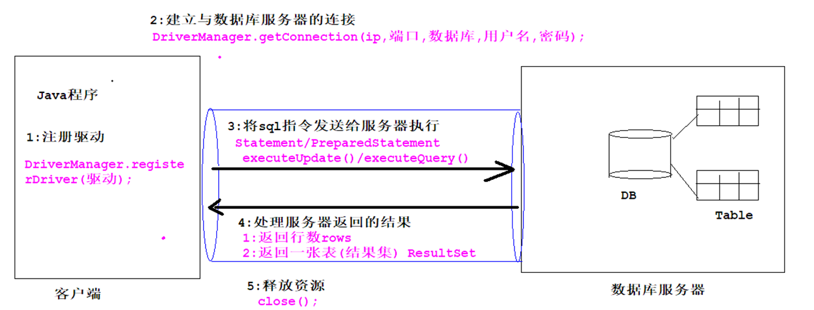

# MySQL

## MySQL的JDBC操作

### 1、JDBC概述

JDBC（Java DataBase Connectivity,java数据库连接）是一种用于执行SQL语句的Java API。JDBC是Java访问数据库的标准规范，可以为不同的关系型数据库提供统一访问，它由一组用Java语言编写的接口和类组成。

JDBC需要连接驱动，驱动是两个设备要进行通信，满足一定通信数据格式，数据格式由设备提供商规定，设备提供商为设备提供驱动软件，通过软件可以与该设备进行通信。

### 2、JDBC入门案例

#### 1.JDBC核心类和接口

- DriverManager:用于注册驱动
- Connection: 表示与数据库创建的连接
- Statement/PrepareStatement: 操作数据库sql语句的对象
- ResultSet: 结果集或一张虚拟表

#### 2.执行流程



#### 3.代码编写

数据准备

```sql
CREATE DATABASE mydb16_jdbc;
USE mydb16_jdbc;

CREATE TABLE IF NOT EXISTS student(
	sid INT PRIMARY KEY auto_increment,
	sname VARCHAR(20),
	age INT
);

INSERT INTO student VALUES(NULL, '宋江', 30), (NULL, '武松', 28), (NULL, '林冲', 26);
```

代码实现流程

```java
public class JDBCDemo01 {
    public static void main(String[] args) throws Exception{
        //1、注册驱动
        //DriverManager.registerDriver(new com.mysql.jdbc.Driver());
        //2、获取连接
        Connection connection = DriverManager.getConnection("jdbc:mysql://localhost:3306/mydb16_jdbc", "root", "123456");
        //3、执行sql
        Statement statement = connection.createStatement();
        ResultSet resultSet = statement.executeQuery("select * from student");
        //4、处理结果集
        while (resultSet.next()) {  //获取每一行数据
            //获取每一列数据
            //int sid = resultSet.getInt("sid");
            int sid = resultSet.getInt(1);
            String sname = resultSet.getString(2);
            int age = resultSet.getInt(3);
            System.out.println(sid + "\t" + sname + "\t" + age);
        }
        //5、关闭连接
        resultSet.close();
        statement.close();
        connection.close();
    }
}
```

通过获取列数来进行打印

```java
public class JDBCDemo02 {
    public static void main(String[] args) throws Exception{
        //1、注册驱动
        //2、获取连接
        Connection connection = DriverManager.getConnection("jdbc:mysql://localhost:3306/mydb16_jdbc", "root", "123456");
        //3、执行sql
        Statement statement = connection.createStatement();
        ResultSet resultSet = statement.executeQuery("select * from student");

        //获取表的列数
        ResultSetMetaData metaData = resultSet.getMetaData();
        int columnCount = metaData.getColumnCount();
        //4、处理结果集
        while (resultSet.next()) {  //获取每一行数据
            //获取每一列数据
            for (int i = 1; i <= columnCount; i++) {
                System.out.print(resultSet.getObject(i) + "\t");
            }
            System.out.println();
        }
        //5、关闭连接
        resultSet.close();
        statement.close();
        connection.close();
    }
}
```

增删改操作

```java
public class JDBCDemo03 {
    public static void main(String[] args) throws Exception{
        //1、注册驱动
        //2、获取连接
        Connection connection = DriverManager.getConnection("jdbc:mysql://localhost:3306/mydb16_jdbc", "root", "123456");
        //3、执行sql
        //3.1增加数据
        Statement statement = connection.createStatement();
//        int rows1 = statement.executeUpdate("insert into student values(null, '鲁智深', 40)");
//        System.out.println(rows1);
        //3.2修改数据
//        int rows2 = statement.executeUpdate("update student set age = 48 where sname = '武松'");
//        System.out.println(rows2);
        //3.3删除数据
        int rows3 = statement.executeUpdate("delete from student where sname = '鲁智深'");
        System.out.println(rows3);

        //5、关闭连接
        statement.close();
        connection.close();
    }
}
```

### 3、JDBC的SQL注入

SQL注入：用户输入的内容作为了SQL语句语法的一部分，改变了原有SQL真正的意义。

数据准备

```sql
-- SQL注入
CREATE TABLE user(
	uid INT PRIMARY KEY auto_increment,
	username VARCHAR(20),
	password VARCHAR(20)
);

INSERT INTO user VALUES(NULL, 'zhangsan', '123456'), (NULL, 'lisi', '888888');
```

SQL注入的情况

```java
public class JDBCDemo04 {
    public static void main(String[] args) throws Exception{
        //用户输入用户名和密码，判断是否能够登录
        BufferedReader br = new BufferedReader(new InputStreamReader(System.in));
        StreamTokenizer in = new StreamTokenizer(br);
        PrintWriter out = new PrintWriter(new OutputStreamWriter(System.out));

        System.out.println("请输入用户名：");
        in.nextToken();
        String username = in.sval;
        System.out.println("请输入密码：");
        in.nextToken();
        String password = String.valueOf((int) in.nval);
        //1、注册驱动
        //2、获取连接
        Connection connection = DriverManager.getConnection("jdbc:mysql://localhost:3306/mydb16_jdbc", "root", "123456");
        //3、执行sql
        //这里使用了statement造成了可能出现的SQL注入
        //比如用户输入用户名：ddd，密码：aaa 'or' 1=1
        //这个时候sql语句就变成了：select * from user where username = 'ddd' and password = 'aaa 'or' 1=1'
        //由于or后面的结果永远为真，所以这个语句一定能查询到结果
        //就造成了登录成功
        //解决方案：将statement更改为preparestatement
        Statement statement = connection.createStatement();
        String sql = "select * from user where username = '" + username + "' and password = '" + password + "'";
        ResultSet resultSet = statement.executeQuery(sql);

        if (resultSet.next()) {
            out.println("登陆成功");
        } else {
            out.println("登录失败");
        }

        //5、关闭连接
        resultSet.close();
        statement.close();
        connection.close();
        out.flush();
    }
}
```

解决方案

```java
public class JDBCDemo05 {
    public static void main(String[] args) throws Exception{
        //用户输入用户名和密码，判断是否能够登录
        BufferedReader br = new BufferedReader(new InputStreamReader(System.in));
        StreamTokenizer in = new StreamTokenizer(br);
        PrintWriter out = new PrintWriter(new OutputStreamWriter(System.out));

        System.out.println("请输入用户名：");
        in.nextToken();
        String username = in.sval;
        System.out.println("请输入密码：");
        in.nextToken();
        String password = String.valueOf((int) in.nval);
        //1、注册驱动
        //2、获取连接
        Connection connection = DriverManager.getConnection("jdbc:mysql://localhost:3306/mydb16_jdbc", "root", "123456");
        //3、执行sql
        //这里使用了statement造成了可能出现的SQL注入
        //比如用户输入用户名：ddd，密码：aaa 'or' 1=1
        //这个时候sql语句就变成了：select * from user where username = 'ddd' and password = 'aaa 'or' 1=1'
        //由于or后面的结果永远为真，所以这个语句一定能查询到结果
        //就造成了登录成功
        //解决方案：将statement更改为preparestatement
        //Statement statement = connection.createStatement();
        String sql = "select * from user where username = ? and password = ?";
        PreparedStatement preparedStatement = connection.prepareStatement(sql);

        preparedStatement.setObject(1, username);
        preparedStatement.setObject(2, password);

        System.out.println(preparedStatement);

        ResultSet resultSet = preparedStatement.executeQuery();

        if (resultSet.next()) {
            out.println("登陆成功");
        } else {
            out.println("登录失败");
        }

        //5、关闭连接
        resultSet.close();
        preparedStatement.close();
        connection.close();
        out.flush();
    }
}
```