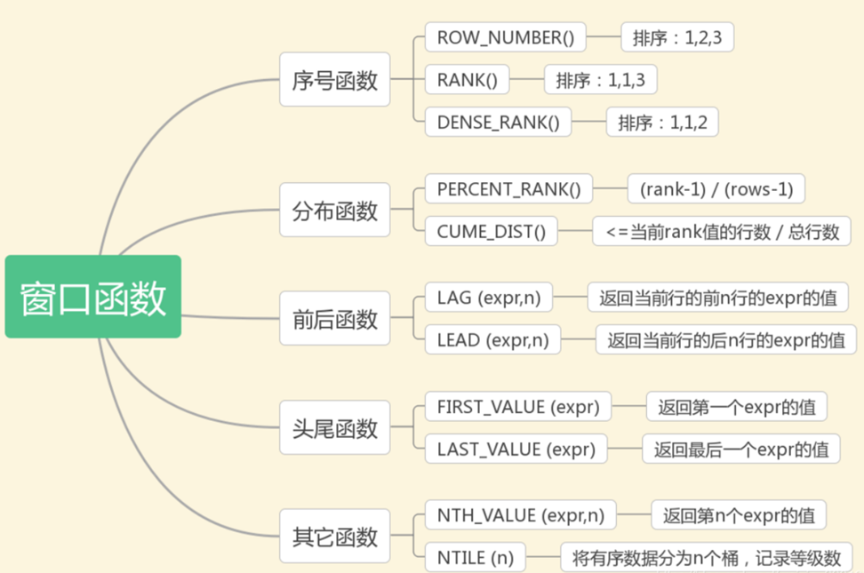
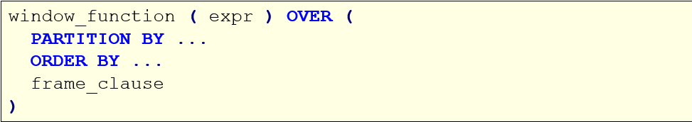
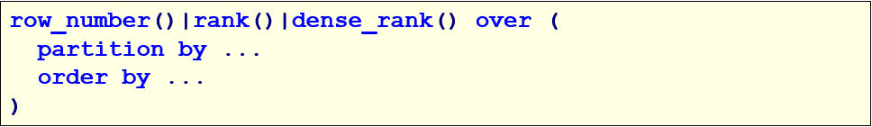

# MySQL

## MySQL的函数

### 1、概述

​	在MySQL中，为了提高代码重用性和隐藏的实现细节，MySQL提供了很多函数。函数可以理解为别人封装好的模板代码。

### 2、分类

​	在MySQL中，函数非常多，主要可以分为以下几类：

1. 聚合函数
2. 数学函数
3. 字符串函数
4. 日期函数
5. 控制流函数
6. 窗口函数

### 3、聚合函数

- 概述
  在MySQL中，聚合函数主要由：count，sum，min，max， avg，这些聚合函数我们之前都学过，不再重复。这里我们学习另外一个函数：group_concat()，该函数用于实现行的合并。
  group_concat()函数首先根据group by指定的列进行分组，并且用分隔符分隔，将同一个分组中的值连接起来，返回一个字符串。

- 格式
  说明：

  1. 使用distinct可以排除重复值；
  2. 如果需要对结果的值进行排序，可以使用order by子句；
  3. separator是一个字符串值，默认为逗号。

- 操作

  ```sql
  -- 一、聚合函数
  -- 这里我们只学习group_concat()函数
  
  -- 1、将所有员工的名字合并成一行
  SELECT GROUP_CONCAT(emp_name) FROM emp;
  
  -- 2、指定分隔符合并
  SELECT GROUP_CONCAT(emp_name SEPARATOR ';') FROM emp;
  
  -- 3、指定排序方式和分隔符
  -- 使用group by分组之后，concat会将每一组的数据进行合并
  SELECT department, GROUP_CONCAT(emp_name SEPARATOR ';') FROM emp GROUP BY department;
  SELECT department, GROUP_CONCAT(emp_name ORDER BY salary DESC SEPARATOR ';') FROM emp GROUP BY department;
  ```

### 4、数学函数

| **函数名**                              | **描述**                    | **实例**                                                     |
| --------------------------------------- | --------------------------- | ------------------------------------------------------------ |
| **ABS(x)**                              | 返回 x 的绝对值             | 返回 -1 的绝对值：  SELECT  ABS(-1) -- 返回1                 |
| **CEIL(x)**                             | 返回大于或等于 x 的最小整数 | SELECT  CEIL(1.5) -- 返回2                                   |
| **FLOOR(x)**                            | 返回小于或等于 x 的最大整数 | 小于或等于  1.5 的整数：  SELECT  FLOOR(1.5) -- 返回1        |
| **GREATEST(expr1, expr2, expr3,  ...)** | 返回列表中的最大值          | 返回以下数字列表中的最大值：  SELECT  GREATEST(3, 12, 34, 8, 25); -- 34  返回以下字符串列表中的最大值：  SELECT  GREATEST("Google", "Runoob", "Apple");  -- Runoob |
| **LEAST(expr1, expr2, expr3, ...)**     | 返回列表中的最小值          | 返回以下数字列表中的最小值：  SELECT  LEAST(3, 12, 34, 8, 25); -- 3  返回以下字符串列表中的最小值：  SELECT  LEAST("Google", "Runoob",  "Apple");  -- Apple |

| **函数名**          | **描述**                       | **实例**                                                     |
| ------------------- | ------------------------------ | ------------------------------------------------------------ |
| **MAX(expression)** | 返回字段 expression 中的最大值 | 返回数据表  Products 中字段  Price 的最大值：  SELECT  MAX(Price) AS LargestPrice FROM Products; |
| **MIN(expression)** | 返回字段 expression 中的最小值 | 返回数据表  Products 中字段  Price 的最小值：  SELECT  MIN(Price) AS MinPrice FROM Products; |
| **MOD(x,y)**        | 返回 x 除以 y 以后的余数       | 5 除于 2 的余数：  SELECT  MOD(5,2) -- 1                     |
| **PI()**            | 返回圆周率(3.141593）          | SELECT  PI() --3.141593                                      |
| **POW(x,y)**        | 返回 x 的 y 次方               | 2 的 3 次方：  SELECT  POW(2,3) -- 8                         |

| **函数名**        | **描述**                                                     | **实例**                             |
| ----------------- | ------------------------------------------------------------ | ------------------------------------ |
| **RAND()**        | 返回 0 到 1 的随机数                                         | SELECT  RAND() --0.93099315644334    |
| **ROUND(x)**      | 返回离 x 最近的整数（遵循四舍五入）                          | SELECT  ROUND(1.23456) --1           |
| **ROUND(x,y)**    | 返回指定位数的小数（遵循四舍五入）                           | SELECT  ROUND(1.23456,3) –1.235      |
| **TRUNCATE(x,y)** | 返回数值 x 保留到小数点后 y 位的值（与  ROUND 最大的区别是不会进行四舍五入） | SELECT  TRUNCATE(1.23456,3) -- 1.234 |

- 操作

  ```sql
  -- 二、数学函数
  -- 求绝对值
  SELECT ABS(-10);	-- 10
  SELECT ABS(10);		-- 10
  
  
  -- 向上取整
  SELECT CEIL(1.5);	-- 2
  SELECT CEIL(1.0);	-- 1
  
  -- 向下取整
  SELECT FLOOR(1.1);	-- 1
  SELECT FLOOR(1.9);	-- 1
  
  -- 取列表最大值
  SELECT GREATEST(1,2,3);	-- 3
  
  -- 取列表最小值
  SELECT LEAST(1,2,3);	-- 1
  
  -- 取模
  SELECT MOD(5, 2);	-- 1
  
  -- 取x的y次方
  SELECT POW(2, 3);	-- 8
  
  -- 取随机数
  SELECT RAND();
  SELECT FLOOR(RAND() * 100);
  
  -- 取小数的四舍五入
  SELECT ROUND(3.1415);	-- 3
  SELECT ROUND(3.5454);	-- 4
  SELECT ROUND(3.5415, 3);	-- 3.542
  
  -- 将小数直接截取到指定位数
  SELECT TRUNCATE(3.1415,3);	-- 3.141
  ```

### 5、字符串函数

| **函数**                     | **描述**                                                     | **实例**                                                     |
| ---------------------------- | ------------------------------------------------------------ | ------------------------------------------------------------ |
| **CHAR_LENGTH(s)**           | 返回字符串 s 的字符数                                        | 返回字符串  RUNOOB 的字符数  SELECT  CHAR_LENGTH("RUNOOB") AS LengthOfString; |
| **CHARACTER_LENGTH(s)**      | 返回字符串 s 的字符数                                        | 返回字符串  RUNOOB 的字符数  SELECT  CHARACTER_LENGTH("RUNOOB") AS LengthOfString; |
| **CONCAT(s1,s2...sn)**       | 字符串 s1,s2 等多个字符串合并为一个字符串                    | 合并多个字符串  SELECT  CONCAT("SQL ", "Runoob ", "Gooogle ",  "Facebook") AS ConcatenatedString; |
| **CONCAT_WS(x, s1,s2...sn)** | 同 CONCAT(s1,s2,...) 函数，但是每个字符串之间要加上 x，x 可以是分隔符 | 合并多个字符串，并添加分隔符：  SELECT  CONCAT_WS("-", "SQL", "Tutorial",  "is", "fun!")AS ConcatenatedString; |
| **FIELD(s,s1,s2...)**        | 返回第一个字符串 s 在字符串列表(s1,s2...)中的位置            | 返回字符串 c 在列表值中的位置：  SELECT  FIELD("c", "a", "b", "c",  "d", "e"); |

| **函数**              | **描述**                                                     | **实例**                                                     |
| --------------------- | ------------------------------------------------------------ | ------------------------------------------------------------ |
| **LTRIM(s)**          | 去掉字符串 s 开始处的空格                                    | 去掉字符串  RUNOOB开始处的空格：  SELECT  LTRIM("  RUNOOB") AS  LeftTrimmedString;-- RUNOOB |
| **MID(s,n,len)**      | 从字符串 s 的 n 位置截取长度为  len 的子字符串，同  SUBSTRING(s,n,len) | 从字符串  RUNOOB 中的第 2 个位置截取 3个  字符：  SELECT  MID("RUNOOB", 2, 3) AS ExtractString; -- UNO |
| **POSITION(s1 IN s)** | 从字符串 s 中获取 s1 的开始位置                              | 返回字符串  abc 中 b 的位置：  SELECT  POSITION('b' in 'abc') -- 2 |
| **REPLACE(s,s1,s2)**  | 将字符串 s2 替代字符串 s 中的字符串 s1                       | 将字符串  abc 中的字符 a 替换为字符 x：  SELECT  REPLACE('abc','a','x') --xbc |
| **REVERSE(s)**        | 将字符串s的顺序反过来                                        | 将字符串 abc 的顺序反过来：  SELECT  REVERSE('abc')  -- cba  |

| **函数**                        | **描述**                                                     | **实例**                                                     |
| ------------------------------- | ------------------------------------------------------------ | ------------------------------------------------------------ |
| **RIGHT(s,n)**                  | 返回字符串 s 的后 n 个字符                                   | 返回字符串  runoob 的后两个字符：  SELECT  RIGHT('runoob',2) -- ob |
| **RTRIM(s)**                    | 去掉字符串 s 结尾处的空格                                    | 去掉字符串  RUNOOB 的末尾空格：  SELECT  RTRIM("RUNOOB   ") AS  RightTrimmedString;  -- RUNOOB |
| **STRCMP(s1,s2)**               | 比较字符串 s1 和 s2，如果 s1  与 s2  相等返回 0 ，如果  s1>s2 返回 1，如果  s1<s2 返回 -1 | 比较字符串：  SELECT  STRCMP("runoob", "runoob"); -- 0       |
| **SUBSTR(s, start, length)**    | 从字符串 s 的 start 位置截取长度为  length 的子字符串        | 从字符串  RUNOOB 中的第 2 个位置截取 3个  字符：  SELECT  SUBSTR("RUNOOB", 2, 3) AS ExtractString; -- UNO |
| **SUBSTRING(s, start, length)** | 从字符串 s 的 start 位置截取长度为  length 的子字符串        | 从字符串  RUNOOB 中的第 2 个位置截取 3个  字符：  SELECT  SUBSTRING("RUNOOB", 2, 3) AS ExtractString;  -- UNO |

| **函数**     | **描述**                            | **实例**                                                     |
| ------------ | ----------------------------------- | ------------------------------------------------------------ |
| **TRIM(s)**  | 去掉字符串 s 开始和结尾处的空格     | 去掉字符串  RUNOOB 的首尾空格：  SELECT  TRIM('  RUNOOB  ') AS TrimmedString; |
| **UCASE(s)** | 将字符串转换为大写                  | 将字符串  runoob 转换为大写：  SELECT  UCASE("runoob"); -- RUNOOB |
| **UPPER(s)** | 将字符串转换为大写                  | 将字符串  runoob 转换为大写：  SELECT  UPPER("runoob"); -- RUNOOB |
| **LCASE(s)** | 将字符串  s  的所有字母变成小写字母 | 字符串  RUNOOB 转换为小写：  SELECT LCASE('RUNOOB') --  runoob |
| **LOWER(s)** | 将字符串  s  的所有字母变成小写字母 | 字符串  RUNOOB 转换为小写：  SELECT LOWER('RUNOOB') -- runoob |

- 操作

  ```sql
  -- 三、字符串函数
  
  -- 获取字符串字符个数
  SELECT CHAR_LENGTH('hello');	-- 5
  SELECT CHAR_LENGTH('你好吗');	-- 3
  
  SELECT LENGTH('hello');		-- 5
  SELECT LENGTH('你好吗');	-- 9
  
  -- 字符串合并
  SELECT CONCAT('hello','world');
  
  -- 指定分隔符进行字符串合并
  SELECT CONCAT_WS(' ', 'hello','world');
  
  -- 返回字符串在列表中第一次出现的位置
  SELECT field('aaa', 'aaa', 'bbb', 'ccc');
  SELECT field('bbb', 'aaa', 'bbb', 'ccc');
  
  -- 去除字符串左边空格
  SELECT ltrim('   aaa');
  
  -- 去除字符串右边空格
  SELECT rtrim('aaa   ');
  
  -- 字符串截取
  -- 从第二个字符开始截取，截取长度为3
  SELECT MID("hello world",2,3)
  
  -- 获取字符串A在字符串中出现的位置
  SELECT POSITION('abc' IN 'habcelloaidislj');
  
  -- 字符串替换
  SELECT REPLACE('helloaaaworld','aaa','bbb');
  
  -- 字符串反转
  SELECT REVERSE('hello');
  
  -- 返回字符串的后几个字符
  SELECT right('hello', 3);	-- 返回最后三个字符
  
  -- 字符串比较
  -- 字典序比较
  SELECT STRCMP('hello', 'world');
  
  -- 字符串截取
  SELECT SUBSTR('hello', 2, 3);
  
  -- 小写转大写
  SELECT UCASE("hello world");
  SELECT UPPER("hello world");
  
  -- 大写转小写
  SELECT LCASE("HELLO WORLD");
  SELECT LOWER("HELLO WORLD");
  ```

### 6、日期函数

| **函数名**                                           | **描述**                               | **实例**                                                     |
| ---------------------------------------------------- | -------------------------------------- | ------------------------------------------------------------ |
| **UNIX_TIMESTAMP()**                                 | 返回从1970-01-01  00:00:00到当前毫秒值 | select  UNIX_TIMESTAMP() -> 1632729059                       |
| **UNIX_TIMESTAMP(****DATE_STRING****)**              | 将制定日期转为毫秒值时间戳             | SELECT  UNIX_TIMESTAMP('2011-12-07 13:01:03');               |
| **FROM_UNIXTIME(BIGINT UNIXTIME[,  STRING FORMAT])** | 将毫秒值时间戳转为指定格式日期         | SELECT  FROM_UNIXTIME(1598079966,'%Y-%m-%d %H:%i:%s'); (1598079966,'%Y-%m-%d  %H:%i:%s'); -> 2020-08-22 15-06-06 |
| **CURDATE()**                                        | 返回当前日期                           | SELECT  CURDATE();  ->  2018-09-19                           |
| **CURRENT_DATE()**                                   | 返回当前日期                           | SELECT  CURRENT_DATE();  ->  2018-09-19                      |

| **函数名**              | **描述**                           | **实例**                                             |
| ----------------------- | ---------------------------------- | ---------------------------------------------------- |
| **CURRENT_TIME**        | 返回当前时间                       | SELECT  CURRENT_TIME();  ->  19:59:02                |
| **CURTIME()**           | 返回当前时间                       | SELECT  CURTIME();  ->  19:59:02                     |
| **CURRENT_TIMESTAMP()** | 返回当前日期和时间                 | SELECT  CURRENT_TIMESTAMP()  ->  2018-09-19 20:57:43 |
| **DATE()**              | 从日期或日期时间表达式中提取日期值 | SELECT  DATE("2017-06-15");    ->  2017-06-15        |
| **DATEDIFF(d1,d2)**     | 计算日期 d1->d2 之间相隔的天数     | SELECT  DATEDIFF('2001-01-01','2001-02-02')  ->  -32 |

| **函数名**                            | **描述**                       | **实例**                                                     |
| ------------------------------------- | ------------------------------ | ------------------------------------------------------------ |
| **TIMEDIFF(time1, time2)**            | 计算时间差值                   | SELECT  TIMEDIFF("13:10:11", "13:10:10");  ->  00:00:01      |
| **DATE_FORMAT(d,f)**                  | 按表达式 f的要求显示日期 d     | SELECT  DATE_FORMAT('2011-11-11 11:11:11','%Y-%m-%d %r')  ->  2011-11-11 11:11:11 AM |
| **STR_TO_DATE(string, format_mask)**  | 将字符串转变为日期             | SELECT  STR_TO_DATE("August 10 2017", "%M %d %Y");  ->  2017-08-10 |
| **DATE_SUB(date,INTERVAL expr type)** | 函数从日期减去指定的时间间隔。 | Orders 表中 OrderDate 字段减去 2 天：  SELECT  OrderId,DATE_SUB(OrderDate,INTERVAL 2  DAY) AS OrderPayDate  FROM  Orders |

| **函数名**                                  | **描述**                                                     | **实例**                                                     |
| ------------------------------------------- | ------------------------------------------------------------ | ------------------------------------------------------------ |
| **DATE_ADD(d****，****INTERVAL expr type)** | 计算起始日期 d 加上一个时间段后的日期，type  值可以是：  ·SECOND_MICROSECOND  ·MINUTE_MICROSECOND  ·MINUTE_SECOND  ·HOUR_MICROSECOND  ·HOUR_SECOND  ·HOUR_MINUTE  ·DAY_MICROSECOND  ·DAY_SECOND  ·DAY_MINUTE  ·DAY_HOUR  ·YEAR_MONTH | SELECT  DATE_ADD("2017-06-15", INTERVAL 10 DAY);    ->  2017-06-25     SELECT  DATE_ADD("2017-06-15 09:34:21", INTERVAL 15 MINUTE);  ->  2017-06-15 09:49:21     SELECT  DATE_ADD("2017-06-15 09:34:21", INTERVAL -3 HOUR);  ->2017-06-15  06:34:21     SELECT  DATE_ADD("2017-06-15 09:34:21", INTERVAL -3 HOUR);  ->2017-04-15 |

| **EXTRACT(type FROM d)**        | **从日期** **d** **中获取指定的值，****type** **指定返回的值。****     type****可取值为：**  ·**MICROSECOND**  ·**SECOND**  ·**MINUTE**  ·**HOUR**  **…..** | **SELECT EXTRACT(MINUTE FROM '2011-11-11 11:11:11')**   **-> 11** |
| ------------------------------- | ------------------------------------------------------------ | ------------------------------------------------------------ |
| **LAST_DAY(d)**                 | 返回给给定日期的那一月份的最后一天                           | SELECT  LAST_DAY("2017-06-20");  ->  2017-06-30              |
| **MAKEDATE(year, day-of-year)** | 基于给定参数年份 year 和所在年中的天数序号  day-of-year 返回一个日期 | SELECT  MAKEDATE(2017, 3);  ->  2017-01-03                   |

| **函数名**     | **描述**                         | **实例**                                      |
| -------------- | -------------------------------- | --------------------------------------------- |
| **YEAR(d)**    | 返回年份                         | SELECT  YEAR("2017-06-15");  ->  2017         |
| **MONTH(d)**   | 返回日期d中的月份值，1 到 12     | SELECT  MONTH('2011-11-11 11:11:11')  ->11    |
| **DAY(d)**     | 返回日期值 d 的日期部分          | SELECT  DAY("2017-06-15");   ->  15           |
| **HOUR(t)**    | 返回 t 中的小时值                | SELECT  HOUR('1:2:3')  ->  1                  |
| **MINUTE(t)**  | 返回 t 中的分钟值                | SELECT  MINUTE('1:2:3')  ->  2                |
| **SECOND(t)**  | 返回 t 中的秒钟值                | SELECT  SECOND('1:2:3')  ->  3                |
| **QUARTER(d)** | 返回日期d是第几季节，返回 1 到 4 | SELECT  QUARTER('2011-11-11 11:11:11')  ->  4 |

| **函数名**        | **描述**                                          | **实例**                                               |
| ----------------- | ------------------------------------------------- | ------------------------------------------------------ |
| **MONTHNAME(d)**  | 返回日期当中的月份名称，如  November              | SELECT  MONTHNAME('2011-11-11 11:11:11')  ->  November |
| **MONTH(d)**      | 返回日期d中的月份值，1 到 12                      | SELECT  MONTH('2011-11-11 11:11:11')  ->11             |
| **DAYNAME(d)**    | 返回日期 d 是星期几，如  Monday,Tuesday           | SELECT  DAYNAME('2011-11-11 11:11:11')  ->Friday       |
| **DAYOFMONTH(d)** | 计算日期 d 是本月的第几天                         | SELECT  DAYOFMONTH('2011-11-11 11:11:11')  ->11        |
| **DAYOFWEEK(d)**  | 日期 d 今天是星期几，1 星期日，2 星期一，以此类推 | SELECT  DAYOFWEEK('2011-11-11 11:11:11')  ->6          |
| **DAYOFYEAR(d)**  | 计算日期 d 是本年的第几天                         | SELECT  DAYOFYEAR('2011-11-11 11:11:11')  ->315        |

| **函数名**               | **描述**                                                     | **实例**                                          |
| ------------------------ | ------------------------------------------------------------ | ------------------------------------------------- |
| **WEEK(d)**              | 计算日期 d 是本年的第几个星期，范围是 0 到 53                | SELECT  WEEK('2011-11-11 11:11:11')  ->  45       |
| **WEEKDAY(d)**           | 日期 d 是星期几，0 表示星期一，1 表示星期二                  | SELECT  WEEKDAY("2017-06-15");  ->  3             |
| **WEEKOFYEAR(d)**        | 计算日期 d 是本年的第几个星期，范围是 0 到 53                | SELECT  WEEKOFYEAR('2011-11-11 11:11:11')  ->  45 |
| **YEARWEEK(date, mode)** | 返回年份及第几周（0到53），mode 中 0 表示周天，1表示周一，以此类推 | SELECT  YEARWEEK("2017-06-15");  ->  201724       |
| **NOW()**                | 返回当前日期和时间                                           | SELECT  NOW()  ->  2018-09-19 20:57:43            |

- 操作

  ```sql
  -- 四、日期函数
  
  -- 获取时间戳（毫秒值）
  SELECT UNIX_TIMESTAMP();
  
  -- 将一个日期字符串转为毫秒值
  SELECT UNIX_TIMESTAMP('2021-12-21 08:08:08');
  
  -- 将时间戳毫秒值转为指定格式的日期
  SELECT FROM_UNIXTIME(UNIX_TIMESTAMP(),'%Y-%m-%d %H:%i:%s');
  
  -- 获取当前的年月日
  SELECT CURDATE();
  SELECT CURRENT_DATE();
  
  -- 获取当前的时分秒
  SELECT CURRENT_TIME();
  SELECT CURTIME();
  
  -- 获取年月日和时分秒
  SELECT CURRENT_TIMESTAMP();
  
  -- 从日期字符串中获取年月日
  SELECT DATE(CURRENT_TIMESTAMP());
  
  -- 获取日期之间的差值
  SELECT DATEDIFF(CURRENT_DATE(),CURRENT_DATE());
  
  -- 获取时间差值（秒级）
  SELECT TIMEDIFF('12:12:34','10:18:56');
  
  -- 日期格式化
  SELECT DATE_FORMAT('2021-1-1 1:1:1','%Y-%m-%d %H:%i:%s');
  
  -- 将字符串转为日期
  SELECT STR_TO_DATE('2021-1-1 1:1:1','%Y-%m-%d %H:%i:%s')
  
  -- 将日期进行减法
  SELECT DATE_SUB('2021-10-01',INTERVAL 2 DAY);
  SELECT DATE_SUB('2021-10-01',INTERVAL 2 MONTH);
  
  -- 将日期进行加法
  SELECT DATE_ADD('2021-10-01',INTERVAL 2 DAY);
  SELECT DATE_ADD('2021-10-01',INTERVAL 2 MONTH);
  
  -- 从日期中获取小时/年/月
  SELECT EXTRACT(HOUR FROM '2021-12-13 11:12:13');
  SELECT EXTRACT(YEAR FROM '2021-12-13 11:12:13');
  SELECT EXTRACT(MONTH FROM '2021-12-13 11:12:13');
  
  -- 获取给定日期所在月的最后一天
  SELECT LAST_DAY('2021-10-01');
  
  -- 获取指定年份和天数的日期
  SELECT MAKEDATE('2021',53);
  
  -- 根据日期获取年月日，时分秒
  SELECT YEAR('2021-12-13 11:12:13');
  SELECT MONTH('2021-12-13 11:12:13');
  SELECT MINUTE('2021-12-13 11:12:13');
  
  -- 根据日期获取信息
  SELECT MONTHNAME('2021-12-13 11:12:13');
  SELECT DAYNAME('2021-12-13 11:12:13');
  SELECT DAYOFMONTH('2021-12-13 11:12:13');
  SELECT DAYOFWEEK('2021-12-13 11:12:13');
  SELECT DAYOFYEAR('2021-12-13 11:12:13');
  
  -- 
  SELECT WEEK('2021-12-13 11:12:13');
  SELECT WEEKDAY('2021-12-13 11:12:13');
  SELECT YEARWEEK('2021-12-13 11:12:13');
  SELECT NOW();
  ```

### 7、控制流函数

- if逻辑判断语句

  | **格式**                                                     | **解释**                                                     | **案例**                                         |
  | ------------------------------------------------------------ | ------------------------------------------------------------ | ------------------------------------------------ |
  | **IF(expr,v1,v2)**                                           | 如果表达式 expr 成立，返回结果 v1；否则，返回结果 v2。       | SELECT  IF(1 > 0,'正确','错误')    ->正确        |
  | **[IFNULL(v1,v2)](https://www.runoob.com/mysql/mysql-func-ifnull.html)** | 如果 v1 的值不为  NULL，则返回 v1，否则返回 v2。             | SELECT  IFNULL(null,'Hello Word')  ->Hello  Word |
  | **ISNULL(expression)**                                       | 判断表达式是否为 NULL                                        | SELECT  ISNULL(NULL);  ->1                       |
  | **NULLIF(expr1, expr2)**                                     | 比较两个字符串，如果字符串  expr1 与  expr2 相等  返回  NULL，否则返回  expr1 | SELECT  NULLIF(25, 25);  ->                      |

  操作：

  ```sql
  -- IF逻辑控制语句
  SELECT IF(5 > 3, '大于', '小于');
  USE mydb3;
  SELECT IF(score >= 85, '优秀', '及格') flag FROM score;
  
  SELECT IFNULL(5,0);
  SELECT IFNULL(NULL,0);
  
  USE test1;
  SELECT *, IFNULL(comm,0) comm_flag FROM emp;
  
  SELECT ISNULL(5);	-- 0
  SELECT ISNULL(NULL);	-- 1
  
  SELECT NULLIF(12,12);	-- NULL
  SELECT NULLIF(12,13);	-- 12
  ```

- case when语句

  | **格式**                                                     | **解释**                                                     | **操作**                                                     |
  | ------------------------------------------------------------ | ------------------------------------------------------------ | ------------------------------------------------------------ |
  | **CASE expression**    **WHEN condition1 THEN  result1**    **WHEN condition2 THEN  result2**    **...**    **WHEN conditionN THEN  resultN**    **ELSE result**  **END** | CASE 表示函数开始，END  表示函数结束。如果  condition1 成立，则返回  result1, 如果  condition2 成立，则返回  result2，当全部不成立则返回  result，而当有一个成立之后，后面的就不执行了。 | select  case 100 when 50 then 'tom' when 100 then 'mary'else 'tim'  end ;        select case when 1=2 then 'tom' when  2=2 then 'mary' else'tim' end ; |

  操作：

  ```sql
  -- CASE WHEN语句
  
  SELECT
  	CASE 5
  		WHEN 1 THEN '你好'
  		WHEN 2 THEN 'hello'
  		WHEN 5 THEN '正确'
  		ELSE
  			'其他'
  	END AS info;
  	
  SELECT
  	CASE 
  		WHEN 2 > 1 THEN '你好'
  		WHEN 2 < 1 THEN 'hello'
  		WHEN 3 > 2 THEN '正确'
  		ELSE
  			'其他'
  	END AS info;
  
  use mydb4; 
  -- 创建订单表
  create table orders(
   oid int primary key, -- 订单id
   price double, -- 订单价格
   payType int -- 支付类型(1:微信支付 2:支付宝支付 3:银行卡支付 4：其他)
  );
   
  insert into orders values(1,1200,1);
  insert into orders values(2,1000,2);
  insert into orders values(3,200,3);
  insert into orders values(4,3000,1);
  insert into orders values(5,1500,2);
  
  -- 方式1
  SELECT
  CASE payType
  	WHEN 1 THEN '微信支付'
  	WHEN 2 THEN '支付宝支付'
  	WHEN 3 THEN '银行卡支付'
  	ELSE
  		'其他支付方式'
  END AS payTypeStr
  FROM orders;
  
  -- 方式2
  SELECT
  CASE 
  	WHEN payType = 1 THEN '微信支付'
  	WHEN payType = 2 THEN '支付宝支付'
  	WHEN payType = 3 THEN '银行卡支付'
  	ELSE
  		'其他支付方式'
  END AS payTypeStr
  FROM orders;
  ```

### 8、窗口函数

- 介绍
  MySQL 8.0 新增窗口函数。窗口函数又被称为开窗函数，与Oracle 窗口函数类似，属于MySQL的一大特点。
  非聚合窗口函数是相对于聚函数来说的。聚合函数是对一组数据计算后返回单个值（即分组），非聚合函数一次只会处理一行数据。窗口聚合函数在行记录上计算某个字段的结果时，可将窗口范围内的数据输入到聚合函数中，并不改变行数。

- 分类

  另外还有开窗聚合函数: SUM,AVG,MIN,MAX

- 语法结构
  

  其中，window_function 是窗口函数的名称；expr 是参数，有些函数不需要参数；OVER子句包含三个选项：

  - 分区（PARTITION BY）
    PARTITION BY选项用于将数据行拆分成多个分区（组），它的作用类似于GROUP BY分组。如果省略了 PARTITION BY，所有的数据作为一个组进行计算
  - 排序（ORDER BY）
    OVER 子句中的ORDER BY选项用于指定分区内的排序方式，与 ORDER BY 子句的作用类似
  - 以及窗口大小（frame_clause）。
    frame_clause选项用于在当前分区内指定一个计算窗口，也就是一个与当前行相关的数据子集

- 数据准备

  ```sql
  use mydb4; 
  create table employee( 
     dname varchar(20), -- 部门名 
     eid varchar(20), 
     ename varchar(20), 
     hiredate date, -- 入职日期 
     salary double -- 薪资
  ); 
  
  insert into employee values('研发部','1001','刘备','2021-11-01',3000);
  insert into employee values('研发部','1002','关羽','2021-11-02',5000);
  insert into employee values('研发部','1003','张飞','2021-11-03',7000);
  insert into employee values('研发部','1004','赵云','2021-11-04',7000);
  insert into employee values('研发部','1005','马超','2021-11-05',4000);
  insert into employee values('研发部','1006','黄忠','2021-11-06',4000);
  insert into employee values('销售部','1007','曹操','2021-11-01',2000);
  insert into employee values('销售部','1008','许褚','2021-11-02',3000);
  insert into employee values('销售部','1009','典韦','2021-11-03',5000);
  insert into employee values('销售部','1010','张辽','2021-11-04',6000);
  insert into employee values('销售部','1011','徐晃','2021-11-05',9000);
  insert into employee values('销售部','1012','曹洪','2021-11-06',6000);
  ```

  

#### 1.序号函数

序号函数有三个：ROW_NUMBER()、RANK()、DENSE_RANK()，可以用来实现分组排序，并添加序号。

- 格式
  

- 操作

  ```sql
  -- 序号函数
  -- 对每个部门的员工按照薪资排序，并给出排名
  SELECT
  dname,
  ename,
  salary,
  ROW_NUMBER() OVER(
  	PARTITION BY dname 
  	ORDER BY salary DESC
  ) AS rn
  FROM employee;
  
  -- RANK()如果排序的字段相同，那么标记序号相同，后面会将相同后的下一个字段跳过
  SELECT
  dname,
  ename,
  salary,
  RANK() OVER(
  	PARTITION BY dname 
  	ORDER BY salary DESC
  ) AS rn
  FROM employee;
  
  -- 相同的值依旧会标记，但是相同后的下一个字段不跳过
  SELECT
  dname,
  ename,
  salary,
  DENSE_RANK() OVER(
  	PARTITION BY dname 
  	ORDER BY salary DESC
  ) AS rn
  FROM employee;
  
  -- 求出每个部门薪资排在前三名的员工	-分组求TOPN
  -- 一定要用子查询，因为SELECT语句一定会先执行FROM和WHERE
  SELECT 
  * 
  FROM(
  	SELECT
  		dname,
  		ename,
  		salary,
  		DENSE_RANK() over(
  			PARTITION BY dname 
  			ORDER BY salary DESC
  		) AS rn
  	FROM employee
  ) t WHERE t.rn <= 3;
  
  -- 对所有员工进行全局排序（不分组）
  SELECT
  *
  FROM(
  	SELECT
  		dname,
  		ename,
  		salary,
  		DENSE_RANK() over(
  			ORDER BY salary DESC
  		) AS rn
  	FROM employee
  ) t WHERE t.rn <= 3;
  ```

#### 2.开窗聚合函数

- 概念
  在窗口中每条记录动态地应用聚合函数（SUM()、AVG()、MAX()、MIN()、COUNT()），可以动态计算在指定的窗口内的各种聚合函数值。

- 操作

  ```sql
  -- 开窗聚合函数
  
  -- 实现排序之后逐行值累加
  SELECT
  	dname,
  	ename,
  	salary,
  	SUM(salary) OVER(
  		PARTITION BY dname
  		ORDER BY hiredate
  	) AS pv1
  FROM employee;
  
  -- 如果没有加ORDER BY，默认把分组内的所有数据进行sum操作
  SELECT
  	dname,
  	ename,
  	salary,
  	SUM(salary) OVER(
  		PARTITION BY dname
  	) AS c1
  FROM employee;
  
  -- 从顶行加到当前行
  SELECT
  	dname,
  	ename,
  	hiredate,
  	salary,
  	SUM(salary) OVER(
  		PARTITION BY dname
  		ORDER BY hiredate
  		rows BETWEEN unbounded preceding AND current ROW 
  	) AS c1
  FROM employee;
  
  -- 从向上3行加到当前行
  SELECT
  	dname,
  	ename,
  	hiredate,
  	salary,
  	SUM(salary) OVER(
  		PARTITION BY dname
  		ORDER BY hiredate
  		rows BETWEEN 3 preceding AND current ROW 
  	) AS c1
  FROM employee;
  
  -- 向上三行加到向后一行
  SELECT
  	dname,
  	ename,
  	hiredate,
  	salary,
  	SUM(salary) OVER(
  		PARTITION BY dname
  		ORDER BY hiredate
  		rows BETWEEN 3 preceding AND 1 following
  	) AS c1
  FROM employee;
  
  -- 从当前行加到最后
  SELECT
  	dname,
  	ename,
  	hiredate,
  	salary,
  	SUM(salary) OVER(
  		PARTITION BY dname
  		ORDER BY hiredate
  		rows BETWEEN current row AND unbounded following
  	) AS c1
  FROM employee;
  ```

#### 3.分布函数

- CUME_DIST

  - 介绍

    - 用途：分组内小于、等于当前rank值的行数 / 分组内总行数
    - 应用场景：查询小于等于当前薪资（salary）的比例

  - 操作

    ```sql
    /*
    rn1: 没有partition,所有数据均为1组，总行数为12，
         第一行：小于等于3000的行数为3，因此，3/12=0.25
         第二行：小于等于4000的行数为5，因此，5/12=0.4166666666666667
    rn2: 按照部门分组，dname='研发部'的行数为6,
         第一行：研发部小于等于3000的行数为1，因此，1/6=0.16666666666666666
    */
    
    SELECT
    	dname,
    	ename,
    	salary,
    	CUME_DIST() OVER(
    		ORDER BY salary
    	) AS rn1,
    	CUME_DIST() OVER(
    		PARTITION BY dname
    		ORDER BY salary
    	) AS rn2
    FROM employee;
    ```

- PERCENT_RANK

  - 介绍

    - 用途：每行按照公式(rank-1) / (rows-1)进行计算。其中，rank为RANK()函数产生的序号，rows为当前窗口的记录总行数
    - 应用场景：不常用

  - 操作

    ```sql
    /*
     rn2:
      第一行: (1 - 1) / (6 - 1) = 0
      第二行: (1 - 1) / (6 - 1) = 0
      第三行: (3 - 1) / (6 - 1) = 0.4
    */
    SELECT
    	dname,
    	ename,
    	salary,
    	RANK() OVER(
    		PARTITION BY dname
    		ORDER BY salary DESC
    	) AS rn1,
    	PERCENT_RANK() OVER(
    		PARTITION BY dname
    		ORDER BY salary
    	) AS rn2
    FROM employee;
    ```

#### 4.前后函数-LAG和LEAD

- 介绍

  - 用途：返回位于当前行的前n行（LAG(expr,n)）或后n行（LEAD(expr,n)）的expr的值
  - 应用场景：查询前1名同学的成绩和当前同学成绩的差值

- 操作

  ```sql
  -- 前后函数
  
  -- LAG的用法
  SELECT
  	dname,
  	ename,
  	salary,
  	hiredate,
  	LAG(hiredate, 1, '2000-01-01') OVER(
  		PARTITION BY dname
  		ORDER BY hiredate
  	) AS time1,
  	LAG(hiredate, 2) OVER(
  		PARTITION BY dname
  		ORDER BY hiredate
  	) AS time2
  FROM employee;
  
  -- LEAD的用法
  SELECT
  	dname,
  	ename,
  	salary,
  	hiredate,
  	LEAD(hiredate, 1, '2000-01-01') OVER(
  		PARTITION BY dname
  		ORDER BY hiredate
  	) AS time1,
  	LEAD(hiredate, 2) OVER(
  		PARTITION BY dname
  		ORDER BY hiredate
  	) AS time2
  FROM employee;
  ```
  

#### 5.头尾函数-FIRST_VALUE和LAST_VALUE

- 介绍

  - 用途：返回第一个（FIRST_VALUE(expr)）或最后一个（LAST_VALUE(expr)）expr的值
  - 应用场景：截止到当前，按照日期排序查询第1个入职和最后1个入职员工的薪资

- 操作

  ```sql
  -- 头尾函数
  
  -- 注意,  如果不指定ORDER BY，则进行排序混乱，会出现错误的结果
  SELECT
  	dname,
  	ename,
  	salary,
  	hiredate,
  	FIRST_VALUE(salary) OVER(
  		PARTITION BY dname
  		ORDER BY hiredate
  	) AS first,
  	LAST_VALUE(salary) OVER(
  		PARTITION BY dname
  		ORDER BY hiredate
  	) AS last
  FROM employee;
  ```

#### 6.其他函数-NTH_VALUE(expr, n)、NTILE(n)

- NTH_VALUE(expr, n)

  - 介绍

    - 用途：返回窗口中第n个expr的值。expr可以是表达式，也可以是列名
    - 应用场景：截止到当前薪资，显示每个员工的薪资中排名第2或者第3的薪资

  - 操作

    ```sql
    -- NTH_VALUE(expr, n)
    SELECT
    	dname,
    	ename,
    	salary,
    	hiredate,
    	NTH_VALUE(salary, 2) OVER(
    		PARTITION BY dname
    		ORDER BY hiredate
    	) AS second_score,
    	NTH_VALUE(salary, 3) OVER(
    		PARTITION BY dname
    		ORDER BY hiredate
    	) AS third_score
    FROM employee;
    ```

- NTILE(n)

  - 介绍-NTILE

    - 用途：将分区中的有序数据分为n个等级，记录等级数
    - 应用场景：将每个部门员工按照入职日期分成3组

  - 操作

    ```sql
    -- NTILE(n)
    -- 基本上是均分的
    -- 优先前面的分组数量多
    SELECT
    	dname,
    	ename,
    	salary,
    	hiredate,
    	NTILE(3) OVER(
    		PARTITION BY dname
    		ORDER BY hiredate
    	) AS nt
    FROM employee;
    
    -- 取出每一个部门的第一组员工
    SELECT
    *
    FROM(
    	SELECT
    		dname,
    		ename,
    		salary,
    		hiredate,
    		NTILE(3) OVER(
    			PARTITION BY dname
    			ORDER BY hiredate
    		) AS nt
    	FROM employee
    ) t
    WHERE t.nt = 1;
    ```