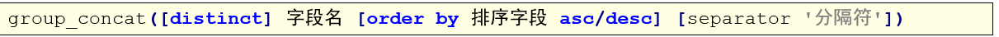

# MySQL

## MySQL的函数

### 1、概述

​	在MySQL中，为了提高代码重用性和隐藏的实现细节，MySQL提供了很多函数。函数可以理解为别人封装好的模板代码。

### 2、分类

​	在MySQL中，函数非常多，主要可以分为以下几类：

1. 聚合函数
2. 数学函数
3. 字符串函数
4. 日期函数
5. 控制流函数
6. 窗口函数

### 3、聚合函数

- 概述
  在MySQL中，聚合函数主要由：count，sum，min，max， avg，这些聚合函数我们之前都学过，不再重复。这里我们学习另外一个函数：group_concat()，该函数用于实现行的合并。
  group_concat()函数首先根据group by指定的列进行分组，并且用分隔符分隔，将同一个分组中的值连接起来，返回一个字符串。

- 格式
  说明：

  1. 使用distinct可以排除重复值；
  2. 如果需要对结果的值进行排序，可以使用order by子句；
  3. separator是一个字符串值，默认为逗号。

- 操作

  ```sql
  -- 一、聚合函数
  -- 这里我们只学习group_concat()函数
  
  -- 1、将所有员工的名字合并成一行
  SELECT GROUP_CONCAT(emp_name) FROM emp;
  
  -- 2、指定分隔符合并
  SELECT GROUP_CONCAT(emp_name SEPARATOR ';') FROM emp;
  
  -- 3、指定排序方式和分隔符
  -- 使用group by分组之后，concat会将每一组的数据进行合并
  SELECT department, GROUP_CONCAT(emp_name SEPARATOR ';') FROM emp GROUP BY department;
  SELECT department, GROUP_CONCAT(emp_name ORDER BY salary DESC SEPARATOR ';') FROM emp GROUP BY department;
  ```

### 4、数学函数

| **函数名**                              | **描述**                    | **实例**                                                     |
| --------------------------------------- | --------------------------- | ------------------------------------------------------------ |
| **ABS(x)**                              | 返回 x 的绝对值             | 返回 -1 的绝对值：  SELECT  ABS(-1) -- 返回1                 |
| **CEIL(x)**                             | 返回大于或等于 x 的最小整数 | SELECT  CEIL(1.5) -- 返回2                                   |
| **FLOOR(x)**                            | 返回小于或等于 x 的最大整数 | 小于或等于  1.5 的整数：  SELECT  FLOOR(1.5) -- 返回1        |
| **GREATEST(expr1, expr2, expr3,  ...)** | 返回列表中的最大值          | 返回以下数字列表中的最大值：  SELECT  GREATEST(3, 12, 34, 8, 25); -- 34  返回以下字符串列表中的最大值：  SELECT  GREATEST("Google", "Runoob", "Apple");  -- Runoob |
| **LEAST(expr1, expr2, expr3, ...)**     | 返回列表中的最小值          | 返回以下数字列表中的最小值：  SELECT  LEAST(3, 12, 34, 8, 25); -- 3  返回以下字符串列表中的最小值：  SELECT  LEAST("Google", "Runoob",  "Apple");  -- Apple |

| **函数名**          | **描述**                       | **实例**                                                     |
| ------------------- | ------------------------------ | ------------------------------------------------------------ |
| **MAX(expression)** | 返回字段 expression 中的最大值 | 返回数据表  Products 中字段  Price 的最大值：  SELECT  MAX(Price) AS LargestPrice FROM Products; |
| **MIN(expression)** | 返回字段 expression 中的最小值 | 返回数据表  Products 中字段  Price 的最小值：  SELECT  MIN(Price) AS MinPrice FROM Products; |
| **MOD(x,y)**        | 返回 x 除以 y 以后的余数       | 5 除于 2 的余数：  SELECT  MOD(5,2) -- 1                     |
| **PI()**            | 返回圆周率(3.141593）          | SELECT  PI() --3.141593                                      |
| **POW(x,y)**        | 返回 x 的 y 次方               | 2 的 3 次方：  SELECT  POW(2,3) -- 8                         |

| **函数名**        | **描述**                                                     | **实例**                             |
| ----------------- | ------------------------------------------------------------ | ------------------------------------ |
| **RAND()**        | 返回 0 到 1 的随机数                                         | SELECT  RAND() --0.93099315644334    |
| **ROUND(x)**      | 返回离 x 最近的整数（遵循四舍五入）                          | SELECT  ROUND(1.23456) --1           |
| **ROUND(x,y)**    | 返回指定位数的小数（遵循四舍五入）                           | SELECT  ROUND(1.23456,3) –1.235      |
| **TRUNCATE(x,y)** | 返回数值 x 保留到小数点后 y 位的值（与  ROUND 最大的区别是不会进行四舍五入） | SELECT  TRUNCATE(1.23456,3) -- 1.234 |

- 操作

  ```sql
  -- 二、数学函数
  -- 求绝对值
  SELECT ABS(-10);	-- 10
  SELECT ABS(10);		-- 10
  
  
  -- 向上取整
  SELECT CEIL(1.5);	-- 2
  SELECT CEIL(1.0);	-- 1
  
  -- 向下取整
  SELECT FLOOR(1.1);	-- 1
  SELECT FLOOR(1.9);	-- 1
  
  -- 取列表最大值
  SELECT GREATEST(1,2,3);	-- 3
  
  -- 取列表最小值
  SELECT LEAST(1,2,3);	-- 1
  
  -- 取模
  SELECT MOD(5, 2);	-- 1
  
  -- 取x的y次方
  SELECT POW(2, 3);	-- 8
  
  -- 取随机数
  SELECT RAND();
  SELECT FLOOR(RAND() * 100);
  
  -- 取小数的四舍五入
  SELECT ROUND(3.1415);	-- 3
  SELECT ROUND(3.5454);	-- 4
  SELECT ROUND(3.5415, 3);	-- 3.542
  
  -- 将小数直接截取到指定位数
  SELECT TRUNCATE(3.1415,3);	-- 3.141
  ```

### 5、字符串函数

| **函数**                     | **描述**                                                     | **实例**                                                     |
| ---------------------------- | ------------------------------------------------------------ | ------------------------------------------------------------ |
| **CHAR_LENGTH(s)**           | 返回字符串 s 的字符数                                        | 返回字符串  RUNOOB 的字符数  SELECT  CHAR_LENGTH("RUNOOB") AS LengthOfString; |
| **CHARACTER_LENGTH(s)**      | 返回字符串 s 的字符数                                        | 返回字符串  RUNOOB 的字符数  SELECT  CHARACTER_LENGTH("RUNOOB") AS LengthOfString; |
| **CONCAT(s1,s2...sn)**       | 字符串 s1,s2 等多个字符串合并为一个字符串                    | 合并多个字符串  SELECT  CONCAT("SQL ", "Runoob ", "Gooogle ",  "Facebook") AS ConcatenatedString; |
| **CONCAT_WS(x, s1,s2...sn)** | 同 CONCAT(s1,s2,...) 函数，但是每个字符串之间要加上 x，x 可以是分隔符 | 合并多个字符串，并添加分隔符：  SELECT  CONCAT_WS("-", "SQL", "Tutorial",  "is", "fun!")AS ConcatenatedString; |
| **FIELD(s,s1,s2...)**        | 返回第一个字符串 s 在字符串列表(s1,s2...)中的位置            | 返回字符串 c 在列表值中的位置：  SELECT  FIELD("c", "a", "b", "c",  "d", "e"); |

| **函数**              | **描述**                                                     | **实例**                                                     |
| --------------------- | ------------------------------------------------------------ | ------------------------------------------------------------ |
| **LTRIM(s)**          | 去掉字符串 s 开始处的空格                                    | 去掉字符串  RUNOOB开始处的空格：  SELECT  LTRIM("  RUNOOB") AS  LeftTrimmedString;-- RUNOOB |
| **MID(s,n,len)**      | 从字符串 s 的 n 位置截取长度为  len 的子字符串，同  SUBSTRING(s,n,len) | 从字符串  RUNOOB 中的第 2 个位置截取 3个  字符：  SELECT  MID("RUNOOB", 2, 3) AS ExtractString; -- UNO |
| **POSITION(s1 IN s)** | 从字符串 s 中获取 s1 的开始位置                              | 返回字符串  abc 中 b 的位置：  SELECT  POSITION('b' in 'abc') -- 2 |
| **REPLACE(s,s1,s2)**  | 将字符串 s2 替代字符串 s 中的字符串 s1                       | 将字符串  abc 中的字符 a 替换为字符 x：  SELECT  REPLACE('abc','a','x') --xbc |
| **REVERSE(s)**        | 将字符串s的顺序反过来                                        | 将字符串 abc 的顺序反过来：  SELECT  REVERSE('abc')  -- cba  |

| **函数**                        | **描述**                                                     | **实例**                                                     |
| ------------------------------- | ------------------------------------------------------------ | ------------------------------------------------------------ |
| **RIGHT(s,n)**                  | 返回字符串 s 的后 n 个字符                                   | 返回字符串  runoob 的后两个字符：  SELECT  RIGHT('runoob',2) -- ob |
| **RTRIM(s)**                    | 去掉字符串 s 结尾处的空格                                    | 去掉字符串  RUNOOB 的末尾空格：  SELECT  RTRIM("RUNOOB   ") AS  RightTrimmedString;  -- RUNOOB |
| **STRCMP(s1,s2)**               | 比较字符串 s1 和 s2，如果 s1  与 s2  相等返回 0 ，如果  s1>s2 返回 1，如果  s1<s2 返回 -1 | 比较字符串：  SELECT  STRCMP("runoob", "runoob"); -- 0       |
| **SUBSTR(s, start, length)**    | 从字符串 s 的 start 位置截取长度为  length 的子字符串        | 从字符串  RUNOOB 中的第 2 个位置截取 3个  字符：  SELECT  SUBSTR("RUNOOB", 2, 3) AS ExtractString; -- UNO |
| **SUBSTRING(s, start, length)** | 从字符串 s 的 start 位置截取长度为  length 的子字符串        | 从字符串  RUNOOB 中的第 2 个位置截取 3个  字符：  SELECT  SUBSTRING("RUNOOB", 2, 3) AS ExtractString;  -- UNO |

| **函数**     | **描述**                            | **实例**                                                     |
| ------------ | ----------------------------------- | ------------------------------------------------------------ |
| **TRIM(s)**  | 去掉字符串 s 开始和结尾处的空格     | 去掉字符串  RUNOOB 的首尾空格：  SELECT  TRIM('  RUNOOB  ') AS TrimmedString; |
| **UCASE(s)** | 将字符串转换为大写                  | 将字符串  runoob 转换为大写：  SELECT  UCASE("runoob"); -- RUNOOB |
| **UPPER(s)** | 将字符串转换为大写                  | 将字符串  runoob 转换为大写：  SELECT  UPPER("runoob"); -- RUNOOB |
| **LCASE(s)** | 将字符串  s  的所有字母变成小写字母 | 字符串  RUNOOB 转换为小写：  SELECT LCASE('RUNOOB') --  runoob |
| **LOWER(s)** | 将字符串  s  的所有字母变成小写字母 | 字符串  RUNOOB 转换为小写：  SELECT LOWER('RUNOOB') -- runoob |

- 操作

  ```sql
  -- 三、字符串函数
  
  -- 获取字符串字符个数
  SELECT CHAR_LENGTH('hello');	-- 5
  SELECT CHAR_LENGTH('你好吗');	-- 3
  
  SELECT LENGTH('hello');		-- 5
  SELECT LENGTH('你好吗');	-- 9
  
  -- 字符串合并
  SELECT CONCAT('hello','world');
  
  -- 指定分隔符进行字符串合并
  SELECT CONCAT_WS(' ', 'hello','world');
  
  -- 返回字符串在列表中第一次出现的位置
  SELECT field('aaa', 'aaa', 'bbb', 'ccc');
  SELECT field('bbb', 'aaa', 'bbb', 'ccc');
  
  -- 去除字符串左边空格
  SELECT ltrim('   aaa');
  
  -- 去除字符串右边空格
  SELECT rtrim('aaa   ');
  
  -- 字符串截取
  -- 从第二个字符开始截取，截取长度为3
  SELECT MID("hello world",2,3)
  
  -- 获取字符串A在字符串中出现的位置
  SELECT POSITION('abc' IN 'habcelloaidislj');
  
  -- 字符串替换
  SELECT REPLACE('helloaaaworld','aaa','bbb');
  
  -- 字符串反转
  SELECT REVERSE('hello');
  
  -- 返回字符串的后几个字符
  SELECT right('hello', 3);	-- 返回最后三个字符
  
  -- 字符串比较
  -- 字典序比较
  SELECT STRCMP('hello', 'world');
  
  -- 字符串截取
  SELECT SUBSTR('hello', 2, 3);
  
  -- 小写转大写
  SELECT UCASE("hello world");
  SELECT UPPER("hello world");
  
  -- 大写转小写
  SELECT LCASE("HELLO WORLD");
  SELECT LOWER("HELLO WORLD");
  ```

### 6、日期函数

| **函数名**                                           | **描述**                               | **实例**                                                     |
| ---------------------------------------------------- | -------------------------------------- | ------------------------------------------------------------ |
| **UNIX_TIMESTAMP()**                                 | 返回从1970-01-01  00:00:00到当前毫秒值 | select  UNIX_TIMESTAMP() -> 1632729059                       |
| **UNIX_TIMESTAMP(****DATE_STRING****)**              | 将制定日期转为毫秒值时间戳             | SELECT  UNIX_TIMESTAMP('2011-12-07 13:01:03');               |
| **FROM_UNIXTIME(BIGINT UNIXTIME[,  STRING FORMAT])** | 将毫秒值时间戳转为指定格式日期         | SELECT  FROM_UNIXTIME(1598079966,'%Y-%m-%d %H:%i:%s'); (1598079966,'%Y-%m-%d  %H:%i:%s'); -> 2020-08-22 15-06-06 |
| **CURDATE()**                                        | 返回当前日期                           | SELECT  CURDATE();  ->  2018-09-19                           |
| **CURRENT_DATE()**                                   | 返回当前日期                           | SELECT  CURRENT_DATE();  ->  2018-09-19                      |

| **函数名**              | **描述**                           | **实例**                                             |
| ----------------------- | ---------------------------------- | ---------------------------------------------------- |
| **CURRENT_TIME**        | 返回当前时间                       | SELECT  CURRENT_TIME();  ->  19:59:02                |
| **CURTIME()**           | 返回当前时间                       | SELECT  CURTIME();  ->  19:59:02                     |
| **CURRENT_TIMESTAMP()** | 返回当前日期和时间                 | SELECT  CURRENT_TIMESTAMP()  ->  2018-09-19 20:57:43 |
| **DATE()**              | 从日期或日期时间表达式中提取日期值 | SELECT  DATE("2017-06-15");    ->  2017-06-15        |
| **DATEDIFF(d1,d2)**     | 计算日期 d1->d2 之间相隔的天数     | SELECT  DATEDIFF('2001-01-01','2001-02-02')  ->  -32 |

| **函数名**                            | **描述**                       | **实例**                                                     |
| ------------------------------------- | ------------------------------ | ------------------------------------------------------------ |
| **TIMEDIFF(time1, time2)**            | 计算时间差值                   | SELECT  TIMEDIFF("13:10:11", "13:10:10");  ->  00:00:01      |
| **DATE_FORMAT(d,f)**                  | 按表达式 f的要求显示日期 d     | SELECT  DATE_FORMAT('2011-11-11 11:11:11','%Y-%m-%d %r')  ->  2011-11-11 11:11:11 AM |
| **STR_TO_DATE(string, format_mask)**  | 将字符串转变为日期             | SELECT  STR_TO_DATE("August 10 2017", "%M %d %Y");  ->  2017-08-10 |
| **DATE_SUB(date,INTERVAL expr type)** | 函数从日期减去指定的时间间隔。 | Orders 表中 OrderDate 字段减去 2 天：  SELECT  OrderId,DATE_SUB(OrderDate,INTERVAL 2  DAY) AS OrderPayDate  FROM  Orders |

- 操作

  ```sql
  
  ```

  