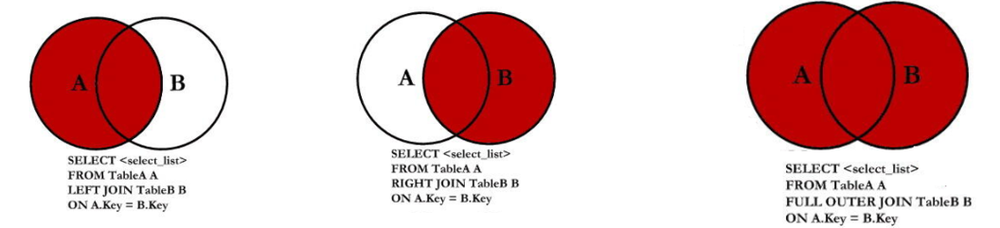
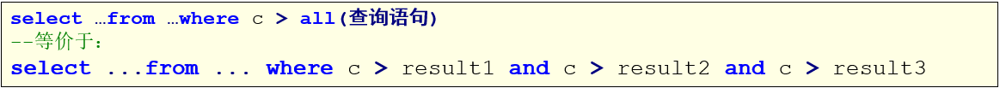

# MySQL

## MySQL多表操作

### 1、基本介绍

​	实际开发中，一个项目通常需要很多张表才能完成。例如，一个商品项目就需要分类表(category)、商品表(products)、订单表(orders)等多张表。且这些表的数据之间存在一定的关系，接下来我们将在单表的基础上，一起学习多表方面的知识。

### 2、多表关系

​	MySQL多表之间的关系可以概括为：一对一、一对多/多对一关系，多对多

- 一对一关系
  - 一个学生只有一张身份张；一张身份证只能对应一个学生。
  - 在任一表中添加唯一外键，指向另一方主键，确保一对一关系。
  - 一般一对一关系很少见，遇到一对一关系的表最好是合并表。
- 一对多/多对一关系
  部门和员工
  分析：一个部门有多个员工，一个员工只能对应一个部门
  实现原则：在多的一方建立外键，指向一的一方的主键
- 多对多关系
  学生和课程
  分析：一个学生可以选择很多门课程，一个课程也可以被很多学生选择
  原则：多对多关系实现需要借助第三张中间表。中间表至少包含两个字段，将多对多的关系，拆成一对多的关系，中间表至少要有两个外键，这两个外键分别指向原来的那两张表的主键。

### 3、外键约束

- 介绍
  MySQL外键约束（FOREIGN KEY）时表的一个特殊字段，经常与主键约束一起使用。对于两个具有关联关系的表而言，相关联字段中主键所在的表就是主表（父表），外键所在的表就是从表（子表）。
  外键用来建立主表与从表的关联关系，为两个表的数据建立连接，约束两个表中数据的一致性和完整性。比如，一个水果摊，只有苹果、桃子、李子、西瓜四种水果，那么你来到水果摊要买水果就只能选择苹果、桃子、李子和西瓜，其他的水果都是不能购买的。

- 特点
  定义一个外键时，需要遵守下列规则：

  - 主表必须已经存在于数据库中，或者是当前正在创建的表。
  - 必须为主表定义主键。
  - 主键不能包含空值，但允许在外键中出现空值。也就是说，只要外键的每个非空值出现在指定的主键中，这个外键的内容就是正确的。
  - 在主表的表名后面指定列名或列名的组合。这个列或列的组合必须是主表的主键或候选键。
  - 外键中列的数目必须和主表的主键中列的数目相同。
  - 外键中列的数据必须和主表主键中对应列的数据类型相同。

- 操作
  创建外键约束：

  - 方式1-在创建表时设置外键约束
    在create table语句中，通过foreign key关键字来指定外键，具体的语法格式如下：
    实现：

    ```sql
    -- 方式1-在创建表时设置外键约束
    -- 创建部门表
    CREATE TABLE IF NOT EXISTS dept(
    	deptno VARCHAR(20) PRIMARY KEY,	-- 部门号
    	name VARCHAR(20)	-- 部门名字
    );
    -- 创建员工表
    CREATE TABLE IF NOT EXISTS emp(
    	eid VARCHAR(20) PRIMARY KEY,
    	ename VARCHAR(20),
    	age INT,
    	dept_id VARCHAR(20),
    	CONSTRAINT emp_fk FOREIGN KEY(dept_id) REFERENCES dept(deptno)	-- 外键约束
    );
    ```

  - 方式2-在创建表外设置外键约束
    外键约束也可以在修改表时添加，但是添加外键约束的前提是：从表中外键列中的数据必须与主表中主键列中的数据一致或者是没有数据。
    实现：

    ```sql
    -- 方式2-在创建表外设置外键约束
    -- 创建部门表
    CREATE TABLE IF NOT EXISTS dept2(
    	deptno VARCHAR(20) PRIMARY KEY,	-- 部门号
    	name VARCHAR(20)	-- 部门名字
    );
    -- 创建员工表
    CREATE TABLE IF NOT EXISTS emp2(
    	eid VARCHAR(20) PRIMARY KEY,	-- 员工编号
    	ename VARCHAR(20),	-- 员工名字
    	age INT,	-- 员工年龄
    	dept_id VARCHAR(20)	-- 员工所属部门
    );
    -- 创建外键约束
    ALTER TABLE emp ADD CONSTRAINT dept_id_fk FOREIGN KEY(dept_id) REFERENCES dept2(deptno);
    ```

  在外键约束下的数据操作：

  1. 数据插入：

     ```sql
     -- 添加主表数据
     -- 注意必须先给主表添加数据
     INSERT INTO dept VALUES('1001','研发部');
     INSERT INTO dept VALUES('1002','销售部');
     INSERT INTO dept VALUES('1003','财务部');
     INSERT INTO dept VALUES('1004','人事部');
     
     -- 添加从表数据
     -- 注意给从表添加数据时，外键列的值不能随便写，必须依赖主表的主键列
     insert into emp values('1','乔峰',20, '1001');
     insert into emp values('2','段誉',21, '1001');
     insert into emp values('3','虚竹',23, '1001');
     insert into emp values('4','阿紫',18, '1002');
     insert into emp values('5','扫地僧',35, '1002');
     insert into emp values('6','李秋水',33, '1003');
     insert into emp values('7','鸠摩智',50, '1003'); 
     insert into emp values('8','天山童姥',60, '1005');  -- 不可以
     ```

  2. 数据删除
     注意：

     1. 主表的数据被从表依赖时，不能删除，否则可以删除
     2. 从表的数据可以随便删除

     ```sql
     -- 删除数据
     /*
     注意：
     1.主表的数据被从表依赖时，不能删除，否则可以删除
     2.从表的数据可以随便删除
     */
     DELETE FROM dept WHERE deptno = '1001';	-- 不可以删除
     DELETE FROM dept WHERE deptno = '1004';	-- 可以删除
     DELETE FROM emp WHERE eid = '7';	-- 可以删除
     ```

  删除外键约束：
  当一个表中不需要外键约束时，就需要从表中将其删除。外键一旦删除，就会解除主表和从表间的关联关系。
  格式：
  实现：

  ```sql
  ALTER TABLE emp2 DROP FOREIGN KEY dept_id_fk;
  ```

- 多对多关系
  在多对多关系中，A表的一行对应B的多行，B表的一行对应A表的多行，我们要新增加一个中间表，来建立多对多关系。

  ```sql
  -- 4.多对多关系
  
  -- 学生表和课程表（多对多）
  -- 1 创建学合适呢个表student（左侧主表）
  CREATE TABLE IF NOT EXISTS student(
  	sid INT PRIMARY KEY auto_increment,
  	name VARCHAR(20),
  	age INT,
  	gender VARCHAR(20)
  );
  -- 2 创建课程表course（右侧主表）
  CREATE TABLE course(
  	cid INT PRIMARY KEY auto_increment,
  	cidname VARCHAR(20)
  );
  -- 3 创建中间表
  CREATE TABLE score(
  	sid INT,
  	cid INT,
  	score DOUBLE
  );
  -- 4 建立外键约束（2次）
  ALTER TABLE score ADD FOREIGN KEY(sid) REFERENCES student(sid);
  ALTER TABLE score ADD FOREIGN KEY(cid) REFERENCES course(cid);
  -- 5给学生表添加数据
  INSERT INTO student VALUES(1,'小龙女',18,'女'),(2,'阿紫',19,'女'),(3,'周芷若',20,'男');
  -- 6给课程表添加数据
  INSERT INTO course VALUES(1,'语文'),(2,'数学'),(3,'英语');
  -- 7给中间表添加数据
  INSERT INTO score VALUES(1,1,78),(1,2,75),(2,1,88),(2,3,90),(3,2,80),(3,3,65);
  
  -- 修改和删除时，中间从表可以随便删除和修改，但是两边的主表受从表依赖的数据不能删除或者修改
  ```


### 4、多表联合查询

- 介绍
  多表查询就是同时查询两个或两个以上的表，因为有的时候用户在查看数据的时候，需要显示的数据来自多张表。
  多表查询有以下分类：

  - 交叉连接查询【产生笛卡尔积，了解】
  - 内连接查询【使用的关键字inner join – inner可以省略】
  - 外连接查询【使用的关键字outer join – outer可以省略】
  - 子查询
  - 表自关联

- 交叉连接查询

  - 交叉连接查询返回被连接的两个表所有数据行的笛卡尔积
  - 笛卡尔积可以理解为一张表的每一行去和另外一张表的任意一行进行匹配
  - 假如A表有m行数据，B表有n行数据，则返回m*n行数据
  - 笛卡尔积会产生很多冗余的数据，后期的其他查询可以在该集合的基础上进行条件筛选

  格式：
  操作：

  ```sql
  -- 一、交叉连接查询
  
  SELECT * FROM dept3,emp3;
  ```

- 内连接查询
  内连接查询求多张表的交际
  格式：
  操作：

  ```sql
  -- 查询每个部门的所属员工
  SELECT * FROM dept3,emp3 WHERE deptno = dept_id;
  SELECT * FROM dept3 INNER JOIN emp3 ON deptno = dept_id;
  
  -- 查询研发部和销售部的所属员工
  SELECT * FROM dept3, emp3 WHERE dept3.deptno = emp3.dept_id and name IN('研发部','销售部');
  SELECT * FROM dept3 JOIN emp3 ON dept3.deptno = emp3.dept_id and name IN('研发部','销售部');
  
  -- 查询每个部门的员工数，并升序排序
  SELECT deptno, COUNT(1) AS total_cnt FROM dept3, emp3 WHERE dept3.deptno = emp3.dept_id GROUP BY deptno ORDER BY total_cnt;
  SELECT deptno, COUNT(1) AS total_cnt FROM dept3 JOIN emp3 ON dept3.deptno = emp3.dept_id GROUP BY deptno ORDER BY total_cnt;
  
  -- 查询人数大于等于3的部门，并按人数降序排序
  SELECT deptno, COUNT(1) AS total_cnt FROM dept3, emp3 WHERE dept3.deptno = emp3.dept_id GROUP BY deptno HAVING total_cnt >= 3 ORDER BY total_cnt DESC;
  SELECT deptno, COUNT(1) AS total_cnt FROM dept3 JOIN emp3 ON dept3.deptno = emp3.dept_id GROUP BY deptno HAVING total_cnt >= 3 ORDER BY total_cnt DESC;
  ```
  
- 外连接查询
  外连接分为左外连接（left outer join）、右外连接（right outer join），满外连接（full outer join）。
  注意：oracle里面有full join，可是在mysql对full join支持的不好。我们可以试用union来达到目的。
  格式：
  操作：
  
  ```sql
  -- 三、外连接查询
  
  -- 左外连接
  -- 查询哪些部门有员工，哪些部门没有员工
  SELECT * FROM dept3 LEFT OUTER JOIN emp3 ON dept3.deptno = emp3.dept_id;
  
  -- 右外连接
  -- 查询员工有对应的部门，哪些没有
  SELECT * FROM dept3 RIGHT OUTER JOIN emp3 ON dept3.deptno = emp3.dept_id;
  
  -- 使用满外连接
  -- 使用union关键字实现左外连接和右外连接的并集
  -- UNION是将两个查询结果上下拼接，并去重
  SELECT * FROM dept3 LEFT OUTER JOIN emp3 ON dept3.deptno = emp3.dept_id 
  UNION
  SELECT * FROM dept3 RIGHT OUTER JOIN emp3 ON dept3.deptno = emp3.dept_id;
  
  -- 将左外连接和右外连接拼接在一起，不去重
  SELECT * FROM dept3 LEFT OUTER JOIN emp3 ON dept3.deptno = emp3.dept_id 
  UNION ALL
  SELECT * FROM dept3 RIGHT OUTER JOIN emp3 ON dept3.deptno = emp3.dept_id;
  ```
  
- 子查询

  - 介绍
    子查询就是指的在一个完整的查询语句之中，嵌套若干个不同功能的小查询，从而一起完成复杂查询的一种编写方式，通俗一点就是包含select嵌套的查询。

  - 特点
    子查询可以分会的数据类型一共分为四种：

    1. 单行单列：返回的是一个具体列的内容，可以理解为一个单值数据；
    2. 单行多列：返回一行数据中多个列的内容；
    3. 多行单列：返回多行记录之中同一列的内容，相当于给出了一个操作范围；
    4. 多行多列：：查询返回的结果是一张临时表

  - 操作

    ```sql
    -- 四、子查询
    
    -- 查询年龄最大的员工信息，显示信息包含员工号、员工名字、员工年龄
    -- 1.查询最大年龄：SELECT MAX(age) FROM emp3;
    
    -- 2.让每一个员工年龄和最大年龄进行比较，相等则满足条件
    SELECT * FROM emp3 WHERE age = (SELECT MAX(age) FROM emp3);	-- 单行单列，可以作为一个值来用
    
    -- 查询年研发部和销售部的员工信息，包含员工号、员工名字
    -- 方式1-关联查询
    SELECT * FROM dept3 a JOIN emp3 b ON a.deptno = b.dept_id AND (name = '研发部' OR name = '销售部');
    -- 方式2-子查询
    -- 2.1 先查询研发部和销售部的部门号:deptno
    SELECT deptno FROM dept3 WHERE name = '研发部' OR name = '销售部';
    -- 2.2 查询哪个员工的部门号是1001 或者 1002
    SELECT * FROM emp3 WHERE dept_id IN (SELECT deptno FROM dept3 WHERE name = '研发部' OR name = '销售部');
    
    
    -- 查询研发部20岁以下的员工信息，包括员工号、员工名字、部门名字
    -- 方式1-关联查询
    SELECT * FROM dept3 a JOIN emp3 b on a.deptno = b.dept_id and (name = '研发部' and age < 20);
    -- 方式2-子查询
    -- 2.1 在部门表中查询研发部信息
    SELECT * FROM dept3 WHERE name = '研发部';
    -- 2.2 在员工表中查询年龄小于20岁的员工信息
    SELECT * FROM emp3 WHERE age < 20;
    -- 2.3 将以上两个查询的结果进行关联查询
    SELECT * FROM (SELECT * FROM dept3 WHERE name = '研发部') t1 JOIN (SELECT * FROM emp3 WHERE age < 20) t2 ON t1.deptno = t2.dept_id;
    ```

  - 子查询关键字
    在子查询中，有一些常用的逻辑关键字，这些关键字可以给我们提供更丰富的查询功能，主要关键字如下：

    1. ALL关键字

       - 格式
         

       - 特点

         - ALL：与子查询返回的所有值比较为true 则返回true
         - ALL可以与=、>、>=、<、<=、<>结合是来使用，分别表示等于、大于、大于等于、小于、小于等于、不等于其中的其中的所有数据。
         - ALL表示指定列中的值必须要大于子查询集的每一个值，即必须要大于子查询集的最大值；如果是小于号即小于子查询集的最小值。同理可以推出其它的比较运算符的情况。

       - 操作

         ```sql
         -- 子查询关键字-ALL
         
         -- 查询年龄大于'1003'部门所有年龄的员工信息
         SELECT * FROM emp3 WHERE age > ALL(SELECT age FROM emp3 WHERE dept_id = '1003');
         
         -- 查询不属于任何一个部门的员工信息
         SELECT * FROM emp3 WHERE dept_id != ALL(SELECT deptno FROM dept3);
         ```

    2. ANY关键字&SOME关键字

       - 格式
         
    
       - 特点
    
         - ANY:与子查询返回的任何值比较为true 则返回true
         - ANY可以与=、>、>=、<、<=、<>结合是来使用，分别表示等于、大于、大于等于、小于、小于等于、不等于其中的其中的任何一个数据。
         - 表示制定列中的值要大于子查询中的任意一个值，即必须要大于子查询集中的最小值。同理可以推出其它的比较运算符的情况。
         - SOME和ANY的作用一样，SOME可以理解为ANY的别名
    
       - 操作
    
         ```sql
         -- 子查询关键字-ANY和SOME
         
         -- 查询年龄大于'1003'部门任意一个员工年龄的员工信息
         SELECT * FROM emp3 WHERE age > SOME(SELECT age FROM emp3 WHERE dept_id = '1003') AND dept_id != '1003';
         ```
    
    3. IN关键字
    
       - 格式
         
    
       - 特点
    
         - IN关键字，用于判断某个记录的值，是否在指定的集合中
         - 在IN关键字前面加上NOT可以将条件反过来
    
       - 操作
    
         ```sql
         -- 子查询关键字-IN
         
         -- 查询研发部和销售部的员工信息，包含员工号、员工名字
         SELECT eid, ename FROM emp3 WHERE dept_id IN (SELECT deptno FROM dept3 WHERE name = '研发部' OR name = '销售部');
         ```
    
    4. EXISTS关键字
    
       - 格式
         
    
       - 特点
    
         - 该子查询如果“有数据结果”(至少返回一行数据)， 则该EXISTS() 的结果为“true”，外层查询执行
         - 该子查询如果“没有数据结果”（没有任何数据返回），则该EXISTS()的结果为“false”，外层查询不执行
         - EXISTS后面的子查询不返回任何实际数据，只返回真或假，当返回真时 where条件成立
         - 注意，EXISTS关键字，比IN关键字的运算效率高，因此，在实际开发中，特别是大数据量时，推荐使用EXISTS关键字
    
       - 操作
    
         ```sql
         -- 查询公司是否有大于60岁的员工，有则输出
         -- 这里一定要把两个emp3区分开来
         -- 如果不区分开来，后面的select语句永远会有返回值
         SELECT * FROM emp3 a WHERE EXISTS(SELECT * FROM emp3 b WHERE a.age > 60);
         
         -- 查询有所属部门的员工信息
         SELECT * FROM emp3 a WHERE EXISTS(SELECT * FROM dept3 b WHERE b.deptno = a.dept_id);
         ```
    
  
- 自关联查询

  - 概念
    MySQL有时在信息查询时需要进行对表自身进行关联查询，即一张表自己和自己关联，一张表当成多张表来用。注意自关联时表必须给表起别名。

  - 格式
    

  - 操作

    ```sql
    -- 自关联查询
    -- 创建表,并建立自关联约束
    CREATE TABLE t_sanguo(
        eid INT PRIMARY KEY ,
        ename VARCHAR(20),
        manager_id INT,
    		FOREIGN KEY (manager_id) REFERENCES t_sanguo (eid)  -- 添加自关联约束
    );
    
    -- 添加数据
    insert into t_sanguo values(1,'刘协',NULL);
    insert into t_sanguo values(2,'刘备',1);
    insert into t_sanguo values(3,'关羽',2);
    insert into t_sanguo values(4,'张飞',2);
    insert into t_sanguo values(5,'曹操',1);
    insert into t_sanguo values(6,'许褚',5);
    insert into t_sanguo values(7,'典韦',5);
    insert into t_sanguo values(8,'孙权',1);
    insert into t_sanguo values(9,'周瑜',8);
    insert into t_sanguo values(10,'鲁肃',8);
    
    -- 进行关联查询
    -- 1.查询每个三国人物及他的上级
    SELECT * FROM t_sanguo a, t_sanguo b WHERE a.manager_id = b.eid;
    SELECT a.ename, b.ename FROM t_sanguo a JOIN t_sanguo b ON a.manager_id = b.eid;
    
    -- 2.查询所有人物及上级
    SELECT a.ename, b.ename FROM t_sanguo a LEFT JOIN t_sanguo b on a.manager_id = b.eid;
    
    -- 3.查询所有人物、上级，上上级 
    SELECT a.ename, b.ename, c.ename FROM t_sanguo a LEFT JOIN t_sanguo b on a.manager_id = b.eid LEFT JOIN t_sanguo c ON b.manager_id = c.eid;
    ```

    
