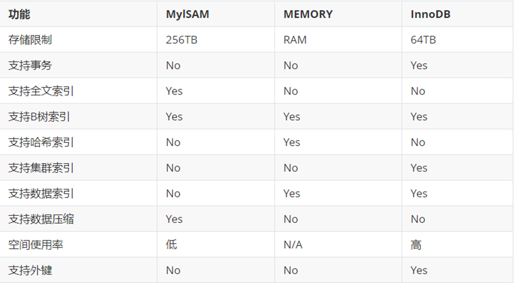
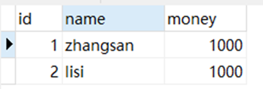
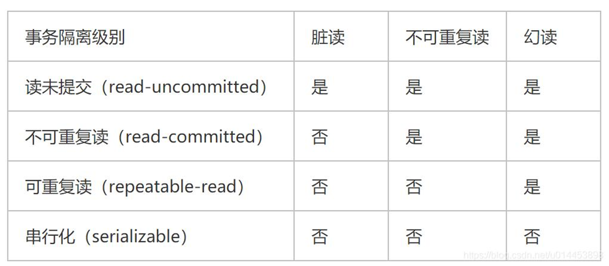
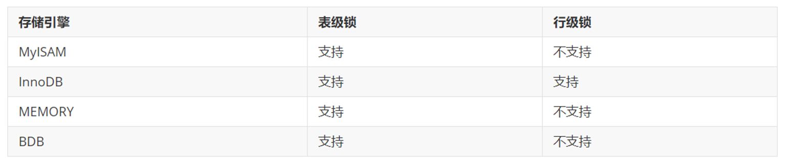
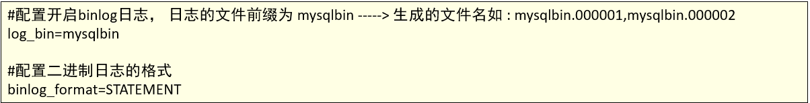
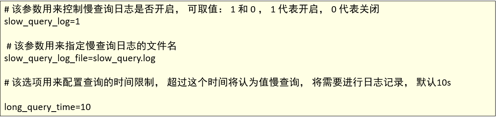

# MySQL

## MySQL的存储引擎

### 1、概念

- 数据库存储引擎是数据库底层软件组织，数据库管理系统（DBMS）使用数据引擎进行创建、查询、更新和删除数据。
- 不同的存储引擎提供不同的存储机制、索引技巧、锁定水平等功能。现在许多不同的数据库管理系统都支持多种不同的数据引擎。MySQL的核心就是存储引擎。
- 用户可以根据不同的需求为数据表选择不同的存储引擎。
- 可以使用 SHOW ENGINES 命令 可以查看Mysql的所有执行引擎我们 可以到 默认的执行引擎是innoDB 支持事务，行级锁定和外键。

### 2、分类

- MyISAM：Mysql 5.5之前的默认数据库引擎，最为常用。拥有较高的插入，查询速度，但不支持事务
- InnoDB：事务型速记的首选引擎，支持ACID事务，支持行级锁定，MySQL5.5成为默认数据库引擎
- Memory： 所有数据置于内存的存储引擎，拥有极高的插入，更新和查询效率。但是会占用和数据量成正比的内存空间。并且其内容会在MYSQL重新启动是会丢失。
- Archive ：非常适合存储大量的独立的，作为历史记录的数据。因为它们不经常被读取。Archive 拥有高效的插入速度，但其对查询的支持相对较差
- Federated ：将不同的 MySQL 服务器联合起来，逻辑上组成一个完整的数据库。非常适合分布式应用
- CSV ：逻辑上由逗号分割数据的存储引擎。它会在数据库子目录里为每个数据表创建一个 .csv 文件。这是一种普通文本文件，每个数据行占用一个文本行。CSV 存储引擎不支持索引。
- BlackHole： 黑洞引擎，写入的任何数据都会消失，一般用于记录 binlog 做复制的中继
- ERFORMANCE_SCHEMA存储引擎该引擎主要用于收集数据库服务器性能参数。
- Mrg_Myisam Merge存储引擎，是一组MyIsam的组合，也就是说，他将MyIsam引擎的多个表聚合起来，但是他的内部没有数据，真正的数据依然是MyIsam引擎的表中，但是可以直接进行查询、删除更新等操作。



### 3、操作

```sql
-- 存储引擎

-- 查看当前数据库支持的存储引擎
SHOW ENGINES;

-- 查看当前的默认存储引擎
SHOW VARIABLES LIKE '%storage_engine%';

-- 查看某个表用了什么引擎（在显示结果里参数engine后面的就表示该表当前用的存储引擎）
CREATE DATABASE mydb11_engine;
USE mydb11_engine;

CREATE TABLE stu1(id INT, name VARCHAR(20));

SHOW CREATE TABLE stu1;

-- 创建新表时指定存储引擎
CREATE TABLE stu2(id INT, name VARCHAR(20)) ENGINE = MyISAM;

SHOW CREATE TABLE stu2;

-- 修改数据库引擎
ALTER TABLE stu1 ENGINE = MyISAM;
ALTER TABLE stu2 ENGINE = INNODB;
```


## MySQL的事务

### 1、概念

- 数据库存储引擎是数据库底层软件组织，数据库管理系统（DBMS）使用数据引擎进行创建、查询、更新和删除数据。
- 不同的存储引擎提供不同的存储机制、索引技巧、锁定水平等功能。现在许多不同的数据库管理系统都支持多种不同的数据引擎。MySQL的核心就是存储引擎。
- 用户可以根据不同的需求为数据表选择不同的存储引擎。
- 可以使用 SHOW ENGINES 命令 可以查看Mysql的所有执行引擎我们 可以到 默认的执行引擎是innoDB 支持事务，行级锁定和外键。

#### 1.什么是事务

- 在MySQL中的事务（Transaction）是由存储引擎实现的，在MySQL中，只有InnoDB存储引擎才支持事务。
- 事务处理可以用来维护数据库的完整性，保证成批的 SQL 语句要么全部执行，要么全部不执行。
- 事务用来管理 DDL、DML、DCL 操作，比如 insert,update,delete 语句，默认是自动提交的。

#### 2.理解事务

​	在银行转账时，必须保证转账绝对安全，这时需要事务参与：




​	假如在第一次update之后，出现了意外、异常，没有执行第二次update，这时转账是否会出现异常？

### 2、事务操作

MySQL的事务操作主要有以下三种：

1. 开启事务：Start Transaction
   - 任何一条DML语句(insert、update、delete)执行，标志事务的开启
   - 命令：BEGIN 或 START TRANSACTION
2. 提交事务：Commit Transaction
   - 成功的结束，将所有的DML语句操作历史记录和底层硬盘数据来一次同步
   - 命令：COMMIT
3. 回滚事务：Rollback Transaction
   - 失败的结束，将所有的DML语句操作历史记录全部清空
   - 命令：ROLLBACK 

之前的所有SQL操作其实也有事务，只是MySQL自动帮我们完成的，每执行一条SQL时MySQL就帮我们自动提交事务，因此如果想要手动控制事务，则必须关闭MySQL的事务自动提交。

在MySQL中直接用 SET 来改变 MySQL 的自动提交模式:


```sql
-- 事务

-- 事务操作
create database if not exists mydb12_transcation;
use mydb12_transcation;
-- 创建账户表
create table account(
    id int primary key, -- 账户id
    name varchar(20), -- 账户名
    money double -- 金额
);
 

--  插入数据
insert into account values(1,'zhangsan',1000);
insert into account values(2,'lisi',1000);


-- 设置MySQL的事务为手动提交（关闭自动提交）
SELECT @@autocommit;
set autocommit = 0;

-- 模拟账户转账
-- 开启事务
BEGIN;
-- id为1的账户转账给id为2的账户
-- 由于关闭了事务的自动提交，所以在开启事务后，执行下面两条命令，数据库的值并没有发生改变
UPDATE account SET money = money - 200 WHERE name = 'zhangsan';
UPDATE account SET money = money + 200 WHERE name = 'lisi';
-- 提交事务
-- 提交事务后，上面两个update更改的数据才会体现在数据库中
COMMIT;

-- 回滚事务
-- 事务开启之后如果没有提交，回滚会让当前事务执行的结果回滚到最早执行的状态
ROLLBACK;

-- 即使是没有提交，查询之后得到的数据也是执行过后的
SELECT * FROM account;
```

### 3、事务的特性


### 4、事务的隔离级别

Isolate，顾名思义就是将事务与另一个事务隔离开，为什么要隔离呢？如果一个事务正在操作的数据被另一个事务修改或删除了，最后的执行结果可能无法达到预期。如果没有隔离性还会导致其他问题。


- 读未提交(Read uncommitted) 
  一个事务可以读取另一个未提交事务的数据，最低级别，任何情况都无法保证,会造成脏读。
- 读已提交(Read committed)
  一个事务要等另一个事务提交后才能读取数据，可避免脏读的发生，会造成不可重复读。
- 可重复读(Repeatable read)
  就是在开始读取数据（事务开启）时，不再允许修改操作，可避免脏读、不可重复读的发生，但是会造成幻读。
- 串行(Serializable)
  是最高的事务隔离级别，在该级别下，事务串行化顺序执行，可以避免脏读、不可重复读与幻读。但是这种事务隔离级别效率低下，比较耗数据库性能，一般不使用。

Mysql的默认隔离级别是Repeatable read。



```sql
-- 事务的隔离级别

-- 查看隔离级别
SHOW VARIABLES LIKE '%ISOLATION%';

-- 设置隔离级别
-- 读未提交
SET SESSION TRANSACTION ISOLATION LEVEL READ UNCOMMITTED;

-- 不可重复读
SET SESSION TRANSACTION ISOLATION LEVEL READ COMMITTED;

-- 可重复读
SET SESSION TRANSACTION ISOLATION LEVEL REPEATABLE READ;

-- 串行化
SET SESSION TRANSACTION ISOLATION LEVEL SERIALIZABLE;
```

## MySQL的锁机制

### 1、概述

锁是计算机协调多个进程或线程并发访问某一资源的机制（避免争抢）。

在数据库中，除传统的计算资源（如 CPU、RAM、I/O 等）的争用以外，数据也是一种供许多用户共享的资源。如何保证数据并发访问的一致性、有效性是所有数据库必须解决的一个问题，锁冲突也是影响数据库并发访问性能的一个重要因素。从这个角度来说，锁对数据库而言显得尤其重要，也更加复杂。

- 从对数据操作的粒度分 ： 
  1. 表锁：操作时，会锁定整个表。 
  2. 行锁：操作时，会锁定当前操作行。
- 从对数据操作的类型分：
  1. 读锁（共享锁）：针对同一份数据，多个读操作可以同时进行而不会互相影响。
  2. 写锁（排它锁）：当前操作没有完成之前，它会阻断其他写锁和读锁。

相对其他数据库而言，MySQL的锁机制比较简单，其最显著的特点是不同的存储引擎支持不同的锁机制。下表中罗列出了各存储引擎对锁的支持情况：



MySQL锁的特性可大致归纳如下 ：


从上述特点可见，很难笼统地说哪种锁更好，只能就具体应用的特点来说哪种锁更合适！仅从锁的角度来说：表级锁更适合于以查询为主，只有少量按索引条件更新数据的应用，如Web 应用；

而行级锁则更适合于有大量按索引条件并发更新少量不同数据，同时又有并查询的应用，如一些在线事务处理（OLTP）系统。

### 2、MyISAM表锁

MyISAM 存储引擎只支持表锁

- 如何加表锁
  MyISAM 在执行查询语句（SELECT）前，会自动给涉及的所有表加读锁，在执行更新操作（UPDATE、DELETE、INSERT 等）前，会自动给涉及的表加写锁，这个过程并不需要用户干预，因此，用户一般不需要直接用 LOCK TABLE 命令给 MyISAM 表显式加锁。
  

- 表锁特点

  1. 对MyISAM 表的读操作，不会阻塞其他用户对同一表的读请求，但会阻塞对同一表的写请求；
  2.  对MyISAM 表的写操作，则会阻塞其他用户对同一表的读和写操作；

  简而言之，就是读锁会阻塞写，但是不会阻塞读。而写锁，则既会阻塞读，又会阻塞写。

  此外，MyISAM 的读写锁调度是写优先，这也是MyISAM不适合做写为主的表的存储引擎的原因。因为写锁后，其他线程不能做任何操作，大量的更新会使查询很难得到锁，从而造成永远阻塞。

### 3、InnoDB行锁

- 行锁特点
  行锁特点 ：偏向InnoDB 存储引擎，开销大，加锁慢；会出现死锁；锁定粒度最小，发生锁冲突的概率最低,并发度也最高。

  InnoDB 与 MyISAM 的最大不同有两点：一是支持事务；二是采用了行级锁。

- 行锁模式
  InnoDB 实现了以下两种类型的行锁。

  共享锁（S）：又称为读锁，简称S锁，共享锁就是多个事务对于同一数据可以共享一把锁，都能访问到数据，但是只能读不能修改。

  排他锁（X）：又称为写锁，简称X锁，排他锁就是不能与其他锁并存，如一个事务获取了一个数据行的排他锁，其他事务就不能再获取该行的其他锁，包括共享锁和排他锁，但是获取排他锁的事务是可以对数据就行读取和修改。

  对于UPDATE、DELETE和INSERT语句，InnoDB会自动给涉及数据集加排他锁（X)；

  对于普通SELECT语句，InnoDB不会加任何锁；
  可以通过以下语句显示给记录集加共享锁或排他锁 。
  

## MySQL的日志

### 1、介绍

在任何一种数据库中，都会有各种各样的日志，记录着数据库工作的方方面面，以帮助数据库管理员追踪数据库曾经发生过的各种事件。MySQL 也不例外。

### 2、日志分类

- 错误日志
- 二进制日志
- 查询日志
- 慢查询日志

### 3、错误日志

错误日志是 MySQL 中最重要的日志之一，它记录了当 mysqld 启动和停止时，以及服务器在运行过程中发生任何严重错误时的相关信息。当数据库出现任何故障导致无法正常使用时，可以首先查看此日志。

该日志是默认开启的 ， 默认存放目录为 mysql 的数据目录, 默认的日志文件名为 hostname.err（hostname是主机名）。

查看日志位置指令 ： 


### 4、二进制日志

- 概述

  二进制日志（BINLOG）记录了所有的 DDL（数据定义语言）语句和 DML（数据操纵语言）语句，但是不包括数据查询语句。此日志对于灾难时的数据恢复起着极其重要的作用，MySQL的主从复制， 就是通过该binlog实现的。

  二进制日志，MySQl8.0默认已经开启，低版本的MySQL的需要通过配置文件开启，并配置MySQL日志的格式。

  Windows系统：my.ini  Linux系统:my.cnf 

  

- 日志格式

  - STATEMENT
    该日志格式在日志文件中记录的都是SQL语句（statement），每一条对数据进行修改的SQL都会记录在日志文件中，通过Mysql提供的mysqlbinlog工具，可以清晰的查看到每条语句的文本。主从复制的时候，从库（slave）会将日志解析为原文本，并在从库重新执行一次。
  - ROW
    该日志格式在日志文件中记录的是每一行的数据变更，而不是记录SQL语句。比如，执行SQL语句 ： update tb_book set status='1' , 如果是STATEMENT 日志格式，在日志中会记录一行SQL文件； 如果是ROW，由于是对全表进行更新，也就是每一行记录都会发生变更，ROW 格式的日志中会记录每一行的数据变更。
  - MIXED
    混合了STATEMENT 和 ROW两种格式。

```sql
-- 二进制日志-BINLOG

-- 查看MySQL是否开启了BINLOG日志
SHOW VARIABLES like 'log_bin';

-- 查看binlog日志的格式
SHOW VARIABLES LIKE 'binlog_format';

-- 查看所有日志
SHOW BINLOG EVENTS;

-- 查看最新的日志
SHOW MASTER STATUS;

-- 查询指定的binlog日志
SHOW BINLOG EVENTS in '高逸非-bin.000034';
SELECT * FROM mydb1.emp2;
UPDATE mydb1.emp2 SET salary = 8000;

-- 从指定的位置开始，查看指定的binlog日志
SHOW BINLOG EVENTS IN '高逸非-bin.000034' FROM 156;

-- 从指定位置开始，查看指定的binlog日志，限制查询的条数
SHOW BINLOG EVENTS IN '高逸非-bin.000034' FROM 156 limit 2;
-- 从指定位置开始，带有偏移，查看指定的binlog日志，限制查询的条数
SHOW BINLOG EVENTS IN '高逸非-bin.000034' FROM 156 limit 1, 2;


-- 清空所有的Binlog日志文件
RESET MASTER;
```

### 5、查询日志

查询日志中记录了客户端的所有操作语句，而二进制日志不包含查询数据的SQL语句。

默认情况下， 查询日志是未开启的。如果需要开启查询日志，可以设置以下配置 ：


```sql
-- 查询日志

-- 查看MySQL是否开启了查询日志
SHOW VARIABLES LIKE 'general_log';

-- 开启查询日志（会话临时开启）
SET GLOBAL general_log = 1;

SELECT * FROM mydb1.emp2;
SELECT * FROM mydb6_view.emp;

SELECT COUNT(*) FROM mydb1.emp2;
SELECT COUNT(*) FROM mydb6_view.emp;
UPDATE mydb1.emp2 SET salary = 9000;
```

### 6、慢查询日志

慢查询日志记录了所有执行时间超过参数 long_query_time 设置值并且扫描记录数不小于 min_examined_row_limit 的所有的SQL语句的日志。long_query_time 默认为 10 秒，最小为 0， 精度可以到微秒。



```sql
-- 慢查询日志

-- 查看慢日志查询是否开启
SHOW VARIABLES LIKE 'slow_query_log%';

-- 开启慢查询日志
SET GLOBAL slow_query_log = 1;

-- 查看慢查询的超时时间
SHOW VARIABLES LIKE 'long_query_time%';

SELECT SLEEP(10);
```
