# MySQL

## MySQL存储过程

### 1、什么是存储过程

- MySQL 5.0 版本开始支持存储过程。
- 简单地说，存储过程就是一组SQL语句集，功能强大，而可以实现一些比较复杂的逻辑功能，类似于JAVA语言中的方法；
- 存储过程就是数据库SQL语言层面的代码封装与重用

### 2、特征

- 有输入输出参数，可以声明变量，有if/else，case，while等控制语句，通过编写存储过程，可以实现复杂的逻辑功能；
- 函数的普遍特性：模块化，封装，代码复用；
- 速度快，只有首次执行需经过编译和优化步骤，后续被调用可以直接执行，省去以上步骤；

### 3、入门案例

- 格式

  

- 操作-数据准备

- 操作-创建存储过程

  ```sql
  -- 1.创建存储过程
  delimiter $$
  CREATE PROCEDURE proc01()
  BEGIN
  	SELECT empno, ename FROM emp;
  END $$
  delimiter;
  
  -- 调用存储过程
  CALL proc01();
  ```

### 4、MySQL操作-变量定义

- 局部变量

  - 格式
    用户自定义，在begin/end块中有效
    MySQL中还可以使用SELECT…INTO语句为变量赋值。其基本语法如下：
    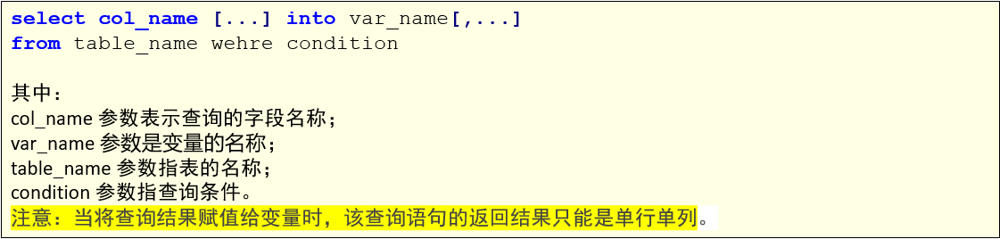

  - 操作

    ```sql
    -- 变量定义
    delimiter $$
    CREATE PROCEDURE proc02()
    BEGIN
    	DECLARE var_name01 VARCHAR(20) DEFAULT 'aaa';	-- 声明/定义变量
    	set var_name01 = 'zhangsan';	-- 给变量赋值
    	SELECT var_name01;	-- 输出变量的值
    END $$
    delimiter;
    
    CALL proc02();
    
    
    delimiter $$
    CREATE PROCEDURE proc03()
    BEGIN
    	DECLARE my_ename VARCHAR(20);	-- 声明/定义变量
    	SELECT ename INTO my_ename FROM emp WHERE empno = 1001;	-- 给变量赋值
    	SELECT my_ename;	-- 输出变量的值
    END $$
    delimiter;
    
    CALL proc03();
    ```
    
  
- 用户变量

  - 格式
    用户自定义，当前会话（连接）有效。类比java的成员变量。
    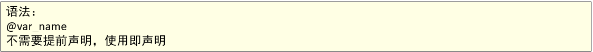

  - 操作

    ```sql
    -- 用户变量
    
    delimiter $$
    CREATE PROCEDURE proc04()
    BEGIN
    	SET @var_name01 = 'beijing';
    	SELECT @var_name01;
    END $$
    delimiter;
    
    CALL proc04();
    SELECT @var_name01;	-- 也可以使用用户变量
    ```

- 系统变量

  - 介绍

    - 系统变量又分为全局变量与会话变量
    - 全局变量在MYSQL启动的时候由服务器自动将它们初始化为默认值，这些默认值可以通过更改my.ini这个文件来更改。
    - 会话变量在每次建立一个新的连接的时候，由MYSQL来初始化。MYSQL会将当前所有全局变量的值复制一份。来做为会话变量。
    - 也就是说，如果在建立会话以后，没有手动更改过会话变量与全局变量的值，那所有这些变量的值都是一样的。
    - 全局变量与会话变量的区别就在于，对全局变量的修改会影响到整个服务器，但是对会话变量的修改，只会影响到当前的会话（也就是当前的数据库连接）。
    - 有些系统变量的值是可以利用语句来动态进行更改的，但是有些系统变量的值却是只读的，对于那些可以更改的系统变量，我们可以利用set语句进行更改。

  - 全局变量
    由系统提供，在整个数据库有效。

    - 格式
      

    - 操作

      ```sql
      -- 全局变量
      
      -- 查看全局变量
      SHOW GLOBAL VARIABLES;
      -- 查看某全局变量
      SELECT @@global.auto_increment_increment;
      -- 修改全局变量的值
      SET GLOBAL sort_buffer_size = 40000;
      SET @@global.sort_buffer_size = 33000;
      
      SELECT @@global.sort_buffer_size;
      ```

  - 会话变量
    由系统提供，当前会话（连接）有效

    - 格式
      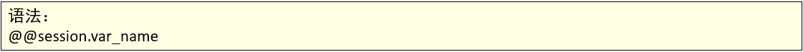

    - 操作

      ```sql
      -- 会话变量
      
      -- 查看系统变量
      SHOW SESSION VARIABLES;
      -- 查看某会话变量
      SELECT @@session.auto_increment_increment;
      -- 修改会话变量的值
      SET SESSION sort_buffer_size = 50000;
      SET @@session.sort_buffer_size = 50000;
      
      SELECT @@session.sort_buffer_size;
      ```

### 5、存储过程传参

- in
  in表示传入的参数，可以传入数值或者变量，即使传入变量，并不会更改变量的值，可以内部更改，仅仅作用在函数范围内。

  ```sql
  -- 传入参数：IN
  
  -- 层状由参数的存储过程，传入员工编号，查找员工信息
  delimiter $$
  CREATE PROCEDURE proc06(IN empno INT)
  BEGIN
  	SELECT * FROM emp WHERE emp.empno = empno;
  END $$
  delimiter;
  
  CALL proc06(1001);
  CALL proc06(1002);
  
  -- 封装由参数的存储过程，可以通过传入部门名和薪资，查询指定部门，并且薪资大于指定部门的员工信息。
  delimiter $$
  CREATE PROCEDURE proc07(IN dname VARCHAR(50), IN sal DECIMAL(7,2))
  BEGIN
  	SELECT * FROM dept a, emp b WHERE a.deptno = b.deptno && a.dname = dname && b.sal > sal;
  END $$
  delimiter;
  
  CALL proc07('学工部', 20000);
  CALL proc07('销售部', 10000);
  ```

- out
  out表示从存储过程内部传值给调用者。

  ```sql
  -- 传出参数：OUT
  
  -- 封装有参数的存储过程，传入员工编号，返回员工名字
  delimiter $$
  CREATE PROCEDURE proc08(IN in_empno INT, OUT out_ename VARCHAR(50))
  BEGIN
  	SELECT ename INTO out_ename FROM emp WHERE empno = in_empno;
  END $$
  delimiter;
  
  CALL proc08(1002, @o_ename);
  SELECT @o_ename;
  
  -- 封装有参数的存储过程，传入员工编号，返回员工名字和薪资
  
  delimiter $$
  CREATE PROCEDURE proc09(IN in_empno INT, OUT out_ename VARCHAR(50), out out_sal DECIMAL(7,2))
  BEGIN
  	SELECT ename, sal INTO out_ename, out_sal FROM emp WHERE empno = in_empno;
  END $$
  delimiter;
  
  CALL proc09(1001, @o_ename, @o_sal);
  SELECT @o_ename, @o_sal;
  ```

- inout
  inout表示从外部传入的参数经过修改后可以返回的变量，既可以使用传入变量的值也可以修改变量的值（即使函数执行完）。

  ```sql
  -- INOUT
  
  -- 传入一个数字，传出这个数字的10倍值
  delimiter $$
  CREATE PROCEDURE proc10(inout num INT)
  BEGIN
  	set num = num * 10;
  END $$
  delimiter;
  
  set @inout_num = 3;
  CALL proc10(@inout_num);
  SELECT @inout_num;
  
  -- 传入员工名，拼接部门号，传入薪资，求出年薪
  delimiter $$
  CREATE PROCEDURE proc11(INOUT inout_ename VARCHAR(50), INOUT inout_sal INT)
  BEGIN
  	SELECT concat_ws('_', deptno, ename) INTO inout_ename FROM emp WHERE ename = inout_ename;
  	SET inout_sal = inout_sal * 12;
  END $$
  delimiter;
  
  SET @inout_ename = '关羽';
  SET @inout_sal = 3000;
  
  CALL proc11(@inout_ename, @inout_sal);
  SELECT @inout_ename, @inout_sal;
  ```

### 6、流程控制

- 判断-IF

  - 格式
    IF语句包含多个判断条件，根据结果为TRUE、FALSE执行语句，与编程语言中的if、else if、else语法类似，其语法格式如下：
    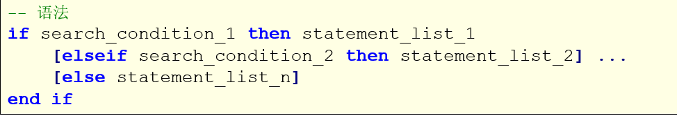

  - 操作

    ```sql
    -- IF
    -- 案例1
    -- 输入一个学生的成绩，来判断成绩的级别：
    /*
      score < 60 :不及格
      score >= 60  , score <80 :及格
      score >= 80 , score < 90 :良好
      score >= 90 , score <= 100 :优秀
      score > 100 :成绩错误
    */
    delimiter $$
    CREATE PROCEDURE proc_12_if(IN score INT)
    BEGIN
    	IF score < 60 
    		THEN
    			SELECT '不及格';
    	ELSEIF score >= 60 AND score < 80
    		THEN
    			SELECT '及格';
    	ELSEIF score >= 80 AND score < 90
    		THEN
    			SELECT '良好';
    	ELSEIF score >= 90 AND score <= 100
    		THEN
    			SELECT '优秀';
    	ELSE
    		SELECT '成绩错误';
    	END IF;
    END $$
    delimiter;
    
    SET @score = 100;
    CALL proc_12_if(@score);
    
    -- 输入员工的名字，判断工资的情况。
    /*
    	sal < 10000 : 试用薪资
    	sal >= 10000 and sal < 20000 : 转正薪资
    	sal >= 20000 : 元老薪资
    */
    delimiter $$
    CREATE PROCEDURE proc_13_if(IN in_ename VARCHAR(20))
    BEGIN
    	DECLARE var_sal DECIMAL(7,2);
    	DECLARE result VARCHAR(20);
    	SELECT sal INTO var_sal FROM emp WHERE ename = in_ename;
    	
    	IF var_sal < 10000
    		THEN
    			SET result = '试用薪资';
    	ELSEIF var_sal < 20000
    		THEN
    			SET result = '转正薪资';
    	ELSE
    		SET result = '元老薪资';
    	END IF;
    	SELECT result;
    END $$
    delimiter;
    
    
    CALL proc_13_if('程普');
    CALL proc_13_if('关羽');
    ```

- 判断-case

  CASE是另一个条件判断的语句，类似于编程语言中的switch语法

  - 格式
    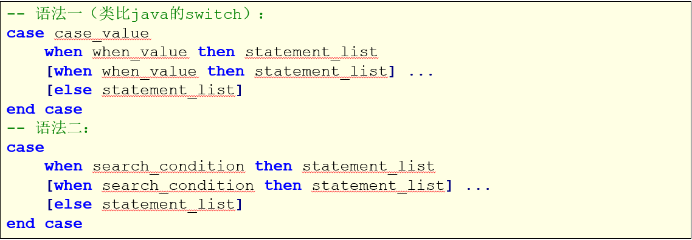

  - 操作

    ```sql
    -- CASE
    -- 格式1
    /*
    	支付方式：
    	1	微信支付
    	2	支付宝支付
    	3	银行卡支付
    	4	其他支付方式
    */
    delimiter $$
    CREATE PROCEDURE proc14_case(IN pay_type INT)
    BEGIN
    	case pay_type
    		WHEN 1 THEN SELECT '微信支付';
    		WHEN 2 THEN SELECT '支付宝支付';
    		WHEN 3 THEN SELECT '银行卡支付';
    		ELSE SELECT '其他方式支付';
    	END CASE;
    END $$
    delimiter;
    
    CALL proc14_case(2);
    CALL proc14_case(4);
    
    -- 格式2
    delimiter $$
    CREATE PROCEDURE proc_15_case(IN score INT)
    BEGIN
    	CASE
    	WHEN score < 60
    		THEN select '不及格';
    	WHEN score < 80
    		THEN select '及格';
    	WHEN score >= 80 AND score < 90
    		THEN select '良好';
    	WHEN score >= 90 AND score <= 100
    		THEN select '优秀';
    	ELSE
    		SELECT '成绩错误';
    	END CASE;
    END $$
    delimiter;
    
    CALL proc_15_case(88);
    ```

- 循环

  - 概述

    - 循环是一段在程序中只出现一次，但可能会连续运行多次的代码。
    - 循环中的代码会运行特定的次数，或者是运行到特定条件成立时结束循环。

  - 循环分类

    - while
    - repeat
    - loop

  - 循环控制

    - leave类似与break，跳出，结束当前所在的循环。
    - iterate类似于continue，继续，结束本次循环，继续下一次。

  - while

    - 格式
      

    - 操作

      ```sql
      -- 循环-WHILE
      
      -- 创建测试表
      CREATE TABLE user(
      	uid INT PRIMARY KEY,
      	username VARCHAR(50),
      	password varchar(50)
      );
      
      -- 需求：向表中添加指定条数数据
      delimiter $$
      CREATE PROCEDURE proc16_while(IN insertCount INT)
      BEGIN
      	DECLARE i INT DEFAULT 1;
      	label:WHILE i <= insertCount DO
      		INSERT INTO user(uid, username, password) VALUES(i, CONCAT('user', i), '123456');
      		SET i = i + 1;
      	END WHILE label;
      end $$
      delimiter;
      
      CALL proc16_while(10);
      
      -- WHILE + LEAVE
      TRUNCATE TABLE user;
      
      delimiter $$
      CREATE PROCEDURE proc17_while_leave(IN insertCount INT)
      BEGIN
      	DECLARE i INT DEFAULT 1;
      	label:WHILE i <= insertCount DO
      		INSERT INTO user(uid, username, password) VALUES(i, CONCAT('user', i), '123456');
      		IF i = 5
      			THEN LEAVE label;
      		END IF;
      		SET i = i + 1;
      	END WHILE label;
      end $$
      delimiter;
      
      CALL proc17_while_leave(10);
      
      -- WHILE + ITERATE
      CREATE TABLE user2(
      	uid INT,
      	username VARCHAR(50),
      	password varchar(50)
      );
      TRUNCATE TABLE user2;
      
      delimiter $$
      CREATE PROCEDURE proc18_while_iterate(IN insertCount INT)
      BEGIN
      	DECLARE i INT DEFAULT 0;
      	label:WHILE i < insertCount DO
      		SET i = i + 1;
      		IF i = 5
      			THEN ITERATE label;
      		END IF;
      		INSERT INTO user2(uid, username, password) VALUES(i, CONCAT('user', i), '123456');
      	END WHILE label;
      	SELECT '循环结束';
      end $$
      delimiter;
      
      CALL proc18_while_iterate(10);	-- 1 2 3 4 6 7 8 9 0
      ```
  
  - repeat
  
    - 格式
      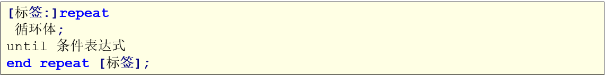
  
    - 操作
  
      ```sql
      -- REPEAT
      TRUNCATE TABLE user;
      delimiter $$
      CREATE PROCEDURE proc19_repeat(IN insertCount INT)
      BEGIN
      	DECLARE i INT DEFAULT 1;
      	label:REPEAT
      		INSERT INTO user(uid, username, password) VALUES(i, CONCAT('user', i), '123456');
      		SET i = i + 1;
      		UNTIL i > insertCount 
      	END REPEAT label;
      	SELECT '循环结束';
      end $$
      delimiter;
      
      CALL proc19_repeat(10);
      ```
      
  
  - loop
  
    - 格式
      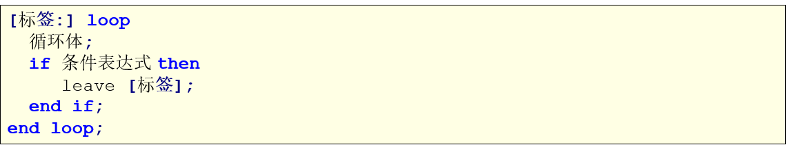
  
    - 操作
  
      ```sql
      -- LOOP
      TRUNCATE TABLE user;
      delimiter $$
      CREATE PROCEDURE proc20_loop(IN insertCount INT)
      BEGIN
      	DECLARE i INT DEFAULT 1;
      	label: LOOP
      		INSERT INTO user(uid, username, password) VALUES(i, CONCAT('user-', i), '123456');
      		SET i = i + 1;
      		IF i > insertCount
      			THEN
      				LEAVE label;
      		END IF;
      	END LOOP label;
      END $$
      delimiter;
      
      CALL proc20_loop(100);
      ```
      

### 7、游标

游标（cursor）是用来存储查询结果集的数据类型，在存储过程和函数中可以使用光标对结果集进行循环的处理。光标的使用包括光标的声明、OPEN、FETCH、和CLOSE。

- 格式
  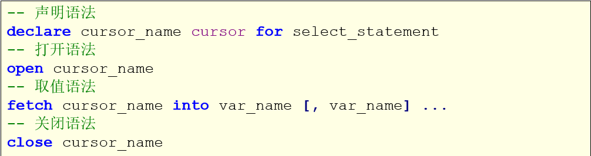

- 操作

  ```sql
  -- 操作游标(CURSOR)
  
  -- 声明游标
  -- 打开游标
  -- 通过游标获取值
  -- 关闭游标
  
  -- 需求：输入一个部门名，查询该部门员工的编号、名字、薪资，将查询的结果集添加游标
  DROP PROCEDURE proc21_cursor;
  delimiter $$
  CREATE PROCEDURE proc21_cursor(in in_dname VARCHAR(50))
  BEGIN
  -- 	定义局部变量
  	DECLARE var_empno VARCHAR(50);
  	DECLARE var_ename VARCHAR(50);
  	DECLARE var_sal DECIMAL(7,2);
  -- 	声明游标
  	DECLARE my_cursor CURSOR FOR
  		SELECT empno, ename, sal
  		FROM dept a, emp b
  		WHERE a.deptno = b.deptno AND a.dname = in_dname;
  -- 	打开游标
  	OPEN my_cursor;
  -- 	通过游标获取值
  	label:LOOP
  		FETCH my_cursor INTO var_empno, var_ename, var_sal;
  		SELECT var_empno, var_ename, var_sal;
  	END LOOP label;
  -- 	关闭游标
  	CLOSE my_cursor;
  END $$
  delimiter;
  
  CALL proc21_cursor('销售部');
  ```

### 8、异常处理-句柄HANDLER

MySql存储过程也提供了对异常处理的功能：通过定义HANDLER来完成异常声明的实现.

官方文档：https://dev.mysql.com/doc/refman/5.7/en/declare-handler.html

- 格式
  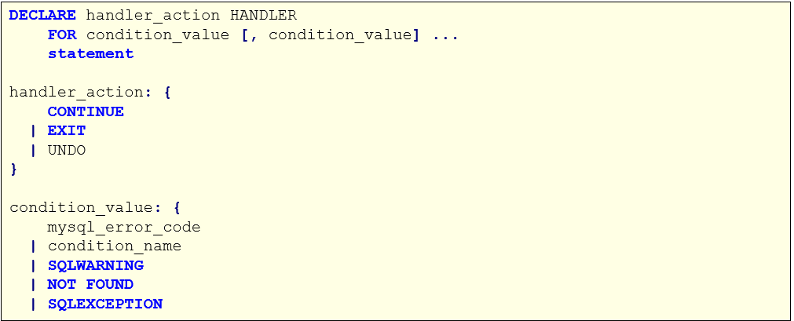

  特别注意：在语法中，变量声明、游标声明、handler声明是必须按照先后顺序书写的，否则创建存储过程出错。

- 操作

  ```sql
  -- 异常处理-句柄HANDLER
  DROP PROCEDURE proc22_handler;
  delimiter $$
  CREATE PROCEDURE proc22_handler(in in_dname VARCHAR(50))
  BEGIN
  -- 	定义局部变量
  	DECLARE var_empno VARCHAR(50);
  	DECLARE var_ename VARCHAR(50);
  	DECLARE var_sal DECIMAL(7,2);
  -- 	定义标记值
  	DECLARE flag int DEFAULT 1;
  -- 	声明游标
  	DECLARE my_cursor CURSOR FOR
  		SELECT empno, ename, sal
  		FROM dept a, emp b
  		WHERE a.deptno = b.deptno AND a.dname = in_dname;
  -- 	定义句柄：定义异常的处理方式
  	/*
  		1.异常处理完之后程序该怎么执行
  			CONTINUE:继续执行剩余代码
  			EXIT:直接终止程序
  			UNDO:不支持
  		2.触发条件
  			条件码:
  			条件名:
  				SQLWARNING
  				NOT FOUND
  				SQLEXCEPTION
  		3.异常触发之后执行什么代码
  			设置flag的值 --> 0
  	*/
  	DECLARE CONTINUE HANDLER FOR 1329 SET flag = 0;
  -- 	打开游标
  	OPEN my_cursor;
  -- 	通过游标获取值
  	label:LOOP
  		FETCH my_cursor INTO var_empno, var_ename, var_sal;
  -- 	判断flag，如果flag的值为1，则执行，否则不执行
  		IF flag = 1 THEN
  			SELECT var_empno, var_ename, var_sal;
  		ELSE
  			LEAVE label;
  		END IF;
  	END LOOP label;
  -- 	关闭游标
  	CLOSE my_cursor;
  END $$
  delimiter;
  
  CALL proc22_handler('销售部');
  ```
  

### 9、练习

- 需求

  创建下个月的每天对应的表user_2021_11_01、user_2021_11_02、...

  需求描述：

  我们需要用某个表记录很多数据，比如记录某某用户的搜索、购买行为(注意，此处是假设用数据库保存)，当每天记录较多时，如果把所有数据都记录到一张表中太庞大，需要分表，我们的要求是，每天一张表，存当天的统计数据，就要求提前生产这些表——每月月底创建下一个月每天的表！

- 预备知识
  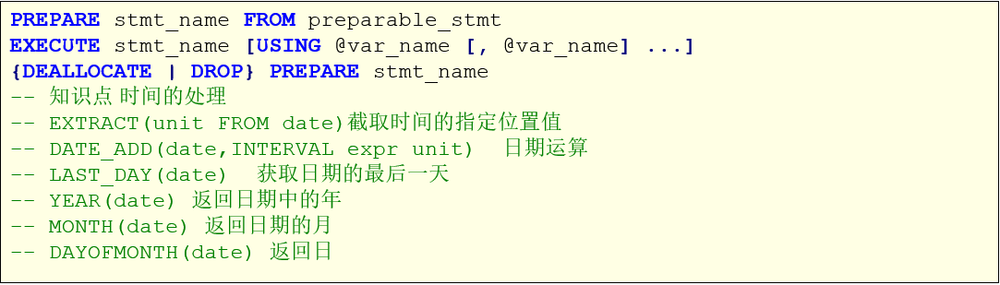

- 操作

  ```sql
  -- 练习
  
  CREATE DATABASE mydb18_proc_demo;
  USE mydb18_proc_demo;
  DROP PROCEDURE IF EXISTS proc22_demo;
  delimiter $$
  CREATE PROCEDURE proc22_demo()
  BEGIN
  	DECLARE next_year INT;	-- 下一个月的年份
  	DECLARE next_month INT;	-- 下一个月的月份
  	DECLARE next_month_day INT;	-- 下一个月最后一天的日期
  	
  	DECLARE next_month_str VARCHAR(2);	-- 下一个月的月份字符串
  	DECLARE next_month_day_str VARCHAR(2);	-- 下一个月的日字符串
  	
  	-- 处理每天的表名
  	DECLARE table_name_str VARCHAR(10);
  	DECLARE t_index INT DEFAULT 1;
  	
  	-- 获取下个月的年份
  	SET next_year = YEAR(DATE_ADD(NOW(), INTERVAL 1 MONTH));
  	
    	-- 获取下个月是几月
  	SET next_month = MONTH(DATE_ADD(NOW(), INTERVAL 1 MONTH));
  	
    	-- 下个月最后一天是几号
  	SET next_month_day = DAYOFMONTH(LAST_DAY(DATE_ADD(NOW(),INTERVAL 1 MONTH)));
  	
  	IF next_month < 10
  		THEN SET next_month_str = CONCAT('0', next_month);	-- 1 --> 01
  	ELSE
  		SET next_month_str = CONCAT('', next_month);	-- 12 --> 12
  	END IF;
  	
  	WHILE t_index <= next_month_day DO
  		IF t_index < 10
  			THEN SET next_month_day_str = CONCAT('0', t_index);
  		ELSE
  			SET next_month_day_str = CONCAT('', t_index);
  		END IF;
  		
      	-- 2021_11_01
  		SET table_name_str = CONCAT(next_year, '_', next_month_str, '_', next_month_day_str);
  		-- 拼接create SQL
  		SET @create_table_sql = concat(
                      'create table user_',
                      table_name_str,
                      '(`uid` INT ,`ename` varchar(50) ,`information` varchar(50)) COLLATE=\'utf8_general_ci\' ENGINE=InnoDB');
  		-- FROM后面不能使用局部变量
  		PREPARE create_table_stmt FROM @create_table_sql;
  		EXECUTE create_table_stmt;
  		DEALLOCATE PREPARE create_table_stmt;
  		
  		set t_index = t_index + 1;
  		
  	END WHILE;
  END $$
  delimiter;
  
  CALL proc22_demo();
  ```

## MySQL的存储函数

### 1、介绍

MySQL存储函数（自定义函数），函数一般用于计算和返回一个值，可以将经常需要使用的计算或功能写成一个函数。

存储函数和存储过程一样，都是在数据库中定义一些 SQL 语句的集合。

### 2、存储函数与存储过程的区别

1. 存储函数有且只有一个返回值，而存储过程可以有多个返回值，也可以没有返回值。
2. 存储函数只能有输入参数，而且不能带in, 而存储过程可以有多个in,out,inout参数。
3. 存储过程中的语句功能更强大，存储过程可以实现很复杂的业务逻辑，而函数有很多限制，如不能在函数中使用insert,update,delete,create等语句。
4. 存储函数只完成查询的工作，可接受输入参数并返回一个结果，也就是函数实现的功能针对性比较强。
5. 存储过程可以调用存储函数。但函数不能调用存储过程。
6. 存储过程一般是作为一个独立的部分来执行(call调用)。而函数可以作为查询语句的一个部分来调用。

### 3、格式

在MySQL中，创建存储函数使用create function关键字，其基本形式如下：

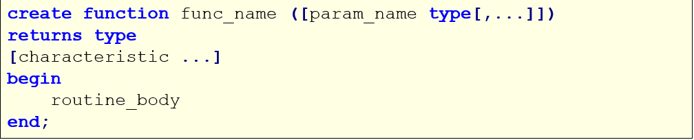

参数说明：

1. func_name ：存储函数的名称。
2. param_name type：可选项，指定存储函数的参数。type参数用于指定存储函数的参数类型，该类型可以是MySQL数据库中所有支持的类型。
3. RETURNS type：指定返回值的类型。
4. characteristic：可选项，指定存储函数的特性。
5. routine_body：SQL代码内容。

### 4、操作

```sql
-- 存储函数

-- 创建一个数据库
CREATE DATABASE mydb9_function;
USE mydb9_function;

-- 允许创建函数权限信任
set GLOBAL log_bin_trust_function_creators = TRUE;
-- 创建存储函数-没有参数
DROP FUNCTION IF EXISTS myfunc1_emp;
delimiter $$
CREATE FUNCTION myfunc1_emp() RETURNS INT
BEGIN
	-- 定义局部变量
	DECLARE cnt INT DEFAULT 0;
	SELECT COUNT(*) INTO cnt FROM emp;
	RETURN cnt;
END $$
delimiter;

-- 调用存储函数
SELECT myfunc1_emp();

-- 创建存储函数-有输入参数
-- 需求：传入一个员工的编号，返回员工的名字
DROP FUNCTION IF EXISTS myfunc2_emp;
delimiter $$
CREATE FUNCTION myfunc2_emp(in_empno INT) RETURNS VARCHAR(50)
BEGIN
	-- 定义局部变量
	DECLARE out_ename VARCHAR(50);
	SELECT ename INTO out_ename FROM emp WHERE empno = in_empno;
	RETURN out_ename;
END $$
delimiter;

-- 调用存储函数
SELECT myfunc2_emp(1008);
```