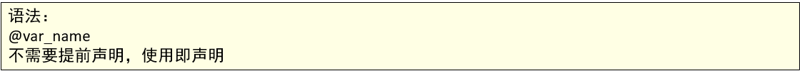
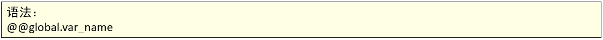
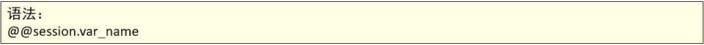
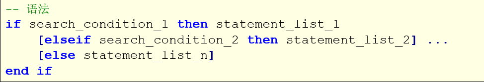
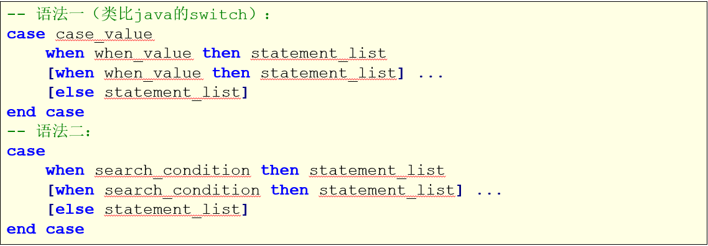
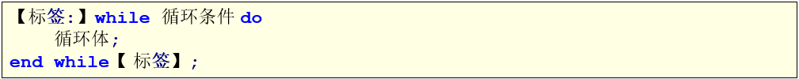
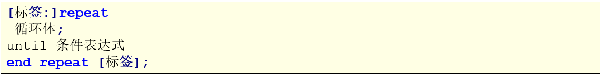
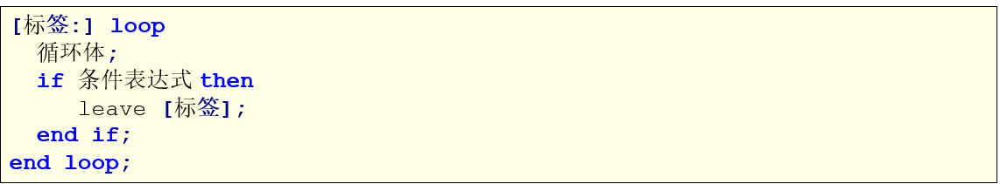

# MySQL

## MySQL存储过程

### 1、什么是存储过程

- MySQL 5.0 版本开始支持存储过程。
- 简单地说，存储过程就是一组SQL语句集，功能强大，而可以实现一些比较复杂的逻辑功能，类似于JAVA语言中的方法；
- 存储过程就是数据库SQL语言层面的代码封装与重用

### 2、特征

- 有输入输出参数，可以声明变量，有if/else，case，while等控制语句，通过编写存储过程，可以实现复杂的逻辑功能；
- 函数的普遍特性：模块化，封装，代码复用；
- 速度快，只有首次执行需经过编译和优化步骤，后续被调用可以直接执行，省去以上步骤；

### 3、入门案例

- 格式

  

- 操作-数据准备

- 操作-创建存储过程

  ```sql
  -- 1.创建存储过程
  delimiter $$
  CREATE PROCEDURE proc01()
  BEGIN
  	SELECT empno, ename FROM emp;
  END $$
  delimiter;
  
  -- 调用存储过程
  CALL proc01();
  ```

### 4、MySQL操作-变量定义

- 局部变量

  - 格式
    用户自定义，在begin/end块中有效
    MySQL中还可以使用SELECT…INTO语句为变量赋值。其基本语法如下：
    

  - 操作

    ```sql
    -- 变量定义
    delimiter $$
    CREATE PROCEDURE proc02()
    BEGIN
    	DECLARE var_name01 VARCHAR(20) DEFAULT 'aaa';	-- 声明/定义变量
    	set var_name01 = 'zhangsan';	-- 给变量赋值
    	SELECT var_name01;	-- 输出变量的值
    END $$
    delimiter;
    
    CALL proc02();
    
    
    delimiter $$
    CREATE PROCEDURE proc03()
    BEGIN
    	DECLARE my_ename VARCHAR(20);	-- 声明/定义变量
    	SELECT ename INTO my_ename FROM emp WHERE empno = 1001;	-- 给变量赋值
    	SELECT my_ename;	-- 输出变量的值
    END $$
    delimiter;
    
    CALL proc03();
    ```
    
  
- 用户变量

  - 格式
    用户自定义，当前会话（连接）有效。类比java的成员变量。
    

  - 操作

    ```sql
    -- 用户变量
    
    delimiter $$
    CREATE PROCEDURE proc04()
    BEGIN
    	SET @var_name01 = 'beijing';
    	SELECT @var_name01;
    END $$
    delimiter;
    
    CALL proc04();
    SELECT @var_name01;	-- 也可以使用用户变量
    ```

- 系统变量

  - 介绍

    - 系统变量又分为全局变量与会话变量
    - 全局变量在MYSQL启动的时候由服务器自动将它们初始化为默认值，这些默认值可以通过更改my.ini这个文件来更改。
    - 会话变量在每次建立一个新的连接的时候，由MYSQL来初始化。MYSQL会将当前所有全局变量的值复制一份。来做为会话变量。
    - 也就是说，如果在建立会话以后，没有手动更改过会话变量与全局变量的值，那所有这些变量的值都是一样的。
    - 全局变量与会话变量的区别就在于，对全局变量的修改会影响到整个服务器，但是对会话变量的修改，只会影响到当前的会话（也就是当前的数据库连接）。
    - 有些系统变量的值是可以利用语句来动态进行更改的，但是有些系统变量的值却是只读的，对于那些可以更改的系统变量，我们可以利用set语句进行更改。

  - 全局变量
    由系统提供，在整个数据库有效。

    - 格式
      

    - 操作

      ```sql
      -- 全局变量
      
      -- 查看全局变量
      SHOW GLOBAL VARIABLES;
      -- 查看某全局变量
      SELECT @@global.auto_increment_increment;
      -- 修改全局变量的值
      SET GLOBAL sort_buffer_size = 40000;
      SET @@global.sort_buffer_size = 33000;
      
      SELECT @@global.sort_buffer_size;
      ```

  - 会话变量
    由系统提供，当前会话（连接）有效

    - 格式
      

    - 操作

      ```sql
      -- 会话变量
      
      -- 查看系统变量
      SHOW SESSION VARIABLES;
      -- 查看某会话变量
      SELECT @@session.auto_increment_increment;
      -- 修改会话变量的值
      SET SESSION sort_buffer_size = 50000;
      SET @@session.sort_buffer_size = 50000;
      
      SELECT @@session.sort_buffer_size;
      ```

### 5、存储过程传参

- in
  in表示传入的参数，可以传入数值或者变量，即使传入变量，并不会更改变量的值，可以内部更改，仅仅作用在函数范围内。

  ```sql
  -- 传入参数：IN
  
  -- 层状由参数的存储过程，传入员工编号，查找员工信息
  delimiter $$
  CREATE PROCEDURE proc06(IN empno INT)
  BEGIN
  	SELECT * FROM emp WHERE emp.empno = empno;
  END $$
  delimiter;
  
  CALL proc06(1001);
  CALL proc06(1002);
  
  -- 封装由参数的存储过程，可以通过传入部门名和薪资，查询指定部门，并且薪资大于指定部门的员工信息。
  delimiter $$
  CREATE PROCEDURE proc07(IN dname VARCHAR(50), IN sal DECIMAL(7,2))
  BEGIN
  	SELECT * FROM dept a, emp b WHERE a.deptno = b.deptno && a.dname = dname && b.sal > sal;
  END $$
  delimiter;
  
  CALL proc07('学工部', 20000);
  CALL proc07('销售部', 10000);
  ```

- out
  out表示从存储过程内部传值给调用者。

  ```sql
  -- 传出参数：OUT
  
  -- 封装有参数的存储过程，传入员工编号，返回员工名字
  delimiter $$
  CREATE PROCEDURE proc08(IN in_empno INT, OUT out_ename VARCHAR(50))
  BEGIN
  	SELECT ename INTO out_ename FROM emp WHERE empno = in_empno;
  END $$
  delimiter;
  
  CALL proc08(1002, @o_ename);
  SELECT @o_ename;
  
  -- 封装有参数的存储过程，传入员工编号，返回员工名字和薪资
  
  delimiter $$
  CREATE PROCEDURE proc09(IN in_empno INT, OUT out_ename VARCHAR(50), out out_sal DECIMAL(7,2))
  BEGIN
  	SELECT ename, sal INTO out_ename, out_sal FROM emp WHERE empno = in_empno;
  END $$
  delimiter;
  
  CALL proc09(1001, @o_ename, @o_sal);
  SELECT @o_ename, @o_sal;
  ```

- inout
  inout表示从外部传入的参数经过修改后可以返回的变量，既可以使用传入变量的值也可以修改变量的值（即使函数执行完）。

  ```sql
  -- INOUT
  
  -- 传入一个数字，传出这个数字的10倍值
  delimiter $$
  CREATE PROCEDURE proc10(inout num INT)
  BEGIN
  	set num = num * 10;
  END $$
  delimiter;
  
  set @inout_num = 3;
  CALL proc10(@inout_num);
  SELECT @inout_num;
  
  -- 传入员工名，拼接部门号，传入薪资，求出年薪
  delimiter $$
  CREATE PROCEDURE proc11(INOUT inout_ename VARCHAR(50), INOUT inout_sal INT)
  BEGIN
  	SELECT concat_ws('_', deptno, ename) INTO inout_ename FROM emp WHERE ename = inout_ename;
  	SET inout_sal = inout_sal * 12;
  END $$
  delimiter;
  
  SET @inout_ename = '关羽';
  SET @inout_sal = 3000;
  
  CALL proc11(@inout_ename, @inout_sal);
  SELECT @inout_ename, @inout_sal;
  ```

### 6、流程控制

- 判断-IF

  - 格式
    IF语句包含多个判断条件，根据结果为TRUE、FALSE执行语句，与编程语言中的if、else if、else语法类似，其语法格式如下：
    

  - 操作

    ```sql
    -- IF
    -- 案例1
    -- 输入一个学生的成绩，来判断成绩的级别：
    /*
      score < 60 :不及格
      score >= 60  , score <80 :及格
      score >= 80 , score < 90 :良好
      score >= 90 , score <= 100 :优秀
      score > 100 :成绩错误
    */
    delimiter $$
    CREATE PROCEDURE proc_12_if(IN score INT)
    BEGIN
    	IF score < 60 
    		THEN
    			SELECT '不及格';
    	ELSEIF score >= 60 AND score < 80
    		THEN
    			SELECT '及格';
    	ELSEIF score >= 80 AND score < 90
    		THEN
    			SELECT '良好';
    	ELSEIF score >= 90 AND score <= 100
    		THEN
    			SELECT '优秀';
    	ELSE
    		SELECT '成绩错误';
    	END IF;
    END $$
    delimiter;
    
    SET @score = 100;
    CALL proc_12_if(@score);
    
    -- 输入员工的名字，判断工资的情况。
    /*
    	sal < 10000 : 试用薪资
    	sal >= 10000 and sal < 20000 : 转正薪资
    	sal >= 20000 : 元老薪资
    */
    delimiter $$
    CREATE PROCEDURE proc_13_if(IN in_ename VARCHAR(20))
    BEGIN
    	DECLARE var_sal DECIMAL(7,2);
    	DECLARE result VARCHAR(20);
    	SELECT sal INTO var_sal FROM emp WHERE ename = in_ename;
    	
    	IF var_sal < 10000
    		THEN
    			SET result = '试用薪资';
    	ELSEIF var_sal < 20000
    		THEN
    			SET result = '转正薪资';
    	ELSE
    		SET result = '元老薪资';
    	END IF;
    	SELECT result;
    END $$
    delimiter;
    
    
    CALL proc_13_if('程普');
    CALL proc_13_if('关羽');
    ```

- 判断-case

  CASE是另一个条件判断的语句，类似于编程语言中的switch语法

  - 格式
    

  - 操作

    ```sql
    -- CASE
    -- 格式1
    /*
    	支付方式：
    	1	微信支付
    	2	支付宝支付
    	3	银行卡支付
    	4	其他支付方式
    */
    delimiter $$
    CREATE PROCEDURE proc14_case(IN pay_type INT)
    BEGIN
    	case pay_type
    		WHEN 1 THEN SELECT '微信支付';
    		WHEN 2 THEN SELECT '支付宝支付';
    		WHEN 3 THEN SELECT '银行卡支付';
    		ELSE SELECT '其他方式支付';
    	END CASE;
    END $$
    delimiter;
    
    CALL proc14_case(2);
    CALL proc14_case(4);
    
    -- 格式2
    delimiter $$
    CREATE PROCEDURE proc_15_case(IN score INT)
    BEGIN
    	CASE
    	WHEN score < 60
    		THEN select '不及格';
    	WHEN score < 80
    		THEN select '及格';
    	WHEN score >= 80 AND score < 90
    		THEN select '良好';
    	WHEN score >= 90 AND score <= 100
    		THEN select '优秀';
    	ELSE
    		SELECT '成绩错误';
    	END CASE;
    END $$
    delimiter;
    
    CALL proc_15_case(88);
    ```

- 循环

  - 概述

    - 循环是一段在程序中只出现一次，但可能会连续运行多次的代码。
    - 循环中的代码会运行特定的次数，或者是运行到特定条件成立时结束循环。

  - 循环分类

    - while
    - repeat
    - loop

  - 循环控制

    - leave类似与break，跳出，结束当前所在的循环。
    - iterate类似于continue，继续，结束本次循环，继续下一次。

  - while

    - 格式
      

    - 操作

      ```sql
      
      ```

  - repeat

    - 格式
      

    - 操作

      ```sql
      
      ```

      

  - loop

    - 格式
      

    - 操作

      ```sql
      
      ```

      