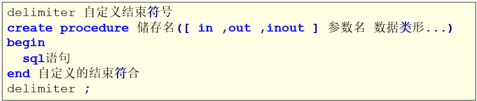

# MySQL

## MySQL存储过程

### 1、什么是存储过程

- MySQL 5.0 版本开始支持存储过程。
- 简单地说，存储过程就是一组SQL语句集，功能强大，而可以实现一些比较复杂的逻辑功能，类似于JAVA语言中的方法；
- 存储过程就是数据库SQL语言层面的代码封装与重用

### 2、特征

- 有输入输出参数，可以声明变量，有if/else，case，while等控制语句，通过编写存储过程，可以实现复杂的逻辑功能；
- 函数的普遍特性：模块化，封装，代码复用；
- 速度快，只有首次执行需经过编译和优化步骤，后续被调用可以直接执行，省去以上步骤；

### 3、入门案例

- 格式

  

- 操作-数据准备

- 操作-创建存储过程

  ```sql
  -- 1.创建存储过程
  delimiter $$
  CREATE PROCEDURE proc01()
  BEGIN
  	SELECT empno, ename FROM emp;
  END $$
  delimiter;
  
  -- 调用存储过程
  CALL proc01();
  ```

### MySQL操作-变量定义

- 局部变量

  - 格式
    用户自定义，在begin/end块中有效
    MySQL中还可以使用SELECT…INTO语句为变量赋值。其基本语法如下：
    

  - 操作

    ```sql
    
    ```

    