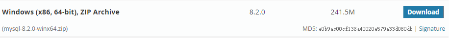
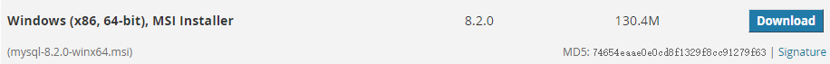
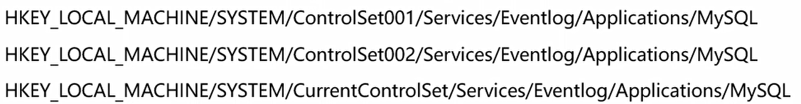

# MySql

## 计算机语言

### 1、计算机语言概述

计算机语言可以简单的理解为一种计算机和人都能识别的语言。

- 机器语言
- 汇编语言
- 高级语言

## SQL语言基础

### 1、SQL的概述

- SQL全称：Structured Query Language，是结构化查询语言，用于访问和处理数据库的标准的计算机语言。SQL语言1974年由Boyce和Chamberlin提出，并首先在IBM公司研制的关系数据库系统SystemR上实现。
- 美国国家标准局开始着手指定SQL标准，并在1986年10月公布了最早的SQL标准，扩展的标准版本是1989年发表的SQL-89，之后还有1992年指定的版本SQL-92和1999年ISO发布的版本SQL-99。
- SQL标准几经修改和完善，其功能更加强大，但目前很多数据库系统只支持SQL-99的部分特征，而大部分数据库系统都能支持1992年指定的SQL-92。

### 2、SQL的特点

- 具有综合统一性，不同数据库支持的SQL稍有不同
- 非过程化语言
- 语言简洁，用户容易接收
- 以一种语法结构提供两种使用方式

### 3、语法特点

- SQL对关键字的大小写不敏感
- SQL语句可以以单行或者多行书写，以分行结束
- SQL的注释：

```sql
-- 单行注，-- 后面一定要加一个空格
# 单行注释，#后面可以不加空格
SELECT * FROM emp;	-- 这里是注释
/*
多行注释
多行注释
*/
```

## 数据库系统简介

###  1、数据库

数据库（Database）是一个以某种组织方式存储在磁盘上的数据的集合。

### 2、数据库应用

数据库应用是指基于数据库的应用软件。

### 3、数据库管理系统（数据库软件）

- 关系型数据库（RDBMS）
  1. Oracle数据库（老大，最挣钱的数据库）
  2. MySQL数据库（最流行中型数据库）
  3. SQL server数据库（Windows上最好的数据库）
  4. PostgreSQL（功能最强大的开源数据库）
  5. SQLite（最流行的嵌入式数据库）
- 非关系型数据库（NoSQL）
  1. Redis（最好的缓存数据库）
  2. MongoDB（最好的文档型数据库）
  3. Elasticsearch（最好的搜索服务）
  4. Cassandra（最好的列式数据库）
  5. HBase（优秀的分布式、列式数据库）

### 3、SQL和数据库管理系统的关系

- SQL是一种用于操作数据库的语言，SQL适用于所有关系型数据库。
- MySQL、Oracle、SQLServer是一个标准库软件，这些数据库软件支持标准SQL，也就是通过SQL可以使用这些软件，不过每一个数据库系统会在标准SQL的基础上扩展自己的SQL语法。
- 大部分的NoSQL数据库有自己的操作语言，对SQL支持的并不好。

### 4、关系型数据库管理系统组成

数据库管理系统（DBMS）主要由数据库和表组成，一个系统可以有很多数据库，每个数据库可以有很多表。

## MySQL简介

### 1、MySQL介绍

- MySQL数据库管理系统由瑞典的DataKonsultAB公司研发，该公司被Sun公司收购，现在Sun公司又被Oracle公司收购，因此MySQL目前属于 Oracle 旗下产品。
- MySQL所使用的 SQL 语言是用于访问数据库的最常用标准化语言。MySQL 软件采用了双授权政策，分为社区版和商业版，由于其体积小、速度快、总体拥有成本低，一般中小型网站的开发都选择 MySQL 作为网站数据库。

### MySQL的特点

- MySQL数据库是用C和C++语言编写的，以保证源码的可移植性
- 支持多个操作系统例如：Windows、Linux、Mac OS等等
- 支持多线程，可以充分的利用CPU资源
- 为多种编程语言提供API，包括C语言，Java，PHP。Python语言等
- MySQL优化了SQL算法，有效的提高了查询速度
- MySQL开放源代码且无版权制约，自主性强、使用成本低
- MySQL历史悠久、社区及用户非常活跃，遇到问题，可以很快获取到帮助

### MySQL的版本

针对不同的用户，MySQL分为两种不同的版本。

- MySQL Community Server
  社区版本，免费，但是MySQL不提供官方技术支持。
- MySQL Enterprise Edition
  商业版，该版本是收费版本，可以试用30天，官方提供技术支持。
- MySQL Cluster
  集群版，开源免费，可将几个MySQL Server封装成一个Server。
- MySQL Cluster CGE
  高级集群版，需付费。
- MySQL Workbench（GUI TOOL）
  一款专为MySQL设计的ER/数据库建模工具。MySQL Workbench又分为两个版本，分别是社区版（MySQL Workbench OSS）、商用版（MySQL Workbench SE）。

MySQL的命名机制使用由3个数字和一个后缀组成的版本号。例如，像mysql-8.0.26的版本号这样解释：

- 第一个数字(8)是主版本号，描述了文件格式。所有版本的发行都有相同的文件格式。
- 第二个数字（0）是发行级别。主版本号和发行级别组合到一起便构成了发行序列号
- 第三个数字(26)是在此发行系列的版本号，随每个新分发版递增。

目前，MySQL的最新版本为MySQL 8.2.0（学习时的最新版本）

## MySQL的安装和使用

### 1、安装方式

MySQL的安装方式有两种：

- 解压配置方式
  
- 步骤安装方式
  

对于安装过程，这里就不再展示（如果想简单一点，直接下载msi安装程序下载即可）。

## MySQL的卸载

1. 停止服务：
   方式1：打开DOS，使用net stop mysql命令
   方式2：进入服务窗口关闭mysql服务
2. 卸载程序：
   在系统应用程序中直接卸载即可
3. 删除项目根文件夹：
   进入mysql安装位置，删除mysql的解压文件夹
4. 删除C盘隐藏文件夹：
   显示隐藏文件后，删除C盘下的“C:\ProgramData\MySQL”所有文件
5. 删除注册表信息：
   win+R输入regedit命令打开注册表窗口，删除以下文件：
   
6. 删除环境变量里的配置
7. 删除MYSQL服务：
   管理员权限cmd->sc delete MySQL服务名字

## MySQL常用图形管理工具

### 1、简介

如果日常的开发和维护均在类似DOS窗口中进行，对于编程初学者来说，上手就略微有点困难，增加了学习成本（后期是一定要学会在窗口中通过命令行来控制的）。我们一般使用mysql图形管理工具来连接MySQL，然后在图形化界面上操作MySQL。

MySQL的管理维护工具非常多，除了系统自带的命令行管理工具之外，还有许多其他的图形化管理工具。

### 2、常用工具介绍

- Navicat
  Navicat是一套快速、可靠的数据库管理工具，Navicat是以直觉化的图形用户界面而建的，可以兼容多种数据库，支持多种操作系统。
- SQLyog
  SQLyog是一个快速而简洁的图形化管理MySQL数据库的工具，它能够在任何地点有效地管理你的数据库，是业界著名的Webyog公司出品。
  使用SQLyog可以快速直观地让您从世界的任何角落通过网络来维护远端的MySQL数据库。
- MySQL Workbench
  MySQL Workbench MySQL是官方提供的图形化管理工具，分为社区版和商业版，社区版完全免费，而商业版则按年收费。支持数据库的创建、设计、迁移、备份、导出和导入功能，并且支持Windows、Linux和mac等主流操作系统。
- DataGrip
  DataGrip，是大名鼎鼎的JetBrains公司出品的，就是那个出品Intellij IDEA的公司。
  DataGrip是一款数据库管理客户端工具，方便连接到数据库服务器，执行sql、创建表、创建索引以及导出数据等。
- 其他工具
  phpMyAdmin
  MySQLDumper
  MySQL GUI Tools
  MySQL ODBC Connector
