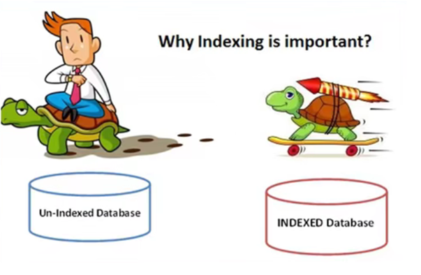
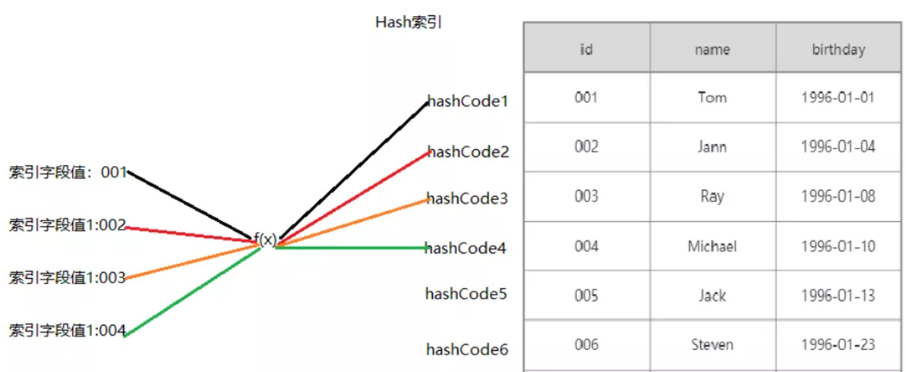
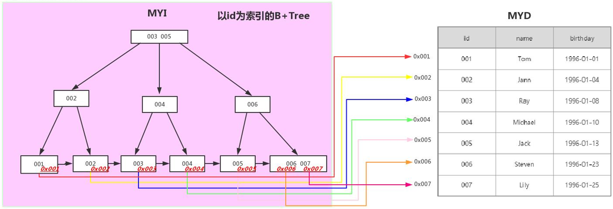
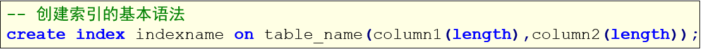
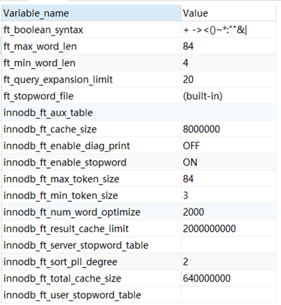
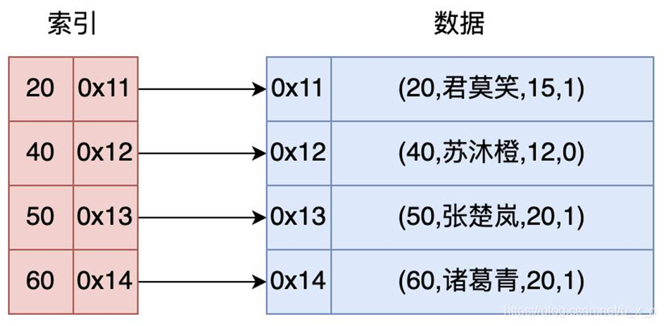
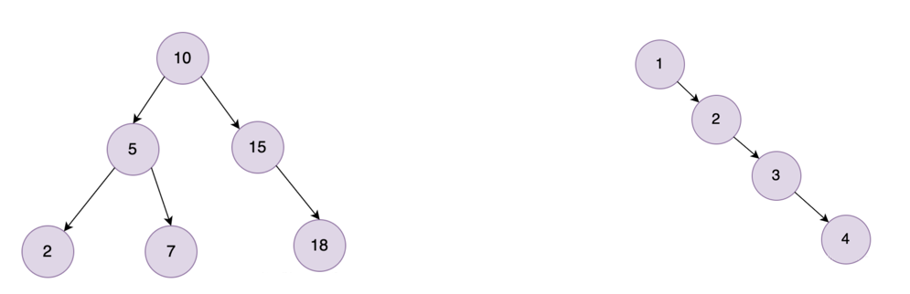
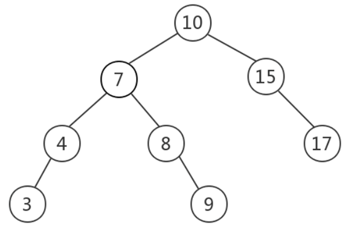
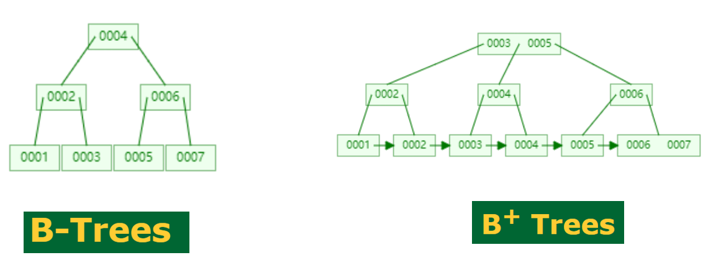

# MySQL

## MySQL的索引

### 1、介绍

​	索引是通过某种算法，构建出一个数据模型，用于快速找出在某个列中有一特定值的行，不使用索引，MySQL必须从第一条记录开始读完整个表，直到找出相关的行，表越大，查询数据所花费的时间就越多，如果表中查询的列有一个索引，MySQL能够快速到达一个位置去搜索数据文件，而不必查看所有数据，那么将会节省很大一部分时间。

​	　索引类似一本书的目录，比如要查找’student’这个单词，可以先找到s开头的页然后向后查找，这个就类似索引。



### 2、索引的分类

索引是存储引擎用来快速查找记录的一种数据结构，按照实现的方式类分，主要有Hash索引和B+Tree索引

#### 1.Hash索引



#### 2.B+Tree索引



按照功能划分，索引划为以下分类:


### 3、索引的操作

#### 1.单列索引

单列索引：一个索引只包含单个列，但一个表中可以有多个单列索引。

- 普通索引
  MySQL中基本索引类型，没有什么限制，允许在定义索引的列中插入重复值和空值，纯粹为了查询数据更快一点。

  - 创建索引

    ```sql
    -- 创建索引
    CREATE DATABASE mydb5;
    USE mydb5;
    
    -- 方式1-创建表的时候直接指定
    CREATE TABLE student(
    	sid INT PRIMARY KEY,
    	card_id VARCHAR(20),
    	name VARCHAR(20),
    	gender VARCHAR(20),
    	age INT,
    	birth DATE,
    	phone_num VARCHAR(20),
    	score DOUBLE,
    	INDEX index_name(name)	-- 给name列创建索引
    );
    
    -- 只有使用了name进行查找才会通过索引查找
    SELECT * FROM student WHERE name = '张三';
    
    -- 方式2-直接创建
    CREATE INDEX index_gender ON student(gender);
    
    -- 方式3-修改表结构（添加索引）
    ALTER TABLE student ADD INDEX index_age(age);
    ```
    
  - 查看索引
  
    ```sql
    -- 查看索引
    
    -- 1、查看数据库所有索引
    -- 数据库会为主键自动建立索引
    SELECT * FROM mysql.innodb_index_stats a WHERE a.database_name = 'mydb5';
    
    -- 2、查看表中所有索引
    SELECT * FROM mysql.innodb_index_stats a WHERE a.database_name = 'mydb5' AND a.table_name LIKE '%student%';
    
    -- 3、查看表中所有索引
    SHOW INDEX FROM student;
    ```
  
  - 删除索引
  
    ```sql
    -- 删除索引
    DROP INDEX index_gender on student;
    
    ALTER TABLE student DROP INDEX index_age;
    ```
  
- 唯一索引

  - 介绍
    唯一索引与前面的普通索引类似，不同的就是：索引列的值必须唯一，但允许有空值。如果是组合索引，则列值的组合必须唯一。

  - 创建索引

    ```sql
    -- 唯一索引
    
    -- 创建索引
    -- 方式1-创建表的时候直接指定
    CREATE TABLE student2(
    	sid INT PRIMARY KEY,
    	card_id VARCHAR(20),
    	name VARCHAR(20),
    	gender VARCHAR(20),
    	age INT,
    	birth DATE,
    	phone_num VARCHAR(20),
    	score DOUBLE,
    	UNIQUE index_card_id(card_id)	-- 给card_id列创建索引
    );
    
    -- 方式2-直接创建
    CREATE TABLE student2(
    	sid INT PRIMARY KEY,
    	card_id VARCHAR(20),
    	name VARCHAR(20),
    	gender VARCHAR(20),
    	age INT,
    	birth DATE,
    	phone_num VARCHAR(20),
    	score DOUBLE
    );
    CREATE UNIQUE INDEX index_card_id ON student2(card_id);
    
    -- 方式3-修改表结构（添加索引）
    ALTER TABLE student2 ADD UNIQUE index_phone_num(phone_num);
    ```

  - 删除索引

    ```sql
    -- 删除索引
    DROP INDEX index_card_id on student2;
    
    ALTER TABLE student2 DROP INDEX index_phone_num;
    ```

- 主键索引

  - 介绍

    每张表一般都会有自己的主键，当我们在创建表时，MySQL会自动在主键列上建立一个索引，这就是主键索引。主键是具有唯一性并且不允许为NULL，所以他是一种特殊的唯一索引。

#### 2.组合索引

- 介绍

  组合索引也叫复合索引，指的是我们在建立索引的时候使用多个字段，例如同时使用身份证和手机号建立索引，同样的可以建立为普通索引或者是唯一索引。
  复合索引的使用复合最左原则。

- 格式
  

- 操作

  ```sql
  -- 组合索引
  
  -- 创建索引--普通索引
  CREATE INDEX index_phone_name ON student(phone_num, name);
  
  -- 删除索引
  DROP INDEX index_phone_name ON student;
  
  -- 创建索引--唯一索引
  -- 创建这个索引之后，插入值时不能出现相同的键值对
  -- 组合索引符合最左原则，即只有使用了括号内左侧的列进行查找才会使用索引
  CREATE UNIQUE INDEX index_phone_name ON student(phone_num, name);
  
  -- 删除索引
  DROP INDEX index_phone_name ON student;
  ```

#### 3.全文索引

- 概述

  - 全文索引的关键字是fulltext

  - 全文索引主要用来查找文本中的关键字，而不是直接与索引中的值相比较，它更像是一个搜索引擎，基于相似度的查询，而不是简单的where语句的参数匹配。

  - 用 like + % 就可以实现模糊匹配了，为什么还要全文索引？like + % 在文本比较少时是合适的，但是对于大量的文本数据检索，是不可想象的。全文索引在大量的数据面前，能比 like + % 快 N 倍，速度不是一个数量级，但是全文索引可能存在精度问题。

  - 全文索引的版本、存储引擎、数据类型的支持情况：

    - MySQL 5.6 以前的版本，只有 MyISAM 存储引擎支持全文索引；
    - MySQL 5.6 及以后的版本，MyISAM 和 InnoDB 存储引擎均支持全文索引;
    - 只有字段的数据类型为 char、varchar、text 及其系列才可以建全文索引；
    - 在数据量较大时候，现将数据放入一个没有全局索引的表中，然后再用create index创建fulltext索引，要比先为一张表建立fulltext然后再将数据写入的速度快很多；
    - 测试或使用全文索引时，要先看一下自己的 MySQL 版本、存储引擎和数据类型是否支持全文索引。

  - MySQL 中的全文索引，有两个变量，最小搜索长度和最大搜索长度，对于长度小于最小搜索长度和大于最大搜索长度的词语，都不会被索引。通俗点就是说，想对一个词语使用全文索引搜索，那么这个词语的长度必须在以上两个变量的区间内。这两个的默认值可以使用以下命令查看:
    

    

  - 参数解释：

    | #    | 参数名称                 | 默认值 | 最小值 | 最大值 | 作用                                                         |
    | ---- | ------------------------ | ------ | ------ | ------ | ------------------------------------------------------------ |
    | 1    | ft_min_word_len          | 4      | 1      | 3600   | MyISAM  引擎表全文索引包含的最小词长度                       |
    | 2    | ft_query_expansion_limit | 20     | 0      | 1000   | MyISAM引擎表使用  with  query expansion 进行全文搜索的最大匹配数 |
    | 3    | innodb_ft_min_token_size | 3      | 0      | 16     | InnoDB  引擎表全文索引包含的最小词长度                       |
    | 4    | innodb_ft_max_token_size | 84     | 10     | 84     | InnoDB  引擎表全文索引包含的最大词长度                       |

- 操作

  ```sql
  -- 全文索引
  show variables like '%ft%';
  
  -- 数据准备
  -- 创建表的时候添加全文索引
  create table t_article (
       id int primary key auto_increment ,
       title varchar(255) ,
       content varchar(1000) ,
       writing_date date -- , 
       -- fulltext (content) -- 创建全文检索
  );
  
  insert into t_article values(null,"Yesterday Once More","When I was young I listen to the radio",'2021-10-01');
  insert into t_article values(null,"Right Here Waiting","Oceans apart, day after day,and I slowly go insane",'2021-10-02'); 
  insert into t_article values(null,"My Heart Will Go On","every night in my dreams,i see you, i feel you",'2021-10-03');
  insert into t_article values(null,"Everything I Do","eLook into my eyes,You will see what you mean to me",'2021-10-04');
  insert into t_article values(null,"Called To Say I Love You","say love you no new year's day, to celebrate",'2021-10-05');
  insert into t_article values(null,"Nothing's Gonna Change My Love For You","if i had to live my life without you near me",'2021-10-06');
  insert into t_article values(null,"Everybody","We're gonna bring the flavor show U how.",'2021-10-07');
  
  -- 修改表结构添加全文索引
  ALTER TABLE t_article ADD FULLTEXT index_content(content);
  
  -- 添加全文索引
  CREATE FULLTEXT INDEX index_content ON t_article(content);
  
  -- 使用全文索引
  -- 由于innodb_ft_min_token_size变量值为3，所以长度为2的搜索是没有结果的
  SELECT * FROM t_article WHERE MATCH(content) AGAINST('yo')	-- 没有结果
  
  SELECT * FROM t_article WHERE MATCH(content) AGAINST('you')	-- 有结果
  ```

  

#### 4.空间索引

- 介绍

  - MySQL在5.7之后的版本支持了空间索引，而且支持OpenGIS几何数据模型
  - 空间索引是对空间数据类型的字段建立的索引，MYSQL中的空间数据类型有4种，分别是GEOMETRY、POINT、LINESTRING、POLYGON。
  - MYSQL使用SPATIAL关键字进行扩展，使得能够用于创建正规索引类型的语法创建空间索引。
  - 创建空间索引的列，必须将其声明为NOT NULL。
  - 空间索引一般是用的比较少，了解即可。

- 操作

  | **类型**   | **含义** | **说明**           |
  | ---------- | -------- | ------------------ |
  | Geometry   | 空间数据 | 任何一种空间类型   |
  | Point      | 点       | 坐标值             |
  | LineString | 线       | 有一系列点连接而成 |
  | Polygon    | 多边形   | 由多条线组成       |

  ```sql
  create table shop_info (
    id  int  primary key auto_increment comment 'id',
    shop_name varchar(64) not null comment '门店名称',
    geom_point geometry not null comment '经纬度',
    spatial key geom_index(geom_point)
  );
  ```

### 4、内部原理

#### 1.概述

- 一般来说，索引本身也很大，不可能全部存储在内存中，因此索引往往以索引文件的形式存储的磁盘上。
- 这样的话，索引查找过程中就要产生磁盘I/O消耗，相对于内存存取，I/O存取的消耗要高几个数量级，所以评价一个数据结构作为索引的优劣最重要的指标就是在查找过程中磁盘I/O操作次数的渐进复杂度。
- 换句话说，索引的结构组织要尽量减少查找过程中磁盘I/O的存取次数。

#### 2.相关的算法

- Hash算法
  优点：通过字段的值计算的hash值，定位数据非常快。

  缺点：不能进行范围查找，因为散列表中的值是无序的，无法进行大小的比较。

- 二叉树
  

  优点：分为左子树、右子树和根节点，左子树比根节点值要小，右子树比根节点值要大
  缺点：有可能产生不平衡 类似于链表的结构 。

- 平衡二叉树
  

  特点：

  1. 它的左子树和右子树都是平衡二叉树
  2. 左子树比中间小，右子树比中间值
  3. 左子树和右子树的深度之差的绝对值不超过1

  缺点：

  1. 插入操作需要旋转
  2. 支持范围查询，但回旋查询效率较低，比如要查找大于8的，会回旋到父节点7、10。
  3. 如果存放几百条数据的情况下，树高度越高，查询效率会越慢

- BTREE树
  目前大部分数据库系统及文件系统都采用B-Tree或其变种B+Tree作为索引结构，Btree结构可以有效的解决之前的相关算法遇到的问题。
  

  MyISAM引擎使用B+Tree。MyISAM引擎使用B+Tree作为索引结构，叶节点的data域存放的是数据记录的地址。
  InnoDB引擎使用B+Tree。InnoDB的叶节点的data域存放的是数据，相比MyISAM效率要高一些，但是比较占硬盘内存大小。

### 5、索引的特点

#### 1.索引的优点

- 大大加快数据的查询速度
- 使用分组和排序进行数据查询时，可以显著减少查询时分组和排序的时间
- 创建唯一索引，能够保证数据库表中每一行数据的唯一性
- 在实现数据的参考完整性方面，可以加速表和表之间的连接

#### 2.索引的缺点

- 创建索引和维护索引需要消耗时间，并且随着数据量的增加，时间也会增加
- 索引需要占据磁盘空间
- 对数据表中的数据进行增加，修改，删除时，索引也要动态的维护，降低了维护的速度

#### 3.创建索引的原则

- 更新频繁的列不应设置索引
- 数据量小的表不要使用索引（毕竟总共2页的文档，还要目录吗？）
- 重复数据多的字段不应设为索引（比如性别，只有男和女，一般来说：重复的数据超过百分之15就不该建索引）
- 首先应该考虑对where 和 order by 涉及的列上建立索引