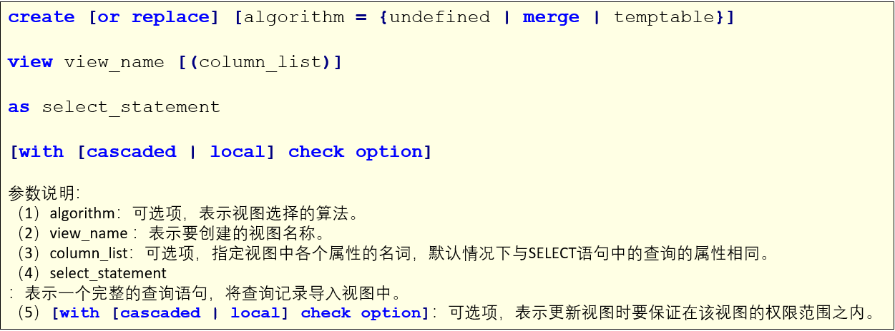

# MySQL

## MySQL的视图

### 1、介绍

- 视图（view）是一个虚拟表，非真实存在，其本质是根据SQL语句获取动态的数据集，并为其命名，用户使用时只需使用视图名称即可获取结果集，并可以将其当作表来使用。
- 数据库中只存放了视图的定义，而并没有存放视图中的数据。这些数据存放在原来的表中。
- 使用视图查询数据时，数据库系统会从原来的表中取出对应的数据。因此，视图中的数据时依赖于原来的表中的数据的。一旦表中的数据发生改变，显示在视图中的数据也会发生改变。

### 2、作用

- 简化代码，可以把重复使用的查询封装成视图重复使用，同时可以使复杂的查询易于理解和使用。
- 安全原因，如果一张表中有很多数据，很多信息不希望让所有人看到，此时可以使用视图视，如：社会保险基金表，可以用视图只显示姓名，地址，而不显示社会保险号和工资数等，可以对不同的用户，设定不同的视图。

### 3、视图的创建

创建视图的语法为：



- 数据准备

  ```sql
  create database mydb6_view;
  
  USE mydb6_view;
  
  CREATE TABLE dept(
  	deptno INT PRIMARY KEY,
  	dname VARCHAR(20),
  	loc VARCHAR(20)
  );
  
  INSERT INTO dept VALUES(10, '教研部', '北京');
  INSERT INTO dept VALUES(20, '学工部', '上海');
  INSERT INTO dept VALUES(30, '销售部', '广州');
  INSERT INTO dept VALUES(40, '财务部', '武汉');
  
  CREATE TABLE emp(
  	empno INT PRIMARY KEY,
  	ename VARCHAR(20),
  	job VARCHAR(20),
  	mgr INT,
  	hiredate DATE,
  	sal FLOAT,
  	COMM FLOAT,
  	deptno INT,
  	CONSTRAINT emp_dept FOREIGN KEY(deptno) REFERENCES dept(deptno)
  );
  
  INSERT INTO emp VALUES(1001, '甘宁', '文员', 1013, '2000-12-17', 8000.00, NULL, 20);
  INSERT INTO emp VALUES(1002, '黛绮丝', '销售员', 1006, '2001-02-20', 16000.00, 3000.00, 30);
  INSERT INTO emp VALUES(1003, '殷天正', '销售员', 1006, '2001-02-22', 12500.00, 5000.00, 30);
  INSERT INTO emp VALUES(1004, '刘备', '经理', 1009, '2001-04-02', 29750.00, NULL, 20);
  INSERT INTO emp VALUES(1005, '谢逊', '销售员', 1006, '2001-09-28', 12500.00, 14000.00, 30);
  INSERT INTO emp VALUES(1006, '关羽', '经理', 1009, '2001-05-01', 28500.00, NULL, 30);
  INSERT INTO emp VALUES(1007, '张飞', '经理', 1009, '2001-09-01', 24500.00, NULL, 10);
  INSERT INTO emp VALUES(1008, '诸葛亮', '分析师', 1004, '2007-04-19', 30000.00, NULL, 20);
  INSERT INTO emp VALUES(1009, '曾阿牛', '董事长', NULL, '2001-11-17', 50000.00, NULL, 10);
  INSERT INTO emp VALUES(1010, '韦一笑', '销售员', 1006, '2001-09-08', 15000.00, 0.00, 30);
  INSERT INTO emp VALUES(1011, '周泰', '文员', 1008, '2007-05-23', 11000.00, NULL, 20);
  INSERT INTO emp VALUES(1012, '程管', '文员', 1006, '2001-12-03', 9500.00, NULL, 30);
  INSERT INTO emp VALUES(1013, '庞统', '分析师', 1004, '2001-12-03', 30000.00, NULL, 20);
  INSERT INTO emp VALUES(1014, '黄盖', '文员', 1007, '2002-01-23', 13000.00, NULL, 10);
  
  CREATE TABLE salgrade(
  	grade INT,
  	losal INT,
  	hisal INT
  );
  
  INSERT INTO salgrade VALUES(1, 7000, 12000);
  INSERT INTO salgrade VALUES(2, 12010, 14000);
  INSERT INTO salgrade VALUES(3, 14010, 20000);
  INSERT INTO salgrade VALUES(4, 20010, 30000);
  INSERT INTO salgrade VALUES(5, 30010, 99990);
  ```
  
- 操作

  ```sql
  -- 创建视图
  
  CREATE OR REPLACE VIEW view1_emp AS SELECT ename, job FROM emp;
  
  -- 查看表和视图
  SHOW TABLES;
  SHOW FULL TABLES;
  
  SELECT * FROM view1_emp;
  ```

### 4、修改视图

修改视图是指修改数据库中已存在的表的定义。当基本表的某些字段发生改变时，可以通过修改视图来保持视图和基本表之间一致。MySQL中通过CREATE OR REPALCE VIEW语句和ALTER VIEW语句来修改视图。

- 格式
  

- 操作

  ```sql
  -- 修改视图
  ALTER VIEW view1_emp 
  AS
  SELECT a.deptno, a.dname, a.loc, b.ename, b.sal FROM dept a, emp b WHERE a.deptno = b.deptno;
  
  SELECT * FROM view1_emp;
  ```

### 5、更新视图

某些视图是可更新的。也就是说，可以在UPDATE、DELETE或INSERT等语句中使用它们，以更新基表的内容。对于可更新的视图，在视图中的行和基表中的行之间必须具有一对一的关系。如果视图包含下述结构中的任何一种，那么它就是不可更新的：

- 聚合函数（SUM(), MIN(), MAX(), COUNT()等）
- DISTINCT
- GROUP BY
- HAVING
- UNION或UNION ALL
- 位于选择列表中的子查询
- JOIN
- FROM子句中的不可更新视图
- WHERE子句中的子查询，引用FROM子句中的表。
- 仅引用文字值（在该情况下，没有要更新的基本表）

视图中虽然可以更新数据，但是有很多的限制。一般情况下，最好将视图作为查询数据的虚拟表，而不要通过视图更新数据。因为，使用视图更新数据时，如果没有全面考虑在视图中更新数据的限制，就可能会造成数据更新失败。

- 操作

  ```sql
  -- 更新视图
  CREATE OR REPLACE VIEW view1_emp
  AS
  SELECT ename, job FROM emp;
  
  -- 做更新直接做到原表里面
  UPDATE view1_emp set ename = '周瑜' WHERE ename = '鲁肃';
  -- 由于往原表里面插入值，所以数据并没有给全，所以会报错
  INSERT INTO view1_emp VALUES('孙权','文员');
  
  -- 视图包含聚合函数不可更新
  CREATE OR REPLACE VIEW view2_emp
  AS
  SELECT count(*) cnt FROM emp GROUP BY deptno;
  
  SELECT * FROM view2_emp;
  
  INSERT INTO view2_emp VALUES(100);
  UPDATE view2_emp set cnt = 100;
  
  -- 视图包含distinct不可更新
  CREATE OR REPLACE view view3_emp
  AS
  SELECT DISTINCT job FROM emp;
  
  SELECT DISTINCT job FROM view3_emp;
  
  INSERT INTO view3_emp VALUES('财务');
  
  -- -------------------------------
  CREATE OR REPLACE VIEW view4_emp
  AS
  SELECT deptno, COUNT(*) FROM emp GROUP BY deptno;
  
  INSERT INTO view4_emp values(30, 100);
  
  -- ------------------------------
  CREATE OR REPLACE VIEW view5_emp
  AS
  SELECT empno, ename FROM emp WHERE empno <= 5
  UNION
  SELECT empno, ename FROM emp WHERE empno > 5;
  
  INSERT INTO view5_emp values(1015, '韦小宝');
  
  -- ------------------------------
  CREATE OR REPLACE VIEW view6_emp
  AS
  SELECT empno, ename, sal FROM emp WHERE sal = (SELECT MAX(sal) FROM emp);
  
  INSERT INTO view6_emp VALUES(1015, '韦小宝', 30000);
  
  -- ------------------------------
  CREATE OR REPLACE VIEW view7_emp
  AS
  SELECT dname, ename, sal FROM emp a JOIN dept b ON a.deptno = b.deptno;
  
  INSERT INTO view7_emp(dname, ename, sal) VALUES('行政部', '韦小宝', 30000);
  
  -- ------------------------------
  CREATE OR REPLACE VIEW view8_emp
  AS
  SELECT '行政部', '杨过';
  
  INSERT INTO view8_emp VALUES('行政部', '韦小宝');
  ```

### 6、其他操作

- 重命名视图
  

- 删除视图
  删除视图时，只能删除视图的定义，不会删除数据。

- 操作

  ```sql
  -- 视图其他操作
  
  -- 重命名视图
  RENAME TABLE view1_emp TO myview1;
  
  -- 删除视图
  DROP VIEW IF EXISTS myview1;
  ```

### 7、练习

```sql
-- 练习

-- 1.查询部门平均薪水最高的部门名称
SELECT
	dname,
	avg_sal 
FROM
	dept a,
	(
	SELECT
		* 
	FROM
		(
		SELECT
			*,
			RANK() over ( ORDER BY avg_sal DESC ) rn 
		FROM
			( SELECT deptno, avg( sal ) avg_sal FROM emp GROUP BY deptno ) t 
		) tt 
	WHERE
		rn = 1 
	) ttt 
WHERE
	a.deptno = ttt.deptno;

-- ----------使用视图进行优化------------
CREATE OR REPLACE view test_view1
AS
SELECT deptno, avg(sal) avg_sal FROM emp GROUP BY deptno;

CREATE OR REPLACE view test_view2
AS
SELECT *, RANK() over ( ORDER BY avg_sal DESC ) rn FROM test_view1; 

CREATE OR REPLACE view test_view3
AS
SELECT * FROM test_view2 WHERE rn = 1;

SELECT
	dname,
	avg_sal 
FROM
	dept a,
	test_view3 t 
WHERE
	a.deptno = t.deptno;


-- 2.查询员工比所属领导薪资高的部门名、员工名、员工领导编号

-- 2.1 查询员工比领导工资高的部门号
CREATE OR REPLACE VIEW test_view4
AS
SELECT
	a.ename ename,
	a.sal esal,
	b.ename mgrname,
	b.sal msal,
	b.empno mempno,
	a.deptno 
FROM
	emp a,
	emp b 
WHERE
	a.mgr = b.empno && a.sal > b.sal;
-- 2.2 将第一步查询出来的部门号和部门表进行链表查询
SELECT
	a.dname,
	b.ename,
	b.mempno 
FROM
	dept a
	JOIN test_view4 b ON a.deptno = b.deptno;


-- 3.查询工资等级为4，2000年以后入职的工作地点为上海的员工编号、姓名和工资，并查询出薪资在前三名的员工信息
-- 3.1 查询工资等级为4，2000年以后入职的工作地点为上海的员工编号、姓名和工资
CREATE OR REPLACE VIEW test_view5
AS
SELECT
	b.empno,
	b.ename,
	b.sal 
FROM
	dept a
	JOIN emp b ON a.deptno = b.deptno 
	AND YEAR ( hiredate ) > '2000' 
	AND a.loc = '上海'
	JOIN salgrade c ON grade = 4 
	AND b.sal BETWEEN c.losal 
	AND c.hisal;

-- 3.2 查询出薪资在前三名的员工信息
CREATE OR REPLACE VIEW test_view6
AS
SELECT *, RANK() OVER(ORDER BY sal) rn FROM test_view5;

SELECT
	a.empno,
	a.ename,
	a.job,
	a.mgr,
	a.hiredate,
	a.sal,
	a.COMM 
FROM
	emp a,
	test_view6 b 
WHERE
	a.empno = b.empno 
	AND rn <= 3;
```
