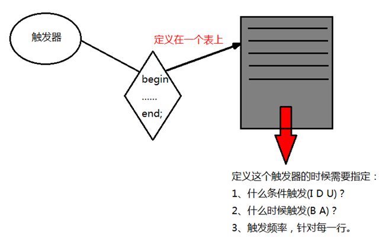

# MySQL

## MySQL的触发器

### 1、概述

#### 1.介绍

- 触发器，就是一种特殊的存储过程。触发器和存储过程一样是一个能够完成特定功能、存储在数据库服务器上的SQL片段，但是触发器无需调用，当对数据库表中的数据执行DML操作时自动触发这个SQL片段的执行，无需手动条用。
- 在MySQL中，只有执行insert,delete,update操作时才能触发触发器的执行。
- 触发器的这种特性可以协助应用在数据库端确保数据的完整性 , 日志记录 , 数据校验等操作 。
- 使用别名 OLD 和 NEW 来引用触发器中发生变化的记录内容，这与其他的数据库是相似的。现在触发器还只支持行级触发，不支持语句级触发。



#### 2.触发器的特性

1. 什么条件会触发：I、D、U
2. 什么时候触发：在增删改前或者后
3. 触发频率：针对每一行执行
4. 触发器定义在表上，附着在表上

### 2、操作

#### 1.创建触发器

- 格式

  1. 创建只有一个执行语句的触发器
     

  2. 创建有多个执行语句的触发器

     

- 操作

  ```sql
  -- 数据准备
  CREATE DATABASE IF NOT EXISTS mydb10_trigger;
  USE mydb10_trigger;
  
  -- 用户表
  CREATE TABLE user(
  	uid INT PRIMARY KEY,
  	username VARCHAR(50) NOT NULL,
  	password VARCHAR(50) NOT NULL
  );
  
  -- 用户信息操作日志表
  CREATE TABLE user_logs(
  	id INT PRIMARY KEY auto_increment,
  	time TIMESTAMP,
  	log_text VARCHAR(255)
  );
  
  -- 需求1：当user表添加一行数据，则会在user_log添加日志记录
  -- 定义触发器
  CREATE TRIGGER trigger_test1 AFTER INSERT
  ON user FOR EACH ROW
  INSERT INTO user_logs VALUES(NULL, NOW(), '有新用户添加');
  
  -- 在user表中添加数据，让触发器执行
  INSERT INTO USER VALUES(1, '张三', '123456');
  INSERT INTO USER VALUES(2, '李四', '234567');
  INSERT INTO USER VALUES(3, '王五', '345678');
  
  -- 需求2：当user表被修改时，则会在user_log添加日志记录
  
  delimiter $$
  CREATE TRIGGER trigger_test2 BEFORE UPDATE
  ON user FOR EACH ROW
  BEGIN
  	INSERT INTO user_logs VALUES(NULL, NOW(), '有用户信息被修改');
  END $$
  delimiter;
  
  -- 在user表中修改数据，让触发器自动执行
  UPDATE user SET password = '888888' WHERE uid = 1;
  UPDATE user SET password = '666666' WHERE uid = 1;
  ```

#### 2.NEW与OLD

- 格式
  MySQL 中定义了 NEW 和 OLD，用来表示触发器的所在表中，触发了触发器的那一行数据，来引用触发器中发生变化的记录内容，具体地：

  | **触发器类型**   | **触发器类型****NEW**  **和** **OLD****的使用**            |
  | ---------------- | ---------------------------------------------------------- |
  | INSERT  型触发器 | NEW  表示将要或者已经新增的数据                            |
  | UPDATE  型触发器 | OLD  表示修改之前的数据  ,  NEW 表示将要或已经修改后的数据 |
  | DELETE  型触发器 | OLD  表示将要或者已经删除的数据                            |

  使用方法：NEW.columnName （columnName为相应数据表某一列名）

- 操作

  ```sql
  -- NEW和OLD
  
  -- INSERT类型的触发器
  
  -- NEW
  DROP TRIGGER IF EXISTS trigger_test3;
  CREATE TRIGGER trigger_test3 AFTER INSERT
  ON user FOR EACH ROW
  INSERT INTO user_logs VALUES(NULL, NOW(), CONCAT('有新用户添加，信息为：',NEW.uid, NEW.username, NEW.password));
  
  INSERT INTO USER VALUES(4, '赵六', '123456');
  
  -- UPDATE类型的触发器
  -- NEW
  CREATE TRIGGER trigger_test5 AFTER UPDATE
  ON user FOR EACH ROW
  INSERT INTO user_logs VALUES(NULL, NOW(), CONCAT_WS(',', '有用户信息修改，信息修改之后为：',NEW.uid, NEW.username, NEW.password));
  
  UPDATE user SET password = '777777' WHERE uid = 1;
  
  -- OLD
  DROP TRIGGER IF EXISTS trigger_test4;
  CREATE TRIGGER trigger_test4 BEFORE UPDATE
  ON user FOR EACH ROW
  INSERT INTO user_logs VALUES(NULL, NOW(), CONCAT('有用户信息修改，信息修改之前为：',OLD.uid, OLD.username, OLD.password));
  
  UPDATE user SET password = '999999' WHERE uid = 4;
  
  -- DELETE类型触发器
  -- OLD
  DROP TRIGGER IF EXISTS trigger_test6;
  CREATE TRIGGER trigger_test6 BEFORE DELETE
  ON user FOR EACH ROW
  INSERT INTO user_logs VALUES(NULL, NOW(), CONCAT_WS(',', '有用户信息被删除，被删除用户信息为：',OLD.uid, OLD.username, OLD.password));
  
  DELETE FROM user WHERE uid = 4;
  ```

#### 3.查看触发器

```sql
-- 查看触发器
SHOW TRIGGERS;
```

#### 4.删除触发器

```sql
-- 删除触发器
DROP TRIGGER IF EXISTS trigger_test1;
```

### 3、注意事项

1. MYSQL中触发器中不能对本表进行 insert ,update ,delete 操作，以免递归循环触发。
2. 尽量少使用触发器，假设触发器触发每次执行1s，insert table 500条数据，那么就需要触发500次触发器，光是触发器执行的时间就花费了500s，而insert 500条数据一共是1s，那么这个insert的效率就非常低了。
3.  触发器是针对每一行的；对增删改非常频繁的表上切记不要使用触发器，因为它会非常消耗资源。 
