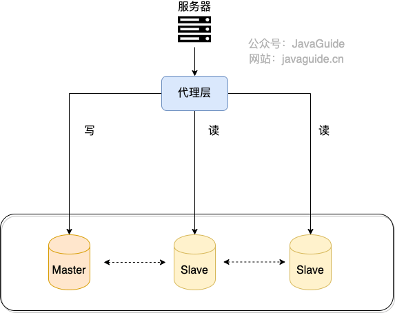

# MySQL面试

## 一、MySQL存储引擎

### 1.MySQL支持哪些存储引擎？默认使⽤哪个？

​	MySQL支持多种存储引擎，可以使用以下命令查看MySQL所支持的存储引擎：

```sqlSHO
SHOW ENGINES；
```

​	查询结果如下：


​	由上图可知，默认的存储引擎为InnoDB。并且，只有InnoDB存储引擎是事务性存储引擎，只有InnoDB支持事务。

### 2.MyISAM和InnoDB 有什么区别？

​	MySQL5.5之前，MyISAM引擎是MySQL的默认存储引擎。

#### （1）是否支持行级锁

​	MyISAM只有表级锁，而InnoDB支持行级锁和表级锁，默认为行级锁。

#### （2）是否支持事务

​	MyISAM不提供事务支持。

​	InnoDB提供事务支持，实现了SQL标准定义了四个隔离级别，具体提交(commit)和回滚(rollback)事务的能力。并且，InnoDB默认使用的REPEATABLE-READ（可重读）隔离级别是可以解决幻读问题发生的。

#### （3）是否支持外键

​	MyISAM不支持，而InnoDB支持。

#### （4）是否支持数据库异常崩溃后的安全恢复

​	MyISAM不支持，而InnoDB支持。

#### （5）是否支持MVCC

​	MyISAM不支持，而InnoDB支持。

​	MVCC可以看作是行级锁的一个升级，可以有效减少加锁操作，提高性能。

#### （6）索引实现不一样

​	虽然 MyISAM 引擎和 InnoDB 引擎都是使用 B+Tree 作为索引结构，但是两者的实现方式不太一样。

​	InnoDB 引擎中，其数据文件本身就是索引文件。相比 MyISAM，索引文件和数据文件是分离的，其表数据文件本身就是按 B+Tree 组织的一个索引结构，树的叶节点 data 域保存了完整的数据记录。

#### （7）性能有差别

​	InnoDB 的性能比 MyISAM 更强大，不管是在读写混合模式下还是只读模式下，随着 CPU 核数的增加，InnoDB 的读写能力呈线性增长。MyISAM 因为读写不能并发，它的处理能力跟核数没关系。

#### （8）数据缓存策略和机制实现不同

​	InnoDB 使用缓冲池（Buffer Pool）缓存数据页和索引页，MyISAM 使用键缓存（Key Cache）仅缓存索引页而不缓存数据页。

## 二、MySQL事务

### 1.事务的四大特性了解么？

​	关系型数据库事务都有ACID特性：

1. 原子性（Atomicity）：事务是最小的执行单位，不允许分割。事务的原子性确保动作要么全部完成，要么完全不起作用。
2. 一致性（Consistency）：执行事务前后，数据保持一致，例如转账业务中，无论事务是否成功，转账者和收款人的总额应该是不变的。
3. 隔离性（Isolation）：并发访问数据库时，一个用户的事务不被其他事务所干扰，各并发事务之间数据库是独立的。
4. 持久性（Durability）：一个事务被提交之后，它对数据库中数据的改变是持久的，即使数据库发送故障页不应该对其有任何影响。

### 2.并发事务带来了哪些问题?不可重复读和幻读有什么区别？

​	带来的问题：

1. 脏读

   一个事务读取数据并且对数据进行了修改，这个修改对其他事务来说是可见的，即使当前事务没有提交。这时另外一个事务读取了这个还未提交的数据，但第一个事务突然回滚，导致数据并没有被提交到数据库，那第二个事务读取到的就是脏数据，这也就是脏读的由来。

2. 丢失数据
   在一个事务读取一个数据时，另外一个事务也访问了该数据，那么在第一个事务中修改了这个数据后，第二个事务也修改了这个数据。这样第一个事务内的修改结果就被丢失，因此称为丢失修改。

3. 不可重复读

   指在一个事务内多次读同一数据。在这个事务还没有结束时，另一个事务也访问该数据。那么，在第一个事务中的两次读数据之间，由于第二个事务的修改导致第一个事务两次读取的数据可能不太一样。这就发生了在一个事务内两次读到的数据是不一样的情况，因此称为不可重复读。

4. 幻读
   幻读与不可重复读类似。它发生在一个事务读取了几行数据，接着另一个并发事务插入了一些数据时。在随后的查询中，第一个事务就会发现多了一些原本不存在的记录，就好像发生了幻觉一样，所以称为幻读。

​	不可重复读和幻读有什么区别：

- 不可重复读的重点是内容修改或者记录减少比如多次读取一条记录发现其中某些记录的值被修改；
- 幻读的重点在于记录新增比如多次执行同一条查询语句（DQL）时，发现查到的记录增加了。

### 3.MySQL 事务隔离级别？默认是什么级别？

​	四个隔离级别：

- 读取未提交：最低的隔离级别，允许读取尚未提交的数据变更，可能会导致脏读、幻读或不可重复读。
- 读取已提交：允许读取并发事务已经提交的数据，可以阻止脏读，但是幻读或不可重复读仍有可能发生。
- 可重复读：对同一字段的多次读取结果都是一致的，除非数据是被本身事务自己所修改，可以阻止脏读和不可重复读，但幻读仍有可能发生。
- 可串行化：最高的隔离级别，完全服从 ACID 的隔离级别。所有的事务依次逐个执行，这样事务之间就完全不可能产生干扰，也就是说，该级别可以防止脏读、不可重复读以及幻读。

​	默认隔离级别：REPEATABLE-READ（可重读）

​	可以通过以下命令来查看：

```sql
select @@transaction_isolation;
```

### 4.MySQL 的隔离级别是基于锁实现的吗？

​	MySQL 的隔离级别基于锁和 MVCC 机制共同实现的。

​	可串行化 隔离级别是通过锁来实现的，读取已提交 和可重复读 隔离级别是基于 MVCC 实现的。不过， 可串行化 之外的其他隔离级别可能也需要用到锁机制，就比如 可重复读 在当前读情况下需要使用加锁读来保证不会出现幻读。

### 5.InnoDB 对 MVCC 的具体实现

​	https://javaguide.cn/database/mysql/innodb-implementation-of-mvcc.html

## 三、MySQL字段类型

### 1.char 和 varchar 的区别是什么？

​	CHAR 和 VARCHAR 是最常用到的字符串类型，两者的主要区别在于：CHAR 是定长字符串，VARCHAR 是变长字符串。

​	CHAR 在存储时会在右边填充空格以达到指定的长度，检索时会去掉空格；VARCHAR 在存储时需要使用 1 或 2 个额外字节记录字符串的长度，检索时不需要处理。

### 2.varchar(100)和 varchar(10)的区别是什么？

​	VARCHAR(100)和 VARCHAR(10)都是变长类型，表示能存储最多 100 个字符和 10 个字符。因此，VARCHAR (100) 可以满足更大范围的字符存储需求，有更好的业务拓展性。而 VARCHAR(10)存储超过 10 个字符时，就需要修改表结构才可以。

### 3.decimal 和 float/double 的区别是什么？存储⾦钱应该⽤哪⼀种？

​	DECIMAL 和 FLOAT 的区别是：DECIMAL 是定点数，FLOAT/DOUBLE 是浮点数。DECIMAL 可以存储精确的小数值，FLOAT/DOUBLE 只能存储近似的小数值。

​	DECIMAL 用于存储具有精度要求的小数，例如与货币相关的数据，可以避免浮点数带来的精度损失。

### 4.为什么不推荐使⽤ text 和 blob？
​	数据库规范通常不推荐使用 BLOB 和 TEXT 类型，这两种类型具有一些缺点和限制，例如：

- 不能有默认值。
- 在使用临时表时无法使用内存临时表，只能在磁盘上创建临时表（《高性能 MySQL》书中有提到）。
- 检索效率较低。
- 不能直接创建索引，需要指定前缀长度。
- 可能会消耗大量的网络和 IO 带宽。
- 可能导致表上的 DML 操作变慢。

## 四、MySQL索引

### 1.为什么索引能提⾼查询速度?

​	使用索引可以大大加快数据的检索速度（大大减少检索的数据量）, 减少 IO 次数。

### 2.聚集索引和⾮聚集索引的区别？⾮聚集索引⼀定回表查询吗?
​	聚簇索引（Clustered Index）即索引结构和数据一起存放的索引，并不是一种单独的索引类型。InnoDB 中的主键索引就属于聚簇索引。

​	非聚簇索引(Non-Clustered Index)即索引结构和数据分开存放的索引，并不是一种单独的索引类型。二级索引(辅助索引)就属于非聚簇索引。MySQL 的 MyISAM 引擎，不管主键还是非主键，使用的都是非聚簇索引。非聚簇索引的叶子节点并不一定存放数据的指针，因为二级索引的叶子节点就存放的是主键，根据主键再回表查数据。

​	

​	非聚集索引一定回表查询吗？

​	非聚集索引不一定回表查询。

​	试想一种情况，用户准备使用SQL查询用户名，而用户名字段正好建立了索引。

```sql
SELECT name FROM table WHERE name = 'guang19'
```

​	那么这个索引的key本身就是name，查到对应的name直接返回就行了，无需回表查询。

​	即使是 MYISAM 也是这样，虽然 MYISAM 的主键索引确实需要回表，因为它的主键索引的叶子节点存放的是指针。但是！如果 SQL 查的就是主键呢?

```sql
SELECT id FROM table WHERE id = 1
```

​	主键索引本身的key就是主键，直接返回就行了。这种情况就称之为覆盖索引了。

### 3.索引这么多优点，为什么不对表中的每⼀个列创建⼀个索引呢？(使⽤索引⼀定能提⾼查询性能吗?)

​	创建索引和维护索引需要耗费许多时间。当对表中的数据进行增删改的时候，如果数据有索引，那么索引也需要动态的修改，会降低 SQL 执行效率。

​	索引需要使用物理文件存储，也会耗费一定空间。

​	大多数情况下，索引查询都是比全表扫描要快的。但是如果数据库的数据量不大，那么使用索引也不一定能够带来很大提升。

### 4.索引底层的数据结构了解么？Hash 索引和 B+树索引优劣分析

​	索引底层的数据结构：Hash、BST、AVL、红黑树、B树&B+树

​	具体的数据结构特点和优劣分析看以下文章：https://javaguide.cn/database/mysql/mysql-index.html

### 5.B+树做索引⽐红⿊树好在哪⾥？

1. **范围查询效率高：** B+树的叶子节点之间有指针相连接形成链表，范围查询时只需遍历这个链表即可，而红黑树则需要做中序遍历。由于 B+树的叶子节点存储了所有数据，因此适合范围查询。
2. **更适合外部存储：** B+树的内部节点只存储索引信息，而叶子节点存储数据及指向下一个叶子节点的指针，这种结构更适合外部存储，减少了 I/O 操作次数，提高了索引的效率。
3. **有利于顺序访问：** B+树的叶子节点之间有序连接，因此对于顺序访问（如范围查询、分页查询等）具有较好的性能。而红黑树在顺序访问时需要进行额外的中序遍历，效率较低。
4. **减少树的高度：** 在相同数据量的情况下，B+树相比于红黑树，树的高度更低。因为 B+树的内部节点存储的是索引信息，每个节点能够存储更多的索引键，从而减少了树的高度，提高了检索效率。
5. **更适合磁盘预读特性：** B+树的节点比红黑树的节点更大，利用了磁盘预读特性，减少了磁盘 I/O 操作的次数，提高了索引的性能。

### 6.最左前缀匹配原则了解么？

​	最左前缀匹配原则指的是在使用联合索引时，MySQL 会根据索引中的字段顺序，从左到右依次匹配查询条件中的字段。如果查询条件与索引中的最左侧字段相匹配，那么 MySQL 就会使用索引来过滤数据，这样可以提高查询效率。

### 7.什么是覆盖索引

​	覆盖索引即需要查询的字段正好是索引的字段，那么直接根据该索引，就可以查到数据了，而无需回表查询。

### 8.如何查看某条 SQL 语句是否⽤到了索引？

​	我们可以使用 `EXPLAIN` 命令来分析 SQL 的执行计划，这样就知道语句是否命中索引了。执行计划是指一条 SQL 语句在经过 MySQL 查询优化器的优化会后，具体的执行方式。

## 五、MySQL锁

### 1.表级锁和⾏级锁有什么区别？

​	**表级锁：** MySQL 中锁定粒度最大的一种锁（全局锁除外），是针对非索引字段加的锁，对当前操作的整张表加锁，实现简单，资源消耗也比较少，加锁快，不会出现死锁。不过，触发锁冲突的概率最高，高并发下效率极低。表级锁和存储引擎无关，MyISAM 和 InnoDB 引擎都支持表级锁。

​	**行级锁：** MySQL 中锁定粒度最小的一种锁，是 **针对索引字段加的锁** ，只针对当前操作的行记录进行加锁。 行级锁能大大减少数据库操作的冲突。其加锁粒度最小，并发度高，但加锁的开销也最大，加锁慢，会出现死锁。行级锁和存储引擎有关，是在存储引擎层面实现的。

### 2.哪些操作会加表级锁？哪些操作会加⾏级锁？请简单举例说⼀下。

​	表级锁：

- `ALTER TABLE`：当对表进行结构变更时，会自动获得表级锁。
- `LOCK TABLES`：手动锁定表，防止其他事务对表进行修改。
- `TRUNCATE TABLE`：清空表时会自动获得表级锁。

​	行级锁

- `UPDATE`：当更新某行数据时，会自动为该行加上行级锁，防止其他事务同时修改同一行数据。
- `SELECT ... FOR UPDATE`：在查询语句中使用 `FOR UPDATE` 子句时，会为查询结果中的行加上行级锁，防止其他事务对这些行进行修改。

### 3.InnoDB 有哪⼏类⾏锁？

- **记录锁（Record Lock）**：也被称为记录锁，属于单个行记录上的锁。
- **间隙锁（Gap Lock）**：锁定一个范围，不包括记录本身。
- **临键锁（Next-Key Lock）**：Record Lock+Gap Lock，锁定一个范围，包含记录本身，主要目的是为了解决幻读问题（MySQL 事务部分提到过）。记录锁只能锁住已经存在的记录，为了避免插入新记录，需要依赖间隙锁。

​	在 InnoDB 默认的隔离级别 REPEATABLE-READ 下，行锁默认使用的是 Next-Key Lock。但是，如果操作的索引是唯一索引或主键，InnoDB 会对 Next-Key Lock 进行优化，将其降级为 Record Lock，即仅锁住索引本身，而不是范围。

### 4.Next-Key Lock 的加锁范围？

1. **当前访问的行：** Next-Key Lock 会锁定当前事务正在访问的行，防止其他事务修改或删除该行。
2. **紧邻当前访问行的“间隙”：** 在使用范围查询（如范围查询、唯一索引扫描等）时，Next-Key Lock 会锁定当前访问行的“间隙”，即当前行与下一行之间的空间，以防止其他事务插入新的数据行，从而保证了范围查询的一致性。

### 5.当前读和快照读有什么区别？

​	**快照读**（一致性非锁定读）就是单纯的 `SELECT` 语句，但不包括下面这两类 `SELECT` 语句：

```sql
SELECT ... FOR UPDATE
-- 共享锁 可以在 MySQL 5.7 和 MySQL 8.0 中使用
SELECT ... LOCK IN SHARE MODE;
-- 共享锁 可以在 MySQL 8.0 中使用
SELECT ... FOR SHARE;
```

​	快照即记录的历史版本，每行记录可能存在多个历史版本（多版本技术）。

​	快照读的情况下，如果读取的记录正在执行 UPDATE/DELETE 操作，读取操作不会因此去等待记录上 X 锁的释放，而是会去读取行的一个快照。

​	只有在事务隔离级别 RC(读取已提交) 和 RR（可重读）下，InnoDB 才会使用一致性非锁定读：

- 在 RC 级别下，对于快照数据，一致性非锁定读总是读取被锁定行的最新一份快照数据。
- 在 RR 级别下，对于快照数据，一致性非锁定读总是读取本事务开始时的行数据版本。

​	快照读比较适合对于数据一致性要求不是特别高且追求极致性能的业务场景。

​	**当前读** （一致性锁定读）就是给行记录加 X 锁或 S 锁。

### 6.MySQL 如何使⽤乐观锁和悲观锁？

1. **悲观锁：** 悲观锁的基本思想是在操作数据之前先获取锁，确保在整个操作过程中数据不会被其他事务修改。在 MySQL 中，可以通过使用 `SELECT ... FOR UPDATE` 或 `LOCK IN SHARE MODE` 语句来实现悲观锁。例如：

   - 使用 `SELECT ... FOR UPDATE` 语句可以获取指定数据行的排他锁，防止其他事务对这些数据行进行修改。

     ```sql
     START TRANSACTION;
     SELECT * FROM users WHERE id = 1 FOR UPDATE;
     -- 在这里对数据进行修改操作
     COMMIT;
     ```

   - 使用 `LOCK IN SHARE MODE` 语句可以获取指定数据行的共享锁，其他事务也可以获取相同数据行的共享锁，但是排他锁会阻止其他事务获取该行的排他锁。

     ```sql
     START TRANSACTION;
     SELECT * FROM users WHERE id = 1 LOCK IN SHARE MODE;
     -- 在这里进行只读操作
     COMMIT;
     ```

2. **乐观锁：** 乐观锁的基本思想是假设在整个事务执行过程中数据不会被其他事务修改，只有在提交时才检查是否有其他事务对数据进行了修改。常见的实现方式包括版本号控制和时间戳控制。在 MySQL 中，可以通过在数据表中添加版本号或时间戳字段，并在更新操作时检查这些字段是否发生了变化来实现乐观锁。例如：

   - 使用版本号控制的乐观锁：

     ```sql
     START TRANSACTION;
     -- 假设 users 表中有一个 version 字段表示版本号
     SELECT version FROM users WHERE id = 1;
     -- 在应用层根据获取的 version 值进行更新操作，并在提交时检查 version 是否仍然一致
     COMMIT;
     ```

   - 使用时间戳控制的乐观锁：

     ```sql
     START TRANSACTION;
     -- 假设 users 表中有一个 last_modified_time 字段表示最后修改时间
     SELECT last_modified_time FROM users WHERE id = 1;
     -- 在应用层进行更新操作，并在提交时检查 last_modified_time 是否仍然一致
     COMMIT;
     ```

## 六、MySQL日志

可以看这个链接中的内容（密码：cnk4）:https://www.yuque.com/snailclimb/mf2z3k/zr4kfk

## 七、MySQL性能优化

### 1.能⽤ MySQL 直接存储⽂件（⽐如图⽚）吗？

​	可以是可以，直接存储文件对应的二进制数据即可。不过，还是建议不要在数据库中存储文件，会严重影响数据库性能，消耗过多存储空间。

​	可以选择使用云服务厂商提供的开箱即用的文件存储服务，成熟稳定，价格也比较低。

### 2.MySQL 如何存储 IP 地址？

可以将 IP 地址转换成整形数据存储，性能更好，占用空间也更小。

MySQL 提供了两个方法来处理 ip 地址

- `INET_ATON()`：把 ip 转为无符号整型 (4-8 位)
- `INET_NTOA()` :把整型的 ip 转为地址

插入数据前，先用 `INET_ATON()` 把 ip 地址转为整型，显示数据时，使用 `INET_NTOA()` 把整型的 ip 地址转为地址显示即可。

### 3.如何分析 SQL 的性能？

我们可以使用 `EXPLAIN` 命令来分析 SQL 的 **执行计划** 。执行计划是指一条 SQL 语句在经过 MySQL 查询优化器的优化会后，具体的执行方式。

`EXPLAIN` 并不会真的去执行相关的语句，而是通过 **查询优化器** 对语句进行分析，找出最优的查询方案，并显示对应的信息。

`EXPLAIN` 适用于 `SELECT`, `DELETE`, `INSERT`, `REPLACE`, 和 `UPDATE`语句，我们一般分析 `SELECT` 查询较多。

### 4.有哪些常⻅的 SQL 优化⼿段？

可以看以下链接的内容（密码：cnk4）：https://www.yuque.com/snailclimb/mf2z3k/abc2sv

### 5.简单说一下大表优化的思路

### 6.读写分离如何实现？

#### （1）什么是读写分离

见名思意，根据读写分离的名字，我们就可以知道：**读写分离主要是为了将对数据库的读写操作分散到不同的数据库节点上。** 这样的话，就能够小幅提升写性能，大幅提升读性能。


一般情况下，我们都会选择一主多从，也就是一台主数据库负责写，其他的从数据库负责读。主库和从库之间会进行数据同步，以保证从库中数据的准确性。这样的架构实现起来比较简单，并且也符合系统的写少读多的特点。

#### （2）如何实现读写分离

不论是使用哪一种读写分离具体的实现方案，想要实现读写分离一般包含如下几步：

1. 部署多台数据库，选择其中的一台作为主数据库，其他的一台或者多台作为从数据库。
2. 保证主数据库和从数据库之间的数据是实时同步的，这个过程也就是我们常说的**主从复制**。
3. 系统将写请求交给主数据库处理，读请求交给从数据库处理。

落实到项目本身的话，常用的方式有两种：

**1. 代理方式**



我们可以在应用和数据中间加了一个代理层。应用程序所有的数据请求都交给代理层处理，代理层负责分离读写请求，将它们路由到对应的数据库中。

**2. 组件方式**

在这种方式中，我们可以通过引入第三方组件来帮助我们读写请求。

这也是我比较推荐的一种方式。这种方式目前在各种互联网公司中用的最多的，相关的实际的案例也非常多。如果你要采用这种方式的话，推荐使用 `sharding-jdbc` ，直接引入 jar 包即可使用，非常方便。同时，也节省了很多运维的成本。

### 7.为什么要分库分表？有哪些常⻅的分库分表⼯具？

#### （1）为什么要分库分表

读写分离主要应对的是数据库读并发，没有解决数据库存储问题。试想一下：**如果 MySQL 一张表的数据量过大怎么办?**

换言之，**我们该如何解决 MySQL 的存储压力呢？**

答案之一就是 **分库分表**。

#### （2）有哪些常见的分库分表工具

Apache ShardingSphere 是一款分布式的数据库生态系统， 可以将任意数据库转换为分布式数据库，并通过数据分片、弹性伸缩、加密等能力对原有数据库进行增强。

ShardingSphere 项目（包括 Sharding-JDBC、Sharding-Proxy 和 Sharding-Sidecar）是当当捐入 Apache 的，目前主要由京东数科的一些巨佬维护。

ShardingSphere 绝对可以说是当前分库分表的首选！ShardingSphere 的功能完善，除了支持读写分离和分库分表，还提供分布式事务、数据库治理、影子库、数据加密和脱敏等功能。

### 8.深度分页如何优化？

https://javaguide.cn/high-performance/deep-pagination-optimization.html

### 9.数据冷热分离如何做？

https://javaguide.cn/high-performance/data-cold-hot-separation.html

### 10.常见的数据库优化方法有哪些

- 索引优化
- 读写分离和分库分表
- 数据冷热分离
- SQL 优化
- 深度分页优化
- 适当冗余数据
- 使用更高的硬件配置
