# 字节面试汇总

## HTTP相关

### HTTP和HTTPS有什么区别


- 端口号：HTTP默认是80，HTTPS默认是443
- URL前缀：HTTP的URL前缀是http://，HTTPS的URL前缀是https://
- 安全性和资源消耗：HTTP协议运行在TCP之上，所有传输的内容都是明文，客户端和服务端都无法验证对方的身份。HTTPS是运行在SSL/TLS之上的HTTP协议，SSL/TLS运行在TCP之上，所有传输的内容都经过加密，加密采用对称加密，但对称加密的密钥用服务器放的证书进行了非对称加密。所以说，HTTP安全性没有HTTPS高，但是HTTPS比HTTP消耗更多服务器资源。
- SEO（搜索引擎优化）：搜索引擎通常会更青睐使用 HTTPS 协议的网站，因为 HTTPS 能够提供更高的安全性和用户隐私保护。使用 HTTPS 协议的网站在搜索结果中可能会被优先显示，从而对 SEO 产生影响。

### HTTP是不保存状态的协议，如何保存用户状态

HTTP 是一种不保存状态，即无状态（stateless）协议。也就是说 HTTP 协议自身不对请求和响应之间的通信状态进行保存。那么我们如何保存用户状态呢？Session 机制的存在就是为了解决这个问题，Session 的主要作用就是通过服务端记录用户的状态。典型的场景是购物车，当你要添加商品到购物车的时候，系统不知道是哪个用户操作的，因为 HTTP 协议是无状态的。服务端给特定的用户创建特定的 Session 之后就可以标识这个用户并且跟踪这个用户了（一般情况下，服务器会在一定时间内保存这个 Session，过了时间限制，就会销毁这个 Session）。

在服务端保存 Session 的方法很多，最常用的就是内存和数据库(比如是使用内存数据库 redis 保存)。既然 Session 存放在服务器端，那么我们如何实现 Session 跟踪呢？大部分情况下，我们都是通过在 Cookie 中附加一个 Session ID 来方式来跟踪。

### URI和URL的区别是什么

- URI(Uniform Resource Identifier) 是统一资源标志符，可以唯一标识一个资源。
- URL(Uniform Resource Locator) 是统一资源定位符，可以提供该资源的路径。它是一种具体的 URI，即 URL 可以用来标识一个资源，而且还指明了如何 locate 这个资源。

URI 的作用像身份证号一样，URL 的作用更像家庭住址一样。URL 是一种具体的 URI，它不仅唯一标识资源，而且还提供了定位该资源的信息。

### GET和POST的区别

GET 和 POST 是 HTTP 协议中两种常用的请求方法，它们在不同的场景和目的下有不同的特点和用法。一般来说，可以从以下几个方面来区分二者（重点搞清两者在语义上的区别即可）：

- 语义（主要区别）：GET 通常用于获取或查询资源，而 POST 通常用于创建或修改资源。
- 幂等：GET 请求是幂等的，即多次重复执行不会改变资源的状态，而 POST 请求是不幂等的，即每次执行可能会产生不同的结果或影响资源的状态。
- 格式：GET 请求的参数通常放在 URL 中，形成查询字符串（querystring），而 POST 请求的参数通常放在请求体（body）中，可以有多种编码格式，如 application/x-www-form-urlencoded、multipart/form-data、application/json 等。GET 请求的 URL 长度受到浏览器和服务器的限制，而 POST 请求的 body 大小则没有明确的限制。不过，实际上 GET 请求也可以用 body 传输数据，只是并不推荐这样做，因为这样可能会导致一些兼容性或者语义上的问题。
- 缓存：由于 GET 请求是幂等的，它可以被浏览器或其他中间节点（如代理、网关）缓存起来，以提高性能和效率。而 POST 请求则不适合被缓存，因为它可能有副作用，每次执行可能需要实时的响应。
- 安全性：GET 请求和 POST 请求如果使用 HTTP 协议的话，那都不安全，因为 HTTP 协议本身是明文传输的，必须使用 HTTPS 协议来加密传输数据。另外，GET 请求相比 POST 请求更容易泄露敏感数据，因为 GET 请求的参数通常放在 URL 中。

POST请求的幂等性实现：

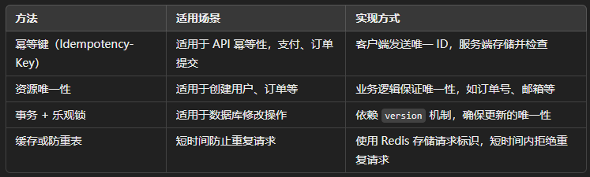

## TCP与UDP

### TCP与UDP的区别

- 是否面向连接：UDP在传输数据之前不需要先建立连接。而TCP提供面向连接的服务，在传送数据之前必须先建立连接，数据传送结束后要释放连接。
- 是否是可靠传输：远地主机在收到UDP报文后，不需要给出任何确认，并且不保证数据不丢失，不保证是否顺序到达。TCP提供可靠的传输服务，TCP在传递数据之前，会有三次握手来简历连接，而且在数据传递时，有确认、窗口、重传、拥塞控制机制。通过TCP连接传输的数据，无差错、不丢失、不重复、并且按序到达。
- 是否有状态：TCP 传输是有状态的，这个有状态说的是 TCP 会去记录自己发送消息的状态比如消息是否发送了、是否被接收了等等。为此 ，TCP 需要维持复杂的连接状态表。而 UDP 是无状态服务，简单来说就是不管发出去之后的事情了。
- 传输效率：由于使用 TCP 进行传输的时候多了连接、确认、重传等机制，所以 TCP 的传输效率要比 UDP 低很多。
- 传输形式：TCP是面向字节流的，UDP是面向报文的。
- 是否提供广播或多播服务：TCP只支持点对点通信，UDP支持一对一、一对多、多对一、多对多。

|                        | TCP            | UDP        |
| ---------------------- | -------------- | ---------- |
| 是否面向连接           | 是             | 否         |
| 是否可靠               | 是             | 否         |
| 是否有状态             | 是             | 否         |
| 传输效率               | 较慢           | 较快       |
| 传输形式               | 字节流         | 数据报文段 |
| 首部开销               | 20 ～ 60 bytes | 8 bytes    |
| 是否提供广播或多播服务 | 否             | 是         |

### 什么时候选择TCP，什么时候选UDP

**UDP 一般用于即时通信**，比如：语音、 视频、直播等等。这些场景对传输数据的准确性要求不是特别高，比如你看视频即使少个一两帧，实际给人的感觉区别也不大。

**TCP 用于对传输准确性要求特别高的场景**，比如文件传输、发送和接收邮件、远程登录等等。

### TCP三次握手和四次挥手

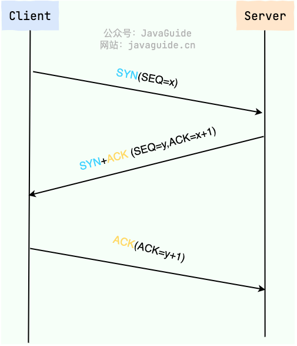

建立一个 TCP 连接需要“三次握手”，缺一不可：

- **一次握手**:客户端发送带有 SYN（SEQ=x） 标志的数据包 -> 服务端，然后客户端进入 **SYN_SEND** 状态，等待服务端的确认；
- **二次握手**:服务端发送带有 SYN+ACK(SEQ=y,ACK=x+1) 标志的数据包 –> 客户端,然后服务端进入 **SYN_RECV** 状态；
- **三次握手**:客户端发送带有 ACK(ACK=y+1) 标志的数据包 –> 服务端，然后客户端和服务端都进入**ESTABLISHED** 状态，完成 TCP 三次握手。

当建立了 3 次握手之后，客户端和服务端就可以传输数据啦！

### 为什么要三次握手

三次握手的目的是建立可靠的通信信道，说到通讯，简单来说就是数据的发送与接收，而三次握手最主要的目的就是双方确认自己与对方的发送与接收是正常的。

1. **第一次握手**：Client 什么都不能确认；Server 确认了对方发送正常，自己接收正常
2. **第二次握手**：Client 确认了：自己发送、接收正常，对方发送、接收正常；Server 确认了：对方发送正常，自己接收正常
3. **第三次握手**：Client 确认了：自己发送、接收正常，对方发送、接收正常；Server 确认了：自己发送、接收正常，对方发送、接收正常

三次握手就能确认双方收发功能都正常，缺一不可。

### 第二次握手传回了ACK，为什么还要传回SYN

服务端传回发送端所发送的ACK是为了告诉客户端：“我接收到的信息确实就是你所发送的信号了”，这表明从客户端到服务端的通信是正常的。回传SYN则是为了建立并确认从服务端到客户端的通信。

### 三次握手过程中可以携带数据吗？

在 TCP 三次握手过程中，第三次握手是可以携带数据的(客户端发送完 ACK 确认包之后就进入 ESTABLISHED 状态了)，这一点在 RFC 793 文档中有提到。也就是说，一旦完成了前两次握手，TCP 协议允许数据在第三次握手时开始传输。

如果第三次握手的 ACK 确认包丢失，但是客户端已经开始发送携带数据的包，那么服务端在收到这个携带数据的包时，如果该包中包含了 ACK 标记，服务端会将其视为有效的第三次握手确认。这样，连接就被认为是建立的，服务端会处理该数据包，并继续正常的数据传输流程。

### 断开连接-TCP四次挥手

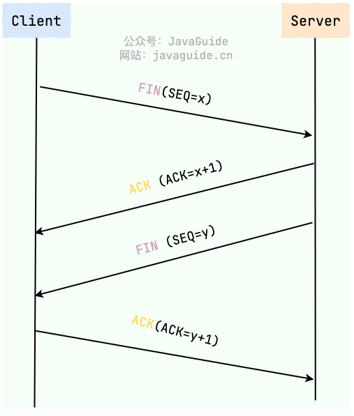

断开一个 TCP 连接则需要“四次挥手”，缺一不可：

1. **第一次挥手**：客户端发送一个 FIN（SEQ=x） 标志的数据包->服务端，用来关闭客户端到服务端的数据传送。然后客户端进入 **FIN-WAIT-1** 状态。
2. **第二次挥手**：服务端收到这个 FIN（SEQ=X） 标志的数据包，它发送一个 ACK （ACK=x+1）标志的数据包->客户端 。然后服务端进入 **CLOSE-WAIT** 状态，客户端进入 **FIN-WAIT-2** 状态。
3. **第三次挥手**：服务端发送一个 FIN (SEQ=y)标志的数据包->客户端，请求关闭连接，然后服务端进入 **LAST-ACK** 状态。
4. **第四次挥手**：客户端发送 ACK (ACK=y+1)标志的数据包->服务端，然后客户端进入**TIME-WAIT**状态，服务端在收到 ACK (ACK=y+1)标志的数据包后进入 CLOSE 状态。此时如果客户端等待 **2MSL** 后依然没有收到回复，就证明服务端已正常关闭，随后客户端也可以关闭连接了。

**只要四次挥手没有结束，客户端和服务端就可以继续传输数据！**

### 为什么要四次挥手

TCP 是全双工通信，可以双向传输数据。任何一方都可以在数据传送结束后发出连接释放的通知，待对方确认后进入半关闭状态。当另一方也没有数据再发送的时候，则发出连接释放通知，对方确认后就完全关闭了 TCP 连接。

举个例子：A 和 B 打电话，通话即将结束后。

1. **第一次挥手**：A 说“我没啥要说的了”
2. **第二次挥手**：B 回答“我知道了”，但是 B 可能还会有要说的话，A 不能要求 B 跟着自己的节奏结束通话
3. **第三次挥手**：于是 B 可能又巴拉巴拉说了一通，最后 B 说“我说完了”
4. **第四次挥手**：A 回答“知道了”，这样通话才算结束。

### 为什么不能把服务端发送的ACK和FIN合并起来，变成三次挥手？

因为服务端收到客户端断开连接的请求时，可能还有一些数据没有发完，这时先回复ACK，表示接收到了断开连接的请求。等待数据发完之后再发FIN，断开服务端到客户端的数据传送

### 如果第二次挥手时服务端的ACK没有送达客户端，会怎样？

客户端没有收到ACK确认，会重新发送FIN请求。

### 为什么第四次挥手需要等待2*MSL（报文段最长寿命）时间后才进入CLOSED状态？

第四次挥手时，客户端发送给服务端的 ACK 有可能丢失，如果服务端因为某些原因而没有收到 ACK 的话，服务端就会重发 FIN，如果客户端在 2*MSL 的时间内收到了 FIN，就会重新发送 ACK 并再次等待 2MSL，防止 Server 没有收到 ACK 而不断重发 FIN。

**MSL(Maximum Segment Lifetime)** : 一个片段在网络中最大的存活时间，2MSL 就是一个发送和一个回复所需的最大时间。如果直到 2MSL，Client 都没有再次收到 FIN，那么 Client 推断 ACK 已经被成功接收，则结束 TCP 连接。

## List相关问题

### ArrayList扩容机制分析

这里看ArrayList源码

首先是其最关键的两个成员变量：

```java
/**
 * 默认初始容量大小
 */
private static final int DEFAULT_CAPACITY = 10;

private static final Object[] DEFAULTCAPACITY_EMPTY_ELEMENTDATA = {};
```

然后我们看add方法：

```java
/**
* 将指定的元素追加到此列表的末尾。
*/
public boolean add(E e) {
    // 加元素之前，先调用ensureCapacityInternal方法
    ensureCapacityInternal(size + 1);  // Increments modCount!!
    // 这里看到ArrayList添加元素的实质就相当于为数组赋值
    elementData[size++] = e;
    return true;
}
```

add方法调用了ensureCapacityInternal()方法，其实现方式如下面所示

```java
// 根据给定的最小容量和当前数组元素来计算所需容量。
private static int calculateCapacity(Object[] elementData, int minCapacity) {
    // 如果当前数组元素为空数组（初始情况），返回默认容量和最小容量中的较大值作为所需容量
    if (elementData == DEFAULTCAPACITY_EMPTY_ELEMENTDATA) {
        return Math.max(DEFAULT_CAPACITY, minCapacity);
    }
    // 否则直接返回最小容量
    return minCapacity;
}

// 确保内部容量达到指定的最小容量。
private void ensureCapacityInternal(int minCapacity) {
    ensureExplicitCapacity(calculateCapacity(elementData, minCapacity));
}
//判断是否需要扩容
private void ensureExplicitCapacity(int minCapacity) {
    modCount++;
    //判断当前数组容量是否足以存储minCapacity个元素
    if (minCapacity - elementData.length > 0)
        //调用grow方法进行扩容
        grow(minCapacity);
}
```

这个时候我们分析一下：

- 当我们通过add添加第一个元素时，elementData.length为0（因为还一个空的list），因为执行了ensureCapacityInternal()方法，所以minCapacity此时为10。此时，minCapacity--elementData.length>0成立，所以会进入grow(minCapacity)方法。
- 当添加第二个元素时，此时elementData.length为1，此时差值不成立，所以不会扩容
- 添加第3、4...到第10个元素时，依然不会执行grow方法
- 直到添加第11个元素，才会进入grow方法进行扩容

然后我们看grow方法

```java
/**
 * 要分配的最大数组大小
 */
private static final int MAX_ARRAY_SIZE = Integer.MAX_VALUE - 8;

/**
 * ArrayList扩容的核心方法。
 */
private void grow(int minCapacity) {
    // oldCapacity为旧容量，newCapacity为新容量
    int oldCapacity = elementData.length;
    // 将oldCapacity 右移一位，其效果相当于oldCapacity /2，
    // 我们知道位运算的速度远远快于整除运算，整句运算式的结果就是将新容量更新为旧容量的1.5倍，
    int newCapacity = oldCapacity + (oldCapacity >> 1);

    // 然后检查新容量是否大于最小需要容量，若还是小于最小需要容量，那么就把最小需要容量当作数组的新容量，
    if (newCapacity - minCapacity < 0)
        newCapacity = minCapacity;

    // 如果新容量大于 MAX_ARRAY_SIZE,进入(执行) `hugeCapacity()` 方法来比较 minCapacity 和 MAX_ARRAY_SIZE，
    // 如果minCapacity大于最大容量，则新容量则为`Integer.MAX_VALUE`，否则，新容量大小则为 MAX_ARRAY_SIZE 即为 `Integer.MAX_VALUE - 8`。
    if (newCapacity - MAX_ARRAY_SIZE > 0)
        newCapacity = hugeCapacity(minCapacity);

    // minCapacity is usually close to size, so this is a win:
    elementData = Arrays.copyOf(elementData, newCapacity);
}
```

**我们再来通过例子探究一下`grow()` 方法：**

- 当 `add` 第 1 个元素时，`oldCapacity` 为 0，经比较后第一个 if 判断成立，`newCapacity = minCapacity`(为 10)。但是第二个 if 判断不会成立，即 `newCapacity` 不比 `MAX_ARRAY_SIZE` 大，则不会进入 `hugeCapacity` 方法。数组容量为 10，`add` 方法中 return true,size 增为 1。
- 当 `add` 第 11 个元素进入 `grow` 方法时，`newCapacity` 为 15，比 `minCapacity`（为 11）大，第一个 if 判断不成立。新容量没有大于数组最大 size，不会进入 `hugeCapacity` 方法。数组容量扩为 15，add 方法中 return true,size 增为 11。
- 以此类推······

hugeCapacity()方法

```java
private static int hugeCapacity(int minCapacity) {
    if (minCapacity < 0) // overflow
        throw new OutOfMemoryError();
    // 对minCapacity和MAX_ARRAY_SIZE进行比较
    // 若minCapacity大，将Integer.MAX_VALUE作为新数组的大小
    // 若MAX_ARRAY_SIZE大，将MAX_ARRAY_SIZE作为新数组的大小
    // MAX_ARRAY_SIZE = Integer.MAX_VALUE - 8;
    return (minCapacity > MAX_ARRAY_SIZE) ?
        Integer.MAX_VALUE :
        MAX_ARRAY_SIZE;
}
```

如果minCapacity大于最大容量，则新容量则为Integer.MAX_VALUE

在grow方法中，调用了Arrays.copyof方法实现了扩容，其底层调用了System.arraycopy方法，然后在原有的数组基础上拷贝了一个new上来的数组，其长度为定义的newCapacity。

## Java线程相关

### Java线程和操作系统的线程有什么区别

一句话概括Java线程和操作系统的关系：**现在的java线程的本质其实就是操作系统的线程**

### 如何创建线程

一般来说，创建线程有很多种方式，例如继承`Thread`类、实现`Runnable`接口、实现`Callable`接口、使用线程池、使用`CompletableFuture`类等等。

不过，这些方式其实并没有真正创建出线程。准确点来说，这些都属于是在 Java 代码中使用多线程的方法。

严格来说，Java 就只有一种方式可以创建线程，那就是通过`new Thread().start()`创建。不管是哪种方式，最终还是依赖于`new Thread().start()`。

### Thread#sleep()方法和Object#wait()方法对比

**`sleep()` 方法没有释放锁，而 `wait()` 方法释放了锁** 。

`wait()` 通常被用于线程间交互/通信，`sleep()`通常被用于暂停执行。

`wait()` 方法被调用后，线程不会自动苏醒，需要别的线程调用同一个对象上的 `notify()`或者 `notifyAll()` 方法。`sleep()`方法执行完成后，线程会自动苏醒，或者也可以使用 `wait(long timeout)` 超时后线程会自动苏醒。

`sleep()` 是 `Thread` 类的静态本地方法，`wait()` 则是 `Object` 类的本地方法。为什么这样设计呢？下一个问题就会聊到。

### 为什么wait()方法不定义在Thread中

`wait()` 是让获得对象锁的线程实现等待，会自动释放当前线程占有的对象锁。每个对象（`Object`）都拥有对象锁，既然要释放当前线程占有的对象锁并让其进入 WAITING 状态，自然是要操作对应的对象（`Object`）而非当前的线程（`Thread`）。

类似的问题：**为什么 `sleep()` 方法定义在 `Thread` 中？**

因为 `sleep()` 是让当前线程暂停执行，不涉及到对象类，也不需要获得对象锁。

### 可以直接调用Thread类的run方法吗？

new 一个 `Thread`，线程进入了新建状态。调用 `start()`方法，会启动一个线程并使线程进入了就绪状态，当分配到时间片后就可以开始运行了。 `start()` 会执行线程的相应准备工作，然后自动执行 `run()` 方法的内容，这是真正的多线程工作。 但是，直接执行 `run()` 方法，会把 `run()` 方法当成一个 main 线程下的普通方法去执行，并不会在某个线程中执行它，所以这并不是多线程工作。

**总结：调用 `start()` 方法方可启动线程并使线程进入就绪状态，直接执行 `run()` 方法的话不会以多线程的方式执行。**

### volatile关键字

#### volatile语义

1. 保证了不同线程对某个共享变量进行操作时的可见性。
2. 禁止指令重排序

#### 内存可见性

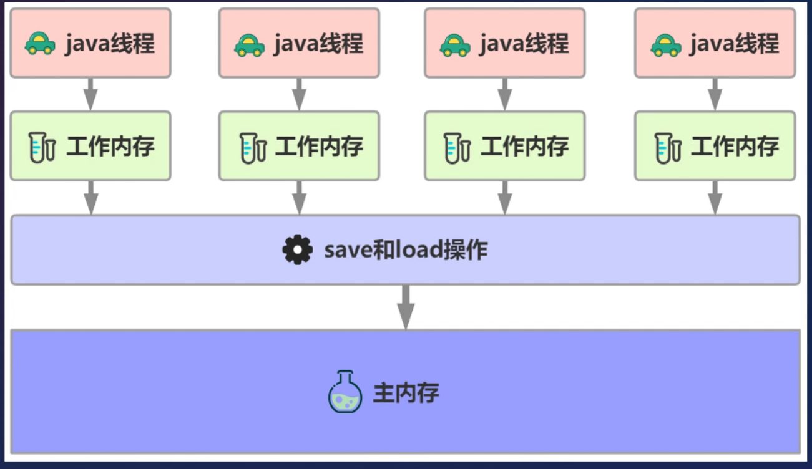

线程之间的内存可见性，当一个线程修改了共享变量时，另一个线程可以读取到这个修改后的值。

当一个线程对volatile修饰的变量进行写操作时，JMM会立即把该线程对应的本地内存中的共享变量刷新到主内存。

当一个线程对volatile修饰的变量进行读操作时，JMM会立即将当前线程对应的本地内存设置为无效，从主内存中读取共享变量的值。 

#### 指令重排序

为优化程序性能，对原有的指令执行顺序进行优化重新排序。重排序可以发生在多个阶段，如编译重排序，CPU重排序等。

volatile实现禁止指令重排基于的是内存屏障。

##### 内存屏障

内存屏障，也称内存栅栏，是一类同步屏障指令，是CPU或编译器在对内存随机访问的操作中的一个同步点，使得此点之前的所有读写操作都执行后才可以开始执行此点之后的操作。 

1. 阻止屏障两侧的指令重排序：内存屏障能够让CPU或编译器在内存访问上有序。一个内存屏障之前的内存访问操作必定先于其之后的完成。
2. 强制把写缓冲区/高速缓存中的脏数据等写回主内存，或者让缓存中相应的数据失效。内存屏障是一种CPU指令，用于控制特定条件下的重排序和内存可见性问题。Java编译器也会根据内存屏障的规则禁止重排序。 

volatile内存屏障插入策略

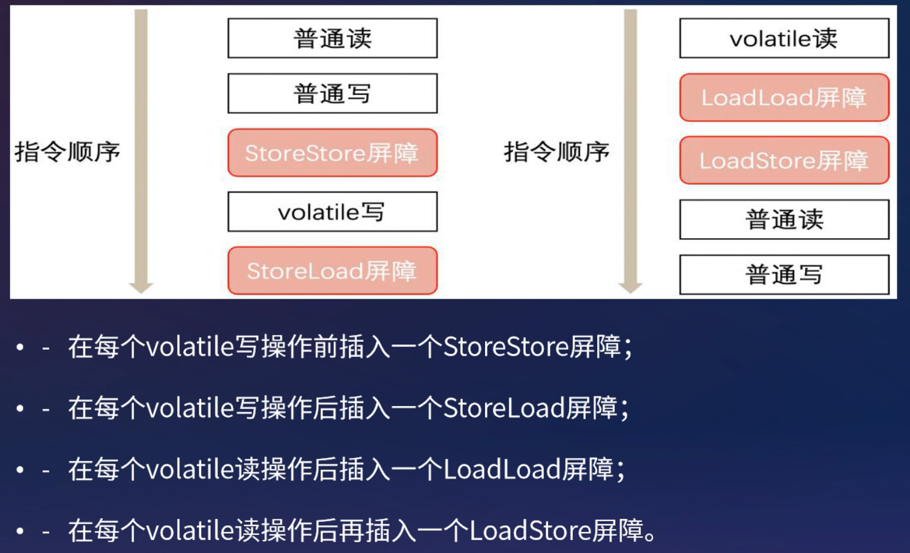

#### volatile重排序规则

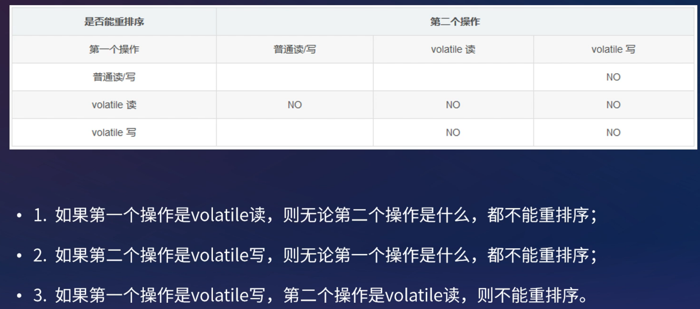

volatile使用场景

1. 修饰标记变量
2. 单例模式中的双重检查

### synchronized关键字

`synchronized` 是 Java 中的一个关键字，翻译成中文是同步的意思，主要解决的是多个线程之间访问资源的同步性，可以保证被它修饰的方法或者代码块在任意时刻只能有一个线程执行。

#### 如何使用synchronized

`synchronized` 关键字的使用方式主要有下面 3 种：

1. 修饰实例方法
2. 修饰静态方法
3. 修饰代码块

```java
//修饰实例方法（锁当前对象实例）
synchronized void method() {
    //业务代码
}
//修饰静态方法（锁当前类）
synchronized static void method() {
    //业务代码
}
//修饰代码块
//synchronized(object) 表示进入同步代码库前要获得 给定对象的锁。
//synchronized(类.class) 表示进入同步代码前要获得 给定 Class 的锁
synchronized(this) {
    //业务代码
}
```

#### synchronzied特性

- 原子性
- 可见性
- 有序性
- 可重入性

#### 原子性

- 被synchronzied修饰的类或对象的所有操作都是原子的，因为在执行操作之前必须先获得类或对象的锁，直到执行完才能释放，这中间的过程无法被中断（除了已经被抛弃的stop()方法），即保证了原子性
- synchronzied和volatile，它们俩特性上最大的区别就在于原子性，volatile不具备原子性

#### 可见性

- synchronized和volatile都具有可见性，其中synchronized对一个类或对象加锁时，一个线程如果要访问该类或多项必须先获得它的锁，而这个锁的状态对于其他任何线程都是可见的，并且在释放锁之前会将对变量的修改刷新到主存当中，保证资源变量的可见性，如果某个线程占用了该锁，其他线程就必须在锁池中等待锁的释放。
- 而volatile的实现类似，被volatile修饰的变量，每当值需要修改时都会立即更新主存，主存是共享的，所有线程可见，所以确保了其他线程读取到的变量永远是最新值，保证可见性。

#### 有序性

- synchronized和volatile都具有有序性，Java允许编译器和处理器对指令进行重排，但是指令重排并不会影响单线程的顺序，它影响的是多线程并发执行的顺序性。
- synchronized保证了每个时刻都只有一个线程访问同步代码块，也就确定了线程执行同步代码块是分先后顺序的，保证了有序性。

#### 可重入性

- synchronized和ReentrantLock都是可重入锁
- 当一个线程试图操作一个由其他线程持有的对象锁的临界资源时，将会处于阻塞状态，但当一个线程再次请求自己持有对象锁的临界资源时，这种情况属于重入锁。

### synchronized和volatile有什么区别

`synchronized` 关键字和 `volatile` 关键字是两个互补的存在，而不是对立的存在！

- `volatile` 关键字是线程同步的轻量级实现，所以 `volatile`性能肯定比`synchronized`关键字要好 。但是 `volatile` 关键字只能用于变量而 `synchronized` 关键字可以修饰方法以及代码块 。
- `volatile` 关键字能保证数据的可见性，但不能保证数据的原子性。`synchronized` 关键字两者都能保证。
- `volatile`关键字主要用于解决变量在多个线程之间的可见性，而 `synchronized` 关键字解决的是多个线程之间访问资源的同步性。

## 认证授权相关

### RBAC模型

 RBAC 即基于角色的权限访问控制（Role-Based Access Control）。这是一种通过角色关联权限，角色同时又关联用户的授权的方式。

简单地说：一个用户可以拥有若干角色，每一个角色又可以被分配若干权限，这样就构造成“用户-角色-权限” 的授权模型。在这种模型中，用户与角色、角色与权限之间构成了多对多的关系。

为了实现RBAC权限模型，数据库表的常见设计如下：

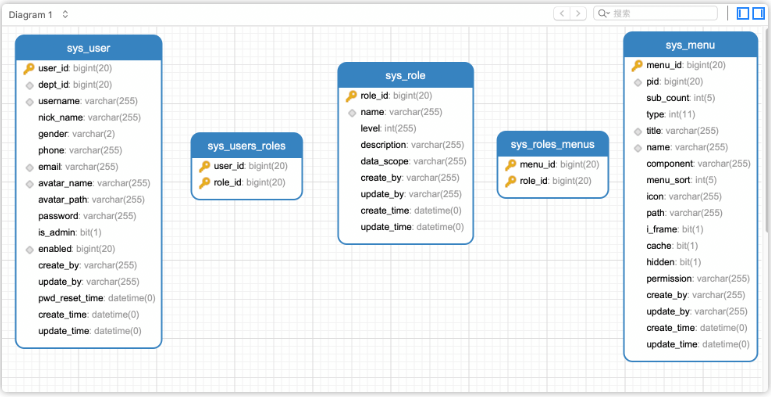

### Cookie

维基百科是这样定义 `Cookie` 的：

> `Cookies` 是某些网站为了辨别用户身份而储存在用户本地终端上的数据（通常经过加密）。

简单来说：**`Cookie` 存放在客户端，一般用来保存用户信息**。

下面是 `Cookie` 的一些应用案例：

1. 我们在 `Cookie` 中保存已经登录过的用户信息，下次访问网站的时候页面可以自动帮你登录的一些基本信息给填了。除此之外，`Cookie` 还能保存用户首选项，主题和其他设置信息。
2. 使用 `Cookie` 保存 `SessionId` 或者 `Token` ，向后端发送请求的时候带上 `Cookie`，这样后端就能取到 `Session` 或者 `Token` 了。这样就能记录用户当前的状态了，因为 HTTP 协议是无状态的。
3. `Cookie` 还可以用来记录和分析用户行为。举个简单的例子你在网上购物的时候，因为 HTTP 协议是没有状态的，如果服务器想要获取你在某个页面的停留状态或者看了哪些商品，一种常用的实现方式就是将这些信息存放在 `Cookie`
4. ......

### Cookie和Session有什么区别？

**`Session` 的主要作用就是通过服务端记录用户的状态。** 典型的场景是购物车，当你要添加商品到购物车的时候，系统不知道是哪个用户操作的，因为 HTTP 协议是无状态的。服务端给特定的用户创建特定的 `Session` 之后就可以标识这个用户并且跟踪这个用户了。

`Cookie` 数据保存在客户端(浏览器端)，`Session` 数据保存在服务器端。相对来说 `Session` 安全性更高。如果使用 `Cookie` 的一些敏感信息不要写入 `Cookie` 中，最好能将 `Cookie` 信息加密然后使用到的时候再去服务器端解密。

### 如何使用Session-Cookie方案进行身份认证

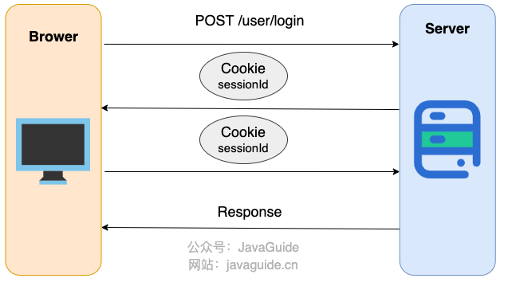

1. 用户向服务器发送用户名、密码、验证码用于登陆系统
2. 服务器验证通过后，服务器为用户创建一个Session，并将Session信息存储起来
3. 服务器向用户返回一个SessionID，写入用户的Cookie。
4. 当用户保持登陆状态时，Cookie将与每个后续请求一起被发送出去
5. 服务器可以将存储在Cookie上的SessionID与存储在内存中或者数据库中的Session信息进行比较，以验证用户的身份，返回给用户客户端相应信息的时候会附带用户当前的状态。

### 如果没有Cookie的话Session还能用吗

一般是通过 `Cookie` 来保存 `SessionID` ，假如你使用了 `Cookie` 保存 `SessionID` 的方案的话， 如果客户端禁用了 `Cookie`，那么 `Session` 就无法正常工作。

但是，并不是没有 `Cookie` 之后就不能用 `Session` 了，比如你可以将 `SessionID` 放在请求的 `url` 里面`https://javaguide.cn/?Session_id=xxx` 。这种方案的话可行，但是安全性和用户体验感降低。当然，为了安全你也可以对 `SessionID` 进行一次加密之后再传入后端。

### 什么是OAuth 2.0

实际上它就是一种授权机制，它的最终目的是为第三方应用颁发一个有时效性的令牌 Token，使得第三方应用能够通过该令牌获取相关的资源。

OAuth 2.0 比较常用的场景就是第三方登录，当你的网站接入了第三方登录的时候一般就是使用的 OAuth 2.0 协议。

另外，现在 OAuth 2.0 也常见于支付场景（微信支付、支付宝支付）和开发平台（微信开放平台、阿里开放平台等等）。

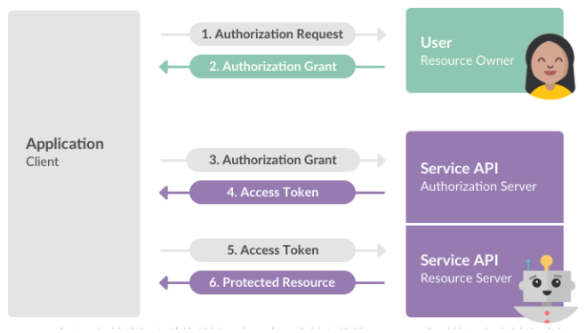

### 什么是JWT

JWT （JSON Web Token） 是目前最流行的跨域认证解决方案，是一种基于 Token 的认证授权机制。 从 JWT 的全称可以看出，JWT 本身也是 Token，一种规范化之后的 JSON 结构的 Token。

JWT 自身包含了身份验证所需要的所有信息，因此，我们的服务器不需要存储 Session 信息。这显然增加了系统的可用性和伸缩性，大大减轻了服务端的压力。

可以看出，**JWT 更符合设计 RESTful API 时的「Stateless（无状态）」原则** 。

并且， 使用 JWT 认证可以有效避免 CSRF 攻击，因为 JWT 一般是存在在 localStorage 中，使用 JWT 进行身份验证的过程中是不会涉及到 Cookie 的。

### JWT组成

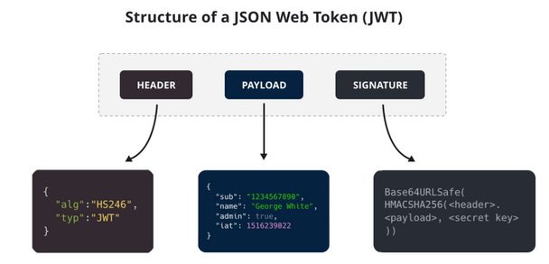

- Header（头部）：描述JWT的元数据，定义了生成签名的算法以及Token的类型。Header被Base64Url编码后成为了JWT的第一部分
- Payload（载荷）：用来存放实际需要传递的数据，包含声明（Claims），如sub、jti。Payload被Base64Url编码后称为JWT的第二部分。
- Signature（签名）：服务器通过Payload、Header和一个密钥(Secret)使用Header里面指定的签名算法（默认是HMAC SHA256）生成。生成的签名会成为JWT的第三部分。

示例

```java
eyJhbGciOiJIUzI1NiIsInR5cCI6IkpXVCJ9.
eyJzdWIiOiIxMjM0NTY3ODkwIiwibmFtZSI6IkpvaG4gRG9lIiwiaWF0IjoxNTE2MjM5MDIyfQ.
SflKxwRJSMeKKF2QT4fwpMeJf36POk6yJV_adQssw5c
```

### 如何基于JWT进行身份验证

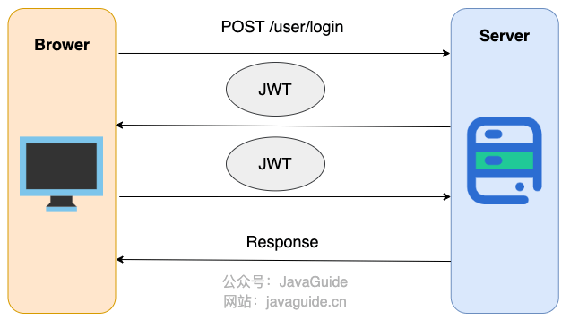

简化后的步骤如下：

- 用户向服务器发送用户名、密码以及验证码用于登陆系统。、
- 如果用户用户名、密码以及验证码校验正确的话，服务端会返回已经签名的 Token，也就是 JWT。
- 用户以后每次向后端发请求都在 Header 中带上这个 JWT 。
- 服务端检查 JWT 并从中获取用户相关信息。
