# 字节面试汇总

## 进程线程协程

### 什么是进程和线程

进程是指计算机中正在运行的一个程序实例。举例：：你打开的微信就是一个进程。

线程也被称为轻量级进程，更加轻量。多个线程可以在同一个进程中同时执行，并且共享进程的资源比如内存空间、文件句柄、网络连接等。举例：你打开的微信里就有一个线程专门用来拉取别人发你的最新的消息。

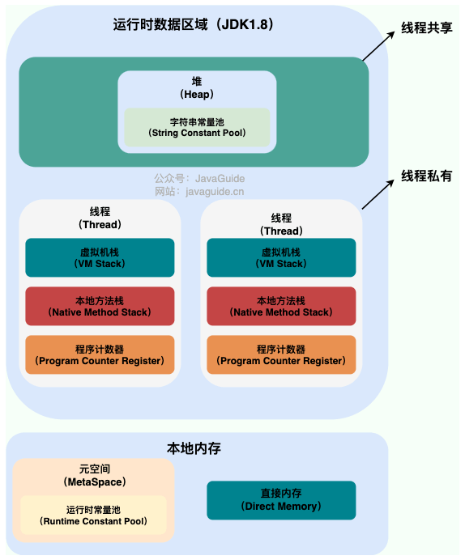

从上图可以看出：一个进程中可以有多个线程，多个线程共享进程的堆和方法区资源，但是每个线程有自己的程序计数器、虚拟机栈和本地方法栈。

总结：

- 线程是进程划分成的更小的运行单位，一个进程在其执行的过程中可以产生多个线程。
- 线程和进程最大的不同在于基本上各进程是独立的，而各线程则不一定，因为同一个进程中的线程极有可能会相互影响。
- 线程执行开销小，但不利于资源的管理和保护；而进程正相反。

### 为什么要使用多线程

从总体上说：

- 从计算机底层来说：线程可以比作是轻量级的进程，是程序执行的最小单位，线程间的切换和调度的成本远远小于进程。
- 从当代互联网发展趋势来说：现在的系统动不动就要求百万级甚至千万级的并发量，而多线程并发编程正是开发高并发系统的基础，利用好多线程机制可以大大提高系统整体的并发能力以及性能。

### 线程间的同步方式有哪些

几种常见的线程同步的方式：

- 互斥锁：采用互斥对象机制，值用拥有互斥对象的线程才有访问公共资源的权限。比如Java中的synchronized关键词和各种Lock都是这种机制。
- 读写锁：允许多个线程同时读取共享资源，但只有一个线程可以对共享资源进行写操作。
- 信号量：它允许同一时刻多个线程访问同一资源，但是需要控制同一时刻访问此资源的最大线程数量。
- 屏障：屏障是一种同步原语，用于等待多个线程到达某个点再一起继续执行。当一个线程到达屏障后，它会停止执行并等待其他线程到达屏障，直到所有线程都到达屏障后，它们才会一起继续执行。比如Java中的CyclicBarrier是这种机制。
- 事件：通过通知操作的方式来保持多线程同步，还可以方便的实现多线程优先级的比较操作。

### 进程有哪几种状态

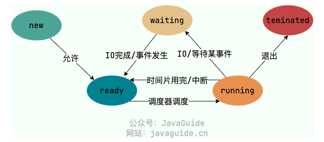

五种状态：

- **创建状态(new)**：进程正在被创建，尚未到就绪状态。
- **就绪状态(ready)**：进程已处于准备运行状态，即进程获得了除了处理器之外的一切所需资源，一旦得到处理器资源(处理器分配的时间片)即可运行。
- **运行状态(running)**：进程正在处理器上运行(单核 CPU 下任意时刻只有一个进程处于运行状态)。
- **阻塞状态(waiting)**：又称为等待状态，进程正在等待某一事件而暂停运行如等待某资源为可用或等待 IO 操作完成。即使处理器空闲，该进程也不能运行。
- **结束状态(terminated)**：进程正在从系统中消失。可能是进程正常结束或其他原因中断退出运行。

### 进程间的通信方式有哪些

- 管道/匿名管道：用于具有亲缘关系的父子进程之间的通信
- 有名管道：匿名管道由于没有名字，只能用于亲缘关系的进程间通信。为了克服这个缺点，提出了有名管道。有名管道严格遵循 **先进先出(First In First Out)** 。有名管道以磁盘文件的方式存在，可以实现本机任意两个进程通信。
- 信号：信号是一种比较复杂的通信方式，用于通知接收进程某个事件已经发生
- 消息队列
- 信号量
- 共享内存：使得多个进程可以访问同一块内存空间，不同进程可以及时看到对方进程中对共享内存中数据的更新。这种方式需要依靠某种同步操作，如互斥锁和信号量等。可以说这是最有用的进程间通信方式。
- 套接字：此方法主要用于在客户端和服务器之间通过网络进行通信。套接字是支持 TCP/IP 的网络通信的基本操作单元，可以看做是不同主机之间的进程进行双向通信的端点，简单的说就是通信的两方的一种约定，用套接字中的相关函数来完成通信过程。

### 调度算法有哪些

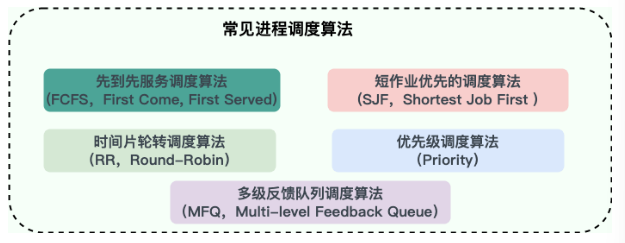

## LRU

**最近最久未使用页面置换算法（LRU，Least Recently Used）**：LRU算法赋予每个页面一个访问字段，用来记录一个页面自上次被访问以来所经历的时间T，当须淘汰一个页面时，选择现有页面中其T值最大的，即最近最久未使用的页面予以淘汰。LRU算法是根据各页之前的访问情况来实现，因此是易于实现的。OPT算法是根据各页未来的访问情况来实现的，因此是不可实现的。

## 应用层协议

### 应用层有哪些常见的协议

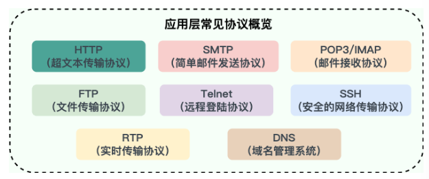

- HTTP：基于TCP协议（现在不单单是基于TCP），是一种用于传输超文本和多媒体内容的协议，主要是为了Web浏览器与Web服务器之间的通信而设计的。当我们使用浏览器浏览网页的时候，我们网页就是通过HTTP请求进行加载的。
- SMTP：基于TCP协议，是一种用于发送电子邮件的协议。注意：SMTP协议只负责邮件的发送，而不是接收。
- POP3/IMAP（邮件接收协议）：基于TCP协议，两者都是负责邮件接收的协议。IMAP协议是比POP3更新的协议，它在功能和性能上都更加强大。IMAP支持邮件搜索、标记、分类、归档等高级功能，而且可以在多个设备之间同步邮件状态。
- FTP：基于TCP协议，是一种用于在计算机之间传输文件的协议，可以屏蔽操作系统和文件存储方式。注意：FTP是一种不安全的协议，因为它在传输过程中不会对数据进行加密。建议在传输敏感数据时使用更安全的协议，如SFTP
- Telnet（远程登陆协议）：基于TCP协议，用于通过一个终端登录到其他服务其。
- SSH：基于TCP协议，通过加密和认证机制实现安全的访问和文件传输等业务
- RTP（实时传输协议）：通常基于UDP协议，但也支持TPC协议。它提供了端到端的实时传输数据的功能，但不包含资源预存留、不保证实时传输质量，这些功能由WebRTC实现。
- DNS：基于UDP协议，用于解决域名和IP地址的映射问题。

## OSI七层模型

OSI七层模型是国际标准化组织提出的一个网络分层模型，其大体结构以及每一层提供的功能如下图所示:

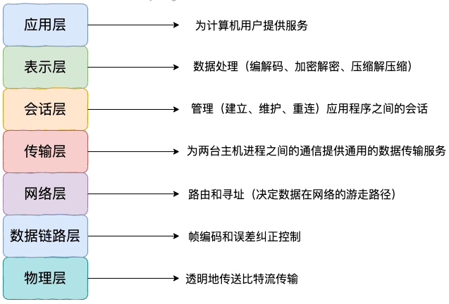

## 在浏览器URL上写一个地址，请描述一下网络方面有哪些变化

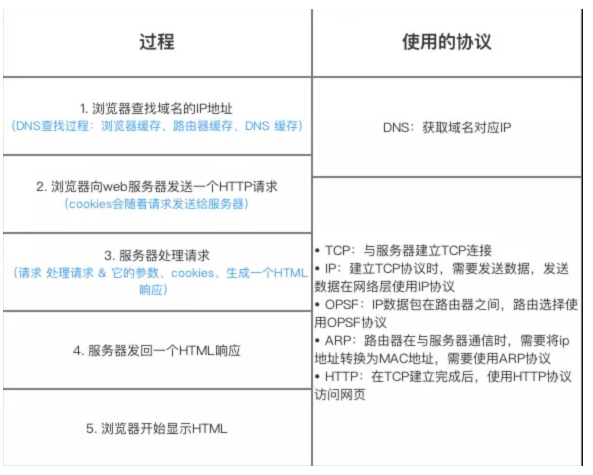

总的来说分为以下几个步骤:

- 在浏览器中输入指定网页的URL
- 浏览器通过DNS协议，获取域名对应的IP地址
- 浏览器根据IP地址和端口号，向目标服务器发送一个TCP连接请求
- 浏览器在TCP连接上，向服务器发送一个HTTP请求报文，请求获取网页的内容
- 服务器收到HTTP请求报文后，处理请求，并返回HTTP响应报文给浏览器
- 浏览器收到HTTP响应报文后，解析响应体中的HTML代码，渲染网页的结构和样式，同时根据HTML中的其他资源URL（如图片、CSS、JS等），再次发起HTTP请求，获取这些资源的内容，直到网页完全加载显示
- 浏览器在不需要和服务器通信时，可以主动关闭TCP连接，或者等待服务器的关闭请求

## 缓存雪崩

### 缓存雪崩

实际上，缓存雪崩描述的就是这样一个简单的场景：缓存在同一时间大面积的失效，导致大量的请求都直接落到了数据库上，对数据库造成了巨大的压力。这就好比雪崩一样，摧枯拉朽之势，数据库的压力可想而知，可能直接就被那么多请求弄宕机了。

另外，缓存服务宕机也会导致缓存雪崩现象，导致所有的请求都落到了数据库上。

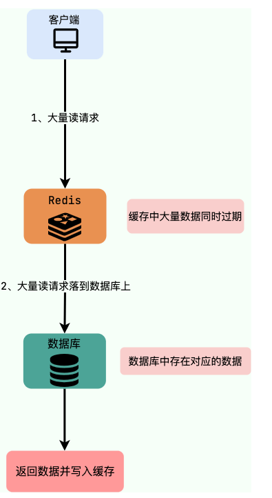

举个例子：秒杀进行过程中，缓存中的某个秒杀商品的数据突然过期，这就导致瞬时大量对该商品的请求直接落到数据库上，对数据库造成了巨大的压力。

解决办法：

- 永不过期（不推荐）：设置热点数据永不过期或者过期时间比较长
- 提前预热（推荐）：针对热点数据提前预热，将其存入缓存中并设置合理的过期时间比如秒杀场景下的数据在秒杀结束之前不过期。
- 加锁（看情况）：在缓存失效后，通过设置互斥锁确保只有一个请求去查询数据库并更新缓存。

### 缓存穿透

缓存穿透说简单点就是大量请求的Key是不合理的，根本不存在于缓存中，也不存在于数据库中。这就导致这些请求直接到了数据库上，根本没有经过缓存这一层，对数据库造成了巨大的压力。

举个例子：某个黑客故意制造一些非法的 key 发起大量请求，导致大量请求落到数据库，结果数据库上也没有查到对应的数据。也就是说这些请求最终都落到了数据库上，对数据库造成了巨大的压力。

解决办法：

- 缓存无效key：如果缓存和数据库都查不到某个 key 的数据就写一个到 Redis 中去并设置过期时间，具体命令如下：`SET key value EX 10086` 。这种方式可以解决请求的 key 变化不频繁的情况，如果黑客恶意攻击，每次构建不同的请求 key，会导致 Redis 中缓存大量无效的 key 。很明显，这种方案并不能从根本上解决此问题。如果非要用这种方式来解决穿透问题的话，尽量将无效的 key 的过期时间设置短一点比如 1 分钟。

- 布隆过滤器

  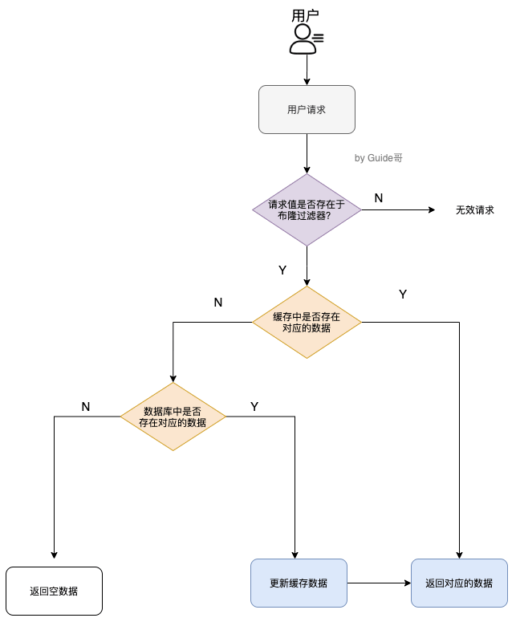

- 接口限流：根据用户或者IP对接口进行限流，对于异常频繁的访问行为，还可以采取黑名单机制，例如将异常IP列入黑名单。

### 缓存击穿

缓存击穿中，请求的key对应的是热点数据，该数据存在于数据库中，但不存在于缓存中（通常是因为缓存中的那份数据已经过期）。这就可能会导致瞬时大量的请求直接打到了数据库上，对数据库造成了巨大的压力，可能直接就被那么多请求宕机了。

### 缓存雪崩和缓存击穿有什么区别

缓存雪崩和缓存击穿比较像，但缓存雪崩导致的原因是缓存中的大量或者所有数据失效，缓存击穿导致的原因主要是某个热点数据不存在与缓存中（通常是因为缓存中的那份数据已经过期）。

## 缓存一致性

**Cache Aside Pattern（旁路缓存模式）**：CAP中遇到写请求是这样的：更新数据库，然后直接删除缓存。

如果更新数据库成功，而删除缓存这一步失败的情况的话，简单说有两种解决方案。

- 缓存失效时间变短（不推荐，治标不治本）
- 增加缓存更新重试机制（常用）：如果缓存服务当前不可用导致缓存删除失败的话，我们就隔一段时间进行重试，重试次数可以自己定。不过，这里更适合引入消息队列实现异步重试，将删除缓存重试的消息投递到消息队列，然后由专门的消费者来重试，直到成功。虽然说多引入了一个消息队列，但其整体带来的收益还是要更高一些。

## Redis相关

### Redis数据类型

#### 常用的数据类型

- 5种基础数据类型：String、List、Set、Hash、Zset（有序集合）
- 3种特殊数据类型：HyperLogLog（基数统计）、Bitmap（位图）、Geospatial（地理位置）

### SortedSet的实现

Redis的有序集合底层使用的是跳表。

- 当有序集合对象同时满足以下两个条件时，使用 ziplist：
  1. ZSet 保存的键值对数量少于 128 个；
  2. 每个元素的长度小于 64 字节。
- 如果不满足上述两个条件，那么使用 skiplist 。

有关于跳表，参考算法笔记

### 为什么要用Redis

1. 访问速度更快
2. 高并发
3. 功能全面：Redis除了可以用作缓存之外，还可以用于分布式锁、限流、消息队列、延迟队列等场景。

### 三种常用的缓存读写策略

#### 旁路缓存模式（Cache Aside Pattern）

缓存读写步骤：

写：

- 先更新db
- 然后直接删除cache

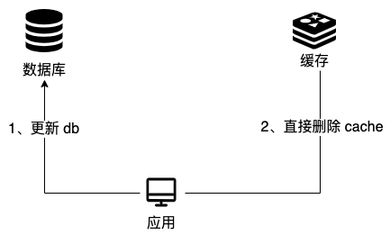

读：

- 从cache中读取数据，读取到就直接返回u
- cache中读取不到的话，就从db中读取数据返回
- 再把数据放到cache中

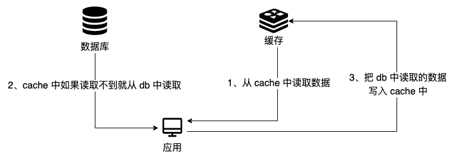

缺陷：

1. 首次请求数据一定不在cache的问题
2. 写操作比较繁琐的话导致cache中的数据会被频繁的删除，这样会影响缓存命中率

#### 读写穿透（Read/Writ Through Pattern）

缓存读写策略：

写：

- 先查cache，cache中不存在，直接更新db
- cache中存在，则先更新cache，然后cache服务自己更新db（同步更新cache和db）

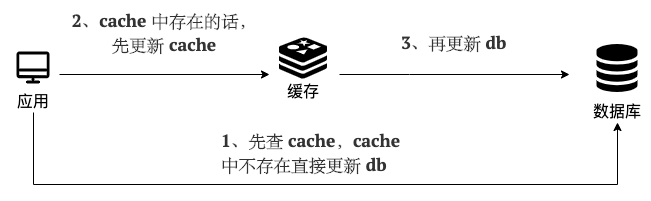

读：

- 从cache中读取数据，读取到就直接返回
- 读取不到的话，先从db加载，写入到cache后返回响应

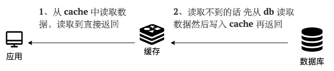

和旁路缓存模式一样，读写穿透也有首次请求数据一定不在cache的问题，对于热点数据可以提前放入缓存中。

#### Write Behind Pattern（异步缓存写入）

Write Behind Pattern 和 Read/Write Through Pattern 很相似，两者都是由 cache 服务来负责 cache 和 db 的读写。

但是，两个又有很大的不同：**Read/Write Through 是同步更新 cache 和 db，而 Write Behind 则是只更新缓存，不直接更新 db，而是改为异步批量的方式来更新 db。**

很明显，这种方式对数据一致性带来了更大的挑战，比如 cache 数据可能还没异步更新 db 的话，cache 服务可能就就挂掉了。

这种策略在我们平时开发过程中也非常非常少见，但是不代表它的应用场景少，比如消息队列中消息的异步写入磁盘、MySQL 的 Innodb Buffer Pool 机制都用到了这种策略。

Write Behind Pattern 下 db 的写性能非常高，非常适合一些数据经常变化又对数据一致性要求没那么高的场景，比如浏览量、点赞量。

### Redis持久化机制

Redis 不同于 Memcached 的很重要一点就是，Redis 支持持久化，而且支持 3 种持久化方式:

- 快照（snapshotting，RDB）
- 只追加文件（append-only file, AOF）
- RDB 和 AOF 的混合持久化(Redis 4.0 新增)

Redis 可以通过创建快照来获得存储在内存里面的数据在 **某个时间点** 上的副本。Redis 创建快照之后，可以对快照进行备份，可以将快照复制到其他服务器从而创建具有相同数据的服务器副本（Redis 主从结构，主要用来提高 Redis 性能），还可以将快照留在原地以便重启服务器的时候使用。

#### RDB持久化

Redis 可以通过创建快照来获得存储在内存里面的数据在 **某个时间点** 上的副本。Redis 创建快照之后，可以对快照进行备份，可以将快照复制到其他服务器从而创建具有相同数据的服务器副本（Redis 主从结构，主要用来提高 Redis 性能），还可以将快照留在原地以便重启服务器的时候使用。

```conf
save 900 1           #在900秒(15分钟)之后，如果至少有1个key发生变化，Redis就会自动触发bgsave命令创建快照。

save 300 10          #在300秒(5分钟)之后，如果至少有10个key发生变化，Redis就会自动触发bgsave命令创建快照。

save 60 10000        #在60秒(1分钟)之后，如果至少有10000个key发生变化，Redis就会自动触发bgsave命令创建快照。
```

Redis 提供了两个命令来生成 RDB 快照文件：

- `save` : 同步保存操作，会阻塞 Redis 主线程；
- `bgsave` : fork 出一个子进程，子进程执行，不会阻塞 Redis 主线程，默认选项。

#### AOF持久化

##### 什么是AOF持久化

开启 AOF 持久化后每执行一条会更改 Redis 中的数据的命令，Redis 就会将该命令写入到 AOF 缓冲区 `server.aof_buf` 中，然后再写入到 AOF 文件中（此时还在系统内核缓存区未同步到磁盘），最后再根据持久化方式（ `fsync`策略）的配置来决定何时将系统内核缓存区的数据同步到硬盘中的。

只有同步到磁盘中才算持久化保存了，否则依然存在数据丢失的风险，比如说：系统内核缓存区的数据还未同步，磁盘机器就宕机了，那这部分数据就算丢失了。

##### AOF工作基本流程

1. 命令追加：所有的写命令会追加到AOF缓冲区中。
2. 文件写入：将AOF缓冲区的数据写入到AOF文件中。这一步需要调用write函数（系统调用），write将数据写入到系统内核缓冲区之后直接返回了（延迟写）。注意！！！此时并没有同步到磁盘。
3. 文件同步：AOF缓冲区根据对应的持久化方式（fsync策略）向硬盘做同步操作。这一步需要调用fsync函数（系统调用），fsync针对单个文件操作，对其进行强制硬盘同步，fsync将阻塞直到写入磁盘完成后返回，保证了数据持久化。
4. 文件重写：随着AOF文件越来越大，需要定期对AOF文件进行重写，达到压缩的目的。
5. 重启加载：当Redis重启时，可以加载AOF文件进行数据恢复。

这里对上面提到的一些 Linux 系统调用再做一遍解释：

- `write`：写入系统内核缓冲区之后直接返回（仅仅是写到缓冲区），不会立即同步到硬盘。虽然提高了效率，但也带来了数据丢失的风险。同步硬盘操作通常依赖于系统调度机制，Linux 内核通常为 30s 同步一次，具体值取决于写出的数据量和 I/O 缓冲区的状态。
- `fsync`：`fsync`用于强制刷新系统内核缓冲区（同步到到磁盘），确保写磁盘操作结束才会返回。

工作流程图：

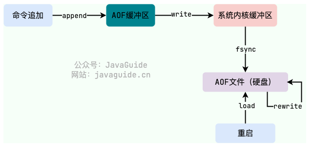

##### AOF持久化方式有哪些

在 Redis 的配置文件中存在三种不同的 AOF 持久化方式（ `fsync`策略），它们分别是：

1. `appendfsync always`：主线程调用 `write` 执行写操作后，后台线程（ `aof_fsync` 线程）立即会调用 `fsync` 函数同步 AOF 文件（刷盘），`fsync` 完成后线程返回，这样会严重降低 Redis 的性能（`write` + `fsync`）。
2. `appendfsync everysec`：主线程调用 `write` 执行写操作后立即返回，由后台线程（ `aof_fsync` 线程）每秒钟调用 `fsync` 函数（系统调用）同步一次 AOF 文件（`write`+`fsync`，`fsync`间隔为 1 秒）
3. `appendfsync no`：主线程调用 `write` 执行写操作后立即返回，让操作系统决定何时进行同步，Linux 下一般为 30 秒一次（`write`但不`fsync`，`fsync` 的时机由操作系统决定）。

##### AOF重写

当AOF变得太大时，Redis能够在后台自动重写AOF产生一个新的AOF文件，这个新的AOF文件和原有的AOF文件所保存的数据库状态一样，但体积更小。

## 消息队列

### 消息队列有什么用

通常来说，使用消息队列主要能为我们的系统带来下面三点好处：

1. 异步处理
2. 削峰/限流
3. 降低系统耦合性

#### 异步处理

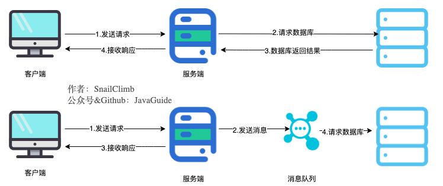

将用户请求中包含的耗时操作，通过消息队列实现异步处理，将对应的消息发送到消息队列之后就立即返回结果，减少响应时间，提高用户体验。随后，系统再对消息进行消费。

因为用户请求数据写入消息队列之后就立即返回给用户了，但是请求数据在后续的业务校验、写数据库等操作中可能失败。因此，**使用消息队列进行异步处理之后，需要适当修改业务流程进行配合**，比如用户在提交订单之后，订单数据写入消息队列，不能立即返回用户订单提交成功，需要在消息队列的订单消费者进程真正处理完该订单之后，甚至出库后，再通过电子邮件或短信通知用户订单成功，以免交易纠纷。这就类似我们平时手机订火车票和电影票。

#### 削峰/限流

先将短时间高并发产生的十五消息存储在消息队列中，然后后端服务再慢慢根据自己的能力去消费这些消息，这样就避免直接把后端服务打垮掉。

举例：再电子商务一些秒杀、促销活动中，合理使用消息队列可以有效抵御促销活动刚开始大量订单涌入对系统的冲击。

#### 降低系统耦合性

使用消息队列还可以降低系统耦合性。如果模块之间不存在直接调用，那么新增模块或者修改模块就对其他模块影响较小，这样系统的可扩展性无疑更好一些。

生产者（客户端）发送消息到消息队列中去，消费者（服务端）处理消息，需要消费的系统直接去消息队列取消息进行消费即可而不需要和其他系统有耦合，这显然也提高了系统的扩展性。

#### 实现分布式事务

RocketMQ、 Kafka、Pulsar、QMQ 都提供了事务相关的功能。事务允许事件流应用将消费，处理，生产消息整个过程定义为一个原子操作。

#### 顺序保证

在很多应用场景中，处理数据的顺序至关重要。消息队列保证数据按照特定的顺序被处理，适用于那些对数据顺序有严格要求的场景。大部分消息队列，例如 RocketMQ、RabbitMQ、Pulsar、Kafka，都支持顺序消息。

#### 延时/定时处理

消息发送后不会立即被消费，而是指定一个时间，到时间后再消费。大部分消息队列，例如 RocketMQ、RabbitMQ、Pulsar、Kafka，都支持定时/延时消息。

#### 即时通讯

MQTT（消息队列遥测传输协议）是一种轻量级的通讯协议，采用发布/订阅模式，非常适合于物联网（IoT）等需要在低带宽、高延迟或不可靠网络环境下工作的应用。它支持即时消息传递，即使在网络条件较差的情况下也能保持通信的稳定性。

RabbitMQ 内置了 MQTT 插件用于实现 MQTT 功能（默认不启用，需要手动开启）。

### 使用消息队列带来哪些问题

- 系统可用性降低：系统可用性再某种程度上降低。在加入MQ之前，你不用考虑消息丢失或者MQ挂掉等等的情况，但是，引入MQ之后你就需要去考虑了
- 系统复杂性提高：加入MQ之后，你需要保证消息没有被重复消费、处理消息丢失的情况、保证消息传递的顺序性等等问题。
- 一致性问题：消息队列可以异步实现，消息队列带来的异步确实可以提高系统响应速度。但是，万一消息的真正消费正并没有正确消费消息怎么办？这样就会导致数据不一致的情况了！

### JMS和AMQP

#### JMS

JMS（Java Message Service，java消息服务）是Java的消息服务，JMS的客户端之间可以通过JMS服务进行异步的消息传输。JMS API是一个消息服务的标准或者说是规范，允许应用程序组件基于JavaEE平台创建、发送、接收和读取消息。它使分布式通信耦合度更低，消息服务更加可靠以及异步性。

#### JMS两种消息模型

点到点（P2P）模型

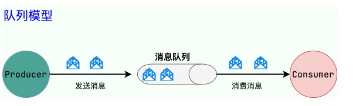

发布/订阅模型

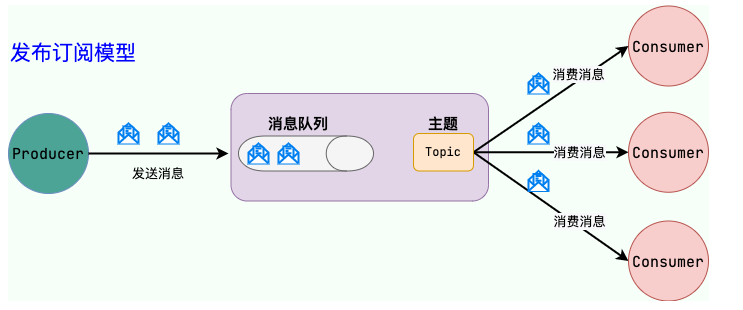

#### AMQP

AMQP，即 Advanced Message Queuing Protocol，一个提供统一消息服务的应用层标准**高级消息队列协议**（二进制应用层协议），是应用层协议的一个开放标准，为面向消息的中间件设计，兼容 JMS。基于此协议的客户端与消息中间件可传递消息，并不受客户端/中间件同产品，不同的开发语言等条件的限制。

RabbitMQ就是基于AMQP协议实现的

#### JMS&AMQP

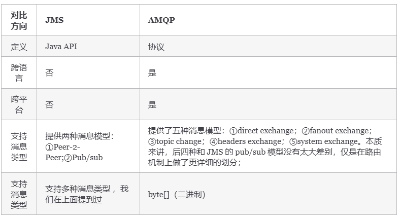

## RabbitMQ

### RabbitMQ是什么

RabbitMQ 是使用 Erlang 编写的一个开源的消息队列，本身支持很多的协议：AMQP，XMPP, SMTP, STOMP，也正是如此，使的它变的非常重量级，更适合于企业级的开发。它同时实现了一个 Broker 构架，这意味着消息在发送给客户端时先在中心队列排队，对路由(Routing)、负载均衡(Load balance)或者数据持久化都有很好的支持。

PS:也可能直接问什么是消息队列？消息队列就是一个使用队列来通信的组件。

### RabbitMQ特点

- **可靠性**: RabbitMQ 使用一些机制来保证可靠性， 如持久化、传输确认及发布确认等。
- **灵活的路由** : 在消息进入队列之前，通过交换器来路由消息。对于典型的路由功能， RabbitMQ 己经提供了一些内置的交换器来实现。针对更复杂的路由功能，可以将多个交换器绑定在一起， 也可以通过插件机制来实现自己的交换器。
- **扩展性**: 多个 RabbitMQ 节点可以组成一个集群，也可以根据实际业务情况动态地扩展 集群中节点。
- **高可用性** : 队列可以在集群中的机器上设置镜像，使得在部分节点出现问题的情况下队 列仍然可用。
- **多种协议**: RabbitMQ 除了原生支持 AMQP 协议，还支持 STOMP， MQTT 等多种消息 中间件协议。
- **多语言客户端** :RabbitMQ 几乎支持所有常用语言，比如 Java、 Python、 Ruby、 PHP、 C#、 JavaScript 等。
- **管理界面** : RabbitMQ 提供了一个易用的用户界面，使得用户可以监控和管理消息、集群中的节点等。
- **插件机制** : RabbitMQ 提供了许多插件 ， 以实现从多方面进行扩展，当然也可以编写自己的插件。

### RabbitMQ核心概念

RabbitMQ 整体上是一个生产者与消费者模型，主要负责接收、存储和转发消息。可以把消息传递的过程想象成：当你将一个包裹送到邮局，邮局会暂存并最终将邮件通过邮递员送到收件人的手上，RabbitMQ 就好比由邮局、邮箱和邮递员组成的一个系统。从计算机术语层面来说，RabbitMQ 模型更像是一种交换机模型。

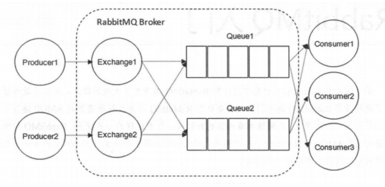

下面介绍上图的一些概念

#### Producer（生产者）和Consumer（消费者）

- Producer（生产者）：生产消息的一方
- Consumer（消费者）：消费消息的一方

消息一般由两部分组成：消息头（Label）和消息体（payLoad），消息体是不透明的，而消息头则由一系列的可选属性组成，这些属性包括routing-key（路由键）、priority（相对于其他消息的优先权）、delivery-mode（指出该消息可能需要持久性存储）等。生产者把消息交由RabbitMQ后，RabbitMQ会根据消息头把消息发送给感兴趣的Consumer（消费者）。

#### Exchange（交换机）

在 RabbitMQ 中，消息并不是直接被投递到 **Queue(消息队列)** 中的，中间还必须经过 **Exchange(交换器)** 这一层，**Exchange(交换器)** 会把我们的消息分配到对应的 **Queue(消息队列)** 中。

**Exchange(交换器)** 用来接收生产者发送的消息并将这些消息路由给服务器中的队列中，如果路由不到，或许会返回给 **Producer(生产者)** ，或许会被直接丢弃掉 。这里可以将 RabbitMQ 中的交换器看作一个简单的实体。

**RabbitMQ 的 Exchange(交换器) 有 4 种类型，不同的类型对应着不同的路由策略**：**direct(默认)**，**fanout**, **topic**, 和 **headers**，不同类型的 Exchange 转发消息的策略有所区别。这个会在介绍 **Exchange Types(交换器类型)** 的时候介绍到。

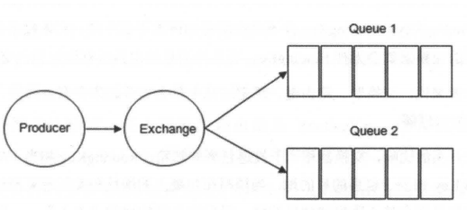

生产者将消息发给交换器的时候，一般会指定一个 **RoutingKey(路由键)**，用来指定这个消息的路由规则，而这个 **RoutingKey 需要与交换器类型和绑定键(BindingKey)联合使用才能最终生效**。

RabbitMQ 中通过 **Binding(绑定)** 将 **Exchange(交换器)** 与 **Queue(消息队列)** 关联起来，在绑定的时候一般会指定一个 **BindingKey(绑定建)** ,这样 RabbitMQ 就知道如何正确将消息路由到队列了,如下图所示。一个绑定就是基于路由键将交换器和消息队列连接起来的路由规则，所以可以将交换器理解成一个由绑定构成的路由表。Exchange 和 Queue 的绑定可以是多对多的关系。

#### Broker（消息中间件的服务节点）

对于 RabbitMQ 来说，一个 RabbitMQ Broker 可以简单地看作一个 RabbitMQ 服务节点，或者 RabbitMQ 服务实例。大多数情况下也可以将一个 RabbitMQ Broker 看作一台 RabbitMQ 服务器。

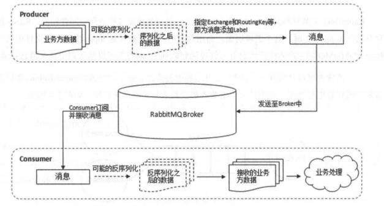

#### Exchange Types（交换机类型）

1. fanout
   fanout 类型的 Exchange 路由规则非常简单，它会把所有发送到该 Exchange 的消息路由到所有与它绑定的 Queue 中，不需要做任何判断操作，所以 fanout 类型是所有的交换机类型里面速度最快的。fanout 类型常用来广播消息。

2. direct
   direct 类型的 Exchange 路由规则也很简单，它会把消息路由到那些 Bindingkey 与 RoutingKey 完全匹配的 Queue 中。

3. topic

   前面讲到 direct 类型的交换器路由规则是完全匹配 BindingKey 和 RoutingKey ，但是这种严格的匹配方式在很多情况下不能满足实际业务的需求。topic 类型的交换器在匹配规则上进行了扩展，它与 direct 类型的交换器相似，也是将消息路由到 BindingKey 和 RoutingKey 相匹配的队列中，但这里的匹配规则有些不同，它约定：

   - RoutingKey 为一个点号“．”分隔的字符串（被点号“．”分隔开的每一段独立的字符串称为一个单词），如 “com.rabbitmq.client”、“java.util.concurrent”、“com.hidden.client”;
   - BindingKey 和 RoutingKey 一样也是点号“．”分隔的字符串；
   - BindingKey 中可以存在两种特殊字符串“*”和“#”，用于做模糊匹配，其中“*”用于匹配一个单词，“#”用于匹配多个单词(可以是零个)。

如果面试官再问你别的，可以说一个headers，但是这个不实用

### AMQP是什么

**AMQP 协议的三层**：

- **Module Layer**:协议最高层，主要定义了一些客户端调用的命令，客户端可以用这些命令实现自己的业务逻辑。
- **Session Layer**:中间层，主要负责客户端命令发送给服务器，再将服务端应答返回客户端，提供可靠性同步机制和错误处理。
- **TransportLayer**:最底层，主要传输二进制数据流，提供帧的处理、信道复用、错误检测和数据表示等。

**AMQP 模型的三大组件**：

- **交换器 (Exchange)**：消息代理服务器中用于把消息路由到队列的组件。
- **队列 (Queue)**：用来存储消息的数据结构，位于硬盘或内存中。
- **绑定 (Binding)**：一套规则，告知交换器消息应该将消息投递给哪个队列。

### 说说生产者Producer和消费者Consumer

**生产者**：

- 消息生产者，就是投递消息的一方
- 消息一般包含两个部分：消息体（payload）和标签（Label）

消费者

- 消费消息，也就是接收消息的一方
- 消费者连接到RabbitMQ服务器，并订阅到队列上。消费消息时只消费消息体，丢弃标签

### 说说Broker服务节点、Queue队列、Exchange交换器

- Broker：可以看作RabbitMQ的服务节点。一般情况下一个Broker可以看作一个RabbitMQ服务器
- Queue：RabbitMQ的内部对象，用于存储消息。多个消费者可以订阅同一队列，这时队列中的消息会被平摊（轮询）给多个消费者进行处理
- Exchange：生产者将消息发送给交换机，由交换机将消息路由到一个或者多个队列中。当路由不到时，或返回给生产者或直接丢弃。

### 什么是死信队列？如何导致的？

DLX，全称为 `Dead-Letter-Exchange`，死信交换器，死信邮箱。当消息在一个队列中变成死信 (`dead message`) 之后，它能被重新发送到另一个交换器中，这个交换器就是 DLX，绑定 DLX 的队列就称之为死信队列。

**导致的死信的几种原因**：

- 消息被拒（`Basic.Reject /Basic.Nack`) 且 `requeue = false`。
- 消息 TTL 过期。
- 队列满了，无法再添加。

### 什么是延迟队列？RabbitMQ怎么实现延迟队列？

延迟队列指的是存储对应的延迟消息，消息被发送以后，并不想让消费者立刻拿到消息，而是等待特定时间后，消费者才能拿到这个消息进行消费。

RabbitMQ 本身是没有延迟队列的，要实现延迟消息，一般有两种方式：

1. 通过 RabbitMQ 本身队列的特性来实现，需要使用 RabbitMQ 的死信交换机（Exchange）和消息的存活时间 TTL（Time To Live）。
2. 在 RabbitMQ 3.5.7 及以上的版本提供了一个插件（rabbitmq-delayed-message-exchange）来实现延迟队列功能。同时，插件依赖 Erlang/OPT 18.0 及以上。

也就是说，AMQP 协议以及 RabbitMQ 本身没有直接支持延迟队列的功能，但是可以通过 TTL 和 DLX 模拟出延迟队列的功能

### 什么是优先级队列

RabbitMQ 自 V3.5.0 有优先级队列实现，优先级高的队列会先被消费。

可以通过`x-max-priority`参数来实现优先级队列。不过，当消费速度大于生产速度且 Broker 没有堆积的情况下，优先级显得没有意义

### RabbitMQ有哪些工作模式

- 简单模式
- work工作模式
- pub/sub发布订阅模式
- Routing路由模式
- Topic主题模式

### RabbitMQ消息怎么传输？

由于 TCP 链接的创建和销毁开销较大，且并发数受系统资源限制，会造成性能瓶颈，所以 RabbitMQ 使用信道的方式来传输数据。信道（Channel）是生产者、消费者与 RabbitMQ 通信的渠道，信道是建立在 TCP 链接上的虚拟链接，且每条 TCP 链接上的信道数量没有限制。就是说 RabbitMQ 在一条 TCP 链接上建立成百上千个信道来达到多个线程处理，这个 TCP 被多个线程共享，每个信道在 RabbitMQ 都有唯一的 ID，保证了信道私有性，每个信道对应一个线程使用

### 如何保证消息的可靠性？

消息到 MQ 的过程中搞丢，MQ 自己搞丢，MQ 到消费过程中搞丢。

- 生产者到 RabbitMQ：事务机制和 Confirm 机制，注意：事务机制和 Confirm 机制是互斥的，两者不能共存，会导致 RabbitMQ 报错。
- RabbitMQ 自身：持久化、集群、普通模式、镜像模式。
- RabbitMQ 到消费者：basicAck 机制、死信队列、消息补偿机制。

## 锁

### 乐观锁&悲观锁

乐观锁与悲观锁不是指具体的什么类型的锁，而是指看待并发同步的角度。

- **悲观锁认为对于同一个数据的并发操作**，一定是会发生修改的，哪怕没有修改，也会认为修改。因此对于同一个数据的并发操作，悲观锁采取加锁的形式。悲观的认为，不加锁的并发操作一定会出问题。
- **乐观锁则认为对于同一个数据的并发操作**，是不会发生修改的。在更新数据的时候，会采用尝试更新，不断重新的方式更新数据。乐观的认为，不加锁的并发操作是没有事情的。

从上面的描述我们可以看出，悲观锁适合写操作非常多的场景，乐观锁适合读操作非常多的场景，不加锁会带来大量的性能提升。

- **悲观锁在Java中的使用，就是利用各种锁。**
- **乐观锁在Java中的使用，是无锁编程**，常常采用的是CAS算法，典型的例子就是原子类，通过CAS自旋实现原子操作的更新。

### 公平锁/非公平锁

- 公平锁是指多个线程按照申请锁的顺序来获取锁。
- 非公平锁是指多个线程获取锁的顺序并不是按照申请锁的顺序，有可能后申请的线程比先申请的线程优先获取锁。有可能，会造成优先级反转或者饥饿现象。

对于Java ReentrantLock而言，通过构造函数指定该锁是否是公平锁，默认是非公平锁。非公平锁的优点在于吞吐量比公平锁大。

对于Synchronized而言，也是一种非公平锁。由于其并不像ReentrantLock是通过AQS的来实现线程调度，所以并没有任何办法使其变成公平锁。

### 可重入锁

可重入锁又名递归锁，是指在同一个线程在外层方法获取锁的时候，在进入内层方法会自动获取锁。说的有点抽象，下面会有一个代码的示例。

- 对于Java ReentrantLock而言, 他的名字就可以看出是一个可重入锁，其名字是Re entrant Lock重新进入锁。
- 对于Synchronized而言，也是一个可重入锁。可重入锁的一个好处是可一定程度避免死锁。

```java
synchronized void setA() throws Exception{
    Thread.sleep(1000);
    setB();
}

synchronized void setB() throws Exception{
    Thread.sleep(1000);
}
```

上面的代码就是一个可重入锁的一个特点，如果不是可重入锁的话，setB可能不会被当前线程执行，可能造成死锁。

### 独享锁/共享锁

- 独享锁是指该锁一次只能被一个线程所持有。
- 共享锁是指该锁可被多个线程所持有。

对于Java ReentrantLock而言，其是独享锁。但是对于Lock的另一个实现类ReadWriteLock，其读锁是共享锁，其写锁是独享锁。

- 读锁的共享锁可保证并发读是非常高效的，读写，写读 ，写写的过程是互斥的。
- 独享锁与共享锁也是通过AQS来实现的，通过实现不同的方法，来实现独享或者共享。

对于Synchronized而言，当然是独享锁。

### 互斥锁/读写锁

上面讲的独享锁/共享锁就是一种广义的说法，互斥锁/读写锁就是具体的实现。

- 互斥锁在Java中的具体实现就是ReentrantLock
- 读写锁在Java中的具体实现就是ReadWriteLock

### 自旋锁

在Java中，自旋锁是指尝试获取锁的线程不会立即阻塞，而是采用循环的方式去尝试获取锁，这样的好处是减少线程上下文切换的消耗，缺点是循环会消耗CPU。

## Map相关问题

### HashMap和Hashtable的区别

- **线程是否安全：**`HashMap` 是非线程安全的，`Hashtable` 是线程安全的,因为 `Hashtable` 内部的方法基本都经过`synchronized` 修饰。（如果你要保证线程安全的话就使用 `ConcurrentHashMap` 吧！）；
- **效率：** 因为线程安全的问题，`HashMap` 要比 `Hashtable` 效率高一点。另外，`Hashtable` 基本被淘汰，不要在代码中使用它；
- **对 Null key 和 Null value 的支持：**`HashMap` 可以存储 null 的 key 和 value，但 null 作为键只能有一个，null 作为值可以有多个；Hashtable 不允许有 null 键和 null 值，否则会抛出 `NullPointerException`。
- **初始容量大小和每次扩充容量大小的不同：** ① 创建时如果不指定容量初始值，`Hashtable` 默认的初始大小为 11，之后每次扩充，容量变为原来的 2n+1。`HashMap` 默认的初始化大小为 16。之后每次扩充，容量变为原来的 2 倍。② 创建时如果给定了容量初始值，那么 `Hashtable` 会直接使用你给定的大小，而 `HashMap` 会将其扩充为 2 的幂次方大小（`HashMap` 中的`tableSizeFor()`方法保证，下面给出了源代码）。也就是说 `HashMap` 总是使用 2 的幂作为哈希表的大小,后面会介绍到为什么是 2 的幂次方。
- **底层数据结构：** JDK1.8 以后的 `HashMap` 在解决哈希冲突时有了较大的变化，当链表长度大于阈值（默认为 8）时，将链表转化为红黑树（将链表转换成红黑树前会判断，如果当前数组的长度小于 64，那么会选择先进行数组扩容，而不是转换为红黑树），以减少搜索时间（后文中我会结合源码对这一过程进行分析）。`Hashtable` 没有这样的机制。
- **哈希函数的实现**：`HashMap` 对哈希值进行了高位和低位的混合扰动处理以减少冲突，而 `Hashtable` 直接使用键的 `hashCode()` 值。

### HashMap和HashSet区别

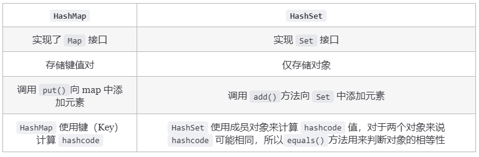

### HashSet如何检查重复

当你把对象加入`HashSet`时，`HashSet` 会先计算对象的`hashcode`值来判断对象加入的位置，同时也会与其他加入的对象的 `hashcode` 值作比较，如果没有相符的 `hashcode`，`HashSet` 会假设对象没有重复出现。但是如果发现有相同 `hashcode` 值的对象，这时会调用`equals()`方法来检查 `hashcode` 相等的对象是否真的相同。如果两者相同，`HashSet` 就不会让加入操作成功。

### HashMap的底层实现

**拉链法**：将链表和数组相结合。也就是说创建一个链表数组，数组中每一格就是一个链表。若遇到哈希冲突，则将冲突的值加到链表中即可。

相比于之前的版本， JDK1.8 之后在解决哈希冲突时有了较大的变化，当链表长度大于阈值（默认为 8）（将链表转换成红黑树前会判断，如果当前数组的长度小于 64，那么会选择先进行数组扩容，而不是转换为红黑树）时，将链表转化为红黑树，以减少搜索时间。

### HashMap为什么线程不安全？

JDK 1.8 后，在 `HashMap` 中，多个键值对可能会被分配到同一个桶（bucket），并以链表或红黑树的形式存储。多个线程对 `HashMap` 的 `put` 操作会导致线程不安全，具体来说会有数据覆盖的风险。

举个例子：

- 两个线程 1,2 同时进行 put 操作，并且发生了哈希冲突（hash 函数计算出的插入下标是相同的）。
- 不同的线程可能在不同的时间片获得 CPU 执行的机会，当前线程 1 执行完哈希冲突判断后，由于时间片耗尽挂起。线程 2 先完成了插入操作。
- 随后，线程 1 获得时间片，由于之前已经进行过 hash 碰撞的判断，所有此时会直接进行插入，这就导致线程 2 插入的数据被线程 1 覆盖了。

还有一种情况是这两个线程同时 `put` 操作导致 `size` 的值不正确，进而导致数据覆盖的问题：

1. 线程 1 执行 `if(++size > threshold)` 判断时，假设获得 `size` 的值为 10，由于时间片耗尽挂起。
2. 线程 2 也执行 `if(++size > threshold)` 判断，获得 `size` 的值也为 10，并将元素插入到该桶位中，并将 `size` 的值更新为 11。
3. 随后，线程 1 获得时间片，它也将元素放入桶位中，并将 size 的值更新为 11。
4. 线程 1、2 都执行了一次 `put` 操作，但是 `size` 的值只增加了 1，也就导致实际上只有一个元素被添加到了 `HashMap` 中。

### ConcurrentHashMap线程安全的具体实现方式

JDK1.8之前

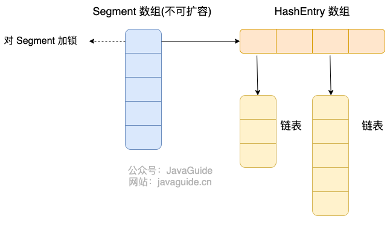

首先将数据分为一段一段（这个“段”就是 `Segment`）的存储，然后给每一段数据配一把锁，当一个线程占用锁访问其中一个段数据时，其他段的数据也能被其他线程访问。

**`ConcurrentHashMap` 是由 `Segment` 数组结构和 `HashEntry` 数组结构组成**。

JDK1.8之后

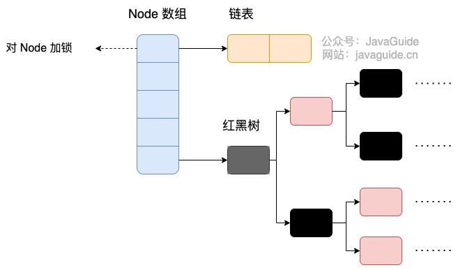

`ConcurrentHashMap` 取消了 `Segment` 分段锁，采用 `Node + CAS + synchronized` 来保证并发安全。数据结构跟 `HashMap` 1.8 的结构类似，数组+链表/红黑二叉树。Java 8 在链表长度超过一定阈值（8）时将链表（寻址时间复杂度为 O(N)）转换为红黑树（寻址时间复杂度为 O(log(N))）。

Java 8 中，锁粒度更细，`synchronized` 只锁定当前链表或红黑二叉树的首节点，这样只要 hash 不冲突，就不会产生并发，就不会影响其他 Node 的读写，效率大幅提升。
