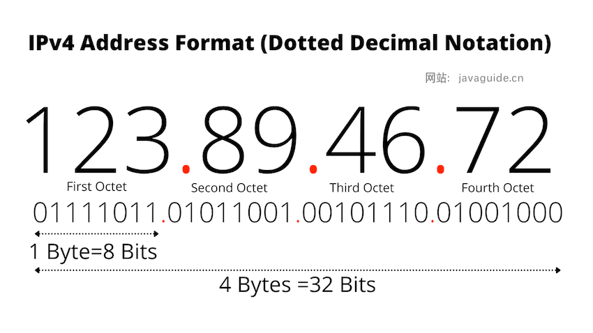

# 计算机网络面试

## 一、网络分层

### 1.OSI与TCP/IP各层的结构与功能

OSI七层模型：

TCP/IP四层模型：

1. 应用层
2. 传输层
3. 网络层
4. 网络接口层

### 2.为什么网络要分层？

1. **各层之间相互独立**：各层之间相互独立，各层之间不需要关心其他层是如何实现的，只需要知道自己如何调用下层提供好的功能就可以了（可以简单理解为接口调用）**。这个和我们对开发时系统进行分层是一个道理。**
2. **提高了灵活性和可替换性**：每一层都可以使用最适合的技术来实现，你只需要保证你提供的功能以及暴露的接口的规则没有改变就行了。并且，每一层都可以根据需要进行修改或替换，而不会影响到整个网络的结构。**这个和我们平时开发系统的时候要求的高内聚、低耦合的原则也是可以对应上的**。
3. **大问题化小**：分层可以将复杂的网络问题分解为许多比较小的、界线比较清晰简单的小问题来处理和解决。这样使得复杂的计算机网络系统变得易于设计，实现和标准化。 **这个和我们平时开发的时候，一般会将系统功能分解，然后将复杂的问题分解为容易理解的更小的问题是相对应的，这些较小的问题具有更好的边界（目标和接口）定义。**

### 3.OSI与TCP/IP各层都有哪些协议？

这里只讲TCP/IP的

- 应用层常见协议：HTTP、SMTP、POP3/IMAP、FTP、Telnet、SSH、RTP、DNS
- 传输层常见协议：TCP、UDP
- 网络层常见协议：IP、ARP、ICMP、NAT、OSPF、RIP、OSPF、RIP、BGP
- 网络接口层：CSMA/CD、MAC、差错检测、多路访问、以太网

## 二、TCP与UDP（重要）

### 1.TCP的三次握手与四次挥手的内容？TCP为什么连接是三次握手而断开是四次挥手？

#### （1）内容

建立一个 TCP 连接需要“三次握手”，缺一不可：

- **一次握手**:客户端发送带有 SYN（SEQ=x） 标志的数据包 -> 服务端，然后客户端进入 **SYN_SEND** 状态，等待服务端的确认；
- **二次握手**:服务端发送带有 SYN+ACK(SEQ=y,ACK=x+1) 标志的数据包 –> 客户端,然后服务端进入 **SYN_RECV** 状态；
- **三次握手**:客户端发送带有 ACK(ACK=y+1) 标志的数据包 –> 服务端，然后客户端和服务端都进入**ESTABLISHED** 状态，完成 TCP 三次握手。

断开一个 TCP 连接则需要“四次挥手”，缺一不可：

- **第一次挥手**：客户端发送一个 FIN（SEQ=x） 标志的数据包->服务端，用来关闭客户端到服务端的数据传送。然后客户端进入 **FIN-WAIT-1** 状态。
- **第二次挥手**：服务端收到这个 FIN（SEQ=X） 标志的数据包，它发送一个 ACK （ACK=x+1）标志的数据包->客户端 。然后服务端进入 **CLOSE-WAIT** 状态，客户端进入 **FIN-WAIT-2** 状态。
- **第三次挥手**：服务端发送一个 FIN (SEQ=y)标志的数据包->客户端，请求关闭连接，然后服务端进入 **LAST-ACK** 状态。
- **第四次挥手**：客户端发送 ACK (ACK=y+1)标志的数据包->服务端，然后客户端进入**TIME-WAIT**状态，服务端在收到 ACK (ACK=y+1)标志的数据包后进入 CLOSE 状态。此时如果客户端等待 **2MSL** 后依然没有收到回复，就证明服务端已正常关闭，随后客户端也可以关闭连接了。

#### （2）为什么连接是三次握手？

三次握手的目的是建立可靠的通信信道，说到通讯，简单来说就是数据的发送与接收，而三次握手最主要的目的就是双方确认自己与对方的发送与接收是正常的。

1. **第一次握手**：Client 什么都不能确认；Server 确认了对方发送正常，自己接收正常
2. **第二次握手**：Client 确认了：自己发送、接收正常，对方发送、接收正常；Server 确认了：对方发送正常，自己接收正常
3. **第三次握手**：Client 确认了：自己发送、接收正常，对方发送、接收正常；Server 确认了：自己发送、接收正常，对方发送、接收正常

三次握手就能确认双方收发功能都正常，缺一不可。

至于为什么不能是两次或者四次，可以看这个知乎专栏：https://www.zhihu.com/question/24853633/answer/115173386

#### （3）为什么断开是四次挥手？

TCP 是全双工通信，可以双向传输数据。任何一方都可以在数据传送结束后发出连接释放的通知，待对方确认后进入半关闭状态。当另一方也没有数据再发送的时候，则发出连接释放通知，对方确认后就完全关闭了 TCP 连接。

举个例子：A 和 B 打电话，通话即将结束后。

1. **第一次挥手**：A 说“我没啥要说的了”
2. **第二次挥手**：B 回答“我知道了”，但是 B 可能还会有要说的话，A 不能要求 B 跟着自己的节奏结束通话
3. **第三次挥手**：于是 B 可能又巴拉巴拉说了一通，最后 B 说“我说完了”
4. **第四次挥手**：A 回答“知道了”，这样通话才算结束。

1. 为什么不能把服务端发送的 ACK 和 FIN 合并起来，变成三次挥手？

   因为服务端收到客户端断开连接的请求时，可能还有一些数据没有发完，这时先回复 ACK，表示接收到了断开连接的请求。等到数据发完之后再发 FIN，断开服务端到客户端的数据传送。

2. 为什么第四次挥手客户端需要等待 2*MSL（报文段最长寿命）时间后才进入 CLOSED 状态？

   第四次挥手时，客户端发送给服务端的 ACK 有可能丢失，如果服务端因为某些原因而没有收到 ACK 的话，服务端就会重发 FIN，如果客户端在 2*MSL 的时间内收到了 FIN，就会重新发送 ACK 并再次等待 2MSL，防止 Server 没有收到 ACK 而不断重发 FIN。

   > **MSL(Maximum Segment Lifetime)** : 一个片段在网络中最大的存活时间，2MSL 就是一个发送和一个回复所需的最大时间。如果直到 2MSL，Client 都没有再次收到 FIN，那么 Client 推断 ACK 已经被成功接收，则结束 TCP 连接。

### 2.TCP 与 UDP 的区别及使⽤场景？

|                        | TCP            | UDP        |
| ---------------------- | -------------- | ---------- |
| 是否面向连接           | 是             | 否         |
| 是否可靠               | 是             | 否         |
| 是否有状态             | 是             | 否         |
| 传输效率               | 较慢           | 较快       |
| 传输形式               | 字节流         | 数据报文段 |
| 首部开销               | 20 ～ 60 bytes | 8 bytes    |
| 是否提供广播或多播服务 | 否             | 是         |

**UDP 一般用于即时通信**，比如：语音、 视频、直播等等。这些场景对传输数据的准确性要求不是特别高，比如你看视频即使少个一两帧，实际给人的感觉区别也不大。

**TCP 用于对传输准确性要求特别高的场景**，比如文件传输、发送和接收邮件、远程登录等等。

### 3.为什么 DNS 协议使⽤ UDP？只使⽤了 UDP 吗？

(GPT解答)

DNS（域名系统）协议通常使用UDP（用户数据报协议）进行通信，而不是TCP（传输控制协议）。这是因为DNS查询通常是短暂且轻量级的，使用UDP可以提供更高的性能和效率。

以下是一些理由：

1. **低延迟：** UDP是无连接的，不需要建立连接和维护状态，因此可以减少通信的延迟。对于DNS查询来说，快速响应是至关重要的。
2. **资源消耗较少：** UDP相比于TCP具有更小的开销，因为它不需要维护连接状态、进行流量控制和拥塞控制等。这使得UDP更适合处理大量的短暂查询请求，而不会占用过多的资源。
3. **简单性：** UDP协议相对于TCP更加简单，实现和部署起来更加容易。这使得DNS服务器和客户端能够更快地响应和处理查询请求。

虽然DNS通常使用UDP进行查询，但是在一些情况下，例如对于较大的DNS响应或者对于需要可靠传输的特殊情况（例如域名解析过程中的区域传输），也可以使用TCP。因此，DNS协议不仅限于UDP，而是可以根据需要选择合适的传输协议。

### 4.TCP 是如何保证传输的可靠性？（⾥⾯涉及到的知识点⾮常多，每个都能挖掘不少问题，例如重传机制、流量控制、拥塞控制。如果⽬标是⼤⼚的话，⼀定要吃透，⾯试经常会问的）

https://javaguide.cn/cs-basics/network/tcp-reliability-guarantee.html

### 5.使⽤ TCP 的协议有哪些?使⽤ UDP 的协议有哪些?HTTP 基于 TCP 还是 UDP？

#### （1）运行于TCP之上的协议

HTTP（2.0之前）、HTTPS、FPT、SMTP、POP3/IMAP、Telnet、SSH

#### （2）运行于UDP之上的协议

HTTP（3.0）、DHCP、DNS

#### (3)HTTP基于TCP还是UDP？

HTTP/3.0 之前是基于 TCP 协议的，而 HTTP/3.0 将弃用 TCP，改用 **基于 UDP 的 QUIC 协议** 。

此变化解决了 HTTP/2 中存在的队头阻塞问题。队头阻塞是指在 HTTP/2.0 中，多个 HTTP 请求和响应共享一个 TCP 连接，如果其中一个请求或响应因为网络拥塞或丢包而被阻塞，那么后续的请求或响应也无法发送，导致整个连接的效率降低。这是由于 HTTP/2.0 在单个 TCP 连接上使用了多路复用，受到 TCP 拥塞控制的影响，少量的丢包就可能导致整个 TCP 连接上的所有流被阻塞。HTTP/3.0 在一定程度上解决了队头阻塞问题，一个连接建立多个不同的数据流，这些数据流之间独立互不影响，某个数据流发生丢包了，其数据流不受影响（本质上是多路复用+轮询）。

除了解决队头阻塞问题，HTTP/3.0 还可以减少握手过程的延迟。在 HTTP/2.0 中，如果要建立一个安全的 HTTPS 连接，需要经过 TCP 三次握手和 TLS 握手：

1. TCP 三次握手：客户端和服务器交换 SYN 和 ACK 包，建立一个 TCP 连接。这个过程需要 1.5 个 RTT（round-trip time），即一个数据包从发送到接收的时间。
2. TLS 握手：客户端和服务器交换密钥和证书，建立一个 TLS 加密层。这个过程需要至少 1 个 RTT（TLS 1.3）或者 2 个 RTT（TLS 1.2）。

所以，HTTP/2.0 的连接建立就至少需要 2.5 个 RTT（TLS 1.3）或者 3.5 个 RTT（TLS 1.2）。而在 HTTP/3.0 中，使用的 QUIC 协议（TLS 1.3，TLS 1.3 除了支持 1 个 RTT 的握手，还支持 0 个 RTT 的握手）连接建立仅需 0-RTT 或者 1-RTT。这意味着 QUIC 在最佳情况下不需要任何的额外往返时间就可以建立新连接。

## 三、HTTP（重要）

### 1.HTTP状态码有哪些？

### 2.一次完整的HTTP请求所经的步骤

https://javaguide.cn/cs-basics/network/the-whole-process-of-accessing-web-pages.html

### 3.HTTP协议了解么？HTTP是基于TCP还是UDP的？

TCP这里讲过了，就不讲了

### 4.HTTP报文的内容简单说一下！HTTP请求报文和响应报文中有哪些数据？

HTTP请求报文：

1. **请求行（Request Line）：** 包含请求方法、请求的资源路径和HTTP协议版本。
2. **请求头部（Request Headers）：** 包含了客户端向服务器传递的各种信息，例如用户代理、内容类型、Cookie等。
3. **请求体（Request Body）：** 在一些请求中，比如POST请求，会带有请求体，用于传递实际的数据。

HTTP响应报文：

1. **状态行（Status Line）：** 包含HTTP协议版本、状态码和状态消息。
2. **响应头部（Response Headers）：** 包含了服务器传递给客户端的各种信息，例如服务器类型、内容长度、响应时间等。
3. **响应体（Response Body）：** 实际的响应内容，可以是HTML、JSON、图片等各种格式的数据。

### 5.HTTP和HTTPS的区别了解么？

https://javaguide.cn/cs-basics/network/http-vs-https.html

### 6.HTTPS 的安全性体现在什么⽅⾯？（本质还是在问 HTTPS 原理）

与上一题一个链接

### 7.HTTPS加密过程是怎么样的？

与第五题一个链接

### 8.HTTP ⻓连接和短连接了解么？

#### 短连接（Short Connection）

每次HTTP请求都会建立一个单独的TCP连接，完成请求和响应后立即关闭连接。这种方式的特点是：

- **每次请求都要重新建立和关闭连接**，会带来额外的时间开销（如TCP三次握手和四次挥手）。
- **适用于一次性请求**或不频繁的请求场景。
- 资源消耗较大，因为每次请求都要重新建立和释放连接，消耗更多的CPU和内存。

#### 长连接（Keep-Alive Connection）

在HTTP/1.1及更高版本中引入的机制，允许在一个TCP连接中发送多个HTTP请求和响应，减少了连接建立和关闭的开销。这种方式的特点是：

- **同一个TCP连接可以被复用**，用于多个HTTP请求和响应，减少了TCP连接建立和关闭的次数。
- **适用于频繁的请求**场景，如网页加载时会有很多资源（图片、CSS、JS等）需要请求。
- 通过减少连接的建立和关闭次数，提高了传输效率和性能。
- **Connection: keep-alive** 头部字段用于指示使用长连接。

#### 工作机制

- **短连接**：客户端发送请求 -> 服务器响应 -> 关闭连接。每次请求都重复这一过程。
- **长连接**：客户端发送请求 -> 服务器响应 -> 连接保持打开 -> 客户端再次发送请求 -> 服务器响应 -> 连接保持打开，直到超时或客户端/服务器主动关闭连接。

#### 实现长连接的具体方式

- **HTTP/1.1**：默认启用长连接，除非请求或响应头中包含 **Connection: close**，表示使用短连接。
- **HTTP/1.0**：默认使用短连接，但可以通过在请求头中添加 **Connection: keep-alive** 来启用长连接。

#### 优缺点比较

**短连接优点**：

- 简单易实现。
- 适用于请求量少的场景。

**短连接缺点**：

- 建立和关闭连接的开销大，性能低。

**长连接优点**：

- 减少连接建立和关闭的开销，提高性能。
- 更适合请求频繁的应用场景。

**长连接缺点**：

- 需要维护连接状态，服务器资源消耗增加。
- 长时间的连接占用可能会导致资源耗尽，需合理设置连接超时。

#### 应用场景

- **短连接**：简单的API请求、低频率的网络通信。
- **长连接**：网页加载、频繁的AJAX请求、实时通信等。

### 9.Cookie和Session的关系

**`Session` 的主要作用就是通过服务端记录用户的状态。** 典型的场景是购物车，当你要添加商品到购物车的时候，系统不知道是哪个用户操作的，因为 HTTP 协议是无状态的。服务端给特定的用户创建特定的 `Session` 之后就可以标识这个用户并且跟踪这个用户了。

`Cookie` 数据保存在客户端(浏览器端)，`Session` 数据保存在服务器端。相对来说 `Session` 安全性更高。如果使用 `Cookie` 的一些敏感信息不要写入 `Cookie` 中，最好能将 `Cookie` 信息加密然后使用到的时候再去服务器端解密。

很多时候我们都是通过 `SessionID` 来实现特定的用户，`SessionID` 一般会选择存放在 Redis 中。

### 10.URI和URL的区别是什么？

- URI(Uniform Resource Identifier) 是统一资源标志符，可以唯一标识一个资源。
- URL(Uniform Resource Locator) 是统一资源定位符，可以提供该资源的路径。它是一种具体的 URI，即 URL 可以用来标识一个资源，而且还指明了如何 locate 这个资源。

URI 的作用像身份证号一样，URL 的作用更像家庭住址一样。URL 是一种具体的 URI，它不仅唯一标识资源，而且还提供了定位该资源的信息。

### 11.GET 和 POST 的区别？

GET 和 POST 是 HTTP 协议中两种常用的请求方法，它们在不同的场景和目的下有不同的特点和用法。一般来说，可以从以下几个方面来区分二者（重点搞清两者在语义上的区别即可）：

- 语义（主要区别）：GET 通常用于获取或查询资源，而 POST 通常用于创建或修改资源。
- 幂等：GET 请求是幂等的，即多次重复执行不会改变资源的状态，而 POST 请求是不幂等的，即每次执行可能会产生不同的结果或影响资源的状态。
- 格式：GET 请求的参数通常放在 URL 中，形成查询字符串（querystring），而 POST 请求的参数通常放在请求体（body）中，可以有多种编码格式，如 application/x-www-form-urlencoded、multipart/form-data、application/json 等。GET 请求的 URL 长度受到浏览器和服务器的限制，而 POST 请求的 body 大小则没有明确的限制。不过，实际上 GET 请求也可以用 body 传输数据，只是并不推荐这样做，因为这样可能会导致一些兼容性或者语义上的问题。
- 缓存：由于 GET 请求是幂等的，它可以被浏览器或其他中间节点（如代理、网关）缓存起来，以提高性能和效率。而 POST 请求则不适合被缓存，因为它可能有副作用，每次执行可能需要实时的响应。
- 安全性：GET 请求和 POST 请求如果使用 HTTP 协议的话，那都不安全，因为 HTTP 协议本身是明文传输的，必须使用 HTTPS 协议来加密传输数据。另外，GET 请求相比 POST 请求更容易泄露敏感数据，因为 GET 请求的参数通常放在 URL 中。

再次提示，重点搞清两者在语义上的区别即可，实际使用过程中，也是通过语义来区分使用 GET 还是 POST。不过，也有一些项目所有的请求都用 POST，这个并不是固定的，项目组达成共识即可。

## 四、WebSocket

### 1.什么是WebSocket？一般用来做什么？

WebSocket 是一种基于 TCP 连接的全双工通信协议，即客户端和服务器可以同时发送和接收数据。

WebSocket 协议在 2008 年诞生，2011 年成为国际标准，几乎所有主流较新版本的浏览器都支持该协议。不过，WebSocket 不只能在基于浏览器的应用程序中使用，很多编程语言、框架和服务器都提供了 WebSocket 支持。

WebSocket 协议本质上是应用层的协议，用于弥补 HTTP 协议在持久通信能力上的不足。客户端和服务器仅需一次握手，两者之间就直接可以创建持久性的连接，并进行双向数据传输。

下面是 WebSocket 的常见应用场景：

- 视频弹幕
- 实时消息推送，详见[Web 实时消息推送详解open in new window](https://javaguide.cn/system-design/web-real-time-message-push.html)这篇文章
- 实时游戏对战
- 多用户协同编辑
- 社交聊天

### 2.WebSocket和HTTP有什么区别？

WebSocket 和 HTTP 两者都是基于 TCP 的应用层协议，都可以在网络中传输数据。

下面是二者的主要区别：

- WebSocket 是一种双向实时通信协议，而 HTTP 是一种单向通信协议。并且，HTTP 协议下的通信只能由客户端发起，服务器无法主动通知客户端。
- WebSocket 使用 ws:// 或 wss://（使用 SSL/TLS 加密后的协议，类似于 HTTP 和 HTTPS 的关系） 作为协议前缀，HTTP 使用 http:// 或 https:// 作为协议前缀。
- WebSocket 可以支持扩展，用户可以扩展协议，实现部分自定义的子协议，如支持压缩、加密等。
- WebSocket 通信数据格式比较轻量，用于协议控制的数据包头部相对较小，网络开销小，而 HTTP 通信每次都要携带完整的头部，网络开销较大（HTTP/2.0 使用二进制帧进行数据传输，还支持头部压缩，减少了网络开销）。

### 3.WebSocket的工作过程是什么样的？

WebSocket 的工作过程可以分为以下几个步骤：

1. 客户端向服务器发送一个 HTTP 请求，请求头中包含 `Upgrade: websocket` 和 `Sec-WebSocket-Key` 等字段，表示要求升级协议为 WebSocket；
2. 服务器收到这个请求后，会进行升级协议的操作，如果支持 WebSocket，它将回复一个 HTTP 101 状态码，响应头中包含 ，`Connection: Upgrade`和 `Sec-WebSocket-Accept: xxx` 等字段、表示成功升级到 WebSocket 协议。
3. 客户端和服务器之间建立了一个 WebSocket 连接，可以进行双向的数据传输。数据以帧（frames）的形式进行传送，WebSocket 的每条消息可能会被切分成多个数据帧（最小单位）。发送端会将消息切割成多个帧发送给接收端，接收端接收消息帧，并将关联的帧重新组装成完整的消息。
4. 客户端或服务器可以主动发送一个关闭帧，表示要断开连接。另一方收到后，也会回复一个关闭帧，然后双方关闭 TCP 连接。

另外，建立 WebSocket 连接之后，通过心跳机制来保持 WebSocket 连接的稳定性和活跃性。

### 4.SSE 与 WebSocket 该如何选择？

**SSE 与 WebSocket 该如何选择？**

SSE 好像一直不被大家所熟知，一部分原因是出现了 WebSocket，这个提供了更丰富的协议来执行双向、全双工通信。对于游戏、即时通信以及需要双向近乎实时更新的场景，拥有双向通道更具吸引力。

但是，在某些情况下，不需要从客户端发送数据。而你只需要一些服务器操作的更新。比如：站内信、未读消息数、状态更新、股票行情、监控数量等场景，SEE 不管是从实现的难易和成本上都更加有优势。此外，SSE 具有 WebSocket 在设计上缺乏的多种功能，例如：自动重新连接、事件 ID 和发送任意事件的能力。

## 五、PING

### 1.PING命令的作用是什么？

PING 命令是一种常用的网络诊断工具，经常用来测试网络中主机之间的连通性和网络延迟。

### 2.PING命令的工作原理是什么？

PING 基于网络层的 **ICMP（Internet Control Message Protocol，互联网控制报文协议）**，其主要原理就是通过在网络上发送和接收 ICMP 报文实现的。

ICMP 报文中包含了类型字段，用于标识 ICMP 报文类型。ICMP 报文的类型有很多种，但大致可以分为两类：

- **查询报文类型**：向目标主机发送请求并期望得到响应。
- **差错报文类型**：向源主机发送错误信息，用于报告网络中的错误情况。

PING 用到的 ICMP Echo Request（类型为 8 ） 和 ICMP Echo Reply（类型为 0） 属于查询报文类型 。

- PING 命令会向目标主机发送 ICMP Echo Request。
- 如果两个主机的连通性正常，目标主机会返回一个对应的 ICMP Echo Reply。

## 六、DNS（重要）

### 1.DNS 是什么？解决了什么问题？

DNS（Domain Name System）域名管理系统，是当用户使用浏览器访问网址之后，使用的第一个重要协议。DNS 要解决的是**域名和 IP 地址的映射问题**。

在一台电脑上，可能存在浏览器 DNS 缓存，操作系统 DNS 缓存，路由器 DNS 缓存。如果以上缓存都查询不到，那么 DNS 就闪亮登场了。

目前 DNS 的设计采用的是分布式、层次数据库结构，**DNS 是应用层协议，它可以在 UDP 或 TCP 协议之上运行，端口为 53** 。

### 2.DNS 能解析端⼝吗？

（GPT回答）

DNS（Domain Name System）本身不直接解析端口号。DNS的主要功能是将域名解析为IP地址，以及提供其他相关信息（例如MX记录用于邮件服务器）。然而，DNS记录不包含端口号信息。

虽然DNS不解析端口号，但应用程序可以结合DNS解析的IP地址和自身配置的端口号来建立连接。例如，浏览器在解析域名后，会使用默认的HTTP端口80或HTTPS端口443来建立连接。

DNS不直接解析端口号，但它通过SRV记录间接支持特定服务的主机名和端口号解析。端口号通常由应用程序在使用DNS解析后的IP地址时指定。

### 3.DNS服务器有哪些？

DNS 服务器自底向上可以依次分为以下几个层级(所有 DNS 服务器都属于以下四个类别之一):

- 根 DNS 服务器。根 DNS 服务器提供 TLD 服务器的 IP 地址。目前世界上只有 13 组根服务器，我国境内目前仍没有根服务器。
- 顶级域 DNS 服务器（TLD 服务器）。顶级域是指域名的后缀，如`com`、`org`、`net`和`edu`等。国家也有自己的顶级域，如`uk`、`fr`和`ca`。TLD 服务器提供了权威 DNS 服务器的 IP 地址。
- 权威 DNS 服务器。在因特网上具有公共可访问主机的每个组织机构必须提供公共可访问的 DNS 记录，这些记录将这些主机的名字映射为 IP 地址。
- 本地 DNS 服务器。每个 ISP（互联网服务提供商）都有一个自己的本地 DNS 服务器。当主机发出 DNS 请求时，该请求被发往本地 DNS 服务器，它起着代理的作用，并将该请求转发到 DNS 层次结构中。严格说来，不属于 DNS 层级结构

世界上并不是只有 13 台根服务器，这是很多人普遍的误解，网上很多文章也是这么写的。实际上，现在根服务器数量远远超过这个数量。最初确实是为 DNS 根服务器分配了 13 个 IP 地址，每个 IP 地址对应一个不同的根 DNS 服务器。然而，由于互联网的快速发展和增长，这个原始的架构变得不太适应当前的需求。为了提高 DNS 的可靠性、安全性和性能，目前这 13 个 IP 地址中的每一个都有多个服务器，截止到 2023 年底，所有根服务器之和达到了 600 多台，未来还会继续增加。

### 4.DNS解析的过程是什么样的？

https://javaguide.cn/cs-basics/network/dns.html

主要分为迭代和递归两个解析过程，这个一定要记牢。

### 5.DNS劫持了解吗？如何应对？

https://cloud.tencent.com/developer/article/1197474

## 七、IP

### 1.IP 协议的作⽤是什么？

**IP（Internet Protocol，网际协议）** 是 TCP/IP 协议中最重要的协议之一，属于网络层的协议，主要作用是定义数据包的格式、对数据包进行路由和寻址，以便它们可以跨网络传播并到达正确的目的地。

目前 IP 协议主要分为两种，一种是过去的 IPv4，另一种是较新的 IPv6，目前这两种协议都在使用，但后者已经被提议来取代前者。

### 2.什么是 IP 地址？IP 寻址如何⼯作？

每个连入互联网的设备或域（如计算机、服务器、路由器等）都被分配一个 **IP 地址（Internet Protocol address）**，作为唯一标识符。每个 IP 地址都是一个字符序列，如 192.168.1.1（IPv4）、2001:0db8:85a3:0000:0000:8a2e:0370:7334（IPv6） 。

当网络设备发送 IP 数据包时，数据包中包含了 **源 IP 地址** 和 **目的 IP 地址** 。源 IP 地址用于标识数据包的发送方设备或域，而目的 IP 地址则用于标识数据包的接收方设备或域。这类似于一封邮件中同时包含了目的地地址和回邮地址。

网络设备根据目的 IP 地址来判断数据包的目的地，并将数据包转发到正确的目的地网络或子网络，从而实现了设备间的通信。

这种基于 IP 地址的寻址方式是互联网通信的基础，它允许数据包在不同的网络之间传递，从而实现了全球范围内的网络互联互通。IP 地址的唯一性和全局性保证了网络中的每个设备都可以通过其独特的 IP 地址进行标识和寻址。

### 3.IPv4 和 IPv6 有什么区别？

**IPv4（Internet Protocol version 4）** 是目前广泛使用的 IP 地址版本，其格式是四组由点分隔的数字，例如：123.89.46.72。IPv4 使用 32 位地址作为其 Internet 地址，这意味着共有约 42 亿（ 2^32）个可用 IP 地址。

这么少当然不够用啦！为了解决 IP 地址耗尽的问题，最根本的办法是采用具有更大地址空间的新版本 IP 协议 - **IPv6（Internet Protocol version 6）**。IPv6 地址使用更复杂的格式，该格式使用由单或双冒号分隔的一组数字和字母，例如：2001:0db8:85a3:0000:0000:8a2e:0370:7334 。IPv6 使用 128 位互联网地址，这意味着越有 2^128（3 开头的 39 位数字，恐怖如斯） 个可用 IP 地址。

除了更大的地址空间之外，IPv6 的优势还包括：

- **无状态地址自动配置（Stateless Address Autoconfiguration，简称 SLAAC）**：主机可以直接通过根据接口标识和网络前缀生成全局唯一的 IPv6 地址，而无需依赖 DHCP（Dynamic Host Configuration Protocol）服务器，简化了网络配置和管理。
- **NAT（Network Address Translation，网络地址转换） 成为可选项**：IPv6 地址资源充足，可以给全球每个设备一个独立的地址。
- **对标头结构进行了改进**：IPv6 标头结构相较于 IPv4 更加简化和高效，减少了处理开销，提高了网络性能。
- **可选的扩展头**：允许在 IPv6 标头中添加不同的扩展头（Extension Headers），用于实现不同类型的功能和选项。
- **ICMPv6（Internet Control Message Protocol for IPv6）**：IPv6 中的 ICMPv6 相较于 IPv4 中的 ICMP 有了一些改进，如邻居发现、路径 MTU 发现等功能的改进，从而提升了网络的可靠性和性能。
- ……
